# Application Boundaries and Key Components Architecture

The **General Insurance Application (GenApp)** in PL/I is a modular, multi-tier mainframe enterprise application running on **IBM z/OS CICS Transaction Server**, persisting data across **IBM Db2 for z/OS** relational tables and **VSAM KSDS** datasets.

---

## 1. System Context & Application Boundaries

```mermaid
flowchart TB
    subgraph External_Entry_Points["External Ingestion & UI Boundary"]
        3270["3270 Terminal / BMS Maps\n(LGTESTP1 via SSMAPP1)"]
        WEB["CICS Web Services / JSON / REST\n(Direct CICS LINK)"]
        BATCH["Batch / External Callers\n(EXEC CICS LINK COMMAREA)"]
    end

    subgraph GenApp_Boundary["GenApp PL/I Application Boundary"]
        direction TB

        subgraph Presentation_Layer["Presentation / Orchestration Layer"]
            TESTP1["LGTESTP1\n(BMS Driver / UI Controller)"]
        end

        subgraph Business_Layer["Business Logic & Service Routing Layer"]
            LGAPOL01["LGAPOL01\n(Add Policy Orchestrator)"]
            LGDPOL01["LGDPOL01\n(Delete Policy Orchestrator)"]
            LGIPOL01["LGIPOL01\n(Inquire Policy Orchestrator)"]
            LGUPOL01["LGUPOL01\n(Update Policy Orchestrator)"]
            BR["LGAPBR01\n(Endowment Business Rules)"]
        end

        subgraph Data_Access_Layer["Data Access Layer (DAL)"]
            subgraph Db2_Access["Db2 Relational Services"]
                LGAPDB01["LGAPDB01 (Add DB2)"]
                LGDPDB01["LGDPDB01 (Delete DB2)"]
                LGIPDB01["LGIPDB01 (Inquire DB2)"]
                LGUPDB01["LGUPDB01 (Update DB2)"]
            end

            subgraph VSAM_Access["VSAM KSDS Services"]
                LGAPVS01["LGAPVS01 (Add VSAM)"]
                LGDPVS01["LGDPVS01 (Delete VSAM)"]
                LGUPVS01["LGUPVS01 (Update VSAM)"]
            end
        end

        subgraph Common_CrossCutting["Cross-Cutting Services"]
            LGSTSQ["LGSTSQ\n(Error & Audit Logging to CICS TSQ)"]
            LGCMAREA["LGCMAREA.inc / LGCMARER.inc\n(Canonical COMMAREA DCLs)"]
        end
    end

    subgraph Persistence_Boundary["Persistence & Infrastructure Boundary"]
        subgraph DB2_DB["Db2 for z/OS Tables"]
            T_CUST["CUSTOMER / CUSTOMER_SECURE"]
            T_POL["POLICY"]
            T_SPEC["ENDOWMENT / HOUSE / MOTOR / COMMERCIAL / CLAIM"]
        end

        subgraph VSAM_DS["VSAM KSDS Files"]
            F_POLY["KSDSPOLY\n(ADAPPL.GENAPP.KSDSPOLY)"]
            F_CUST["KSDSCUST\n(ADAPPL.GENAPP.KSDSCUST)"]
        end

        subgraph CICS_Queues["CICS Storage"]
            TSQ["Transient Data / TS Queues"]
        end
    end

    %% External to Presentation/Business
    3270 -->|TRAN SSP1 / Screen I/O| TESTP1
    TESTP1 -->|EXEC CICS LINK| LGIPOL01
    TESTP1 -->|EXEC CICS LINK| LGAPOL01
    TESTP1 -->|EXEC CICS LINK| LGDPOL01
    TESTP1 -->|EXEC CICS LINK| LGUPOL01
    WEB -->|EXEC CICS LINK COMMAREA| LGIPOL01
    WEB -->|EXEC CICS LINK COMMAREA| LGAPOL01
    WEB -->|EXEC CICS LINK COMMAREA| LGDPOL01
    WEB -->|EXEC CICS LINK COMMAREA| LGUPOL01
    BATCH -->|EXEC CICS LINK| LGIPOL01

    %% Business to DAL / Rules
    LGAPOL01 -->|EXEC CICS LINK| BR
    LGAPOL01 -->|EXEC CICS LINK| LGAPDB01
    LGDPOL01 -->|EXEC CICS LINK| LGDPDB01
    LGIPOL01 -->|EXEC CICS LINK| LGIPDB01
    LGUPOL01 -->|EXEC CICS LINK| LGUPDB01

    %% DAL Db2 to VSAM secondary sync
    LGAPDB01 -->|EXEC CICS LINK| LGAPVS01
    LGDPDB01 -->|EXEC CICS LINK| LGDPVS01
    LGUPDB01 -->|EXEC CICS LINK| LGUPVS01

    %% Logging
    LGAPOL01 -.->|EXEC CICS LINK| LGSTSQ
    LGDPOL01 -.->|EXEC CICS LINK| LGSTSQ
    LGIPOL01 -.->|EXEC CICS LINK| LGSTSQ
    LGUPOL01 -.->|EXEC CICS LINK| LGSTSQ
    LGAPDB01 -.->|EXEC CICS LINK| LGSTSQ
    LGDPDB01 -.->|EXEC CICS LINK| LGSTSQ
    LGIPDB01 -.->|EXEC CICS LINK| LGSTSQ
    LGUPDB01 -.->|EXEC CICS LINK| LGSTSQ
    LGAPVS01 -.->|EXEC CICS LINK| LGSTSQ
    LGDPVS01 -.->|EXEC CICS LINK| LGSTSQ
    LGUPVS01 -.->|EXEC CICS LINK| LGSTSQ

    %% DAL to DB/Files
    LGAPDB01 -->|EXEC SQL INSERT| DB2_DB
    LGDPDB01 -->|EXEC SQL DELETE| DB2_DB
    LGIPDB01 -->|EXEC SQL SELECT / FETCH| DB2_DB
    LGUPDB01 -->|EXEC SQL UPDATE| DB2_DB

    LGAPVS01 -->|EXEC CICS WRITE FILE| F_POLY
    LGDPVS01 -->|EXEC CICS DELETE FILE| F_POLY
    LGUPVS01 -->|EXEC CICS REWRITE FILE| F_POLY
    LGSTSQ -->|WRITEQ TS| TSQ
```

---

## 2. Key Architectural Components

### A. Presentation & Orchestration Layer
*   [`LGTESTP1.pli`](../../PLI%20Programs/LGTESTP1.pli:10): **BMS 3270 Terminal Driver / Test Harness**.
    *   Interacts with terminal users via BMS mapset [`SSMAPP1`](../../Maps/SSMAP.bms:40) (defined in [`SSMAP.inc`](../../Includes/SSMAP.inc:80)).
    *   Translates 3270 screen inputs (Customer Number, Policy Type, Policy Specific fields) into the standard COMMAREA payload structure.
    *   Invokes business logic modules via `EXEC CICS LINK` based on Function keys (`F3` Exit, `F5` Inquire, `F6` Add, `F7` Delete, `F8` Update).

### B. Business Logic & Orchestration Layer
*   [`LGIPOL01.pli`](../../PLI%20Programs/LGIPOL01.pli:10): **Policy Inquiry Service**. Validates inquiry requests (`01INQP`, `01INQE`, `01INQH`, `01INQM`, `01INQC`, `01INQA`) and invokes `LGIPDB01`.
*   [`LGAPOL01.pli`](../../PLI%20Programs/LGAPOL01.pli:10): **Policy Add / Creation Service**. Performs pre-insert validation, links to business rule program `LGAPBR01` for endowment calculations, and routes to `LGAPDB01`.
*   [`LGDPOL01.pli`](../../PLI%20Programs/LGDPOL01.pli:10): **Policy Deletion Service**. Orchestrates policy removal via `LGDPDB01`.
*   [`LGUPOL01.pli`](../../PLI%20Programs/LGUPOL01.pli:10): **Policy Update Service**. Orchestrates policy updates via `LGUPDB01`.
*   **Business Rule Engine (`LGAPBR01`)**: Validates endowment policy terms, limits, and rates using [`LGCMARER.inc`](../../Includes/LGCMARER.inc:25).

### C. Data Access Layer (DAL)
The DAL isolates relational and non-relational persistence mechanisms:
1.  **Db2 Access Layer (`LGxPDB01`)**:
    *   [`LGIPDB01.pli`](../../PLI%20Programs/LGIPDB01.pli:10): Executes `EXEC SQL` queries (`SELECT`, `FETCH` via Cursors) against `CUSTOMER`, `POLICY`, `ENDOWMENT`, `HOUSE`, `MOTOR`, `COMMERCIAL`, and `CLAIM` tables.
    *   [`LGAPDB01.pli`](../../PLI%20Programs/LGAPDB01.pli:10): Generates IDs and issues `EXEC SQL INSERT` statements across tables. Coordinates dual-write consistency by linking to `LGAPVS01`.
    *   [`LGDPDB01.pli`](../../PLI%20Programs/LGDPDB01.pli:10): Issues `EXEC SQL DELETE` statements (cascading across foreign keys) and calls `LGDPVS01`.
    *   [`LGUPDB01.pli`](../../PLI%20Programs/LGUPDB01.pli:10): Issues `EXEC SQL UPDATE` statements and calls `LGUPVS01`.
2.  **VSAM Access Layer (`LGxPVS01`)**:
    *   [`LGAPVS01.pli`](../../PLI%20Programs/LGAPVS01.pli:10): Performs `EXEC CICS WRITE FILE('KSDSPOLY')` for VSAM mirror data.
    *   [`LGDPVS01.pli`](../../PLI%20Programs/LGDPVS01.pli:10): Performs `EXEC CICS DELETE FILE('KSDSPOLY')`.
    *   [`LGUPVS01.pli`](../../PLI%20Programs/LGUPVS01.pli:10): Performs `EXEC CICS REWRITE FILE('KSDSPOLY')` or `WRITE` if inserting new keys.

### D. Shared Copybooks and Data Contracts
*   [`LGCMAREA.inc`](../../Includes/LGCMAREA.inc:10): Canonical interface structure (32,500 bytes union) shared across all CICS programs, establishing uniform request headers (`CA_REQUEST_ID`, `CA_RETURN_CODE`, `CA_CUSTOMER_NUM`) and polymorphic payload structures (`CA_CUSTOMER_REQUEST`, `CA_POLICY_REQUEST`, `CA_ENDOWMENT`, `CA_HOUSE`, `CA_MOTOR`, `CA_COMMERCIAL`, `CA_CLAIM`).
*   [`LGPOLICY.inc`](../../Includes/LGPOLICY.inc:12): Data mapping and lengths contract aligning PL/I host variables with Db2 schema definitions.
*   [`LGCMARER.inc`](../../Includes/LGCMARER.inc:25): Business rules parameter interface contract for rule validation routines.

---

## 3. Data & Persistence Boundaries

| Layer / Target | Resource Name | Definition / Schema Reference | Purpose |
| :--- | :--- | :--- | :--- |
| **Relational Database** | `CUSTOMER` / `CUSTOMER_SECURE` | [`db2cre.jcl`](../../DDL/db2cre.jcl:102) | Core customer master and security profile |
| **Relational Database** | `POLICY` | [`db2cre.jcl`](../../DDL/db2cre.jcl:153) | Primary policy header with foreign key to customer |
| **Relational Database** | `ENDOWMENT`, `HOUSE`, `MOTOR`, `COMMERCIAL` | [`db2cre.jcl`](../../DDL/db2cre.jcl:195) | Specific policy subtype tables |
| **Relational Database** | `CLAIM` | [`db2cre.jcl`](../../DDL/db2cre.jcl:353) | Claims linked to policies |
| **VSAM KSDS** | `KSDSPOLY` | [`GenApp.CSD`](../../Resources/GenApp.CSD:85) | High-speed primary key index file for policies |
| **VSAM KSDS** | `KSDSCUST` | [`GenApp.CSD`](../../Resources/GenApp.CSD:50) | High-speed primary key index file for customers |
| **Temporary Storage** | `LGSTSQ` (TS Queue) | [`GenApp.CSD`](../../Resources/GenApp.CSD:413) | Centralized error diagnostics and operational audit trail |
