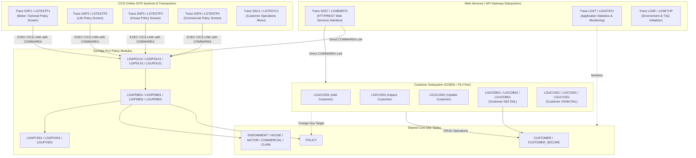

# External System Dependencies and Integration Architecture

This document outlines the external systems, companion subsystems, CICS transactions, web gateways, and persistence layers that depend on or interact with the GenApp PL/I policy modules and Db2 tables.

---

## 1. Dependency & Integration Architecture Diagram

---

## 2. External Systems and Component Interdependencies

### A. CICS 3270 User Interface Systems & Transactions
The policy modules serve as the backend service layer for several online CICS transactions defined in [`Resources/GenApp.CSD`](../../Resources/GenApp.CSD:749):
*   **Transaction `SSP1` ([`LGTESTP1.pli`](../../PLI%20Programs/LGTESTP1.pli:10))**: Motor and general policy presentation menu. Issues `EXEC CICS LINK` to [`LGIPOL01.pli`](../../PLI%20Programs/LGIPOL01.pli:10), [`LGAPOL01.pli`](../../PLI%20Programs/LGAPOL01.pli:10), [`LGDPOL01.pli`](../../PLI%20Programs/LGDPOL01.pli:10), and [`LGUPOL01.pli`](../../PLI%20Programs/LGUPOL01.pli:10).
*   **Transactions `SSP2`, `SSP3`, `SSP4` (`LGTESTP2`, `LGTESTP3`, `LGTESTP4`)**: Dedicated menu drivers for Life/Endowment (`SSP2`), House/Property (`SSP3`), and Commercial Insurance (`SSP4`) that package 3270 screen data into [`Includes/LGCMAREA.inc`](../../Includes/LGCMAREA.inc:10) and invoke policy orchestrators.
*   **Transaction `SSC1` (`LGTESTC1`)**: Customer management menu driver.

---

### B. Customer Subsystem (Cross-Domain Data Dependency)
The Customer management subsystem shares the Db2 database and maintains referential integrity with the Policy domain:
*   **Customer Modules**: `LGACUS01` (Add), `LGICUS01` (Inquire), `LGUCUS01` (Update), and their data access modules `LGACDB01`, `LGACDB02`, `LGICDB01`, `LGUCDB01`, `LGACVS01`, `LGICVS01` (Transaction `LGCF`), `LGUCVS01`.
*   **Database Schema Coupling**:
    *   `policy` table has a Foreign Key (`customerNumber`) referencing `customer(customerNumber)` with `ON DELETE CASCADE` ([`DDL/db2cre.jcl`](../../DDL/db2cre.jcl:167)).
    *   Customer deletion or modifications directly propagate or restrict policy records.
    *   [`LGIPDB01.pli`](../../PLI%20Programs/LGIPDB01.pli:89) queries the `customer` table alongside `policy` to return customer profile details with policy inquiries.

---

### C. Web Services & Modern API Gateways
*   **Transaction `SSST` (`LGWEBST5`)**:
    *   Exposes GenApp functions as CICS Web Services / RESTful JSON APIs.
    *   Decodes incoming HTTP/JSON payloads and issues `EXEC CICS LINK` calls passing standard 32KB COMMAREA buffers ([`Includes/LGCMAREA.inc`](../../Includes/LGCMAREA.inc:10)) to [`LGIPOL01.pli`](../../PLI%20Programs/LGIPOL01.pli:10), [`LGAPOL01.pli`](../../PLI%20Programs/LGAPOL01.pli:10), etc.

---

### D. Operational, Diagnostic & Monitoring Systems
*   **Transaction `LGST` (`LGASTAT1`)**:
    *   Application statistics collection module that reports on GenApp resource usage and activity metrics.
*   **Transaction `LGSE` (`LGSETUP`)**:
    *   Initial setup program configuring application environment, temporary storage queues, and operational buffers.
*   **Error Logger `LGSTSQ`**:
    *   Central diagnostic subprogram called by all business and DAL programs ([`LGAPOL01.pli`](../../PLI%20Programs/LGAPOL01.pli:165), [`LGIPDB01.pli`](../../PLI%20Programs/LGIPDB01.pli:1233), [`LGAPVS01.pli`](../../PLI%20Programs/LGAPVS01.pli:155)) via `EXEC CICS LINK PROGRAM('LGSTSQ')` to write error records to CICS Transient Data / Temporary Storage Queues.

---

### E. VSAM Fast-Path & Mirroring Systems
*   **Transaction `LGPF` (`LGIPVS01`)**:
    *   Allows fast-path primary key lookups directly against the VSAM dataset `KSDSPOLY` ([`Resources/GenApp.CSD`](../../Resources/GenApp.CSD:666)), bypassing the relational Db2 layer.
    *   Relies on [`LGAPVS01.pli`](../../PLI%20Programs/LGAPVS01.pli:10), [`LGDPVS01.pli`](../../PLI%20Programs/LGDPVS01.pli:10), and [`LGUPVS01.pli`](../../PLI%20Programs/LGUPVS01.pli:10) to keep `KSDSPOLY` synchronized whenever Db2 table modifications take place.
