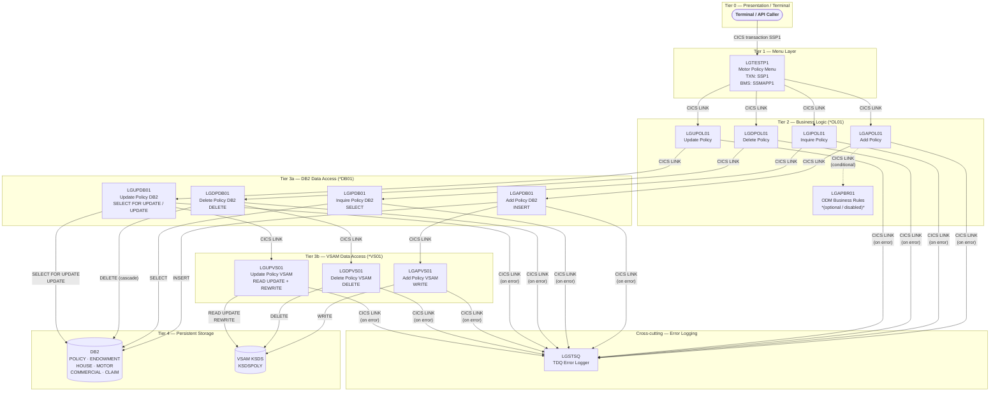

# GenApp PL/I Program Inventory

**Application:** GenApp — IBM CICS/DB2 Insurance Application  
**Language:** PL/I (z/OS)  
**Architecture:** Three-tier CICS LINK chain — Menu → Business Logic (`*OL01`) → DB2 (`*DB01`) + VSAM (`*VS01`)  
**Communication:** 32,500-byte COMMAREA defined in [`Includes/LGCMAREA.inc`](../../Includes/LGCMAREA.inc)  
**Generated:** AI-assisted inventory from source analysis

---

## Table of Contents

1. [Architecture Overview](#architecture-overview)
2. [Include Files (Shared)](#include-files-shared)
3. [Program Inventory](#program-inventory)
   - [LGTESTP1 — Motor Policy Menu](#lgtestp1--motor-policy-menu)
   - [LGAPOL01 — Add Policy (Business Logic)](#lgapol01--add-policy-business-logic)
   - [LGAPDB01 — Add Policy (DB2)](#lgapdb01--add-policy-db2)
   - [LGAPVS01 — Add Policy (VSAM)](#lgapvs01--add-policy-vsam)
   - [LGIPOL01 — Inquire Policy (Business Logic)](#lgipol01--inquire-policy-business-logic)
   - [LGIPDB01 — Inquire Policy (DB2)](#lgipdb01--inquire-policy-db2)
   - [LGDPOL01 — Delete Policy (Business Logic)](#lgdpol01--delete-policy-business-logic)
   - [LGDPDB01 — Delete Policy (DB2)](#lgdpdb01--delete-policy-db2)
   - [LGDPVS01 — Delete Policy (VSAM)](#lgdpvs01--delete-policy-vsam)
   - [LGUPOL01 — Update Policy (Business Logic)](#lgupol01--update-policy-business-logic)
   - [LGUPDB01 — Update Policy (DB2)](#lgupdb01--update-policy-db2)
   - [LGUPVS01 — Update Policy (VSAM)](#lgupvs01--update-policy-vsam)
4. [Dependency Matrix](#dependency-matrix)
5. [DB2 Tables Summary](#db2-tables-summary)
6. [VSAM Files Summary](#vsam-files-summary)
7. [External Programs Referenced](#external-programs-referenced)

---

## Architecture Overview

---

## Include Files (Shared)

| File | Path | Used By | Purpose |
|------|------|---------|---------|
| [`LGCMAREA.inc`](../../Includes/LGCMAREA.inc) | `Includes/` | All programs | 32,500-byte COMMAREA structure: request ID, return code, customer/policy fields for all policy types (Endowment, House, Motor, Commercial, Claim) |
| [`LGPOLICY.inc`](../../Includes/LGPOLICY.inc) | `Includes/` | `*DB01`, `*OL01` (some) | DB2 host variable structures (`DB2_POLICY`, `DB2_ENDOWMENT`, `DB2_HOUSE`, `DB2_MOTOR`, `DB2_COMMERCIAL`, `DB2_CLAIM`) and commarea length constants |
| [`SSMAP.inc`](../../Includes/SSMAP.inc) | `Includes/` | `LGTESTP1` only | BMS map I/O structures for all SSMAP panels (`SSMAPP1I/O`, `SSMAPP2I/O` … `SSMAPP5I/O`, `SSMAPC1I/O`) |
| [`LGCMARER.inc`](../../Includes/LGCMARER.inc) | `Includes/` | *(reserved / not referenced in scanned programs)* | Alternate COMMAREA variant |

**Include Syntax:**  
- `%INCLUDE name;` — PL/I preprocessor (used in `*OL01` and `*VS01` programs)  
- `EXEC SQL INCLUDE name;` — DB2 precompiler (used in `*DB01` programs)

---

## Program Inventory

---

### LGTESTP1 — Motor Policy Menu

| Attribute | Value |
|-----------|-------|
| **Source** | [`PLI Programs/LGTESTP1.pli`](../../PLI%20Programs/LGTESTP1.pli) |
| **Tier** | Presentation / Menu |
| **CICS Transaction** | `SSP1` |
| **Entry point** | `LGTESTP1: Proc(DFHEIPTR, COMM_AREA_PTR) Options(Main, Reentrant)` |
| **Policy types** | Motor only |
| **Operations** | Inquire (opt 1, 4), Add (opt 2), Delete (opt 3), Update (opt 4 — inline) |

**Description:** Interactive CICS terminal program. Displays and receives BMS map `SSMAPP1` from mapset `SSMAP`. Routes to business-logic programs based on the menu option selected. Handles `CLEAR` (PF key), `PF3` (end), and `MAPFAIL` conditions. Uses `EXEC CICS RETURN TRANSID('SSP1')` to restart the transaction pseudo-conversationally.

**Includes Used:**

| Include | Mechanism |
|---------|-----------|
| `LGCMAREA` | `%INCLUDE LGCMAREA;` |
| `SSMAP` | `%INCLUDE SSMAP;` |

**BMS Maps:**

| Map | Mapset | Access |
|-----|--------|--------|
| `SSMAPP1` | `SSMAP` | SEND + RECEIVE (I/O) |

**Called Programs (EXEC CICS LINK):**

| Program | Operation | Condition |
|---------|-----------|-----------|
| `LGIPOL01` | Inquire Motor policy | Options 1 and 4 |
| `LGAPOL01` | Add Motor policy | Option 2 |
| `LGDPOL01` | Delete Motor policy | Option 3 |
| `LGUPOL01` | Update Motor policy | Option 4 (after inquire) |

**DB2 Tables:** None (no direct DB2 access)  
**VSAM Files:** None (no direct VSAM access)  
**Error Handling:** Sends error text to BMS map field `ERP1FLDO`. Issues `EXEC CICS Syncpoint Rollback` on Add/Delete failure.

---

### LGAPOL01 — Add Policy (Business Logic)

| Attribute | Value |
|-----------|-------|
| **Source** | [`PLI Programs/LGAPOL01.pli`](../../PLI%20Programs/LGAPOL01.pli) |
| **Tier** | Business Logic (OL) |
| **Request IDs handled** | `01AEND`, `01AHOU`, `01AMOT`, `01ACOM`, `01ACLM` |
| **Entry point** | `LGAPOL01: Proc(COMM_AREA_PTR) Options(Main)` |

**Description:** Orchestrates policy additions for all five policy types (Endowment, House, Motor, Commercial, Claim). Validates COMMAREA length, then chains to `LGAPDB01` for DB2 work. Optionally invokes business rules engine `LGAPBR01` (ODM) for Endowment policies when `BUSINESS_RULES = 'Y'` (disabled by default — commented out).

**Includes Used:**

| Include | Mechanism |
|---------|-----------|
| `LGCMAREA` | `%INCLUDE LGCMAREA;` |

**Called Programs (EXEC CICS LINK):**

| Program | Condition |
|---------|-----------|
| `LGAPBR01` | Conditional — only when `BUSINESS_RULES = 'Y'` AND request is `01AEND` (disabled by default) |
| `LGAPDB01` | Always (main DB2 insert chain) |
| `LGSTSQ` | Error logging via `WRITE_ERROR_MESSAGE` procedure |

**DB2 Tables:** None direct  
**VSAM Files:** None direct  
**Abend codes:** `LGCA` (no COMMAREA)

---

### LGAPDB01 — Add Policy (DB2)

| Attribute | Value |
|-----------|-------|
| **Source** | [`PLI Programs/LGAPDB01.pli`](../../PLI%20Programs/LGAPDB01.pli) |
| **Tier** | Data Access — DB2 |
| **Request IDs handled** | `01AEND`, `01AHOU`, `01AMOT`, `01ACOM`, `01ACLM` |
| **Entry point** | `LGAPDB01: Proc(COMM_AREA_PTR) Options(Main)` |

**Description:** Performs all DB2 INSERT operations for policy creation. Inserts a row into `POLICY` first (obtaining the generated `POLICYNUMBER` via `IDENTITY_VAL_LOCAL()`), then inserts into the appropriate policy-type table. After DB2 work completes, chains to `LGAPVS01` for VSAM write. On sub-table INSERT failure, issues `EXEC CICS ABEND ABCODE('LGSQ') NODUMP` to force backout of the already-committed POLICY row.

**Includes Used:**

| Include | Mechanism |
|---------|-----------|
| `LGPOLICY` | `EXEC SQL INCLUDE LGPOLICY;` |
| `SQLCA` | `EXEC SQL INCLUDE SQLCA;` |
| `LGCMAREA` | `EXEC SQL INCLUDE LGCMAREA;` |

**DB2 Tables:**

| Table | Operation | Notes |
|-------|-----------|-------|
| `POLICY` | INSERT | Always; uses `DEFAULT` for `POLICYNUMBER` (identity column); `LASTCHANGED` set to `CURRENT TIMESTAMP` |
| `POLICY` | SELECT | Reads back `LASTCHANGED` after insert |
| `ENDOWMENT` | INSERT | When request = `01AEND`; includes optional `PADDINGDATA` VARCHAR |
| `HOUSE` | INSERT | When request = `01AHOU` |
| `MOTOR` | INSERT | When request = `01AMOT` |
| `COMMERCIAL` | INSERT | When request = `01ACOM` |
| `CLAIM` | INSERT | When request = `01ACLM` |

**VSAM Files:**

| File | Operation | Notes |
|------|-----------|-------|
| `KSDSPOLY` | (delegated) | Via `EXEC CICS LINK PROGRAM('LGAPVS01')` |

**Called Programs (EXEC CICS LINK):**

| Program | Condition |
|---------|-----------|
| `LGAPVS01` | Always (after all DB2 inserts) |
| `LGSTSQ` | Error logging |

**Abend codes:** `LGCA` (no COMMAREA), `LGSQ` (sub-table insert failure — triggers DB2 backout)

---

### LGAPVS01 — Add Policy (VSAM)

| Attribute | Value |
|-----------|-------|
| **Source** | [`PLI Programs/LGAPVS01.pli`](../../PLI%20Programs/LGAPVS01.pli) |
| **Tier** | Data Access — VSAM |
| **Request IDs handled** | All add types (`01AEND`, `01AHOU`, `01AMOT`, `01ACOM`) via type letter (`E`, `H`, `M`, `C`) |
| **Entry point** | `LGAPVS01: Proc(COMM_AREA_PTR) Options(Main)` |

**Description:** Writes a 64-byte policy record to VSAM KSDS `KSDSPOLY`. The record key is 21 bytes: 1-byte type code + 10-byte customer number + 10-byte policy number. Policy-type-specific fields are copied from COMMAREA into the `WF_Policy_Info` working storage structure before the WRITE.

**Includes Used:**

| Include | Mechanism |
|---------|-----------|
| `LGCMAREA` | `%INCLUDE LGCMAREA;` |

**VSAM Files:**

| File | Operation | Access Mode | Key Length | Record Length |
|------|-----------|-------------|------------|---------------|
| `KSDSPOLY` | WRITE (add new record) | KSDS keyed | 21 bytes | 64 bytes |

**Called Programs (EXEC CICS LINK):**

| Program | Condition |
|---------|-----------|
| `LGSTSQ` | Error logging |

**DB2 Tables:** None  
**Return codes:** `80` = VSAM WRITE failed

---

### LGIPOL01 — Inquire Policy (Business Logic)

| Attribute | Value |
|-----------|-------|
| **Source** | [`PLI Programs/LGIPOL01.pli`](../../PLI%20Programs/LGIPOL01.pli) |
| **Tier** | Business Logic (OL) |
| **Request IDs handled** | `01IEND`, `01IHOU`, `01IMOT`, `01ICOM`, `01ICLM` (and extended variants `02ICOM`–`05ICOM`, `02ICLM`) |
| **Entry point** | `LGIPOL01: Proc(COMM_AREA_PTR) Options(Main)` |

**Description:** Business logic layer for policy inquiries. Contains a post-inquiry business rule: sets `CA_EXPIRY_DATE = '2099-01-01'` for Motor policies where `CA_M_MAKE = 'HONDA'`. Delegates all DB2 retrieval to `LGIPDB01`.

**Includes Used:**

| Include | Mechanism |
|---------|-----------|
| `LGPOLICY` | `%INCLUDE LGPOLICY;` |
| `LGCMAREA` | `%INCLUDE LGCMAREA;` |

**Called Programs (EXEC CICS LINK):**

| Program | Condition |
|---------|-----------|
| `LGIPDB01` | Always |
| `LGSTSQ` | Error logging |

**DB2 Tables:** None direct  
**VSAM Files:** None direct  
**Abend codes:** `LGCA` (no COMMAREA)

---

### LGIPDB01 — Inquire Policy (DB2)

| Attribute | Value |
|-----------|-------|
| **Source** | [`PLI Programs/LGIPDB01.pli`](../../PLI%20Programs/LGIPDB01.pli) |
| **Tier** | Data Access — DB2 |
| **Request IDs handled** | `01IEND`, `01IHOU`, `01IMOT`, `01ICOM`, `02ICOM`, `03ICOM`, `05ICOM`, `01ICLM`, `02ICLM` |
| **Entry point** | `LGIPDB01: Proc(COMM_AREA_PTR) Options(Main)` |

**Description:** The most complex DB2 program. Supports COMMAREA mode (standard CICS LINK) and CICS Channel/Container mode (`ICOM` channel). Performs joins across POLICY + policy-type tables. For Commercial policies, supports multiple query modes: by customer+policy (01ICOM), by policy only (02ICOM), cursor scan by customer (03ICOM), cursor scan by ZIP code (05ICOM). For Claims, supports single-claim inquiry (01ICLM) and cursor scan of all claims for a policy (02ICLM). Uses three SQL cursors.

**Includes Used:**

| Include | Mechanism |
|---------|-----------|
| `SQLCA` | `EXEC SQL INCLUDE SQLCA;` |
| `LGPOLICY` | `EXEC SQL INCLUDE LGPOLICY;` |
| `LGCMAREA` | `EXEC SQL INCLUDE LGCMAREA;` |

**DB2 Tables:**

| Table | Operation | Request IDs | Notes |
|-------|-----------|-------------|-------|
| `POLICY` | SELECT (JOIN) | All | Always joined with policy-type table |
| `ENDOWMENT` | SELECT (JOIN with POLICY) | `01IEND` | Returns PADDINGDATA VARCHAR |
| `HOUSE` | SELECT (JOIN with POLICY) | `01IHOU` | |
| `MOTOR` | SELECT (JOIN with POLICY) | `01IMOT` | |
| `COMMERCIAL` | SELECT (JOIN with POLICY) | `01ICOM`, `02ICOM` | Direct SELECT |
| `COMMERCIAL` | SELECT via cursor `Cust_Cursor` | `03ICOM` | By customer number |
| `COMMERCIAL` | SELECT via cursor `Zip_Cursor` | `05ICOM` | By ZIP code |
| `CLAIM` | SELECT (JOIN with POLICY) | `01ICLM` | Single claim |
| `CLAIM` | SELECT via cursor `CusClaim_Cursor` | `02ICLM` | All claims for policy |

**SQL Cursors:**

| Cursor | Type | Query |
|--------|------|-------|
| `Cust_Cursor` | Insensitive Scroll | POLICY JOIN COMMERCIAL WHERE CustomerNumber = :input |
| `Zip_Cursor` | Insensitive Scroll | POLICY JOIN COMMERCIAL WHERE Zipcode = :input |
| `CusClaim_Cursor` | Insensitive Scroll | POLICY JOIN CLAIM WHERE CustomerNumber + PolicyNumber |

**VSAM Files:** None  
**Called Programs (EXEC CICS LINK):**

| Program | Condition |
|---------|-----------|
| `LGSTSQ` | Error logging |

**Abend codes:** `LGCA` (no COMMAREA)

---

### LGDPOL01 — Delete Policy (Business Logic)

| Attribute | Value |
|-----------|-------|
| **Source** | [`PLI Programs/LGDPOL01.pli`](../../PLI%20Programs/LGDPOL01.pli) |
| **Tier** | Business Logic (OL) |
| **Request IDs handled** | `01DEND`, `01DHOU`, `01DCOM`, `01DMOT` |
| **Entry point** | `LGDPOL01: Proc(COMM_AREA_PTR) Options(Main)` |

**Description:** Orchestrates policy deletion. Normalises `CA_REQUEST_ID` to uppercase. Delegates to `LGDPDB01` for DB2 delete and (via `LGDPDB01`) to `LGDPVS01` for VSAM delete. Returns immediately on DB2 error.

**Includes Used:**

| Include | Mechanism |
|---------|-----------|
| `LGCMAREA` | `%INCLUDE LGCMAREA;` |

**Called Programs (EXEC CICS LINK):**

| Program | Condition |
|---------|-----------|
| `LGDPDB01` | Always (via `DELETE_POLICY_DB2_INFO` internal procedure) |
| `LGSTSQ` | Error logging |

**DB2 Tables:** None direct  
**VSAM Files:** None direct  
**Abend codes:** `LGCA` (no COMMAREA)

---

### LGDPDB01 — Delete Policy (DB2)

| Attribute | Value |
|-----------|-------|
| **Source** | [`PLI Programs/LGDPDB01.pli`](../../PLI%20Programs/LGDPDB01.pli) |
| **Tier** | Data Access — DB2 |
| **Request IDs handled** | `01DEND`, `01DHOU`, `01DCOM`, `01DMOT` |
| **Entry point** | `LGDPDB01: Proc(DFHEIPTR, COMM_AREA_PTR) Options(Main, Reentrant)` |

**Description:** Deletes a row from `POLICY` by customer number + policy number. Due to DB2 FOREIGN KEY CASCADE definitions, the DELETE on POLICY automatically propagates to the matching row in the policy-type table (ENDOWMENT, HOUSE, MOTOR, or COMMERCIAL). After DB2 delete succeeds, chains to `LGDPVS01` for VSAM deletion.

**Includes Used:**

| Include | Mechanism |
|---------|-----------|
| `SQLCA` | `EXEC SQL INCLUDE SQLCA;` |
| `LGCMAREA` | `EXEC SQL INCLUDE LGCMAREA;` |

**DB2 Tables:**

| Table | Operation | Notes |
|-------|-----------|-------|
| `POLICY` | DELETE | WHERE CUSTOMERNUMBER + POLICYNUMBER; CASCADE to sub-tables |

**VSAM Files:**

| File | Operation | Notes |
|------|-----------|-------|
| `KSDSPOLY` | (delegated) | Via `EXEC CICS LINK PROGRAM('LGDPVS01')` |

**Called Programs (EXEC CICS LINK):**

| Program | Condition |
|---------|-----------|
| `LGDPVS01` | After successful DB2 delete |
| `LGSTSQ` | Error logging |

**Abend codes:** `LGCA` (no COMMAREA)

---

### LGDPVS01 — Delete Policy (VSAM)

| Attribute | Value |
|-----------|-------|
| **Source** | [`PLI Programs/LGDPVS01.pli`](../../PLI%20Programs/LGDPVS01.pli) |
| **Tier** | Data Access — VSAM |
| **Entry point** | `LGDPVS01: Proc(COMM_AREA_PTR) Options(Main)` |

**Description:** Deletes a record from VSAM KSDS `KSDSPOLY` using the 21-byte composite key (type + customer + policy number).

**Includes Used:**

| Include | Mechanism |
|---------|-----------|
| `LGCMAREA` | `%INCLUDE LGCMAREA;` |

**VSAM Files:**

| File | Operation | Access Mode | Key Length |
|------|-----------|-------------|------------|
| `KSDSPOLY` | DELETE | KSDS keyed | 21 bytes |

**Called Programs (EXEC CICS LINK):**

| Program | Condition |
|---------|-----------|
| `LGSTSQ` | Error logging |

**DB2 Tables:** None  
**Return codes:** `81` = VSAM DELETE failed

---

### LGUPOL01 — Update Policy (Business Logic)

| Attribute | Value |
|-----------|-------|
| **Source** | [`PLI Programs/LGUPOL01.pli`](../../PLI%20Programs/LGUPOL01.pli) |
| **Tier** | Business Logic (OL) |
| **Request IDs handled** | `01UEND`, `01UHOU`, `01UMOT` |
| **Entry point** | `LGUPOL01: Proc(COMM_AREA_PTR) Options(Main)` |

**Description:** Validates COMMAREA length for each policy type, then delegates to `LGUPDB01` for DB2 update via `UPDATE_POLICY_DB2_INFO` internal procedure. Note: LGCMAREA `%INCLUDE` is commented out in this program — the COMMAREA is received and accessible via CICS but the include is not compiled in.

**Includes Used:**

| Include | Mechanism |
|---------|-----------|
| `LGPOLICY` | *(via local `WS_POLICY_LENGTHS` — not `%INCLUDE`)* |
| `LGCMAREA` | `/*%INCLUDE LGCMAREA;*/` — **commented out** |

**Called Programs (EXEC CICS LINK):**

| Program | Condition |
|---------|-----------|
| `LGUPDB01` | Always (via `UPDATE_POLICY_DB2_INFO`) |
| `LGSTSQ` | Error logging |

**DB2 Tables:** None direct  
**VSAM Files:** None direct  
**Abend codes:** `LGCA` (no COMMAREA)

---

### LGUPDB01 — Update Policy (DB2)

| Attribute | Value |
|-----------|-------|
| **Source** | [`PLI Programs/LGUPDB01.pli`](../../PLI%20Programs/LGUPDB01.pli) |
| **Tier** | Data Access — DB2 |
| **Request IDs handled** | `01UEND`, `01UHOU`, `01UMOT` |
| **Entry point** | `LGUPDB01: Proc(COMM_AREA_PTR) Options(Main)` |

**Description:** Implements optimistic locking for policy updates: opens `POLICY_CURSOR` (SELECT FOR UPDATE WITH HOLD), fetches the current row, compares `LASTCHANGED` timestamps, then updates the policy-type table and the POLICY header row. On timestamp mismatch, returns `CA_RETURN_CODE = '02'` (concurrent modification). On cursor open failure with SQLCODE -913 (deadlock/timeout), returns `CA_RETURN_CODE = '90'`. After DB2 update, chains to `LGUPVS01` for VSAM rewrite.

**Includes Used:**

| Include | Mechanism |
|---------|-----------|
| `LGPOLICY` | `%INCLUDE LGPOLICY;` (with commented-out `EXEC SQL`) |
| `SQLCA` | `%INCLUDE SQLCA;` (with commented-out `EXEC SQL`) |
| `LGCMAREA` | `%INCLUDE LGCMAREA;` (with commented-out `EXEC SQL`) |

**DB2 Tables:**

| Table | Operation | Notes |
|-------|-----------|-------|
| `POLICY` | SELECT FOR UPDATE (cursor `POLICY_CURSOR`) | Locks row; reads `ISSUEDATE`, `EXPIRYDATE`, `LASTCHANGED`, `BROKERID`, `BROKERSREFERENCE` |
| `POLICY` | UPDATE WHERE CURRENT OF cursor | Updates header fields + new `LASTCHANGED` timestamp |
| `POLICY` | SELECT | Reads back new `LASTCHANGED` |
| `ENDOWMENT` | UPDATE | When request = `01UEND` |
| `HOUSE` | UPDATE | When request = `01UHOU` |
| `MOTOR` | UPDATE | When request = `01UMOT` |

**SQL Cursors:**

| Cursor | Type | Description |
|--------|------|-------------|
| `POLICY_CURSOR` | WITH HOLD FOR UPDATE | Locks POLICY row for optimistic-lock update |

**VSAM Files:**

| File | Operation | Notes |
|------|-----------|-------|
| `KSDSPOLY` | (delegated) | Via `EXEC CICS LINK PROGRAM('LGUPVS01')` |

**Called Programs (EXEC CICS LINK):**

| Program | Condition |
|---------|-----------|
| `LGUPVS01` | Always (after DB2 update) |
| `LGSTSQ` | Error logging |

**Abend codes:** `LGCA` (no COMMAREA)

---

### LGUPVS01 — Update Policy (VSAM)

| Attribute | Value |
|-----------|-------|
| **Source** | [`PLI Programs/LGUPVS01.pli`](../../PLI%20Programs/LGUPVS01.pli) |
| **Tier** | Data Access — VSAM |
| **Entry point** | `LGUPVS01: Proc(COMM_AREA_PTR) Options(Main)` |

**Description:** Updates a VSAM KSDS record in `KSDSPOLY`. First issues a `CICS READ ... UPDATE` to lock the record, then issues `CICS REWRITE`. On READ failure, abends with `LGV3`; on REWRITE failure, abends with `LGV4`.

**Includes Used:**

| Include | Mechanism |
|---------|-----------|
| `LGCMAREA` | `%INCLUDE LGCMAREA;` |

**VSAM Files:**

| File | Operation | Access Mode | Notes |
|------|-----------|-------------|-------|
| `KSDSPOLY` | READ UPDATE | KSDS keyed (exclusive lock) | Read before rewrite |
| `KSDSPOLY` | REWRITE | KSDS keyed | Overwrites locked record |

**Called Programs (EXEC CICS LINK):**

| Program | Condition |
|---------|-----------|
| `LGSTSQ` | Error logging |

**DB2 Tables:** None  
**Return codes:** `81` = READ UPDATE failed, `82` = REWRITE failed  
**Abend codes:** `LGV3` (VSAM read failed), `LGV4` (VSAM rewrite failed)

---

## Dependency Matrix

| Program | LGCMAREA | LGPOLICY | SSMAP | SQLCA | KSDSPOLY | DB2 Tables | LGSTSQ | Calls |
|---------|----------|----------|-------|-------|----------|------------|--------|-------|
| LGTESTP1 | ✓ (`%INC`) | — | ✓ (`%INC`) | — | — | — | — | LGIPOL01, LGAPOL01, LGDPOL01, LGUPOL01 |
| LGAPOL01 | ✓ (`%INC`) | — | — | — | — | — | ✓ | LGAPDB01, LGAPBR01¹ |
| LGAPDB01 | ✓ (SQL) | ✓ (SQL) | — | ✓ (SQL) | WRITE→ | POLICY, ENDOWMENT, HOUSE, MOTOR, COMMERCIAL, CLAIM | ✓ | LGAPVS01 |
| LGAPVS01 | ✓ (`%INC`) | — | — | — | WRITE | — | ✓ | — |
| LGIPOL01 | ✓ (`%INC`) | ✓ (`%INC`) | — | — | — | — | ✓ | LGIPDB01 |
| LGIPDB01 | ✓ (SQL) | ✓ (SQL) | — | ✓ (SQL) | — | POLICY, ENDOWMENT, HOUSE, MOTOR, COMMERCIAL, CLAIM | ✓ | — |
| LGDPOL01 | ✓ (`%INC`) | — | — | — | — | — | ✓ | LGDPDB01 |
| LGDPDB01 | ✓ (SQL) | — | — | ✓ (SQL) | DELETE→ | POLICY (CASCADE) | ✓ | LGDPVS01 |
| LGDPVS01 | ✓ (`%INC`) | — | — | — | DELETE | — | ✓ | — |
| LGUPOL01 | ✗ (commented) | ✗ (inline) | — | — | — | — | ✓ | LGUPDB01 |
| LGUPDB01 | ✓ (`%INC`) | ✓ (`%INC`) | — | ✓ (`%INC`) | REWRITE→ | POLICY, ENDOWMENT, HOUSE, MOTOR | ✓ | LGUPVS01 |
| LGUPVS01 | ✓ (`%INC`) | — | — | — | READ+REWRITE | — | ✓ | — |

¹ `LGAPBR01` conditional — only invoked when `BUSINESS_RULES = 'Y'` (default: disabled)

---

## DB2 Tables Summary

| Table | Programs That Access It | Operations |
|-------|------------------------|------------|
| `POLICY` | LGAPDB01, LGIPDB01, LGDPDB01, LGUPDB01 | INSERT, SELECT (join), DELETE (cascade), SELECT FOR UPDATE / UPDATE |
| `ENDOWMENT` | LGAPDB01, LGIPDB01, LGUPDB01 | INSERT, SELECT (join with POLICY), UPDATE |
| `HOUSE` | LGAPDB01, LGIPDB01, LGUPDB01 | INSERT, SELECT (join with POLICY), UPDATE |
| `MOTOR` | LGAPDB01, LGIPDB01, LGUPDB01 | INSERT, SELECT (join with POLICY), UPDATE |
| `COMMERCIAL` | LGAPDB01, LGIPDB01 | INSERT, SELECT (join with POLICY), cursor scans by customer/ZIP |
| `CLAIM` | LGAPDB01, LGIPDB01 | INSERT, SELECT (join with POLICY), cursor scan |

> **Note:** `COMMERCIAL` and `CLAIM` have no UPDATE path in the current codebase. `POLICY` deletes cascade to policy-type subtables via DB2 foreign keys.

---

## VSAM Files Summary

| VSAM File | Type | Key | Programs | Operations |
|-----------|------|-----|----------|------------|
| `KSDSPOLY` | KSDS | 21 bytes: 1-byte type (`C`/`E`/`H`/`M`) + 10-byte customer# + 10-byte policy# | LGAPVS01, LGDPVS01, LGUPVS01 | WRITE (add), DELETE, READ UPDATE + REWRITE (update) |

---

## External Programs Referenced

| Program | Purpose | Called By | Notes |
|---------|---------|-----------|-------|
| `LGSTSQ` | TDQ error logger — writes error message COMMAREA to transient data queue | All programs (via `WRITE_ERROR_MESSAGE`) | Not in this repository; assumed external utility |
| `LGAPBR01` | ODM Business Rules engine for Endowment policy | LGAPOL01 (conditional) | Not in this repository; invoked only when `BUSINESS_RULES = 'Y'` |

---

*Document generated from source analysis of `PLI Programs/` and `Includes/` directories. All program links are relative to the workspace root.*
