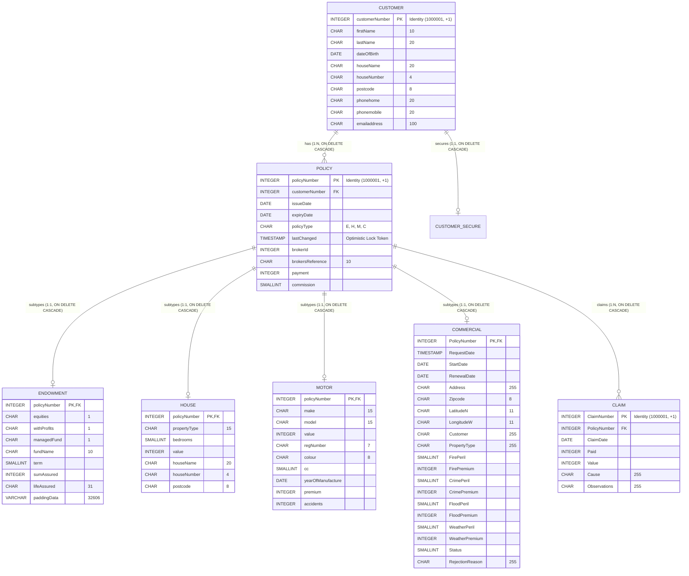
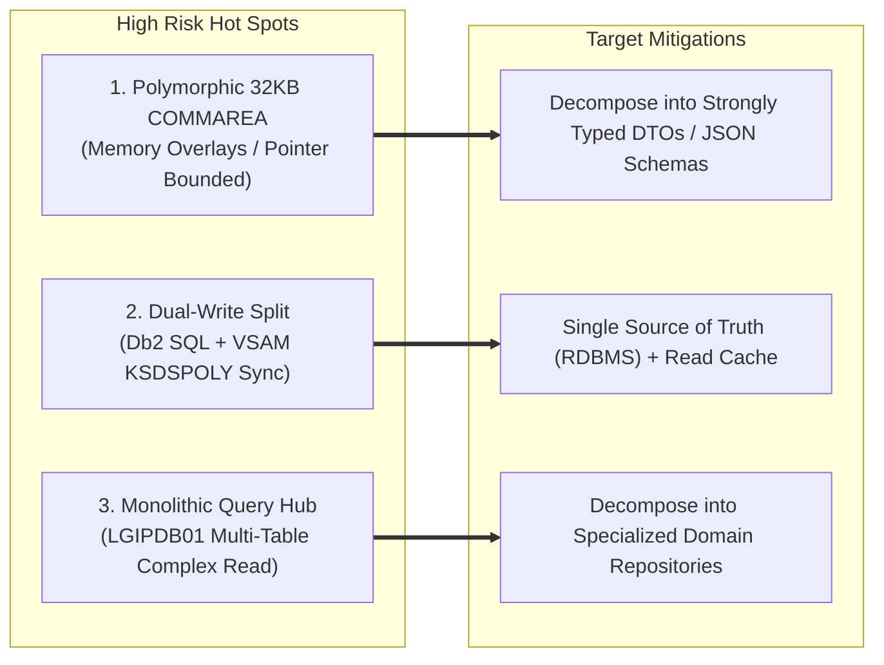

# GenApp PL/I Migration & System Architecture Guide

Comprehensive technical reference, component catalog, data contracts, and risk analysis for engineering teams modernizing the **General Insurance Application (GenApp)** from IBM z/OS CICS and Db2/VSAM to target architectures (EEPOS / Cloud / Distributed Microservices).

---

## Table of Contents
1. [Executive Summary & System Landscape](#1-executive-summary--system-landscape)
2. [End-to-End System Architecture Diagram](#2-end-to-end-system-architecture-diagram)
3. [Component Inventory & Layered Classification](#3-component-inventory--layered-classification)
4. [Data Model, Schema & Storage Architecture](#4-data-model-schema--storage-architecture)
5. [Canonical Communication Contracts (COMMAREA)](#5-canonical-communication-contracts-commarea)
6. [Core Business Rules & Logic Catalogue](#6-core-business-rules--logic-catalogue)
7. [Migration Risk Hot Spots & Technical Mitigations](#7-migration-risk-hot-spots--technical-mitigations)
8. [Target Architecture Mapping Recommendations](#8-target-architecture-mapping-recommendations)

---

## 1. Executive Summary & System Landscape

The General Insurance Application (**GenApp**) is a multi-tier enterprise insurance policy management system implemented in **IBM Enterprise PL/I for z/OS**. It operates within an **IBM CICS Transaction Server** environment and manages policies across five distinct lines of business: **Motor**, **House/Property**, **Endowment/Life**, **Commercial Insurance**, and **Claims**.

### Key Architectural Principles:
* **Separation of Concerns**: Strict multi-tiered decomposition between Presentation (BMS Driver `LGTESTP1`), Business Logic / Orchestration (`LGxPOL01`), and Data Access Layers (`LGxPDB01`, `LGxPVS01`).
* **Canonical Inter-Program Protocol**: All inter-program communication executes via `EXEC CICS LINK` passing a fixed 32,500-byte polymorphic pointer-based memory structure defined in [`Includes/LGCMAREA.inc`](../../Includes/LGCMAREA.inc:10).
* **Dual Persistence Model**: Uses **IBM Db2 for z/OS** as the relational source of truth and maintains a secondary mirror index in **VSAM KSDS** (`KSDSPOLY`) for high-speed primary-key inquiries.

---

## 2. End-to-End System Architecture Diagram

```mermaid
flowchart TB
    subgraph Ingress_Layer["Ingress & Entry Point Boundary"]
        3270["3270 Terminal / BMS Screens\n(Trans: SSP1, SSP2, SSP3, SSP4, SSC1)"]
        WEB["CICS Web Services / JSON REST\n(Trans: SSST / LGWEBST5)"]
        BATCH["Batch Execution / Callers\n(EXEC CICS LINK COMMAREA)"]
    end

    subgraph GenApp_PLI_Core["GenApp PL/I Application Boundary"]
        direction TB

        subgraph Presentation_Layer["1. Presentation Layer"]
            TESTP1["LGTESTP1\n(BMS Driver / Map SSMAPP1)"]
        end

        subgraph Business_Layer["2. Business Logic & Orchestration Layer"]
            LGAPOL01["LGAPOL01\n(Add Policy Orchestrator)"]
            LGDPOL01["LGDPOL01\n(Delete Policy Orchestrator)"]
            LGIPOL01["LGIPOL01\n(Inquire Policy Orchestrator)"]
            LGUPOL01["LGUPOL01\n(Update Policy Orchestrator)"]
            BR["LGAPBR01\n(ODM / Endowment Rules)"]
        end

        subgraph DAL_Layer["3. Data Access Layer (DAL)"]
            subgraph Db2_DAL["Db2 Relational Services (SQL)"]
                LGAPDB01["LGAPDB01 (Add DB2)"]
                LGDPDB01["LGDPDB01 (Delete DB2)"]
                LGIPDB01["LGIPDB01 (Inquire DB2)"]
                LGUPDB01["LGUPDB01 (Update DB2)"]
            end

            subgraph VSAM_DAL["VSAM KSDS Services (File Control)"]
                LGAPVS01["LGAPVS01 (Write KSDSPOLY)"]
                LGDPVS01["LGDPVS01 (Delete KSDSPOLY)"]
                LGUPVS01["LGUPVS01 (Rewrite KSDSPOLY)"]
            end
        end

        subgraph Common_CrossCutting["4. Cross-Cutting & Diagnostic Services"]
            LGSTSQ["LGSTSQ\n(Error & Audit Logger to CICS TSQ)"]
            LGCMAREA["LGCMAREA.inc / LGPOLICY.inc\n(Canonical Contracts)"]
        end
    end

    subgraph Persistence_Layer["Persistence & Storage Boundary"]
        subgraph DB2_Storage["Db2 for z/OS Relational Tables"]
            T_CUST["CUSTOMER / CUSTOMER_SECURE"]
            T_POL["POLICY (Parent Header)"]
            T_END["ENDOWMENT"]
            T_HOU["HOUSE"]
            T_MOT["MOTOR"]
            T_COM["COMMERCIAL"]
            T_CLM["CLAIM"]
        end

        subgraph VSAM_Storage["VSAM Files"]
            F_POLY["KSDSPOLY (Policy Mirror)"]
            F_CUST["KSDSCUST (Customer Mirror)"]
        end

        subgraph CICS_Queues["CICS Storage"]
            TSQ["Temporary Storage Queues\n(CSMT Error Logs)"]
        end
    end

    %% Ingress to Presentation / Business
    3270 -->|Screen I/O| TESTP1
    TESTP1 -->|EXEC CICS LINK| LGIPOL01 & LGAPOL01 & LGDPOL01 & LGUPOL01
    WEB -->|EXEC CICS LINK 32KB COMMAREA| LGIPOL01 & LGAPOL01 & LGDPOL01 & LGUPOL01
    BATCH -->|EXEC CICS LINK| LGIPOL01

    %% Business to DAL / Rules
    LGAPOL01 -->|EXEC CICS LINK| BR
    LGAPOL01 -->|EXEC CICS LINK| LGAPDB01
    LGDPOL01 -->|EXEC CICS LINK| LGDPDB01
    LGIPOL01 -->|EXEC CICS LINK| LGIPDB01
    LGUPOL01 -->|EXEC CICS LINK| LGUPDB01

    %% DAL Dual-Write Synchronization
    LGAPDB01 -->|EXEC CICS LINK| LGAPVS01
    LGDPDB01 -->|EXEC CICS LINK| LGDPVS01
    LGUPDB01 -->|EXEC CICS LINK| LGUPVS01

    %% Data Access Operations
    LGAPDB01 -->|EXEC SQL INSERT| DB2_Storage
    LGDPDB01 -->|EXEC SQL DELETE| DB2_Storage
    LGIPDB01 -->|EXEC SQL SELECT / FETCH| DB2_Storage
    LGUPDB01 -->|EXEC SQL UPDATE (FOR UPDATE)| DB2_Storage

    LGAPVS01 -->|EXEC CICS WRITE| F_POLY
    LGDPVS01 -->|EXEC CICS DELETE| F_POLY
    LGUPVS01 -->|EXEC CICS REWRITE| F_POLY

    %% Diagnostics
    GenApp_PLI_Core -.->|EXEC CICS LINK| LGSTSQ
    LGSTSQ -->|WRITEQ TS| TSQ
```

---

## 3. Component Inventory & Layered Classification

### 3.1 PL/I Source Modules (12 Modules)

| Source Module | Architectural Layer | Primary Function & Logic Summary | Direct Dependencies |
| :--- | :--- | :--- | :--- |
| [`LGTESTP1.pli`](../../PLI%20Programs/LGTESTP1.pli:10) | Presentation / UI | 3270 BMS Map driver using mapset [`SSMAPP1`](../../Maps/SSMAP.bms:40). Translates operator inputs into COMMAREA payloads and routes user requests. | `LGIPOL01`, `LGAPOL01`, `LGDPOL01`, `LGUPOL01`, `SSMAPP1` |
| [`LGIPOL01.pli`](../../PLI%20Programs/LGIPOL01.pli:10) | Business Logic | Policy Inquiry Orchestrator. Validates inquiry inputs, invokes `LGIPDB01`, and applies the **Honda vehicle policy expiry date override**. | [`LGIPDB01`](../../PLI%20Programs/LGIPDB01.pli:10), `LGSTSQ` |
| [`LGAPOL01.pli`](../../PLI%20Programs/LGAPOL01.pli:10) | Business Logic | Policy Add Orchestrator. Evaluates payload size, delegates endowment rules to `LGAPBR01`, and invokes `LGAPDB01`. | `LGAPBR01`, [`LGAPDB01`](../../PLI%20Programs/LGAPDB01.pli:10), `LGSTSQ` |
| [`LGDPOL01.pli`](../../PLI%20Programs/LGDPOL01.pli:10) | Business Logic | Policy Delete Orchestrator. Validates policy key structure and dispatches deletion to `LGDPDB01`. | [`LGDPDB01`](../../PLI%20Programs/LGDPDB01.pli:10), `LGSTSQ` |
| [`LGUPOL01.pli`](../../PLI%20Programs/LGUPOL01.pli:10) | Business Logic | Policy Update Orchestrator. Verifies request payload bounds per policy line and routes to `LGUPDB01`. | [`LGUPDB01`](../../PLI%20Programs/LGUPDB01.pli:10), `LGSTSQ` |
| [`LGIPDB01.pli`](../../PLI%20Programs/LGIPDB01.pli:10) | Data Access (Db2) | Read Query Hub. Implements embedded SQL `SELECT` and cursors across `CUSTOMER`, `POLICY`, `ENDOWMENT`, `HOUSE`, `MOTOR`, `COMMERCIAL`, and `CLAIM` tables. | Db2 Tables, `LGSTSQ` |
| [`LGAPDB01.pli`](../../PLI%20Programs/LGAPDB01.pli:10) | Data Access (Db2) | Relational Insert Service. Generates primary key IDs, inserts rows across Db2 tables, and synchronizes to `LGAPVS01`. | Db2 Tables, [`LGAPVS01`](../../PLI%20Programs/LGAPVS01.pli:10), `LGSTSQ` |
| [`LGDPDB01.pli`](../../PLI%20Programs/LGDPDB01.pli:10) | Data Access (Db2) | Relational Delete Service. Issues SQL deletes against policy tables and calls `LGDPVS01` to remove mirrored records. | Db2 Tables, [`LGDPVS01`](../../PLI%20Programs/LGDPVS01.pli:10), `LGSTSQ` |
| [`LGUPDB01.pli`](../../PLI%20Programs/LGUPDB01.pli:10) | Data Access (Db2) | Relational Update Service. Implements **timestamp-based optimistic locking** (`SELECT FOR UPDATE`), updates Db2, and calls `LGUPVS01`. | Db2 Tables, [`LGUPVS01`](../../PLI%20Programs/LGUPVS01.pli:10), `LGSTSQ` |
| [`LGAPVS01.pli`](../../PLI%20Programs/LGAPVS01.pli:10) | Data Access (VSAM) | VSAM Add Service. Issues `EXEC CICS WRITE FILE('KSDSPOLY')` to create policy mirror records. | `KSDSPOLY`, `LGSTSQ` |
| [`LGDPVS01.pli`](../../PLI%20Programs/LGDPVS01.pli:10) | Data Access (VSAM) | VSAM Delete Service. Issues `EXEC CICS DELETE FILE('KSDSPOLY')`. | `KSDSPOLY`, `LGSTSQ` |
| [`LGUPVS01.pli`](../../PLI%20Programs/LGUPVS01.pli:10) | Data Access (VSAM) | VSAM Update Service. Issues `EXEC CICS REWRITE FILE('KSDSPOLY')`. | `KSDSPOLY`, `LGSTSQ` |

---

### 3.2 Shared Copybooks & Includes

| Copybook | Purpose & Usage |
| :--- | :--- |
| [`Includes/LGCMAREA.inc`](../../Includes/LGCMAREA.inc:10) | **Canonical 32,500-byte COMMAREA contract**. Defines union overlays for `CA_CUSTOMER_REQUEST`, `CA_CUSTSECR_REQUEST`, and `CA_POLICY_REQUEST` (`CA_ENDOWMENT`, `CA_HOUSE`, `CA_MOTOR`, `CA_COMMERCIAL`, `CA_CLAIM`). |
| [`Includes/LGPOLICY.inc`](../../Includes/LGPOLICY.inc:12) | **Db2 Host Structure Mapping**. Defines internal PL/I working-storage structures and field lengths matching the Db2 column schema. |
| [`Includes/LGCMARER.inc`](../../Includes/LGCMARER.inc:25) | **Business Rule DCL**. Defines parameter structures (`REQUEST`, `RESPONSE`) passed to the rule validation subprogram `LGAPBR01`. |
| [`Includes/SSMAP.inc`](../../Includes/SSMAP.inc:1) | Generated PL/I BMS screen symbolic structures for mapset [`SSMAPP1`](../../Maps/SSMAP.bms:40). |

---

## 4. Data Model, Schema & Storage Architecture

### 4.1 Db2 Relational Schema Definition
Defined in [`DDL/db2cre.jcl`](../../DDL/db2cre.jcl:102):



---

## 5. Canonical Communication Contracts (COMMAREA)

All CICS programs communicate using the 32,500-byte structure defined in [`Includes/LGCMAREA.inc`](../../Includes/LGCMAREA.inc:10):

### 5.1 Header Envelope (Standard for all requests)
| Offset / Field | PL/I Data Type | Description |
| :--- | :--- | :--- |
| `CA_REQUEST_ID` | `CHAR(6)` | 6-character action verb (e.g., `01INQP`, `01AMOT`, `01UEND`, `01DMOT`). |
| `CA_RETURN_CODE` | `PIC '99'` | Output return code: `00`=Success, `01`=Not Found, `02`=Concurrency Conflict, `90`=DB Error, `98`=Length Error, `99`=Bad Request. |
| `CA_CUSTOMER_NUM` | `PIC '9999999999'` | 10-digit customer identifier. |
| `CA_REQUEST_SPECIFIC` | `UNION (32,482 B)` | Polymorphic payload overlay determined by `CA_REQUEST_ID`. |

### 5.2 Request ID Action Verb Mapping
* **Inquiry Operations**: `01INQP` (Generic Policy), `01IEND` (Endowment), `01IHOU` (House), `01IMOT` (Motor), `01ICOM` (Commercial), `01ICLM` (Claim).
* **Add Operations**: `01AEND` (Add Endowment), `01AHOU` (Add House), `01AMOT` (Add Motor), `01ACOM` (Add Commercial), `01ACLM` (Add Claim).
* **Update Operations**: `01UEND` (Update Endowment), `01UHOU` (Update House), `01UMOT` (Update Motor).
* **Delete Operations**: `01DEND`, `01DHOU`, `01DMOT`, `01DCOM`, `01DCLM`.

---

## 6. Core Business Rules & Logic Catalogue

### 6.1 Motor Vehicle "HONDA" Expiry Date Override
* **Location**: [`LGIPOL01.pli`](../../PLI%20Programs/LGIPOL01.pli:96), [`LGIPOL01-inventory.md`](../../docs/business-rule/PLI%20Programs/LGIPOL01-inventory.md:62)
* **Rule**: During any motor policy inquiry, if `CA_M_MAKE = 'HONDA'`, the application automatically overrides the stored database `CA_EXPIRY_DATE` to `'2099-01-01'`.
* **Migration Target**: Recreate in target Policy Service as a business rule or domain service hook.

### 6.2 Timestamp Optimistic Concurrency Control
* **Location**: [`LGUPDB01.pli`](../../PLI%20Programs/LGUPDB01.pli:213)
* **Rule**: When updating a policy, `CA_LASTCHANGED` passed from the client is matched against `DB2_LASTCHANGED`. If they differ, return `CA_RETURN_CODE = '02'` (preventing lost updates). On success, assign `CURRENT TIMESTAMP`.
* **Migration Target**: Implement via JPA `@Version` or HTTP `ETag` / `If-Match` conditional requests.

### 6.3 External Business Rules Engine (ODM) Delegation
* **Location**: [`LGAPOL01.pli`](../../PLI%20Programs/LGAPOL01.pli:122), [`LGCMARER.inc`](../../Includes/LGCMARER.inc:25)
* **Rule**: When adding endowment policies (`01AEND`), the orchestrator checks `BUSINESS_RULES = 'Y'` and links to `LGAPBR01` to validate terms and limits.
* **Migration Target**: Implement as a distinct microservice rule engine (e.g., Drools / AWS Step Functions).

### 6.4 Cascading Entity Lifecycle
* **Location**: [`DDL/db2cre.jcl`](../../DDL/db2cre.jcl:128)
* **Rule**: Foreign keys enforce `ON DELETE CASCADE`. Deleting a customer purges all attached policies and claims in Db2.
* **Migration Target**: Manage via Aggregate Root lifecycle in Domain Driven Design (Customer Aggregate cascades to Policy Entities).

---

## 7. Migration Risk Hot Spots & Technical Mitigations



1. **Polymorphic Memory Overlays (`LGCMAREA.inc`)**:
   * *Risk*: Direct line-by-line translation to modern languages will cause memory alignment and parsing failures.
   * *Mitigation*: Deconstruct the single 32KB buffer into clean, strongly typed REST/JSON payload objects per line of business (`MotorPolicyDto`, `HousePolicyDto`, etc.).
2. **Db2 + VSAM Dual-Write Split**:
   * *Risk*: Potential distributed transaction partial failures if VSAM write fails after Db2 insert without two-phase commit rollback.
   * *Mitigation*: Retire `KSDSPOLY` in target architecture and standardize on an RDBMS (PostgreSQL / Db2) with an optional read-aside caching layer (Redis).
3. **Monolithic Query Program (`LGIPDB01`)**:
   * *Risk*: 1,250+ lines of multi-table static SQL queries and repeated section pointer manipulations.
   * *Mitigation*: Split `LGIPDB01` into dedicated Spring Boot / Quarkus repository interfaces per domain aggregate.

---

## 8. Target Architecture Mapping Recommendations

| Legacy Mainframe Construct | Recommended Modern Target Mapping |
| :--- | :--- |
| **BMS 3270 Screen Driver (`LGTESTP1`)** | React / Angular Web SPA or Modern Electronic POS (EEPOS) Client |
| **CICS COMMAREA (`LGCMAREA.inc`)** | OpenTelemetry-instrumented OpenAPI / JSON REST Contracts |
| **CICS LINK Program Execution** | gRPC Services or Spring Cloud REST / Event-Driven Messaging |
| **PL/I Business Logic (`LGxPOL01`)** | Java / Kotlin Spring Boot Domain Microservices |
| **Db2 for z/OS Relational Tables** | PostgreSQL / Aurora PostgreSQL or Db2 on Cloud |
| **VSAM `KSDSPOLY` Dataset** | Redis Cache or Primary Key Read Replica |
| **CICS TS Queue Logging (`LGSTSQ`)** | Centralized Logging via SLF4J / Logback to OpenSearch / Grafana Loki |
| **Abend Codes (`LGCA`)** | Standard RFC 7807 Problem Details HTTP Error Payloads |
