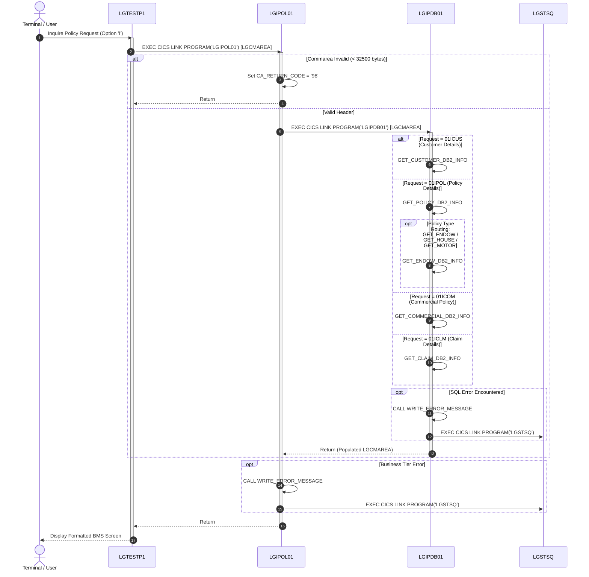
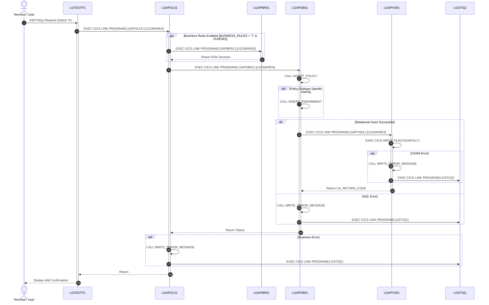
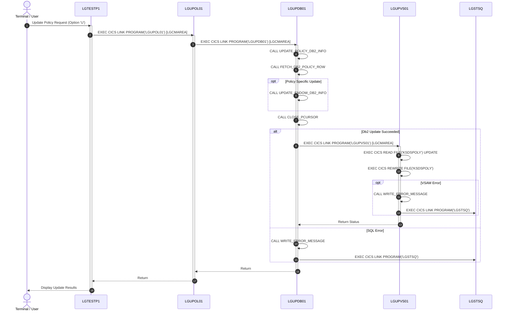
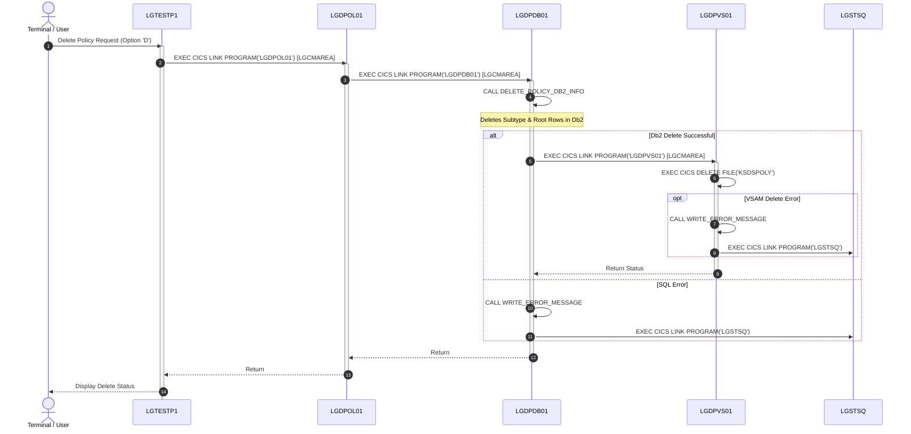
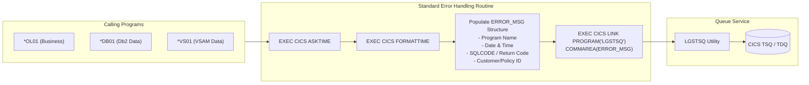

# GenApp PL/I Application Call Graphs and Architecture Documentation

This document provides architectural call graphs and invocation hierarchy analysis for the **GenApp-PLI** application, cataloged from workspace source files and the local metadata database.

---

## 1. System Overview & Architectural Model

The GenApp PL/I application implements a modular, three-tier z/OS CICS architecture:
1. **Presentation / Menu Layer**: Interactive BMS screen driver and coordinator ([`LGTESTP1`](PLI Programs/LGTESTP1.pli:1)).
2. **Business Logic Tier (`*OL01`)**: Request routing, input validation, ODM rule invocation, and orchestrator programs.
3. **Data Access Tier**:
   - **Db2 Relational Tier (`*DB01`)**: SQL queries, cursor loops, host variable mapping, and secondary VSAM sync calls.
   - **VSAM KSDS Tier (`*VS01`)**: Direct record read/write/delete operations against KSDS data sets (`KSDSCUST`, `KSDSPOLY`).
4. **Shared Utility & External Services**:
   - **Queue Logger Utility (`LGSTSQ`)**: Error message formatting and TSQ writer.
   - **ODM Rules Engine (`LGAPBR01`)**: Optional Operational Decision Manager business rule validation.

```mermaid
flowchart TD
    subgraph Client ["Presentation Layer"]
        LGTESTP1["LGTESTP1<br/>(BMS Menu Driver)"]
    end

    subgraph BusinessLogic ["Business Logic Tier"]
        LGIPOL01["LGIPOL01<br/>(Inquire Policy)"]
        LGAPOL01["LGAPOL01<br/>(Add Policy)"]
        LGUPOL01["LGUPOL01<br/>(Update Policy)"]
        LGDPOL01["LGDPOL01<br/>(Delete Policy)"]
    end

    subgraph BusinessRules ["Decision Service"]
        LGAPBR01["LGAPBR01<br/>(ODM Rules Engine)"]
    end

    subgraph DataAccess ["Data Access Tier"]
        subgraph Db2Layer ["Db2 Data Access"]
            LGIPDB01["LGIPDB01<br/>(Db2 Inquire)"]
            LGAPDB01["LGAPDB01<br/>(Db2 Insert)"]
            LGUPDB01["LGUPDB01<br/>(Db2 Update)"]
            LGDPDB01["LGDPDB01<br/>(Db2 Delete)"]
        end

        subgraph VSAMLayer ["VSAM KSDS Data Access"]
            LGAPVS01["LGAPVS01<br/>(VSAM Insert)"]
            LGUPVS01["LGUPVS01<br/>(VSAM Update)"]
            LGDPVS01["LGDPVS01<br/>(VSAM Delete)"]
        end
    end

    subgraph Utilities ["System Utilities"]
        LGSTSQ["LGSTSQ<br/>(TSQ Error Logger)"]
    end

    %% Presentation to Business Tier
    LGTESTP1 -->|EXEC CICS LINK| LGIPOL01
    LGTESTP1 -->|EXEC CICS LINK| LGAPOL01
    LGTESTP1 -->|EXEC CICS LINK| LGUPOL01
    LGTESTP1 -->|EXEC CICS LINK| LGDPOL01

    %% Business Tier to Db2 & Rules
    LGIPOL01 -->|EXEC CICS LINK| LGIPDB01
    LGAPOL01 -->|EXEC CICS LINK (Optional)| LGAPBR01
    LGAPOL01 -->|EXEC CICS LINK| LGAPDB01
    LGUPOL01 -->|EXEC CICS LINK| LGUPDB01
    LGDPOL01 -->|EXEC CICS LINK| LGDPDB01

    %% Db2 to VSAM secondary sync
    LGAPDB01 -->|EXEC CICS LINK| LGAPVS01
    LGUPDB01 -->|EXEC CICS LINK| LGUPVS01
    LGDPDB01 -->|EXEC CICS LINK| LGDPVS01

    %% Logging across all tiers
    LGIPOL01 -.->|EXEC CICS LINK| LGSTSQ
    LGAPOL01 -.->|EXEC CICS LINK| LGSTSQ
    LGUPOL01 -.->|EXEC CICS LINK| LGSTSQ
    LGDPOL01 -.->|EXEC CICS LINK| LGSTSQ
    LGIPDB01 -.->|EXEC CICS LINK| LGSTSQ
    LGAPDB01 -.->|EXEC CICS LINK| LGSTSQ
    LGUPDB01 -.->|EXEC CICS LINK| LGSTSQ
    LGDPDB01 -.->|EXEC CICS LINK| LGSTSQ
    LGAPVS01 -.->|EXEC CICS LINK| LGSTSQ
    LGUPVS01 -.->|EXEC CICS LINK| LGSTSQ
    LGDPVS01 -.->|EXEC CICS LINK| LGSTSQ
```

---

## 2. Program Catalog & Database Cross-Reference

| Program Name | Language / Type | Location / Source | Role & Responsibility |
|:---|:---|:---|:---|
| [`LGTESTP1`](PLI Programs/LGTESTP1.pli:1) | PL/I (Options Main, Reentrant) | Local Workspace & DB | Presentation controller; drives BMS map `SSMAP` for menu navigation and policy CRUD actions |
| [`LGIPOL01`](PLI Programs/LGIPOL01.pli:1) | PL/I (Options Main) | Local Workspace & DB | Policy Inquiry business logic controller; checks Commarea length and links to database layer |
| [`LGIPDB01`](PLI Programs/LGIPDB01.pli:1) | PL/I (Options Main) | Local Workspace & DB | Db2 inquiry data service; executes single row queries and multi-row cursors across policy tables |
| [`LGAPOL01`](PLI Programs/LGAPOL01.pli:1) | PL/I (Options Main) | Local Workspace & DB | Policy Add business logic controller; manages business rules gating and links to DB2 insert tier |
| [`LGAPDB01`](PLI Programs/LGAPDB01.pli:1) | PL/I (Options Main) | Local Workspace & DB | Db2 insert data service; persists customer/policy records to Db2 and triggers VSAM sync via `LGAPVS01` |
| [`LGAPVS01`](PLI Programs/LGAPVS01.pli:1) | PL/I (Options Main) | Local Workspace & DB | VSAM insert service; writes records to `KSDSCUST` and `KSDSPOLY` |
| [`LGUPOL01`](PLI Programs/LGUPOL01.pli:1) | PL/I (Options Main) | Local Workspace & DB | Policy Update business logic controller; validates request headers and links to update data tier |
| [`LGUPDB01`](PLI Programs/LGUPDB01.pli:1) | PL/I (Options Main) | Local Workspace & DB | Db2 update data service; performs cursor-based updates across policy tables and triggers `LGUPVS01` |
| [`LGUPVS01`](PLI Programs/LGUPVS01.pli:1) | PL/I (Options Main) | Local Workspace & DB | VSAM update service; rewrites records in `KSDSCUST` and `KSDSPOLY` |
| [`LGDPOL01`](PLI Programs/LGDPOL01.pli:1) | PL/I (Options Main) | Local Workspace & DB | Policy Delete business logic controller; orchestrates policy removal workflow |
| [`LGDPDB01`](PLI Programs/LGDPDB01.pli:1) | PL/I (Options Main) | Local Workspace & DB | Db2 delete data service; deletes rows from relational tables and calls `LGDPVS01` |
| [`LGDPVS01`](PLI Programs/LGDPVS01.pli:1) | PL/I (Options Main) | Local Workspace & DB | VSAM delete service; deletes customer and policy records from KSDS data sets |
| `LGAPBR01` | External / Rule Service | Database Catalog | Operational Decision Manager (ODM) business rule module for endowment policies |
| `LGSTSQ` | Assembler / Utility | Database Catalog | Standardized CICS Temporary Storage Queue (TSQ) error logging service |

---

## 3. Call Graphs by Functional Domain

### 3.1 Policy Inquiry Domain (`LGIP*`)

Handles retrieval and inquiry requests for customer policies, commercial details, and claim histories across Db2.

#### Inter-Program & Procedure Call Graph


#### Detailed Execution Matrix: `LGIPDB01` Internal Procedures
- [`LGIPDB01:MAIN`](PLI Programs/LGIPDB01.pli:232)
  - `GET_CUSTOMER_DB2_INFO`: Single-row select from `CUSTOMER` table.
  - `GET_POLICY_DB2_INFO`: Fetches root record from `POLICY` table, followed by specific subtype queries:
    - `GET_ENDOW_DB2_INFO`: Queries `ENDOWMENT` table.
    - `GET_HOUSE_DB2_INFO`: Queries `HOUSE` table.
    - `GET_MOTOR_DB2_INFO`: Queries `MOTOR` table.
    - `GET_COMMERCIAL_DB2_INFO_1` / `_2` / `_3` / `_5`: Dynamic cursor fetch for commercial risks.
    - `GET_CLAIM_DB2_INFO_1` / `_2`: Dynamic cursor fetch for policy claim records.
  - `WRITE_ERROR_MESSAGE` [`LGIPDB01:1225`](PLI Programs/LGIPDB01.pli:1225): Formats timestamp and links to `LGSTSQ`.

---

### 3.2 Policy Creation & Add Domain (`LGAP*`)

Manages the creation and insertion of new insurance policies, validation against business rules (ODM), persistence to Db2, and synchronization with VSAM.

#### Inter-Program & Procedure Call Graph


#### Detailed Execution Matrix: `LGAPDB01` Internal Procedures
- [`LGAPOL01:MAIN`](PLI Programs/LGAPOL01.pli:85)
  - Links to `LGAPBR01` [`LGAPOL01:124`](PLI Programs/LGAPOL01.pli:124) when rules are enabled.
  - Links to `LGAPDB01` [`LGAPOL01:133`](PLI Programs/LGAPOL01.pli:133).
- [`LGAPDB01:MAIN`](PLI Programs/LGAPDB01.pli:131)
  - `INSERT_POLICY`: Inserts base policy row into Db2.
  - Subtype inserts: `INSERT_ENDOWMENT`, `INSERT_HOUSE`, `INSERT_MOTOR`, `INSERT_COMMERCIAL`, `INSERT_CLAIM`.
  - Links to `LGAPVS01` [`LGAPDB01:229`](PLI Programs/LGAPDB01.pli:229) for dual storage consistency.
- [`LGAPVS01:MAIN`](PLI Programs/LGAPVS01.pli:131)
  - Executes `EXEC CICS WRITE FILE('KSDSPOLY')` or `EXEC CICS WRITE FILE('KSDSCUST')`.

---

### 3.3 Policy Update Domain (`LGUP*`)

Controls modifications to customer records and existing policy details in Db2 and VSAM.

#### Inter-Program & Procedure Call Graph


#### Detailed Execution Matrix: `LGUPDB01` Internal Procedures
- [`LGUPOL01:MAIN`](PLI Programs/LGUPOL01.pli:83)
  - Length check & request validation.
  - Links to `LGUPDB01` [`LGUPOL01:139`](PLI Programs/LGUPOL01.pli:139).
- [`LGUPDB01:MAIN`](PLI Programs/LGUPDB01.pli:130)
  - `UPDATE_POLICY_DB2_INFO`: Updates base policy row.
  - Cursor cycle: `FETCH_DB2_POLICY_ROW` -> `UPDATE_ENDOW_DB2_INFO` / `UPDATE_HOUSE_DB2_INFO` / `UPDATE_MOTOR_DB2_INFO` -> `CLOSE_PCURSOR`.
  - Links to `LGUPVS01` [`LGUPDB01:155`](PLI Programs/LGUPDB01.pli:155).
- [`LGUPVS01:MAIN`](PLI Programs/LGUPVS01.pli:146)
  - `EXEC CICS READ FILE(...) UPDATE` followed by `EXEC CICS REWRITE FILE(...)`.

---

### 3.4 Policy Deletion Domain (`LGDP*`)

Executes cascade deletion of policy subtypes, base policy rows, and VSAM records.

#### Inter-Program & Procedure Call Graph


#### Detailed Execution Matrix: `LGDPDB01` Internal Procedures
- [`LGDPOL01:MAIN`](PLI Programs/LGDPOL01.pli:69)
  - Links to `LGDPDB01` [`LGDPOL01:122`](PLI Programs/LGDPOL01.pli:122).
- [`LGDPDB01:MAIN`](PLI Programs/LGDPDB01.pli:90)
  - `DELETE_POLICY_DB2_INFO`: Deletes rows across `POLICY`, `ENDOWMENT`, `HOUSE`, `MOTOR`, `COMMERCIAL`, and `CLAIM` tables.
  - Links to `LGDPVS01` [`LGDPDB01:125`](PLI Programs/LGDPDB01.pli:125).
- [`LGDPVS01:MAIN`](PLI Programs/LGDPVS01.pli:69)
  - `EXEC CICS DELETE FILE('KSDSPOLY')`.

---

### 3.5 Cross-Cutting Infrastructure & Utility: Error Queue Logging (`LGSTSQ`)

All business logic, Db2 access, and VSAM modules share an identical, standardized error handler calling [`LGSTSQ`](PLI Programs/LGIPOL01.pli:119).



---

## 4. Architectural Summary & Cross-Reference Matrix

| Source Program | Invocation Target | Communication Method | Data Payload | Purpose / Interaction |
|:---|:---|:---|:---|:---|
| [`LGTESTP1`](PLI Programs/LGTESTP1.pli:59) | [`LGIPOL01`](PLI Programs/LGIPOL01.pli:1) | `EXEC CICS LINK` | `LGCMAREA` (32500 bytes) | Inquire customer/policy details |
| [`LGTESTP1`](PLI Programs/LGTESTP1.pli:100) | [`LGAPOL01`](PLI Programs/LGAPOL01.pli:1) | `EXEC CICS LINK` | `LGCMAREA` (32500 bytes) | Add new policy request |
| [`LGTESTP1`](PLI Programs/LGTESTP1.pli:122) | [`LGDPOL01`](PLI Programs/LGDPOL01.pli:1) | `EXEC CICS LINK` | `LGCMAREA` (32500 bytes) | Delete policy request |
| [`LGTESTP1`](PLI Programs/LGTESTP1.pli:190) | [`LGUPOL01`](PLI Programs/LGUPOL01.pli:1) | `EXEC CICS LINK` | `LGCMAREA` (32500 bytes) | Update policy request |
| [`LGIPOL01`](PLI Programs/LGIPOL01.pli:91) | [`LGIPDB01`](PLI Programs/LGIPDB01.pli:1) | `EXEC CICS LINK` | `LGCMAREA` (32500 bytes) | Execute Db2 relational inquiry |
| [`LGAPOL01`](PLI Programs/LGAPOL01.pli:124) | `LGAPBR01` | `EXEC CICS LINK` | `LGCMAREA` (32500 bytes) | Evaluate business rules for endowment policies |
| [`LGAPOL01`](PLI Programs/LGAPOL01.pli:133) | [`LGAPDB01`](PLI Programs/LGAPDB01.pli:1) | `EXEC CICS LINK` | `LGCMAREA` (32500 bytes) | Execute Db2 policy inserts |
| [`LGAPDB01`](PLI Programs/LGAPDB01.pli:229) | [`LGAPVS01`](PLI Programs/LGAPVS01.pli:1) | `EXEC CICS LINK` | `LGCMAREA` (32500 bytes) | Replicate inserted policy into VSAM KSDS |
| [`LGUPOL01`](PLI Programs/LGUPOL01.pli:139) | [`LGUPDB01`](PLI Programs/LGUPDB01.pli:1) | `EXEC CICS LINK` | `LGCMAREA` (32500 bytes) | Execute Db2 policy updates |
| [`LGUPDB01`](PLI Programs/LGUPDB01.pli:155) | [`LGUPVS01`](PLI Programs/LGUPVS01.pli:1) | `EXEC CICS LINK` | `LGCMAREA` (32500 bytes) | Replicate policy updates to VSAM KSDS |
| [`LGDPOL01`](PLI Programs/LGDPOL01.pli:122) | [`LGDPDB01`](PLI Programs/LGDPDB01.pli:1) | `EXEC CICS LINK` | `LGCMAREA` (32500 bytes) | Execute Db2 policy deletions |
| [`LGDPDB01`](PLI Programs/LGDPDB01.pli:125) | [`LGDPVS01`](PLI Programs/LGDPVS01.pli:1) | `EXEC CICS LINK` | `LGCMAREA` (32500 bytes) | Replicate policy deletions to VSAM KSDS |
| All Modules | `LGSTSQ` | `EXEC CICS LINK` | `ERROR_MSG` structure | Write formatted error diagnostics to CICS TSQ/TDQ |
