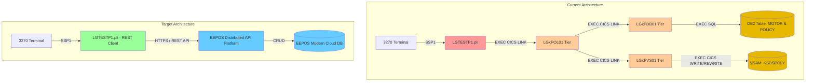
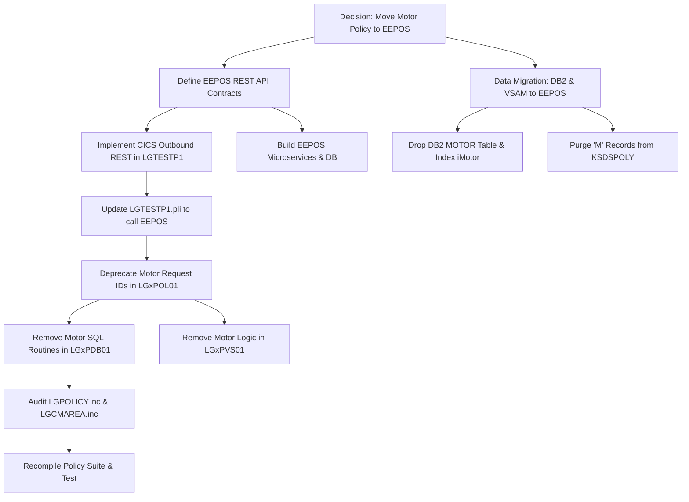

# Impact Analysis Report: Moving Motor Policy and Related Data to EEPOS via API

**Created**: 2025-05-18T10:00:00Z  
**Author**: IBM Bob Premium Package for Z AI Assistant  
**Analysis Method**: Local Workspace & Local Database Analysis  
**Workspace Alignment**: Fully Aligned  
**Confidence Level**: High  

---

## 1. Change Summary

### Change Specification

**Title**: Migration of Motor Policy Management and Relational Data to Distributed System (EEPOS) via REST API  

**Type**: Migration / Modernization / Decomposition  

**Description**:  
Migrate all Motor Policy lifecycle processing (Inquire, Add, Update, Delete) and associated persistence from the mainframe z/OS DB2 and VSAM tiers to an external distributed platform called **EEPOS**, accessed via RESTful APIs. 

**Business Objective**:  
- Decouple high-volume, modern motor insurance workflows from legacy mainframe processing.
- Offload DB2/VSAM storage and MIPS consumption for motor lines of business.
- Enable agile feature development in EEPOS while maintaining 3270 terminal compatibility during transition.

### System Context

- **Application**: GenApp-PLI General Insurance Application (CICS / PL/I / DB2 / VSAM / BMS).
- **Languages & Frameworks**: PL/I Enterprise Compiler, CICS Transaction Server for z/OS, IBM Db2 for z/OS, VSAM KSDS (`KSDSPOLY`), CICS BMS Maps.
- **Entry Points**: 
  - Terminal 3270 BMS Map: Transaction `SSP1` driving [`LGTESTP1.pli`](PLI%20Programs/LGTESTP1.pli:8).
  - Business Layer Programs: [`LGIPOL01.pli`](PLI%20Programs/LGIPOL01.pli:10), [`LGAPOL01.pli`](PLI%20Programs/LGAPOL01.pli:10), [`LGUPOL01.pli`](PLI%20Programs/LGUPOL01.pli:7), [`LGDPOL01.pli`](PLI%20Programs/LGDPOL01.pli:9).
  - Data Layer Programs: [`LGIPDB01.pli`](PLI%20Programs/LGIPDB01.pli:10), [`LGAPDB01.pli`](PLI%20Programs/LGAPDB01.pli:10), [`LGUPDB01.pli`](PLI%20Programs/LGUPDB01.pli:10), [`LGDPDB01.pli`](PLI%20Programs/LGDPDB01.pli:10), [`LGAPVS01.pli`](PLI%20Programs/LGAPVS01.pli:10), [`LGUPVS01.pli`](PLI%20Programs/LGUPVS01.pli:22), [`LGDPVS01.pli`](PLI%20Programs/LGDPVS01.pli:10).

---

## 2. Scope Definition

### In Scope
1. **BMS Menu & UI Layer**:
   - Refactor [`LGTESTP1.pli`](PLI%20Programs/LGTESTP1.pli:8) to call the EEPOS REST API directly (using `EXEC CICS WEB` API or CICS HTTP outbound infrastructure) instead of linking to internal `LGxPOL01` modules.
2. **Business & Persistence Layers (Decommissioning / Routing)**:
   - Deprecate or modify Request ID routing (`01IMOT`, `01AMOT`, `01UMOT`, `01DMOT`) in [`LGAPOL01.pli`](PLI%20Programs/LGAPOL01.pli:10), [`LGIPOL01.pli`](PLI%20Programs/LGIPOL01.pli:10), [`LGUPOL01.pli`](PLI%20Programs/LGUPOL01.pli:7), [`LGDPOL01.pli`](PLI%20Programs/LGDPOL01.pli:9).
   - Decommission DB2 motor SQL routines (`INSERT_MOTOR`, `GET_MOTOR_DB2_INFO`, `UPDATE_MOTOR_DB2_INFO`) in [`LGAPDB01.pli`](PLI%20Programs/LGAPDB01.pli:420), [`LGIPDB01.pli`](PLI%20Programs/LGIPDB01.pli:558), [`LGUPDB01.pli`](PLI%20Programs/LGUPDB01.pli:405), [`LGDPDB01.pli`](PLI%20Programs/LGDPDB01.pli:145).
   - Deprecate motor branch execution (`'M'`) in VSAM mirror programs [`LGAPVS01.pli`](PLI%20Programs/LGAPVS01.pli:111), [`LGUPVS01.pli`](PLI%20Programs/LGUPVS01.pli:126), [`LGDPVS01.pli`](PLI%20Programs/LGDPVS01.pli:61).
3. **Database & Data Tier**:
   - Decommission DB2 table `<DB2DBID>.MOTOR` and its index `<DB2DBID>.iMotor` in [`DDL/db2cre.jcl`](DDL/db2cre.jcl:267).
   - Migrate historical data from DB2 `MOTOR` and `POLICY` tables (where `POLICYTYPE = 'M'`) and `KSDSPOLY` VSAM records to EEPOS.
4. **Copybooks / Shared Includes**:
   - Audit and modify [`Includes/LGCMAREA.inc`](Includes/LGCMAREA.inc:71) (`CA_MOTOR` overlay) and [`Includes/LGPOLICY.inc`](Includes/LGPOLICY.inc:73) (`DB2_MOTOR` definitions and lengths).

### Out of Scope
- Non-motor insurance policies: Endowment (`01xEND`), House (`01xHOU`), Commercial (`01xCOM`), and Claims (`01xCLM`).
- Customer Master management: [`LGACDB01`](PLI%20Programs/LGAPDB01.pli:1) and Customer DB2 table (`<DB2DBID>.CUSTOMER`).
- Common infrastructure utilities: [`LGSTSQ`](PLI%20Programs/LGAPOL01.pli:165) (TSQ logger).

### System Boundaries
- **API Gateway / EEPOS API**: Boundary where CICS issues JSON/REST requests over HTTP/HTTPS.
- **Mainframe Core**: CICS Region and DB2 Subsystem hosting remaining insurance business lines.

---

## 3. System Architecture & Context

### System Architecture Flow (Current vs. Target)



---

## 4. Comprehensive List of Affected Programs and Includes

### 4.1. Programs to Modify or Decommission

| Program / Component | Role / Description | Action Required | Complexity |
| :--- | :--- | :--- | :--- |
| [`LGTESTP1.pli`](PLI%20Programs/LGTESTP1.pli:8) | Motor 3270 Menu UI Driver | **Modify**: Replace internal `EXEC CICS LINK` calls with `EXEC CICS WEB` / REST client routines to EEPOS. Parse JSON/REST responses back to `SSMAPP1` BMS screen. | High |
| [`LGIPOL01.pli`](PLI%20Programs/LGIPOL01.pli:10) | Policy Inquire Business Logic | **Modify**: Remove hardcoded Motor business rules (`IF CA_M_MAKE = 'HONDA' THEN ...`) or reject `01IMOT` requests with redirect code. | Low |
| [`LGIPDB01.pli`](PLI%20Programs/LGIPDB01.pli:10) | Policy Inquire DB2 Tier | **Modify**: Remove `GET_MOTOR_DB2_INFO` procedure (lines 558–656), SQL query `SELECT FROM POLICY, MOTOR`, and `01IMOT` branch in `SELECT(WS_REQUEST_ID)`. | Medium |
| [`LGAPOL01.pli`](PLI%20Programs/LGAPOL01.pli:10) | Policy Add Business Logic | **Modify**: Reject `01AMOT` request ID or decommission entry. | Low |
| [`LGAPDB01.pli`](PLI%20Programs/LGAPDB01.pli:10) | Policy Add DB2 Tier | **Modify**: Remove `INSERT_MOTOR` procedure (lines 420–460), `INSERT INTO MOTOR` SQL, and `01AMOT` handling. | Medium |
| [`LGUPOL01.pli`](PLI%20Programs/LGUPOL01.pli:7) | Policy Update Business Logic | **Modify**: Remove `01UMOT` validation logic and commarea length check (`WS_FULL_MOTOR_LEN`). | Low |
| [`LGUPDB01.pli`](PLI%20Programs/LGUPDB01.pli:10) | Policy Update DB2 Tier | **Modify**: Remove `UPDATE_MOTOR_DB2_INFO` (lines 405–437), `UPDATE MOTOR` SQL, and `01UMOT` branch in `SELECT(CA_REQUEST_ID)`. | Medium |
| [`LGDPOL01.pli`](PLI%20Programs/LGDPOL01.pli:9) | Policy Delete Business Logic | **Modify**: Remove `01DMOT` handling from request selection. | Low |
| [`LGDPDB01.pli`](PLI%20Programs/LGDPDB01.pli:10) | Policy Delete DB2 Tier | **Modify**: Remove `01DMOT` from `SELECT(CA_REQUEST_ID)` in line 123. | Low |
| [`LGAPVS01.pli`](PLI%20Programs/LGAPVS01.pli:10) | Policy Add VSAM Mirror | **Modify**: Remove `WHEN ('M')` branch in line 111 and `WF_M_Policy_Data` mapping. | Low |
| [`LGUPVS01.pli`](PLI%20Programs/LGUPVS01.pli:22) | Policy Update VSAM Mirror | **Modify**: Remove `WHEN ('M')` branch in line 127 and `WF_M_Policy_Data` mapping. | Low |
| [`LGDPVS01.pli`](PLI%20Programs/LGDPVS01.pli:10) | Policy Delete VSAM Mirror | **Modify**: Ensure no orphaned records or remove motor key deletes. | Low |

### 4.2. Copybooks & Includes to Audit / Modify

| Include File | Purpose & Usage | Recommended Change & Impact |
| :--- | :--- | :--- |
| [`Includes/LGCMAREA.inc`](Includes/LGCMAREA.inc:71) | Shared universal COMMAREA structure (32,500 bytes). Defines `CA_MOTOR` overlay (lines 71–81). | **Retain / Comment**: `CA_MOTOR` is inside a `UNION` (`CA_POLICY_SPECIFIC`). Removing it alters offset alignment only if surrounding structures change, but keeping it ensures backward binary compatibility with non-modified modules. |
| [`Includes/LGPOLICY.inc`](Includes/LGPOLICY.inc:17) | DB2 Host variables and length definitions. | **Modify**: Remove or deprecate `WS_MOTOR_LEN`, `WS_FULL_MOTOR_LEN`, and `DCL 1 DB2_MOTOR UNION` (lines 73–85) after all DB2 programs are refactored. |
| [`Maps/SSMAP.bms`](Maps/SSMAP.bms:1) & [`Includes/SSMAP.inc`](Includes/SSMAP.inc:1) | 3270 BMS Map for Motor Policy Screen `SSMAPP1`. | **Retain / Adjust**: Kept intact to support 3270 terminal users interacting with [`LGTESTP1.pli`](PLI%20Programs/LGTESTP1.pli:8). |

### 4.3. Database & CSD Resource Artifacts

| Artifact | Location | Impact |
| :--- | :--- | :--- |
| **Db2 Table `MOTOR`** | [`DDL/db2cre.jcl`](DDL/db2cre.jcl:267) (Table & `iMotor` Index) | Drop table and foreign key constraint referencing `POLICY`. |
| **Db2 Table `POLICY`** | [`DDL/db2cre.jcl`](DDL/db2cre.jcl:180) | Policy rows with `POLICYTYPE = 'M'` will no longer be generated on DB2. Existing rows migrated to EEPOS. |
| **VSAM Dataset `KSDSPOLY`** | Mainframe Catalog / CICS FCT | Records with key prefix `'M'` retired / migrated. |
| **CSD Definitions** | [`Resources/DFHCSDUP.csd`](Resources/DFHCSDUP.csd:144) / `GenApp.CSD` | Verify URIMAP, WEB, and TCPIPSERVICE configurations for outbound REST calls from `LGTESTP1`. |

---

## 5. Hidden Dependencies & Deep Architectural Findings

During in-depth analysis of the PL/I source code, the following non-obvious dependencies were identified:

1. **Hardcoded Motor Business Logic in Generic Programs**:
   - In [`LGIPOL01.pli`](PLI%20Programs/LGIPOL01.pli:96), there is explicit business logic tied to motor policy values:
     ```pli
     IF CA_M_MAKE = 'HONDA' THEN
        CA_EXPIRY_DATE = '2099-01-01';
     ```
     *Impact*: If motor inquiry is removed from `LGIPOL01`, this rule must be implemented in the EEPOS service or removed.

2. **Foreign Key Cascade Deletes on Db2**:
   - In [`DDL/db2cre.jcl`](DDL/db2cre.jcl:279), the `MOTOR` table defines:
     ```sql
     FOREIGN KEY(policyNumber) REFERENCES <DB2DBID>.policy (policyNumber) ON DELETE CASCADE
     ```
   - When deleting a motor policy via [`LGDPDB01.pli`](PLI%20Programs/LGDPDB01.pli:148), the SQL only deletes from `POLICY`:
     ```sql
     DELETE FROM POLICY WHERE CUSTOMERNUMBER = :DB2_CUSTOMERNUM_INT AND POLICYNUMBER = :DB2_POLICYNUM_INT;
     ```
     *Impact*: DB2 automatic cascade delete will no longer clean up motor records if the `MOTOR` table is removed or detached from DB2 `POLICY`.

3. **Dual-Persistence Mirroring (DB2 + VSAM)**:
   - Every CICS Add/Update/Delete operation writes to DB2 (`LGxPDB01`) and then immediately links to VSAM (`LGxPVS01`) to update `KSDSPOLY`.
   - *Impact*: EEPOS migration requires decommissioning or synchronizing both the DB2 `MOTOR` table and the `KSDSPOLY` VSAM records to prevent data inconsistency.

4. **Length and Union Overlay Dependencies in COMMAREA**:
   - `LGCMAREA` uses a single `32500` byte `UNION` for `CA_POLICY_SPECIFIC`.
   - Programs such as [`LGAPOL01.pli`](PLI%20Programs/LGAPOL01.pli:103) compute commarea size dynamically:
     ```pli
     WS_REQUIRED_CA_LEN = WS_CA_HEADER_LEN + WS_FULL_MOTOR_LEN;
     ```
   - *Impact*: Modifying length variables in `LGPOLICY.inc` without recompiling dependent programs can cause return code `98` (Commarea length too short) across other policy types.

5. **CICS Syncpoint / Distributed Two-Phase Commit**:
   - [`LGTESTP1.pli`](PLI%20Programs/LGTESTP1.pli:104) executes `EXEC CICS Syncpoint Rollback` on error.
   - When calling a REST API in EEPOS, CICS local syncpoint rollback will **not** automatically roll back changes in EEPOS unless a two-phase commit / compensation transaction pattern is used.

---

## 6. Risk Assessment & Mitigation

| Risk | Likelihood | Impact | Category | Mitigation Strategy |
| :--- | :--- | :--- | :--- | :--- |
| **Network Latency & Timeout in 3270 Session** | High | High | Performance / UX | Configure non-blocking HTTP timeouts on `EXEC CICS WEB CONVERSE`; implement graceful error handling with user-friendly messages on BMS map `SSMAPP1`. |
| **Data Integrity / Incomplete Dual-Write Migration** | High | High | Data Integrity | Execute bulk historical data migration during a maintenance window; employ data validation reconciliation scripts between DB2/VSAM and EEPOS. |
| **Lack of Distributed Transaction Rollback** | Medium | High | Operational / Integrity | Implement idempotent APIs in EEPOS; design compensating REST calls in `LGTESTP1` if subsequent CICS operations fail. |
| **CICS Outbound Security & Certificate Management** | Medium | Medium | Security / Auth | Install EEPOS TLS/SSL CA certificates in the z/OS RACF / TopSecret keyring; configure CICS URIMAP with appropriate Basic/Bearer token credentials. |
| **Regression in Other Policy Types (Endow, House, Comm)** | Low | High | Regression | Isolate changes in `LGCMAREA.inc` / `LGPOLICY.inc`; run comprehensive regression test suites for Endowment, House, and Commercial transactions. |

---

## 7. Change Propagation Map



---

## 8. Estimated Effort Breakdown

| Phase / Task | Description | Estimated Person-Days |
| :--- | :--- | :--- |
| **1. API Contract & Architecture Design** | Define OpenAPI/Swagger specs for Motor CRUD, authentication, and error codes. | 5 days |
| **2. EEPOS Backend Implementation** | Build distributed services, data storage, and business logic in EEPOS. | 15 days |
| **3. Mainframe REST Client (`LGTESTP1.pli`)** | Re-engineer `LGTESTP1.pli` with `EXEC CICS WEB` API, JSON parsing, and BMS mapping. | 8 days |
| **4. Mainframe Cleanup & Decoupling** | Modify `LGxPOL01`, `LGxPDB01`, `LGxPVS01`, `LGPOLICY.inc` to remove legacy motor code. | 7 days |
| **5. Data Migration & Validation Tooling** | Extraction JCL/programs from DB2/VSAM, transform, load into EEPOS, validation scripts. | 6 days |
| **6. Testing & Quality Assurance** | Unit testing, integration testing, latency/stress testing, regression of other policies. | 10 days |
| **7. Cutover & Operational Deployment** | Production dry-runs, RACF keyring configuration, CICS URIMAP setup, DDL drop. | 4 days |
| **Total Estimated Effort** | | **55 Person-Days (~11 Weeks)** |

---

## 9. Transition & Execution Plan

### Phase 1: Preparation & API Foundation (Weeks 1–3)
- Finalize EEPOS REST API contracts for Inquire, Add, Update, and Delete Motor Policy.
- Stand up EEPOS services in non-production environments with required schemas.
- Configure z/OS Communications Server, CICS TCPIPSERVICE, URIMAP, and RACF TLS keyrings for outbound CICS HTTP calls.

### Phase 2: Dual-Read & Prototype Client (Weeks 4–6)
- Develop and prototype the REST outbound client routines in [`LGTESTP1.pli`](PLI%20Programs/LGTESTP1.pli:8).
- Perform initial data snapshot from DB2 `MOTOR` and `POLICY` tables to EEPOS.
- Validate EEPOS API responses against `LGIPDB01` outputs.

### Phase 3: Mainframe Refactoring & Decoupling (Weeks 7–8)
- Refactor [`LGTESTP1.pli`](PLI%20Programs/LGTESTP1.pli:8) to switch completely to EEPOS REST APIs for Option 1 (Inquire), Option 2 (Add), Option 3 (Delete), Option 4 (Update).
- Remove motor-specific procedures (`INSERT_MOTOR`, `GET_MOTOR_DB2_INFO`, `UPDATE_MOTOR_DB2_INFO`) in `LGAPDB01`, `LGIPDB01`, `LGUPDB01`, and `LGDPDB01`.
- Update `LGAPVS01`, `LGUPVS01`, `LGDPVS01` to bypass VSAM writes for `'M'` policy records.

### Phase 4: Data Cutover & Full Integration Testing (Weeks 9–10)
- Execute final delta data migration from DB2 `MOTOR` to EEPOS database.
- Execute full regression testing of 3270 screens (`SSP1`, `SSMAPP1`) and non-motor policy types (Endowment, House, Commercial).
- Verify end-to-end exception scenarios (network timeout, API failure, invalid policy number).

### Phase 5: Decommissioning & Cleanup (Week 11)
- Drop DB2 Table `<DB2DBID>.MOTOR` and Index `<DB2DBID>.iMotor` via DDL.
- Clean up unused constants in [`Includes/LGPOLICY.inc`](Includes/LGPOLICY.inc:17).
- Archive legacy motor batch jobs and backup artifacts.
