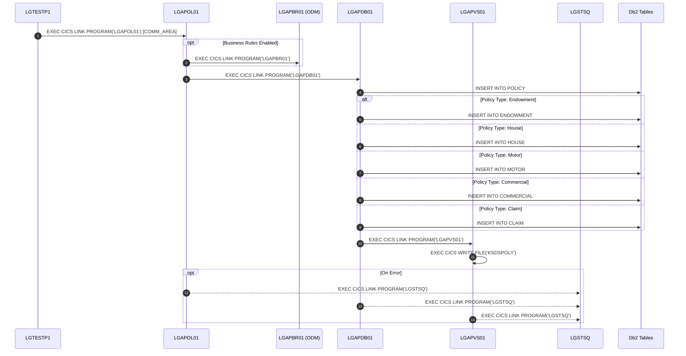
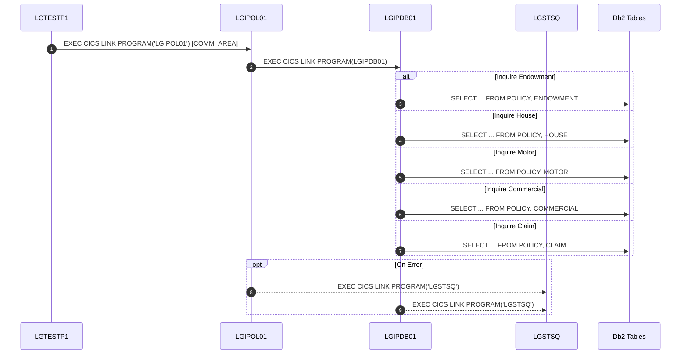
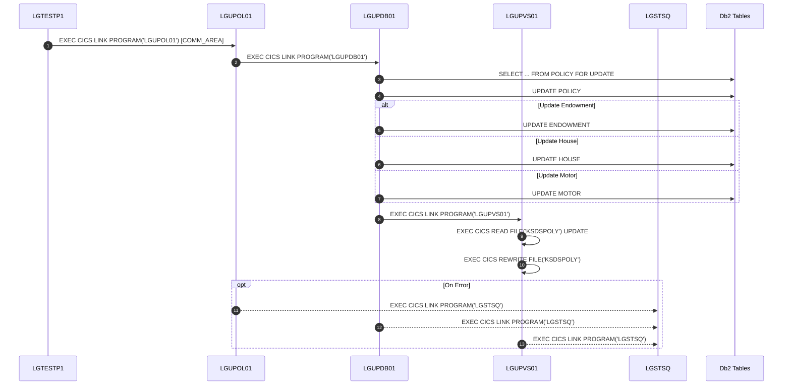
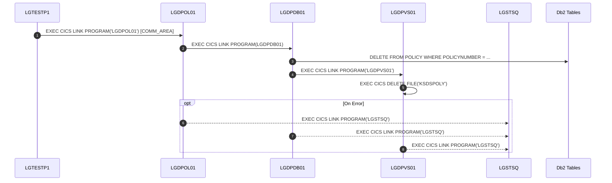
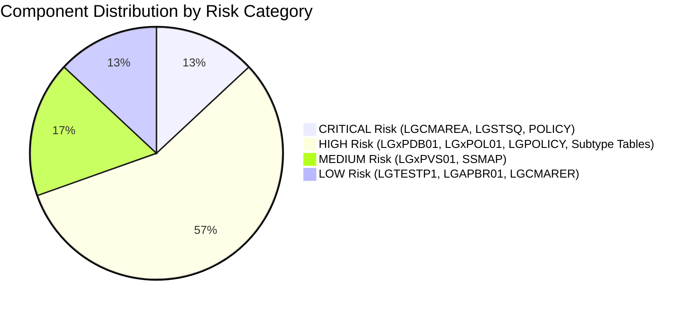

# GenApp-PLI Architecture & Call Graph Documentation

## 1. Executive Summary & Architecture Overview

**GenApp-PLI** is an enterprise general insurance policy management application running on IBM z/OS under CICS Transaction Server and IBM Db2. The application is written in PL/I with modular three-tier separation:
1. **Presentation / Menu Tier**: CICS BMS map handlers ([`LGTESTP1`](PLI%20Programs/LGTESTP1.pli)).
2. **Business Logic Tier**: Business validation, routing, orchestration, and optional ODM rule execution ([`LGAPOL01`](PLI%20Programs/LGAPOL01.pli), [`LGDPOL01`](PLI%20Programs/LGDPOL01.pli), [`LGIPOL01`](PLI%20Programs/LGIPOL01.pli), [`LGUPOL01`](PLI%20Programs/LGUPOL01.pli)).
3. **Data Access Tier**:
   - **Db2 Tier**: Relational persistence for core insurance entities ([`LGAPDB01`](PLI%20Programs/LGAPDB01.pli), [`LGDPDB01`](PLI%20Programs/LGDPDB01.pli), [`LGIPDB01`](PLI%20Programs/LGIPDB01.pli), [`LGUPDB01`](PLI%20Programs/LGUPDB01.pli)).
   - **VSAM Tier**: Key-Sequenced Data Set (KSDS) fast caching / policy indexing ([`LGAPVS01`](PLI%20Programs/LGAPVS01.pli), [`LGDPVS01`](PLI%20Programs/LGDPVS01.pli), [`LGUPVS01`](PLI%20Programs/LGUPVS01.pli)).
4. **Common Infrastructure & Utilities**: Common communication areas ([`LGCMAREA`](Includes/LGCMAREA.inc)), error logging via TSQ (`LGSTSQ`), business rules (`LGAPBR01`), and shared policy data models ([`LGPOLICY`](Includes/LGPOLICY.inc)).

```mermaid
graph TD
    subgraph Presentation ["Presentation Tier (BMS / CICS)"]
        LGTESTP1["LGTESTP1 (Terminal UI Menu)"]
    end

    subgraph BusinessLogic ["Business Logic Tier (OL)"]
        LGAPOL01["LGAPOL01 (Add Policy Logic)"]
        LGDPOL01["LGDPOL01 (Delete Policy Logic)"]
        LGIPOL01["LGIPOL01 (Inquire Policy Logic)"]
        LGUPOL01["LGUPOL01 (Update Policy Logic)"]
    end

    subgraph DataAccess ["Data Access Tier (DB & VS)"]
        LGAPDB01["LGAPDB01 (Add Policy Db2)"]
        LGDPDB01["LGDPDB01 (Delete Policy Db2)"]
        LGIPDB01["LGIPDB01 (Inquire Policy Db2)"]
        LGUPDB01["LGUPDB01 (Update Policy Db2)"]
        LGAPVS01["LGAPVS01 (Add Policy VSAM)"]
        LGDPVS01["LGDPVS01 (Delete Policy VSAM)"]
        LGUPVS01["LGUPVS01 (Update Policy VSAM)"]
    end

    subgraph External ["External & Utility Services"]
        LGSTSQ["LGSTSQ (TSQ Error Log Writer)"]
        LGAPBR01["LGAPBR01 (ODM Business Rules Engine)"]
    end

    LGTESTP1 -->|EXEC CICS LINK| LGAPOL01
    LGTESTP1 -->|EXEC CICS LINK| LGDPOL01
    LGTESTP1 -->|EXEC CICS LINK| LGIPOL01
    LGTESTP1 -->|EXEC CICS LINK| LGUPOL01

    LGAPOL01 -->|EXEC CICS LINK| LGAPDB01
    LGAPOL01 -.->|EXEC CICS LINK (Optional)| LGAPBR01
    LGAPDB01 -->|EXEC CICS LINK| LGAPVS01

    LGDPOL01 -->|EXEC CICS LINK| LGDPDB01
    LGDPDB01 -->|EXEC CICS LINK| LGDPVS01

    LGIPOL01 -->|EXEC CICS LINK| LGIPDB01

    LGUPOL01 -->|EXEC CICS LINK| LGUPDB01
    LGUPDB01 -->|EXEC CICS LINK| LGUPVS01

    LGTESTP1 -.->|Error| LGSTSQ
    LGAPOL01 -->|Error| LGSTSQ
    LGDPOL01 -->|Error| LGSTSQ
    LGIPOL01 -->|Error| LGSTSQ
    LGUPOL01 -->|Error| LGSTSQ
    LGAPDB01 -->|Error| LGSTSQ
    LGDPDB01 -->|Error| LGSTSQ
    LGIPDB01 -->|Error| LGSTSQ
    LGUPDB01 -->|Error| LGSTSQ
    LGAPVS01 -->|Error| LGSTSQ
    LGDPVS01 -->|Error| LGSTSQ
    LGUPVS01 -->|Error| LGSTSQ
```

---

## 2. Functional Topic Call Graphs

### 2.1 Policy Creation Flow (Add Policy)
The Policy Creation flow handles customer validation, policy number generation, policy header insertion, line-of-business (Endowment, House, Motor, Commercial, Claim) data creation, and VSAM KSDSPOLY key indexing.



### 2.2 Policy Inquiry Flow (Inquire Policy)
The Policy Inquiry flow fetches policy details by customer number, policy number, or line of business. It executes relational joins between `POLICY` and specific subtype tables (`ENDOWMENT`, `HOUSE`, `MOTOR`, `COMMERCIAL`, `CLAIM`).



### 2.3 Policy Update Flow (Update Policy)
The Policy Update flow acquires row-level locks via `SELECT FOR UPDATE`, updates relational attributes across `POLICY` and subtype tables, and synchronizes the VSAM `KSDSPOLY` data store via `READ UPDATE` / `REWRITE`.



### 2.4 Policy Deletion Flow (Delete Policy)
The Policy Deletion flow removes policy records from Db2 and removes index keys from VSAM `KSDSPOLY`.



---

## 3. Component Dependency Rankings & Fan-In / Fan-Out Metrics

### 3.1 Programs Dependency Ranking (by Direct Dependents / Inward Fan-In)

| Rank | Program | Type | Incoming Dependents (Fan-In) | Calling Programs (Callers) | Outgoing Dependencies (Fan-Out) | Risk Level |
| :--- | :--- | :--- | :--- | :--- | :--- | :--- |
| **1** | **`LGSTSQ`** | Utility | **11** | `LGAPDB01`, `LGAPOL01`, `LGAPVS01`, `LGDPDB01`, `LGDPOL01`, `LGDPVS01`, `LGIPDB01`, `LGIPOL01`, `LGUPDB01`, `LGUPOL01`, `LGUPVS01` | 0 | **CRITICAL** |
| **2** | **`LGIPDB01`** | Db2 Tier | **1** | `LGIPOL01` | 1 (`LGSTSQ`) + 6 Db2 Tables | **HIGH** |
| **2** | **`LGAPDB01`** | Db2 Tier | **1** | `LGAPOL01` | 2 (`LGSTSQ`, `LGAPVS01`) + 6 Db2 Tables | **HIGH** |
| **2** | **`LGUPDB01`** | Db2 Tier | **1** | `LGUPOL01` | 2 (`LGSTSQ`, `LGUPVS01`) + 4 Db2 Tables | **HIGH** |
| **2** | **`LGDPDB01`** | Db2 Tier | **1** | `LGDPOL01` | 2 (`LGSTSQ`, `LGDPVS01`) + 1 Db2 Table | **HIGH** |
| **2** | **`LGAPVS01`** | VSAM Tier | **1** | `LGAPDB01` | 1 (`LGSTSQ`) + VSAM (`KSDSPOLY`) | **MEDIUM** |
| **2** | **`LGUPVS01`** | VSAM Tier | **1** | `LGUPDB01` | 1 (`LGSTSQ`) + VSAM (`KSDSPOLY`) | **MEDIUM** |
| **2** | **`LGDPVS01`** | VSAM Tier | **1** | `LGDPDB01` | 1 (`LGSTSQ`) + VSAM (`KSDSPOLY`) | **MEDIUM** |
| **2** | **`LGAPBR01`** | ODM Tier | **1** | `LGAPOL01` | 0 | **LOW** |
| **2** | **`LGIPOL01`** | Business | **1** | `LGTESTP1` | 2 (`LGIPDB01`, `LGSTSQ`) | **HIGH** |
| **2** | **`LGAPOL01`** | Business | **1** | `LGTESTP1` | 3 (`LGAPDB01`, `LGAPBR01`, `LGSTSQ`) | **HIGH** |
| **2** | **`LGUPOL01`** | Business | **1** | `LGTESTP1` | 2 (`LGUPDB01`, `LGSTSQ`) | **HIGH** |
| **2** | **`LGDPOL01`** | Business | **1** | `LGTESTP1` | 2 (`LGDPDB01`, `LGSTSQ`) | **HIGH** |
| **3** | **`LGTESTP1`** | BMS UI | **0** | *(Initiating Transaction / Terminal UI)* | 5 (`LGIPOL01`, `LGAPOL01`, `LGDPOL01`, `LGUPOL01`, `LGSTSQ`) | **LOW** |

---

### 3.2 Includes / Copybooks Dependency Ranking

| Rank | Include / Copybook | File Path | Dependent Programs Count | Referencing Programs | Structural Impact & Role | Risk Level |
| :--- | :--- | :--- | :--- | :--- | :--- | :--- |
| **1** | **`LGCMAREA`** | [`Includes/LGCMAREA.inc`](Includes/LGCMAREA.inc) | **10** | `LGAPDB01`, `LGAPOL01`, `LGAPVS01`, `LGDPDB01`, `LGDPOL01`, `LGDPVS01`, `LGIPDB01`, `LGIPOL01`, `LGTESTP1`, `LGUPVS01` *(plus inline in `LGUPOL01`, `LGUPDB01`)* | Universal 32,500-byte `COMM_AREA` data contract across all layers. | **CRITICAL** |
| **2** | **`LGPOLICY`** | [`Includes/LGPOLICY.inc`](Includes/LGPOLICY.inc) | **3** | `LGAPDB01`, `LGIPDB01`, `LGUPDB01` *(also partially `LGIPOL01`)* | Db2 SQL host variable structures for Policy, Endowment, House, Motor, Commercial, Claim. | **HIGH** |
| **3** | **`SSMAP`** | [`Includes/SSMAP.inc`](Includes/SSMAP.inc) | **1** | `LGTESTP1` | BMS 3270 map symbolic copybook for terminal UI. | **MEDIUM** |
| **4** | **`LGCMARER`** | [`Includes/LGCMARER.inc`](Includes/LGCMARER.inc) | **0** *(Ext)* | *(Designed for `LGAPBR01` ODM integration)* | Business rules engine request/response data contracts. | **LOW** |

---

### 3.3 Db2 Tables Dependency Ranking

| Rank | Db2 Table | Referencing Programs Count | Referencing Programs | Operations Performed | Criticality & Risk Level |
| :--- | :--- | :--- | :--- | :--- | :--- |
| **1** | **`POLICY`** | **4** | `LGAPDB01`, `LGDPDB01`, `LGIPDB01`, `LGUPDB01` | `INSERT`, `SELECT`, `UPDATE` (with lock), `DELETE` | **CRITICAL** (Central root entity for all insurance operations) |
| **2** | **`COMMERCIAL`**| **2** | `LGAPDB01`, `LGIPDB01` | `INSERT`, `SELECT` | **HIGH** |
| **2** | **`ENDOWMENT`** | **3** | `LGAPDB01`, `LGIPDB01`, `LGUPDB01` | `INSERT`, `SELECT`, `UPDATE` | **HIGH** |
| **2** | **`HOUSE`**     | **3** | `LGAPDB01`, `LGIPDB01`, `LGUPDB01` | `INSERT`, `SELECT`, `UPDATE` | **HIGH** |
| **2** | **`MOTOR`**     | **3** | `LGAPDB01`, `LGIPDB01`, `LGUPDB01` | `INSERT`, `SELECT`, `UPDATE` | **HIGH** |
| **2** | **`CLAIM`**     | **2** | `LGAPDB01`, `LGIPDB01` | `INSERT`, `SELECT` | **HIGH** |

---

## 4. Architectural Risk Analysis & High-Risk Components



### 4.1 Top Critical Risk Components

1. **[`Includes/LGCMAREA.inc`](Includes/LGCMAREA.inc) (Copybook - CRITICAL RISK)**
   - **Why Risky**: Acts as the universal parameter interface (`COMM_AREA`) for all CICS `LINK` commands across every tier. A change in layout, field offsets, or UNION structures triggers recompilation and alignment requirements across all 11+ programs.
   - **Mitigation Strategy**: Maintain backward-compatible byte alignment, avoid changing existing offsets, and implement regression testing across all transaction paths.

2. **`LGSTSQ` (Utility Program - CRITICAL RISK)**
   - **Why Risky**: Called by every single program in the application (11 callers) for error logging to CICS TSQ. Any change in parameter expectations or availability can cause cascading failures across all business and database tiers.
   - **Mitigation Strategy**: Maintain rigid parameter signature and fail-safe exception handling.

3. **`POLICY` (Db2 Table - CRITICAL RISK)**
   - **Why Risky**: Core parent table referenced by all 4 database tier programs (`LGAPDB01`, `LGDPDB01`, `LGIPDB01`, `LGUPDB01`). Schema alterations impact full lifecycle CRUD operations.
   - **Mitigation Strategy**: Plan schema migrations with DBAs, ensure corresponding updates in [`Includes/LGPOLICY.inc`](Includes/LGPOLICY.inc), and coordinate synchronized builds.

4. **Db2 Tier Programs ([`LGAPDB01`](PLI%20Programs/LGAPDB01.pli), [`LGIPDB01`](PLI%20Programs/LGIPDB01.pli), [`LGUPDB01`](PLI%20Programs/LGUPDB01.pli), [`LGDPDB01`](PLI%20Programs/LGDPDB01.pli) - HIGH RISK)**
   - **Why Risky**: These programs bridge business transactions to both relational Db2 tables and VSAM files (`KSDSPOLY`), managing data integrity, locking (`SELECT FOR UPDATE`), and transactional consistency.
   - **Mitigation Strategy**: Rigorous transaction boundary testing and DB2 plan rebind verification.
