# GenApp-PLI — Architecture Diagram

> Functional layers, business programs, BMS screens, DB2 tables, VSAM files, and external programs.  
> Utility programs (`LGSTSQ`) and language runtime includes (`LGCMAREA`, `LGPOLICY`, `SQLCA`, `SSMAP`) are excluded to keep the diagram focused on business logic.

---

## Layer Legend

| Colour | Layer |
|--------|-------|
| 🟦 Blue | Presentation (BMS screen + terminal transaction) |
| 🟩 Green | Add Policy operation |
| 🟦 Teal | Inquire Policy operation |
| 🟥 Red | Delete Policy operation |
| 🟧 Amber | Update Policy operation |
| 🟪 Purple | VSAM Access tier |
| ⬜ Grey | External systems (DB2, VSAM file, ODM) |

---

## Architecture Diagram

```mermaid
%%{init: {"theme": "base", "themeVariables": {
  "primaryColor": "#f0f4ff",
  "primaryBorderColor": "#6c8ebf",
  "secondaryColor": "#f9f9f9",
  "tertiaryColor": "#fff8ec",
  "edgeLabelBackground": "#ffffff",
  "fontFamily": "monospace"
}}}%%

flowchart TB

    %% ─────────────────────────────────────────
    %% LAYER 0 — CICS ENTRY POINT
    %% ─────────────────────────────────────────
    subgraph L0["① CICS Transaction"]
        direction LR
        TXN(["SSP1\nCICS Transaction"])
    end

    %% ─────────────────────────────────────────
    %% LAYER 1 — PRESENTATION
    %% ─────────────────────────────────────────
    subgraph L1["② Presentation — BMS Screen &amp; Terminal Program"]
        direction LR
        SSMAP[["SSMAP\nBMS Mapset\n(SSMAPP1)"]]
        LGTESTP1["LGTESTP1\nTerminal Menu\n(Motor Policy)"]
    end

    %% ─────────────────────────────────────────
    %% LAYER 2 — BUSINESS LOGIC
    %% ─────────────────────────────────────────
    subgraph L2["③ Business Logic Tier  —  LGxPOL01"]
        direction LR
        LGAPOL01["LGAPOL01\nAdd Policy"]
        LGIPOL01["LGIPOL01\nInquire Policy"]
        LGDPOL01["LGDPOL01\nDelete Policy"]
        LGUPOL01["LGUPOL01\nUpdate Policy"]
    end

    %% ─────────────────────────────────────────
    %% LAYER 3A — DB2 ACCESS TIER
    %% ─────────────────────────────────────────
    subgraph L3A["④a DB2 Access Tier  —  LGxPDB01"]
        direction LR
        LGAPDB01["LGAPDB01\nAdd → DB2"]
        LGIPDB01["LGIPDB01\nInquire → DB2"]
        LGDPDB01["LGDPDB01\nDelete → DB2"]
        LGUPDB01["LGUPDB01\nUpdate → DB2"]
    end

    %% ─────────────────────────────────────────
    %% LAYER 3B — VSAM ACCESS TIER
    %% ─────────────────────────────────────────
    subgraph L3B["④b VSAM Access Tier  —  LGxPVS01"]
        direction LR
        LGAPVS01["LGAPVS01\nAdd → VSAM"]
        LGDPVS01["LGDPVS01\nDelete → VSAM"]
        LGUPVS01["LGUPVS01\nUpdate → VSAM"]
    end

    %% ─────────────────────────────────────────
    %% LAYER 4 — EXTERNAL RESOURCES
    %% ─────────────────────────────────────────
    subgraph L4["⑤ Data Stores &amp; External Services"]
        direction TB

        subgraph DB2["DB2 Tables"]
            direction LR
            TPOLICY[("POLICY\n──────\nMaster policy record\nall types")]
            TENDOW[("ENDOWMENT\n──────\nEndowment policy\ndetail")]
            THOUSE[("HOUSE\n──────\nHouse policy\ndetail")]
            TMOTOR[("MOTOR\n──────\nMotor policy\ndetail")]
            TCOMMERCIAL[("COMMERCIAL\n──────\nCommercial policy\ndetail")]
            TCLAIM[("CLAIM\n──────\nClaim record")]
        end

        subgraph VSAM["VSAM File"]
            KSDSPOLY[("KSDSPOLY\n──────\nKSDS — Policy\nmaster copy")]
        end

        subgraph ODM["External — Business Rules"]
            LGAPBR01["LGAPBR01\nODM Business Rules\n(optional — disabled\nby default)"]
        end
    end

    %% ─────────────────────────────────────────
    %% EDGES — Entry & Presentation
    %% ─────────────────────────────────────────
    TXN -->|"starts"| LGTESTP1
    SSMAP <-->|"SEND / RECEIVE MAP"| LGTESTP1

    %% ─────────────────────────────────────────
    %% EDGES — Business Logic dispatch
    %% ─────────────────────────────────────────
    LGTESTP1 -->|"CICS LINK\nAdd"| LGAPOL01
    LGTESTP1 -->|"CICS LINK\nInquire"| LGIPOL01
    LGTESTP1 -->|"CICS LINK\nDelete"| LGDPOL01
    LGTESTP1 -->|"CICS LINK\nUpdate"| LGUPOL01

    %% ─────────────────────────────────────────
    %% EDGES — Business Logic → Data Tier
    %% ─────────────────────────────────────────
    LGAPOL01 -->|"CICS LINK"| LGAPDB01
    LGAPOL01 -->|"CICS LINK\n(VSAM path)"| LGAPVS01
    LGAPOL01 -.->|"CICS LINK\n[if BUSINESS_RULES=Y]"| LGAPBR01

    LGIPOL01 -->|"CICS DYNAMIC_LINK"| LGIPDB01

    LGDPOL01 -->|"CICS DYNAMIC_LINK"| LGDPDB01
    LGDPDB01 -->|"CICS LINK\n(cascade)"| LGDPVS01

    LGUPOL01 -->|"CICS LINK"| LGUPDB01
    LGUPDB01 -->|"CICS LINK\n(sync)"| LGUPVS01

    %% ─────────────────────────────────────────
    %% EDGES — DB2 Access → DB2 Tables
    %% ─────────────────────────────────────────
    LGAPDB01 -->|"INSERT"| TPOLICY
    LGAPDB01 -->|"SELECT"| TPOLICY
    LGAPDB01 -->|"INSERT"| TENDOW
    LGAPDB01 -->|"INSERT"| THOUSE
    LGAPDB01 -->|"INSERT"| TMOTOR
    LGAPDB01 -->|"INSERT"| TCOMMERCIAL
    LGAPDB01 -->|"INSERT"| TCLAIM

    LGIPDB01 -->|"SELECT / FETCH"| TPOLICY
    LGIPDB01 -->|"SELECT"| TENDOW
    LGIPDB01 -->|"SELECT"| THOUSE
    LGIPDB01 -->|"SELECT"| TMOTOR
    LGIPDB01 -->|"SELECT / FETCH"| TCOMMERCIAL
    LGIPDB01 -->|"SELECT / FETCH"| TCLAIM

    LGDPDB01 -->|"DELETE"| TPOLICY

    LGUPDB01 -->|"SELECT FOR UPDATE\n/ UPDATE"| TPOLICY
    LGUPDB01 -->|"UPDATE"| TENDOW
    LGUPDB01 -->|"UPDATE"| THOUSE
    LGUPDB01 -->|"UPDATE"| TMOTOR

    %% ─────────────────────────────────────────
    %% EDGES — VSAM Access → VSAM File
    %% ─────────────────────────────────────────
    LGAPVS01 -->|"CICS WRITE"| KSDSPOLY
    LGDPVS01 -->|"CICS DELETE"| KSDSPOLY
    LGUPVS01 -->|"CICS READ\n+ REWRITE"| KSDSPOLY

    %% ─────────────────────────────────────────
    %% STYLES — Layers
    %% ─────────────────────────────────────────
    style L0 fill:#e8eaf6,stroke:#5c6bc0,stroke-width:2px
    style L1 fill:#e3f2fd,stroke:#1976d2,stroke-width:2px
    style L2 fill:#e8f5e9,stroke:#388e3c,stroke-width:2px
    style L3A fill:#fff8e1,stroke:#f9a825,stroke-width:2px
    style L3B fill:#f3e5f5,stroke:#7b1fa2,stroke-width:2px
    style L4 fill:#fafafa,stroke:#757575,stroke-width:2px
    style DB2 fill:#fff3e0,stroke:#e65100,stroke-width:1px,stroke-dasharray:4 2
    style VSAM fill:#ede7f6,stroke:#4527a0,stroke-width:1px,stroke-dasharray:4 2
    style ODM fill:#fce4ec,stroke:#ad1457,stroke-width:1px,stroke-dasharray:4 2

    %% ─────────────────────────────────────────
    %% STYLES — Nodes
    %% ─────────────────────────────────────────

    %% Transaction
    style TXN fill:#5c6bc0,color:#fff,stroke:#3949ab

    %% BMS map
    style SSMAP fill:#1976d2,color:#fff,stroke:#0d47a1

    %% Terminal program
    style LGTESTP1 fill:#1565c0,color:#fff,stroke:#0d47a1

    %% Business Logic — Add (green)
    style LGAPOL01 fill:#2e7d32,color:#fff,stroke:#1b5e20
    %% Business Logic — Inquire (teal)
    style LGIPOL01 fill:#00695c,color:#fff,stroke:#004d40
    %% Business Logic — Delete (red)
    style LGDPOL01 fill:#b71c1c,color:#fff,stroke:#7f0000
    %% Business Logic — Update (amber)
    style LGUPOL01 fill:#e65100,color:#fff,stroke:#bf360c

    %% DB2 Access — Add (green)
    style LGAPDB01 fill:#388e3c,color:#fff,stroke:#1b5e20
    %% DB2 Access — Inquire (teal)
    style LGIPDB01 fill:#00796b,color:#fff,stroke:#004d40
    %% DB2 Access — Delete (red)
    style LGDPDB01 fill:#c62828,color:#fff,stroke:#7f0000
    %% DB2 Access — Update (amber)
    style LGUPDB01 fill:#ef6c00,color:#fff,stroke:#bf360c

    %% VSAM Access — Add
    style LGAPVS01 fill:#6a1b9a,color:#fff,stroke:#4a148c
    %% VSAM Access — Delete
    style LGDPVS01 fill:#6a1b9a,color:#fff,stroke:#4a148c
    %% VSAM Access — Update
    style LGUPVS01 fill:#6a1b9a,color:#fff,stroke:#4a148c

    %% DB2 tables
    style TPOLICY fill:#fff3e0,stroke:#e65100,color:#212121
    style TENDOW fill:#fff3e0,stroke:#e65100,color:#212121
    style THOUSE fill:#fff3e0,stroke:#e65100,color:#212121
    style TMOTOR fill:#fff3e0,stroke:#e65100,color:#212121
    style TCOMMERCIAL fill:#fff3e0,stroke:#e65100,color:#212121
    style TCLAIM fill:#fff3e0,stroke:#e65100,color:#212121

    %% VSAM file
    style KSDSPOLY fill:#ede7f6,stroke:#4527a0,color:#212121

    %% ODM
    style LGAPBR01 fill:#f8bbd0,stroke:#ad1457,color:#212121
```



---

## Key Architectural Observations

### Three-Tier CICS Call Chain
Every business operation follows the same pattern:
```
LGTESTP1  →  LGxPOL01  →  LGxPDB01  →  DB2 tables
                       →  LGxPVS01  →  KSDSPOLY (VSAM)
```
All communication flows through the shared 32 500-byte `COMM_AREA` parameter passed on every `EXEC CICS LINK`.

### Dual Persistence Model
DB2 is the primary data store; `KSDSPOLY` (VSAM KSDS) is a parallel copy maintained in sync:
- **Add** — `LGAPVS01` writes VSAM independently alongside `LGAPDB01`
- **Delete** — `LGDPDB01` cascades to `LGDPVS01` to remove the VSAM record
- **Update** — `LGUPDB01` calls `LGUPVS01` after completing all DB2 updates

### Dynamic vs Static Linking
- `LGIPOL01 → LGIPDB01` and `LGDPOL01 → LGDPDB01` use **`CICS DYNAMIC_LINK`** (program name resolved at runtime)
- All other inter-program calls use **static `CICS LINK`**

### Optional Business Rules Path
`LGAPOL01` contains a `BUSINESS_RULES` flag (default `'N'`) that gates an optional call to the ODM engine `LGAPBR01`. The flag is hardcoded off; enabling it requires changing the initialisation value in source.

### Inquire Complexity
`LGIPDB01` is by far the most complex program (cyclomatic score **70**, 15 internal procedures). It is the only program that uses **CICS Channels/Containers** (`GET CONTAINER` / `PUT CONTAINER`) to pass large result sets back to the caller.
