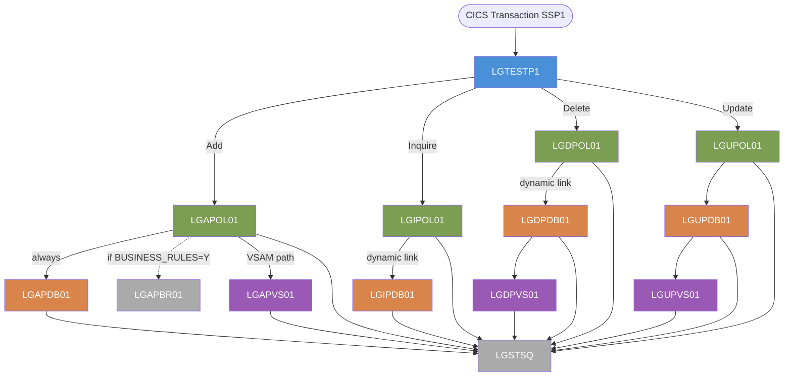

# GenApp-PLI — Complete Application Inventory

> Generated from local scanner database and source inspection.  
> All 11 PL/I programs and 1 supporting utility are catalogued.

---

## 1. Application Overview

GenApp is a CICS-based general insurance policy management application written in PL/I (z/OS).
It manages four policy types — **Endowment**, **House**, **Motor**, and **Commercial** — and
exposes them through a 3-tier CICS program architecture:

```
Terminal / UI tier  →  Business logic tier  →  Data access tier
    LGTESTP1              LGxPOL01               LGxPDB01  (DB2)
                                                 LGxPVS01  (VSAM)
```

All programs communicate via a 32 500-byte `COMM_AREA` structure defined in
[`LGCMAREA.inc`](../../Includes/LGCMAREA.inc) and linked using `EXEC CICS LINK`.

**CICS transaction**: `SSP1`  
**CICS resource group**: `GENASAP`

---

## 2. Program Summary Table

| Program | Tier | Operation | Storage | Paragraphs | Cyclomatic Score |
|---------|------|-----------|---------|-----------|-----------------|
| [LGTESTP1](#lgtestp1) | UI / Menu | All (Add/Inquire/Delete/Update) | — | 1 | 12 |
| [LGAPOL01](#lgapol01) | Business Logic | Add Policy | — | 2 | 9 |
| [LGAPDB01](#lgapdb01) | DB2 Access | Add Policy | DB2 | 8 | 26 |
| [LGAPVS01](#lgapvs01) | VSAM Access | Add Policy | VSAM | 2 | 9 |
| [LGIPOL01](#lgipol01) | Business Logic | Inquire Policy | — | 2 | 6 |
| [LGIPDB01](#lgipdb01) | DB2 Access | Inquire Policy | DB2 | 15 | 70 |
| [LGDPOL01](#lgdpol01) | Business Logic | Delete Policy | — | 3 | 8 |
| [LGDPDB01](#lgdpdb01) | DB2 Access | Delete Policy | DB2 | 3 | 8 |
| [LGDPVS01](#lgdpvs01) | VSAM Access | Delete Policy | VSAM | 2 | 5 |
| [LGUPOL01](#lgupol01) | Business Logic | Update Policy | — | 3 | 11 |
| [LGUPDB01](#lgupdb01) | DB2 Access | Update Policy | DB2 | — | — |
| [LGUPVS01](#lgupvs01) | VSAM Access | Update Policy | VSAM | 2 | 10 |

> **Note**: `LGUPDB01` is present in the source tree but was classified as type COBOL (`1`) by the scanner — likely an artefact of an earlier port. It is a PL/I source file and is included here.  
> `LGSTSQ` and `LGAPBR01` are utility/external programs referenced by the above programs; they are listed in section 5.

---

## 3. Per-Program Detail

---

### LGTESTP1

**File**: [`PLI Programs/LGTESTP1.pli`](../../PLI%20Programs/LGTESTP1.pli)  
**Tier**: UI / Terminal Menu  
**Role**: Entry-point CICS program for the motor policy menu screen. Presents a BMS map to the terminal operator, captures key presses (PF keys, ENTER), and dispatches to the appropriate business-logic program for Add, Inquire, Delete, or Update operations. Handles `HANDLE AID`, `HANDLE CONDITION`, and `SYNCPOINT ROLLBACK` for error recovery.  
**CICS Transaction**: `SSP1`

#### Includes

| Include | Mechanism | Purpose |
|---------|-----------|---------|
| [`SSMAP.inc`](../../Includes/SSMAP.inc) | `%INCLUDE SSMAP` | BMS map symbolic definitions (all screen field structures) |
| [`LGCMAREA.inc`](../../Includes/LGCMAREA.inc) | `%INCLUDE LGCMAREA` | Universal COMM_AREA communication area structure |

#### BMS Maps (MAPSET `SSMAP`)

| Map | Direction | Use |
|-----|-----------|-----|
| `SSMAPP1` (I/O: `SSMAPP1I` / `SSMAPP1O`) | SEND + RECEIVE | Main policy input/display screen |

> The mapset `SSMAP` is defined in [`Maps/SSMAP.bms`](../../Maps/SSMAP.bms).  
> The include [`Includes/SSMAP.inc`](../../Includes/SSMAP.inc) contains symbolic field definitions for maps `SSMAPP1`–`SSMAPP5` and `SSMAPC1`.

#### Called Programs (CICS LINK)

| Program | Trigger | Purpose |
|---------|---------|---------|
| [`LGAPOL01`](#lgapol01) | PF key — Add | Add policy business logic |
| [`LGIPOL01`](#lgipol01) | PF key — Inquire | Inquire policy business logic |
| [`LGDPOL01`](#lgdpol01) | PF key — Delete | Delete policy business logic |
| [`LGUPOL01`](#lgupol01) | PF key — Update | Update policy business logic |

#### DB2 Tables
None.

#### VSAM Files
None.

---

### LGAPOL01

**File**: [`PLI Programs/LGAPOL01.pli`](../../PLI%20Programs/LGAPOL01.pli)  
**Tier**: Business Logic  
**Role**: Orchestrates the Add Policy request. Validates the incoming `COMM_AREA`, optionally invokes the ODM business rules engine (`LGAPBR01`), then delegates to `LGAPDB01` (DB2 path) for data persistence. Logs errors to TSQ via `LGSTSQ`.  
**Called by**: `LGTESTP1`

#### Includes

| Include | Mechanism | Purpose |
|---------|-----------|---------|
| [`LGCMAREA.inc`](../../Includes/LGCMAREA.inc) | `%INCLUDE LGCMAREA` | COMM_AREA structure |
| [`LGPOLICY.inc`](../../Includes/LGPOLICY.inc) | `%INCLUDE LGPOLICY` | DB2 host variable structures for all policy types |
| `SQLCA` | `EXEC SQL INCLUDE SQLCA` | SQL communication area |

#### Called Programs (CICS LINK)

| Program | Condition | Purpose |
|---------|-----------|---------|
| [`LGAPBR01`](#lgapbr01--lgstsq-supporting-programs) | `BUSINESS_RULES = 'Y'` (disabled by default) | ODM business rules validation |
| [`LGAPDB01`](#lgapdb01) | Always | DB2 write path for add |
| [`LGSTSQ`](#lgapbr01--lgstsq-supporting-programs) | On error | Write error message to transient data queue |

#### DB2 Tables
None directly (delegates to `LGAPDB01`).

#### VSAM Files
None directly.

---

### LGAPDB01

**File**: [`PLI Programs/LGAPDB01.pli`](../../PLI%20Programs/LGAPDB01.pli)  
**Tier**: DB2 Data Access  
**Role**: Performs all DB2 INSERT operations for a new policy. Inserts a master row into `POLICY`, then inserts a type-specific row into one of `ENDOWMENT`, `HOUSE`, `MOTOR`, or `COMMERCIAL` based on the policy type code in `COMM_AREA`. Also inserts into `CLAIM`. Reads back the newly assigned policy number via `SELECT`. Logs errors to TSQ via `LGSTSQ`.  
**Called by**: `LGAPOL01`

#### Includes

| Include | Mechanism | Purpose |
|---------|-----------|---------|
| [`LGCMAREA.inc`](../../Includes/LGCMAREA.inc) | `EXEC SQL INCLUDE LGCMAREA` | COMM_AREA structure |
| [`LGPOLICY.inc`](../../Includes/LGPOLICY.inc) | `EXEC SQL INCLUDE LGPOLICY` | DB2 host variable structures |
| `SQLCA` | `EXEC SQL INCLUDE SQLCA` | SQL communication area |

#### DB2 Tables

| Table | Access Mode | Operation |
|-------|-------------|-----------|
| `POLICY` | READ | `SELECT` — retrieve policy number after insert |
| `POLICY` | WRITE | `INSERT` — create master policy record |
| `ENDOWMENT` | WRITE | `INSERT` — create endowment policy detail |
| `HOUSE` | WRITE | `INSERT` — create house policy detail |
| `MOTOR` | WRITE | `INSERT` — create motor policy detail |
| `COMMERCIAL` | WRITE | `INSERT` — create commercial policy detail |
| `CLAIM` | WRITE | `INSERT` — create initial claim record |

#### VSAM Files
None.

#### Called Programs (CICS LINK)

| Program | Purpose |
|---------|---------|
| [`LGSTSQ`](#lgapbr01--lgstsq-supporting-programs) | Write error message to TSQ |

---

### LGAPVS01

**File**: [`PLI Programs/LGAPVS01.pli`](../../PLI%20Programs/LGAPVS01.pli)  
**Tier**: VSAM Data Access  
**Role**: Writes a new policy record to the `KSDSPOLY` VSAM KSDS file using `EXEC CICS WRITE FILE`. Provides an alternative VSAM persistence path for the Add Policy operation. Logs errors via `LGSTSQ`.  
**Called by**: `LGAPOL01` (if VSAM path is selected in COMM_AREA)

#### Includes

| Include | Mechanism | Purpose |
|---------|-----------|---------|
| [`LGCMAREA.inc`](../../Includes/LGCMAREA.inc) | `%INCLUDE LGCMAREA` | COMM_AREA structure |

#### VSAM Files

| File | CICS Name | Access Mode | Operation |
|------|-----------|-------------|-----------|
| `KSDSPOLY` | `KSDSPOLY` | WRITE | `EXEC CICS WRITE FILE` — insert new policy record |

#### DB2 Tables
None.

#### Called Programs (CICS LINK)

| Program | Purpose |
|---------|---------|
| [`LGSTSQ`](#lgapbr01--lgstsq-supporting-programs) | Write error message to TSQ |

---

### LGIPOL01

**File**: [`PLI Programs/LGIPOL01.pli`](../../PLI%20Programs/LGIPOL01.pli)  
**Tier**: Business Logic  
**Role**: Orchestrates the Inquire Policy request. Validates `COMM_AREA`, then delegates to `LGIPDB01` (DB2 path) for data retrieval. Supports dynamic program linking (the DB2 program name is resolved at runtime). Logs errors via `LGSTSQ`.  
**Called by**: `LGTESTP1`

#### Includes

| Include | Mechanism | Purpose |
|---------|-----------|---------|
| [`LGCMAREA.inc`](../../Includes/LGCMAREA.inc) | `%INCLUDE LGCMAREA` | COMM_AREA structure |
| [`LGPOLICY.inc`](../../Includes/LGPOLICY.inc) | `%INCLUDE LGPOLICY` | DB2 host variable structures |

#### Called Programs

| Program | Method | Purpose |
|---------|--------|---------|
| [`LGIPDB01`](#lgipdb01) | `CICS DYNAMIC_LINK` | DB2 read path for inquire |
| [`LGSTSQ`](#lgapbr01--lgstsq-supporting-programs) | `CICS LINK` | Write error message to TSQ |

#### DB2 Tables
None directly.

#### VSAM Files
None directly.

---

### LGIPDB01

**File**: [`PLI Programs/LGIPDB01.pli`](../../PLI%20Programs/LGIPDB01.pli)  
**Tier**: DB2 Data Access  
**Role**: Most complex program in the application (cyclomatic score 70, 15 procedures). Performs all DB2 SELECT operations for a policy inquiry. Queries `POLICY`, then reads the relevant policy-type table (`ENDOWMENT`, `HOUSE`, `MOTOR`, or `COMMERCIAL`), and optionally fetches from `CLAIM`. Uses DB2 cursors for row-by-row iteration. Uses CICS containers (`GET CONTAINER` / `PUT CONTAINER`) to pass large data sets back to the caller. Logs errors via `LGSTSQ`.  
**Called by**: `LGIPOL01` (dynamic link)

#### Includes

| Include | Mechanism | Purpose |
|---------|-----------|---------|
| [`LGCMAREA.inc`](../../Includes/LGCMAREA.inc) | `EXEC SQL INCLUDE LGCMAREA` | COMM_AREA structure |
| [`LGPOLICY.inc`](../../Includes/LGPOLICY.inc) | `EXEC SQL INCLUDE LGPOLICY` | DB2 host variable structures |
| `SQLCA` | `EXEC SQL INCLUDE SQLCA` | SQL communication area |

#### DB2 Tables

| Table | Access Mode | Operations |
|-------|-------------|-----------|
| `POLICY` | READ | `SELECT`, `FETCH` (cursor) — retrieve policy master record(s) |
| `ENDOWMENT` | READ | `SELECT` — retrieve endowment detail |
| `HOUSE` | READ | `SELECT` — retrieve house policy detail |
| `MOTOR` | READ | `SELECT` — retrieve motor policy detail |
| `COMMERCIAL` | READ | `SELECT`, `FETCH` (cursor) — retrieve commercial policy detail |
| `CLAIM` | READ | `SELECT`, `FETCH` (cursor) — retrieve associated claim records |

#### CICS Channels / Containers

| Container | Direction | Purpose |
|-----------|-----------|---------|
| (unnamed) | `GET CONTAINER` | Receive request parameters from caller channel |
| (unnamed) | `PUT CONTAINER` | Return policy data to caller via channel |

#### VSAM Files
None.

#### Called Programs (CICS LINK)

| Program | Purpose |
|---------|---------|
| [`LGSTSQ`](#lgapbr01--lgstsq-supporting-programs) | Write error message to TSQ |

---

### LGDPOL01

**File**: [`PLI Programs/LGDPOL01.pli`](../../PLI%20Programs/LGDPOL01.pli)  
**Tier**: Business Logic  
**Role**: Orchestrates the Delete Policy request. Validates `COMM_AREA`, then links to `LGDPDB01` (DB2 path) which in turn cascades to `LGDPVS01` (VSAM path). Uses dynamic link to call `LGDPDB01`. Logs errors via `LGSTSQ`.  
**Called by**: `LGTESTP1`

#### Includes

| Include | Mechanism | Purpose |
|---------|-----------|---------|
| [`LGCMAREA.inc`](../../Includes/LGCMAREA.inc) | `%INCLUDE LGCMAREA` | COMM_AREA structure |
| `SQLCA` | `EXEC SQL INCLUDE SQLCA` | SQL communication area |

#### Called Programs

| Program | Method | Purpose |
|---------|--------|---------|
| [`LGDPDB01`](#lgdpdb01) | `CICS DYNAMIC_LINK` + `CICS LINK` | DB2 delete path |
| [`LGSTSQ`](#lgapbr01--lgstsq-supporting-programs) | `CICS LINK` | Write error message to TSQ |

#### DB2 Tables
None directly.

#### VSAM Files
None directly.

---

### LGDPDB01

**File**: [`PLI Programs/LGDPDB01.pli`](../../PLI%20Programs/LGDPDB01.pli)  
**Tier**: DB2 Data Access  
**Role**: Deletes the master `POLICY` row via `EXEC SQL DELETE`. Cascades by also calling `LGDPVS01` to remove the matching VSAM record. Logs errors via `LGSTSQ`.  
**Called by**: `LGDPOL01`

#### Includes

| Include | Mechanism | Purpose |
|---------|-----------|---------|
| [`LGCMAREA.inc`](../../Includes/LGCMAREA.inc) | `EXEC SQL INCLUDE LGCMAREA` | COMM_AREA structure |
| `SQLCA` | `EXEC SQL INCLUDE SQLCA` | SQL communication area |

#### DB2 Tables

| Table | Access Mode | Operation |
|-------|-------------|-----------|
| `POLICY` | WRITE | `DELETE` — remove policy master record |

#### VSAM Files
None directly (delegates VSAM delete to `LGDPVS01`).

#### Called Programs (CICS LINK)

| Program | Purpose |
|---------|---------|
| [`LGDPVS01`](#lgdpvs01) | Delete matching VSAM policy record |
| [`LGSTSQ`](#lgapbr01--lgstsq-supporting-programs) | Write error message to TSQ |

---

### LGDPVS01

**File**: [`PLI Programs/LGDPVS01.pli`](../../PLI%20Programs/LGDPVS01.pli)  
**Tier**: VSAM Data Access  
**Role**: Deletes a policy record from the `KSDSPOLY` VSAM KSDS file using `EXEC CICS DELETE FILE`. Called by `LGDPDB01` as the final step in a cascaded policy delete. Logs errors via `LGSTSQ`.  
**Called by**: `LGDPDB01`

#### Includes

| Include | Mechanism | Purpose |
|---------|-----------|---------|
| [`LGCMAREA.inc`](../../Includes/LGCMAREA.inc) | `%INCLUDE LGCMAREA` | COMM_AREA structure |

#### VSAM Files

| File | CICS Name | Access Mode | Operation |
|------|-----------|-------------|-----------|
| `KSDSPOLY` | `KSDSPOLY` | WRITE | `EXEC CICS DELETE FILE` — remove policy record by key |

#### DB2 Tables
None.

#### Called Programs (CICS LINK)

| Program | Purpose |
|---------|---------|
| [`LGSTSQ`](#lgapbr01--lgstsq-supporting-programs) | Write error message to TSQ |

---

### LGUPOL01

**File**: [`PLI Programs/LGUPOL01.pli`](../../PLI%20Programs/LGUPOL01.pli)  
**Tier**: Business Logic  
**Role**: Orchestrates the Update Policy request. Validates `COMM_AREA`, then delegates to `LGUPDB01` (DB2 path) for the DB2 update. Logs errors via `LGSTSQ`.  
**Called by**: `LGTESTP1`

#### Includes

| Include | Mechanism | Purpose |
|---------|-----------|---------|
| [`LGCMAREA.inc`](../../Includes/LGCMAREA.inc) | `%INCLUDE LGCMAREA` (commented-out; included via COMM_AREA_PTR param) | COMM_AREA structure |

#### Called Programs (CICS LINK)

| Program | Purpose |
|---------|---------|
| [`LGUPDB01`](#lgupdb01) | DB2 update path |
| [`LGSTSQ`](#lgapbr01--lgstsq-supporting-programs) | Write error message to TSQ |

#### DB2 Tables
None directly.

#### VSAM Files
None directly.

---

### LGUPDB01

**File**: [`PLI Programs/LGUPDB01.pli`](../../PLI%20Programs/LGUPDB01.pli)  
**Tier**: DB2 Data Access  
**Role**: Performs all DB2 UPDATE operations for a policy record. Uses `SELECT FOR UPDATE` cursor on `POLICY` to lock the row, then dispatches to internal sub-procedures to update the type-specific table (`ENDOWMENT`, `HOUSE`, or `MOTOR`), and finally updates the `POLICY` master row and reads back the new `LASTCHANGED` timestamp. Also calls `LGUPVS01` to synchronize the VSAM copy. Logs errors via `LGSTSQ`.  
**Called by**: `LGUPOL01`

#### Includes

| Include | Mechanism | Purpose |
|---------|-----------|---------|
| [`LGCMAREA.inc`](../../Includes/LGCMAREA.inc) | `%INCLUDE LGCMAREA` | COMM_AREA structure |
| [`LGPOLICY.inc`](../../Includes/LGPOLICY.inc) | `%INCLUDE LGPOLICY` | DB2 host variable structures |
| `SQLCA` | `%INCLUDE SQLCA` | SQL communication area |

#### DB2 Tables

| Table | Access Mode | Operation |
|-------|-------------|-----------|
| `POLICY` | READ | `SELECT FOR UPDATE` (cursor) — lock row for update |
| `POLICY` | READ | `SELECT LASTCHANGED` — read back timestamp after update |
| `POLICY` | WRITE | `UPDATE` — update master policy record |
| `ENDOWMENT` | WRITE | `UPDATE` — update endowment detail (2 variants: with/without VARCHAR field) |
| `HOUSE` | WRITE | `UPDATE` — update house policy detail |
| `MOTOR` | WRITE | `UPDATE` — update motor policy detail |

#### VSAM Files
None directly (delegates VSAM update to `LGUPVS01`).

#### Called Programs (CICS LINK)

| Program | Purpose |
|---------|---------|
| [`LGUPVS01`](#lgupvs01) | Synchronize VSAM policy record after DB2 update |
| [`LGSTSQ`](#lgapbr01--lgstsq-supporting-programs) | Write error message to TSQ |

---

### LGUPVS01

**File**: [`PLI Programs/LGUPVS01.pli`](../../PLI%20Programs/LGUPVS01.pli)  
**Tier**: VSAM Data Access  
**Role**: Updates an existing policy record in the `KSDSPOLY` VSAM KSDS file. Reads the record using `EXEC CICS READ FILE` (with exclusive lock), then rewrites it with updated data via `EXEC CICS REWRITE FILE`. Called by `LGUPDB01` to keep the VSAM copy in sync with DB2. Logs errors via `LGSTSQ`.  
**Called by**: `LGUPDB01`

#### Includes

| Include | Mechanism | Purpose |
|---------|-----------|---------|
| [`LGCMAREA.inc`](../../Includes/LGCMAREA.inc) | `%INCLUDE LGCMAREA` | COMM_AREA structure |

#### VSAM Files

| File | CICS Name | Access Mode | Operations |
|------|-----------|-------------|-----------|
| `KSDSPOLY` | `KSDSPOLY` | READ + WRITE | `EXEC CICS READ FILE` (exclusive) + `EXEC CICS REWRITE FILE` |

#### DB2 Tables
None.

#### Called Programs (CICS LINK)

| Program | Purpose |
|---------|---------|
| [`LGSTSQ`](#lgapbr01--lgstsq-supporting-programs) | Write error message to TSQ |

---

## 4. Shared Resources Summary

### 4a. Include Files

| Include | File | Used By | Purpose |
|---------|------|---------|---------|
| `LGCMAREA` | [`Includes/LGCMAREA.inc`](../../Includes/LGCMAREA.inc) | All 11 PL/I programs | 32 500-byte COMM_AREA union + pointer `COMM_AREA_PTR`. Entry parameter for all programs. |
| `LGPOLICY` | [`Includes/LGPOLICY.inc`](../../Includes/LGPOLICY.inc) | LGAPDB01, LGAPOL01, LGIPDB01, LGIPOL01, LGUPDB01 | DB2 host variable structures for all policy types |
| `SQLCA` | (system) | LGAPDB01, LGDPDB01, LGDPOL01, LGIPDB01, LGUPDB01 | SQL communication area for SQLCODE / SQLERRM |
| `SSMAP` | [`Includes/SSMAP.inc`](../../Includes/SSMAP.inc) | LGTESTP1 | BMS map symbolic field definitions (all screen maps) |
| `LGCMARER` | [`Includes/LGCMARER.inc`](../../Includes/LGCMARER.inc) | (ODM path — LGAPBR01) | Business rules request/response structures |

### 4b. DB2 Tables

| Table | Programs with Access | Read Operations | Write Operations |
|-------|----------------------|----------------|-----------------|
| `POLICY` | LGAPDB01, LGIPDB01, LGDPDB01, LGUPDB01 | SELECT, FETCH (cursor), SELECT FOR UPDATE | INSERT, UPDATE, DELETE |
| `ENDOWMENT` | LGAPDB01, LGIPDB01, LGUPDB01 | SELECT | INSERT, UPDATE |
| `HOUSE` | LGAPDB01, LGIPDB01, LGUPDB01 | SELECT | INSERT, UPDATE |
| `MOTOR` | LGAPDB01, LGIPDB01, LGUPDB01 | SELECT | INSERT, UPDATE |
| `COMMERCIAL` | LGAPDB01, LGIPDB01 | SELECT, FETCH (cursor) | INSERT |
| `CLAIM` | LGAPDB01, LGIPDB01 | SELECT, FETCH (cursor) | INSERT |

> DDL for all tables is in [`DDL/db2cre.jcl`](../../DDL/db2cre.jcl). Placeholder tokens (`<DB2HLQ>`, `<DB2SSID>`, `<DB2PLAN>`, `<SQLID>`, `<DB2DBID>`, `<DB2RUN>`) must be substituted before execution.

### 4c. VSAM Files

| File (CICS name) | Type | Programs | Operations |
|-----------------|------|----------|-----------|
| `KSDSPOLY` | KSDS | LGAPVS01 (WRITE), LGDPVS01 (DELETE), LGUPVS01 (READ+REWRITE) | Add, Delete, Update policy records |

### 4d. BMS Maps

| Mapset | Map | File | Used By | Direction |
|--------|-----|------|---------|-----------|
| `SSMAP` | `SSMAPP1` | [`Maps/SSMAP.bms`](../../Maps/SSMAP.bms) | LGTESTP1 | SEND MAP + RECEIVE MAP |

> Map fields: `SSMAPP1I` (input) / `SSMAPP1O` (output). Additional symbolic maps `SSMAPP2`–`SSMAPP5` and `SSMAPC1` are defined in `SSMAP.inc` but only `SSMAPP1` is actively used in `LGTESTP1`.

### 4e. CICS Transactions

| Transaction | Program | Purpose |
|-------------|---------|---------|
| `SSP1` | `LGTESTP1` | Main application entry transaction — motor policy terminal menu |

---

## 5. Supporting / External Programs

| Program | Type | Role |
|---------|------|------|
| `LGSTSQ` | CICS utility (COBOL) | Error logging utility — all programs link here to write diagnostic messages to a CICS transient data queue |
| `LGAPBR01` | ODM business rules (COBOL) | Optional business rules validation called by `LGAPOL01` when `BUSINESS_RULES = 'Y'` (disabled by default) |

---

## 6. Calling Hierarchy



---

## 7. Data Flow by Operation

### Add Policy
```
LGTESTP1 → LGAPOL01 → [LGAPBR01 optional]
                     → LGAPDB01 → INSERT: POLICY, MOTOR|HOUSE|ENDOW|COMMERCIAL, CLAIM
                     → LGAPVS01 → WRITE: KSDSPOLY
```

### Inquire Policy
```
LGTESTP1 → LGIPOL01 →(dynamic)→ LGIPDB01 → SELECT: POLICY, MOTOR|HOUSE|ENDOW|COMMERCIAL, CLAIM
                                            → GET/PUT CONTAINER (channel data)
```

### Delete Policy
```
LGTESTP1 → LGDPOL01 →(dynamic)→ LGDPDB01 → DELETE: POLICY
                                           → LGDPVS01 → DELETE: KSDSPOLY
```

### Update Policy
```
LGTESTP1 → LGUPOL01 → LGUPDB01 → SELECT FOR UPDATE: POLICY (cursor lock)
                                 → UPDATE: MOTOR|HOUSE|ENDOWMENT
                                 → UPDATE: POLICY (timestamp refresh)
                                 → LGUPVS01 → READ + REWRITE: KSDSPOLY
```

---

*Document generated: `docs/inventory/genapp-pli-inventory.md`*
