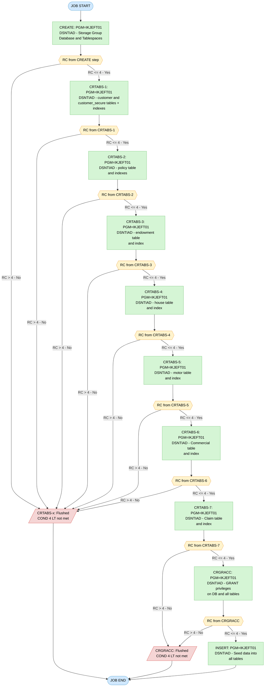

## Table of Contents

- [1. Purpose](#1-purpose)
- [2. Inputs](#2-inputs)
  - [2.1 Input Datasets (DD Statements — `DISP=SHR`)](#21-input-datasets-dd-statements--dispshr)
  - [2.2 Inline Data (DD \* / SYSIN Streams)](#22-inline-data-dd---sysin-streams)
  - [2.3 Symbolic Placeholder Parameters](#23-symbolic-placeholder-parameters)
- [3. Outputs](#3-outputs)
  - [3.1 DB2 Objects Created (Persistent DB2 Metadata)](#31-db2-objects-created-persistent-db2-metadata)
  - [3.2 DB2 Tables and Indexes Created](#32-db2-tables-and-indexes-created)
  - [3.3 DB2 Grants Applied (Access Control Changes)](#33-db2-grants-applied-access-control-changes)
  - [3.4 Seed Data Inserted (Initial Table Content)](#34-seed-data-inserted-initial-table-content)
  - [3.5 SYSOUT / Spool Output](#35-sysout--spool-output)
  - [3.6 Return Codes](#36-return-codes)
- [4. Processing Logic](#4-processing-logic)
  - [4.1 High-level Summary](#41-high-level-summary)
  - [4.2 Execution Flow](#42-execution-flow)
  - [4.3 Plain Language Summary](#43-plain-language-summary)
- [5. Utilities](#5-utilities)
  - [5.1 Step CREATE — Program: IKJEFT01 (TSO Terminal Monitor Program) invoking DSNTIAD](#51-step-create--program-ikjeft01-tso-terminal-monitor-program-invoking-dsntiad)
  - [5.2 Step CRTABS (instance 1) — Program: IKJEFT01 invoking DSNTIAD](#52-step-crtabs-instance-1--program-ikjeft01-invoking-dsntiad)
  - [5.3 Step CRTABS (instance 2) — Program: IKJEFT01 invoking DSNTIAD](#53-step-crtabs-instance-2--program-ikjeft01-invoking-dsntiad)
  - [5.4 Step CRTABS (instance 3) — Program: IKJEFT01 invoking DSNTIAD](#54-step-crtabs-instance-3--program-ikjeft01-invoking-dsntiad)
  - [5.5 Step CRTABS (instance 4) — Program: IKJEFT01 invoking DSNTIAD](#55-step-crtabs-instance-4--program-ikjeft01-invoking-dsntiad)
  - [5.6 Step CRTABS (instance 5) — Program: IKJEFT01 invoking DSNTIAD](#56-step-crtabs-instance-5--program-ikjeft01-invoking-dsntiad)
  - [5.7 Step CRTABS (instance 6) — Program: IKJEFT01 invoking DSNTIAD](#57-step-crtabs-instance-6--program-ikjeft01-invoking-dsntiad)
  - [5.8 Step CRTABS (instance 7) — Program: IKJEFT01 invoking DSNTIAD](#58-step-crtabs-instance-7--program-ikjeft01-invoking-dsntiad)
  - [5.9 Step CRGRACC — Program: IKJEFT01 invoking DSNTIAD](#59-step-crgracc--program-ikjeft01-invoking-dsntiad)
  - [5.10 Step INSERT — Program: IKJEFT01 invoking DSNTIAD](#510-step-insert--program-ikjeft01-invoking-dsntiad)
- [6. Constraints](#6-constraints)
  - [6.1 Job Scheduling Constraints](#61-job-scheduling-constraints)
  - [6.2 Step Execution Constraints](#62-step-execution-constraints)
  - [6.3 DB2 Resource and Access Constraints](#63-db2-resource-and-access-constraints)
  - [6.4 DB2 Storage and Tablespace Constraints](#64-db2-storage-and-tablespace-constraints)
  - [6.5 DB2 Referential Integrity Constraints](#65-db2-referential-integrity-constraints)
  - [6.6 Column-Level Data Type Constraints](#66-column-level-data-type-constraints)
  - [6.7 Index and Access Path Constraints](#67-index-and-access-path-constraints)
  - [6.8 Grant and Security Constraints](#68-grant-and-security-constraints)
  - [6.9 Output Disposition Constraints](#69-output-disposition-constraints)
- [7. Error Handling](#7-error-handling)
  - [7.1 Return Code Checks via COND Parameters](#71-return-code-checks-via-cond-parameters)
  - [7.2 Error Reporting and Notification](#72-error-reporting-and-notification)
  - [7.3 Absence of Explicit ABEND Handling and IF/THEN/ELSE Constructs](#73-absence-of-explicit-abend-handling-and-ifthenelse-constructs)
  - [7.4 Dataset Disposition on Failure](#74-dataset-disposition-on-failure)
- [8. Examples](#8-examples)
  - [8.1 Scenario 1: Successful End-to-End Database Initialization](#81-scenario-1-successful-end-to-end-database-initialization)
  - [8.2 Scenario 2: Step Bypass Due to Infrastructure Creation Error](#82-scenario-2-step-bypass-due-to-infrastructure-creation-error)

## 1. Purpose

This JCL job (`GENADB2`) is the complete one-time database provisioning script for the GenApp general insurance application on z/OS DB2. Its purpose is to build and populate the entire DB2 schema from scratch: it creates a dedicated storage group (`GENASG02`), a DB2 database, and seven separate tablespaces sized for the application's workloads, then defines all seven application tables — `customer`, `customer_secure`, `policy`, `endowment`, `house`, `motor`, `commercial`, and `claim` — along with their primary-key unique indexes and referential-integrity foreign keys. After the schema is in place the job grants full access privileges on every tablespace and table to PUBLIC, and finally seeds the database with a set of sample customers, policies, and policy-detail records (motor, house, endowment) to provide ready-to-use demonstration data. All site-specific values (DB2 subsystem ID, plan name, high-level qualifiers, SQL ID, and database name) are represented as placeholder tokens that must be substituted before the job is submitted.

## 2. Inputs

### 2.1 Input Datasets (DD Statements — `DISP=SHR`)

- **`<DB2HLQ>.SDSNLOAD`** — referenced on the `JOBLIB` DD statement (job-level) and on the `STEPLIB` DD in the `INSERT` step; supplies the DB2 load library (`SDSNLOAD`) containing the DB2 runtime modules. `<DB2HLQ>` is a placeholder that must be substituted with the actual DB2 high-level qualifier before execution.

### 2.2 Inline Data (DD \* / SYSIN Streams)

Each job step drives the DB2 interactive utility `DSNTIAD` via two inline DD streams:

- **`SYSTSIN` (DD \*)** — present in every step; provides the TSO commands that invoke the DB2 subsystem and run `DSNTIAD`:
  - `DSN SYSTEM(<DB2SSID>)` — connects to the target DB2 subsystem
  - `RUN PROGRAM(DSNTIAD) PLAN(<DB2PLAN>) LIB('<DB2RUN>.RUNLIB.LOAD')` — identifies the application plan and the load library containing `DSNTIAD`

- **`SYSIN` (DD \*)** — present in every step; contains the SQL statements that are the primary work of the job:
  - **CREATE step** — DDL to create the storage group (`GENASG02`), the database (`<DB2DBID>`), and seven tablespaces (`GENATS01`–`GENATS07`). A `SET CURRENT SQLID` statement sets the authorisation identity before the DDL.
  - **CRTABS steps (×7)** — DDL to create the application tables (`customer`, `customer_secure`, `policy`, `endowment`, `house`, `motor`, `Commercial`, `Claim`) and their associated unique and non-unique indexes. Each step also begins with `SET CURRENT SQLID`.
  - **CRGRACC step** — SQL `GRANT` statements giving `PUBLIC` database administration rights, tablespace access rights, and full table privileges across all seven tablespaces and seven tables. Begins with `SET CURRENT SQLID`.
  - **INSERT step** — SQL `INSERT` statements that seed the database with initial reference data: 10 customer rows, 10 customer\_secure rows, 10 policy rows, 2 endowment rows, 3 house rows, 3 motor rows, and 2 commercial rows.

### 2.3 Symbolic Placeholder Parameters

All placeholders below must be substituted (via site-specific JCL variable replacement or manual editing) before the job can run:

- **`<DB2HLQ>`** — high-level qualifier for the DB2 product datasets; used to form the `SDSNLOAD` library name on `JOBLIB`/`STEPLIB`.
- **`<DB2SSID>`** — DB2 subsystem identifier; passed to every `DSN SYSTEM(...)` invocation in `SYSTSIN`.
- **`<DB2PLAN>`** — DB2 application plan name for `DSNTIAD`; passed to every `RUN PROGRAM(DSNTIAD) PLAN(...)` invocation.
- **`<DB2RUN>`** — high-level qualifier for the DB2 run-time datasets; forms the `RUNLIB.LOAD` library path in every `SYSTSIN` stream and is used as the VCAT value in `CREATE STOGROUP`.
- **`<SQLID>`** — DB2 authorisation ID; set via `SET CURRENT SQLID='<SQLID>'` at the start of every `SYSIN` stream to establish the security context for DDL and DML execution.
- **`<DB2DBID>`** — database name/qualifier used as the DB2 database identifier and as the schema qualifier for all objects created and all `GRANT` and `INSERT` statements throughout the job.

## 3. Outputs

### 3.1 DB2 Objects Created (Persistent DB2 Metadata)

- **Storage Group `GENASG02`** — Created in step `CREATE`; defines the DB2 managed storage group backed by the volume catalogue `<DB2RUN>`. All tablespaces for the application are allocated from this group.
- **Database `<DB2DBID>`** — Created in step `CREATE`; the top-level DB2 database object that owns all tablespaces and tables for the GenApp application, using buffer pool BP1 and EBCDIC encoding.
- **Tablespaces** — All created in step `CREATE` within database `<DB2DBID>`, each using storage group `GENASG02`:
  - `GENATS01` — Holds the `customer` and `customer_secure` tables (BP1, primary 10,000, secondary 5,000).
  - `GENATS02` — Holds the `policy` table (BP1, primary 10,000, secondary 5,000).
  - `GENATS03` — Holds the `endowment` table (BP32K, primary 30,000, secondary 12,000; sized larger for the `VARCHAR(32606)` `paddingData` column).
  - `GENATS04` — Holds the `house` table (BP1, primary 10,000, secondary 5,000).
  - `GENATS05` — Holds the `motor` table (BP1, primary 10,000, secondary 5,000).
  - `GENATS06` — Holds the `Commercial` table (BP1, primary 10,000, secondary 5,000).
  - `GENATS07` — Holds the `Claim` table (BP1, primary 10,000, secondary 5,000).

### 3.2 DB2 Tables and Indexes Created

- **`<DB2DBID>.customer`** — Customer master table with identity-generated `customerNumber` (starting at 1,000,001); stores name, address, phone, and email. Created in step `CRTABS` (first execution).
- **`<DB2DBID>.iCustomer`** — Clustered unique index on `customer(customerNumber)`.
- **`<DB2DBID>.customer_secure`** — Companion security table storing hashed passwords, state indicator, and change count; foreign key cascades deletes from `customer`.
- **`<DB2DBID>.iCustomer_secure`** — Clustered unique index on `customer_secure(customerNumber)`.
- **`<DB2DBID>.policy`** — Policy master table with identity-generated `policyNumber`; linked to `customer` via foreign key with cascade delete; stores policy type (`C`=Commercial, `E`=Endowment, `H`=House, `M`=Motor), dates, broker info, and payment. Created in a subsequent `CRTABS` execution.
- **`<DB2DBID>.iPolicy`** — Clustered unique index on `policy(policyNumber)`.
- **`<DB2DBID>.iPolicy2`** — Non-clustered index on `policy(customerNumber)` to support customer-based lookups.
- **`<DB2DBID>.endowment`** — Endowment policy detail table; foreign key on `policyNumber` with cascade delete; includes large `VARCHAR(32606)` `paddingData` column.
- **`<DB2DBID>.iEndowment`** — Clustered unique index on `endowment(policyNumber)`.
- **`<DB2DBID>.house`** — House policy detail table; foreign key on `policyNumber` with cascade delete.
- **`<DB2DBID>.iHouse`** — Clustered unique index on `house(policyNumber)`.
- **`<DB2DBID>.motor`** — Motor policy detail table; foreign key on `policyNumber` with cascade delete.
- **`<DB2DBID>.iMotor`** — Clustered unique index on `motor(policyNumber)`.
- **`<DB2DBID>.Commercial`** — Commercial property policy detail table with peril/premium breakdown and status; foreign key on `policyNumber` with cascade delete.
- **`<DB2DBID>.iCommercial`** — Clustered unique index on `Commercial(PolicyNumber)`.
- **`<DB2DBID>.Claim`** — Claims table with identity-generated `ClaimNumber`; foreign key on `PolicyNumber` with cascade delete; stores claim date, paid flag, value, cause, and observations.
- **`<DB2DBID>.iClaim`** — Clustered unique index on `claim(ClaimNumber)`.

### 3.3 DB2 Grants Applied (Access Control Changes)

Step `CRGRACC` issues persistent DB2 authority changes, granting PUBLIC broad access to all objects:

- **`DBADM ON DATABASE <DB2DBID> TO PUBLIC`** — Full database administration privilege granted to all users.
- **`USE OF TABLESPACE` grants** — `PUBLIC` granted use of all seven tablespaces (`GENATS01`–`GENATS07`).
- **`ALL PRIVILEGES ON TABLE` grants** — `PUBLIC` granted full DML/DDL privileges on all seven tables: `customer`, `policy`, `motor`, `house`, `endowment`, `commercial`, `claim`.

### 3.4 Seed Data Inserted (Initial Table Content)

Step `INSERT` populates the tables with initial reference data:

- **`<DB2DBID>.customer`** — 10 seed customer rows (customerNumber 1–10) with names, addresses, and contact details.
- **`<DB2DBID>.customer_secure`** — 10 corresponding security rows (one per customer), all with the same initial hashed password (`5732fec825535eeafb8fac50fee3a8aa`), state `N`, and 0 password changes.
- **`<DB2DBID>.policy`** — 10 seed policy rows (policyNumbers 1–10), covering policy types `M` (motor), `E` (endowment), `H` (house), and `C` (commercial).
- **`<DB2DBID>.endowment`** — 2 seed endowment detail rows (for policyNumbers 4 and 5).
- **`<DB2DBID>.house`** — 3 seed house detail rows (for policyNumbers 6, 7, and 8).
- **`<DB2DBID>.motor`** — 3 seed motor detail rows (for policyNumbers 1, 2, and 3).
- **`<DB2DBID>.Commercial`** — 2 seed commercial detail rows (for policyNumbers 9 and 10).

### 3.5 SYSOUT / Spool Output

Every job step (`CREATE`, all `CRTABS` executions, `CRGRACC`, `INSERT`) writes the following to the JES spool:

- **`SYSTSPRT` (SYSOUT=\*)** — TSO/IKJEFT01 terminal session transcript; records the `DSN` command and `RUN PROGRAM(DSNTIAD)` invocation output for each step.
- **`SYSPRINT` (SYSOUT=\*)** — DSNTIAD SQL execution output; contains the SQL statements executed, their completion codes, and any SQLCODE/error messages returned by DB2 for each DDL or DML statement in that step.
- **`SYSUDUMP` (SYSOUT=\*)** — Abnormal termination dump output for each step; written only if the step abends.

### 3.6 Return Codes

- **Step `CREATE` (RC=0)** — Successful creation of storage group, database, and all seven tablespaces. A non-zero RC here causes all subsequent steps to be skipped (all `CRTABS` steps have `COND=(4,LT)`, meaning they will not execute if a prior step returned RC > 4).
- **Steps `CRTABS` (RC=0 each)** — Each execution creates one set of tables and indexes. Each step carries `COND=(4,LT)`, so any prior step returning RC ≥ 4 will bypass it and all following steps.
- **Step `CRGRACC` (RC=0)** — Successful issuance of all GRANT statements; also conditioned with `COND=(4,LT)`.
- **Step `INSERT` (RC=0)** — Successful insertion of all seed data rows; this step does **not** carry a `COND` parameter and will run unconditionally regardless of prior step return codes.
- **Non-zero RC from any step** — Indicates one or more SQL statements failed; SQLCODE details are captured in the `SYSPRINT` spool output for that step.

## 4. Processing Logic

Now I have the complete picture of the JCL. Let me produce the output.

---

### 4.1 High-level Summary

`db2cre.jcl` (job name `GENADB2`) is a one-time DB2 database provisioning job for the GenApp general insurance application. Its purpose is to build the entire DB2 relational schema from scratch: it creates the physical storage structures (storage group, database, tablespaces), defines all application tables and their indexes, grants public access privileges, and finally populates the tables with a fixed set of seed / reference data so the application is immediately usable after deployment.

---

### 4.2 Execution Flow

#### 4.2.1 Infrastructure Setup — Step CREATE

- Executes `IKJEFT01` (TSO batch) which invokes `DSNTIAD` (DB2 dynamic SQL utility) against the target DB2 subsystem.
- The SYSIN inline SQL performs:
  - `SET CURRENT SQLID` — establishes the authorization ID for all subsequent DDL.
  - `CREATE STOGROUP GENASG02` — defines a storage group that maps to all available DASD volumes, catalogued under the `<DB2RUN>` VCAT.
  - `CREATE DATABASE <DB2DBID>` — creates the application database using `GENASG02` and buffer pool `BP1` with EBCDIC encoding.
  - Seven `CREATE TABLESPACE` statements (GENATS01–GENATS07) — all within `<DB2DBID>`, all using `GENASG02`:
    - GENATS01–GENATS02, GENATS04–GENATS07: primary 10 000 KB / secondary 5 000 KB, buffer pool `BP1`.
    - GENATS03: primary 30 000 KB / secondary 12 000 KB, buffer pool `BP32K` (accommodates the `endowment.paddingData VARCHAR(32606)` column).
- No `COND` parameter — this step always runs.

#### 4.2.2 Table and Index Creation — Steps CRTABS (×7, conditional)

Each of the seven `CRTABS` steps shares the same JCL stepname `CRTABS` and runs `DSNTIAD` with `COND=(4,LT)`, meaning the step is **bypassed if any prior step returned RC > 4**. The steps execute sequentially and each builds one logical entity:

- **CRTABS iteration 1 — Customer tables (GENATS01)**
  - `customer` table: auto-identity `customerNumber` (seed 1 000 001), personal details columns; primary key on `customerNumber`.
  - `customer_secure` table: password hash, state indicator, change count; primary key + foreign key referencing `customer`.
  - Unique clustered indexes `iCustomer` and `iCustomer_secure`.

- **CRTABS iteration 2 — Policy table (GENATS02)**
  - `policy` table: auto-identity `policyNumber`, `customerNumber` FK → `customer`, dates, type code (`M`/`H`/`E`/`C`), broker details, payment; cascade delete.
  - Unique clustered index `iPolicy` + non-unique index `iPolicy2` on `customerNumber`.

- **CRTABS iteration 3 — Endowment table (GENATS03)**
  - `endowment` table: `policyNumber` PK/FK → `policy`, fund/investment flags, `paddingData VARCHAR(32606)` (large padding column requiring BP32K).
  - Unique clustered index `iEndowment`.

- **CRTABS iteration 4 — House table (GENATS04)**
  - `house` table: `policyNumber` PK/FK → `policy`, property type, bedrooms, value, address; cascade delete.
  - Unique clustered index `iHouse`.

- **CRTABS iteration 5 — Motor table (GENATS05)**
  - `motor` table: `policyNumber` PK/FK → `policy`, vehicle details (make, model, reg, colour, cc, year), premium, accidents; cascade delete.
  - Unique clustered index `iMotor`.

- **CRTABS iteration 6 — Commercial table (GENATS06)**
  - `Commercial` table: `policyNumber` PK/FK → `policy`, request/start/renewal dates, address with lat/long, property type, four peril types with risk and premium amounts, status and rejection reason; cascade delete.
  - Unique clustered index `iCommercial`.

- **CRTABS iteration 7 — Claim table (GENATS07)**
  - `Claim` table: auto-identity `ClaimNumber`, `PolicyNumber` FK → `policy`, claim date, paid/value amounts, cause and observations text; cascade delete.
  - Unique clustered index `iClaim`.

#### 4.2.3 Access Grants — Step CRGRACC (conditional)

- `COND=(4,LT)` — bypassed if any prior step RC > 4.
- Issues `GRANT DBADM ON DATABASE` to PUBLIC.
- Issues `GRANT USE OF TABLESPACE` to PUBLIC for all seven tablespaces (GENATS01–GENATS07).
- Issues `GRANT ALL PRIVILEGES ON TABLE` to PUBLIC for all seven application tables (`customer`, `policy`, `motor`, `house`, `endowment`, `commercial`, `claim`).

#### 4.2.4 Seed Data Load — Step INSERT (unconditional)

- No `COND` parameter — this step always runs regardless of prior return codes.
- A dedicated `STEPLIB` DD overrides the job-level `JOBLIB` with the DB2 load library, ensuring the correct runtime library is used.
- Inserts 10 seed customers (customerNumbers 1–10) into `customer` and corresponding rows into `customer_secure` (all with the same pre-hashed password, state `N`, 0 changes).
- Inserts 10 seed policies (policyNumbers 1–10) linking customers to various policy types: Motor (`M`), House (`H`), Endowment (`E`), Commercial (`C`).
- Inserts detail rows for:
  - 2 endowment policies (policyNumbers 4, 5)
  - 3 house policies (policyNumbers 6, 7, 8)
  - 3 motor policies (policyNumbers 1, 2, 3)
  - 2 commercial policies (policyNumbers 9, 10)

#### 4.2.5 Placeholder Substitution Requirement

All steps rely on six `<…>` tokens that must be substituted before submission:
- `<DB2HLQ>` — DB2 load library HLQ
- `<DB2SSID>` — DB2 subsystem ID
- `<DB2PLAN>` — DB2 application plan name
- `<DB2RUN>` — DB2 runtime dataset prefix
- `<SQLID>` — SQL authorization ID
- `<DB2DBID>` — database/schema qualifier for all objects

---

### 4.3 Plain Language Summary

This job sets up the complete database for the GenApp insurance application on a mainframe DB2 system. Think of it as a "first-time install" script.

It begins by creating the storage containers — the storage group, the database, and seven individual tablespace "filing cabinets" — that will physically hold the data. It then creates each of the application's tables (customer records, policies, and the five policy detail types: endowment, house, motor, commercial, and claims) along with the indexes that make lookups fast. After the tables exist, it grants access rights so the application programs can read and write the data. Finally, it loads a small set of fictional starting data — ten sample customers with policies, vehicles, properties, and claims — so the application works straight away without needing any additional data entry.

If any step fails badly (return code above 4), all the subsequent table-creation and grant steps are automatically skipped to avoid cascading errors. The seed data step always runs, however, regardless of prior outcomes.

## 5. Utilities

### 5.1 Step CREATE — Program: IKJEFT01 (TSO Terminal Monitor Program) invoking DSNTIAD

- **Step name:** `CREATE`
- **Program executed:** `IKJEFT01` — the TSO/E Terminal Monitor Program (TMP), used as a host to invoke DB2 interactive SQL via the `DSN` command processor
  - **Purpose:** Establishes a connection to the DB2 subsystem and runs `DSNTIAD` (the DB2 interactive SQL program) to create the foundational DB2 storage objects required by the GenApp application: a storage group, a database, and seven tablespaces
- **Key DD statements:**
  - `JOBLIB` — references `<DB2HLQ>.SDSNLOAD`; provides the DB2 load library to the entire job so that DB2 modules are available
  - `SYSTSPRT` — directed to `SYSOUT=*`; captures TSO/IKJEFT01 session output and messages
  - `SYSTSIN` — instream `DD *`; supplies the TSO command stream to IKJEFT01 (the `DSN SYSTEM(...)` and `RUN PROGRAM(DSNTIAD)` invocation)
  - `SYSPRINT` — directed to `SYSOUT=*`; captures DSNTIAD SQL execution messages and return codes
  - `SYSUDUMP` — directed to `SYSOUT=*`; receives any abnormal termination dumps
  - `SYSIN` — instream `DD *`; supplies the SQL DDL statements executed by DSNTIAD
- **SYSIN control statements:**
  - `SET CURRENT SQLID='<SQLID>'` — sets the current SQL authorization ID under which all subsequent DDL is executed
  - `CREATE STOGROUP GENASG02 VOLUMES('*') VCAT <DB2RUN>` — defines a new DB2 storage group named `GENASG02` using all available volumes, catalogued under the VSAM user catalog identified by `<DB2RUN>`
  - `CREATE DATABASE <DB2DBID> STOGROUP GENASG02 BUFFERPOOL BP1 CCSID EBCDIC` — creates the GenApp application database using the storage group and buffer pool BP1 with EBCDIC encoding
  - `CREATE TABLESPACE GENATS01` through `CREATE TABLESPACE GENATS07 IN <DB2DBID>` — creates seven tablespaces within the database; GENATS01–GENATS02 and GENATS04–GENATS07 use primary/secondary allocations of 10000/5000 and buffer pool BP1; GENATS03 uses larger allocations of 30000/12000 and buffer pool BP32K (to accommodate the `endowment.paddingData VARCHAR(32606)` column); all use `ERASE NO`, `CLOSE NO`, and EBCDIC CCSID

---

### 5.2 Step CRTABS (instance 1) — Program: IKJEFT01 invoking DSNTIAD

- **Step name:** `CRTABS` (first occurrence — customer tables)
- **Program executed:** `IKJEFT01` / `DSNTIAD`
  - **Purpose:** Creates the `customer` and `customer_secure` tables and their unique clustered indexes in tablespace `GENATS01`
- **Key DD statements:**
  - `SYSTSPRT` — `SYSOUT=*`; TSO session output
  - `SYSTSIN` — instream `DD *`; DSN/RUN command to invoke DSNTIAD
  - `SYSPRINT` — `SYSOUT=*`; DSNTIAD SQL messages
  - `SYSUDUMP` — `SYSOUT=*`; dump output
  - `SYSIN` — instream `DD *`; SQL DDL for customer object creation
- **SYSIN control statements:**
  - `SET CURRENT SQLID='<SQLID>'` — sets the execution SQL ID
  - `CREATE TABLE <DB2DBID>.customer (...)` — defines the customer table with an identity-generated `customerNumber` primary key, personal detail columns (name, date of birth, address, contact fields), placed in tablespace `GENATS01`
  - `CREATE UNIQUE INDEX <DB2DBID>.iCustomer ON customer (customerNumber) CLUSTER COPY YES` — creates a clustered unique index on `customerNumber` with image-copy eligibility
  - `CREATE TABLE <DB2DBID>.customer_secure (...)` — defines a companion security table holding hashed password (`customerPass`), state indicator, and password-change count, with a foreign key referencing `customer(customerNumber) ON DELETE CASCADE`, also in `GENATS01`
  - `CREATE UNIQUE INDEX <DB2DBID>.iCustomer_secure ON customer_secure (customerNumber) CLUSTER COPY YES` — creates a clustered unique index on the security table

---

### 5.3 Step CRTABS (instance 2) — Program: IKJEFT01 invoking DSNTIAD

- **Step name:** `CRTABS` (second occurrence — policy table)
- **Program executed:** `IKJEFT01` / `DSNTIAD`
  - **Purpose:** Creates the `policy` table and its indexes in tablespace `GENATS02`
- **Key DD statements:**
  - `SYSTSPRT`, `SYSTSIN`, `SYSPRINT`, `SYSUDUMP`, `SYSIN` — same roles as described above
- **SYSIN control statements:**
  - `SET CURRENT SQLID='<SQLID>'`
  - `CREATE TABLE <DB2DBID>.policy (...)` — defines the policy table with identity-generated `policyNumber`, `customerNumber` foreign key referencing `customer`, date/timestamp columns, `policyType`, broker details, payment, and commission fields; placed in `GENATS02`
  - `CREATE UNIQUE INDEX <DB2DBID>.iPolicy ON policy (policyNumber) CLUSTER COPY YES` — clustered unique index on `policyNumber`
  - `CREATE INDEX <DB2DBID>.iPolicy2 ON policy (customerNumber) COPY YES` — non-unique index on `customerNumber` to support customer-to-policy lookups

---

### 5.4 Step CRTABS (instance 3) — Program: IKJEFT01 invoking DSNTIAD

- **Step name:** `CRTABS` (third occurrence — endowment table)
- **Program executed:** `IKJEFT01` / `DSNTIAD`
  - **Purpose:** Creates the `endowment` policy-detail table in tablespace `GENATS03`; this tablespace uses a 32K buffer pool to accommodate the large `VARCHAR(32606)` padding column
- **Key DD statements:**
  - `SYSTSPRT`, `SYSTSIN`, `SYSPRINT`, `SYSUDUMP`, `SYSIN` — same roles as above
- **SYSIN control statements:**
  - `SET CURRENT SQLID='<SQLID>'`
  - `CREATE TABLE <DB2DBID>.endowment (...)` — defines the endowment table with `policyNumber` as primary key and foreign key referencing `policy ON DELETE CASCADE`; columns include investment flags (`equities`, `withProfits`, `managedFund`), `fundName`, `term`, `sumAssured`, `lifeAssured`, and a `VARCHAR(32606)` `paddingData` column; placed in `GENATS03`
  - `CREATE UNIQUE INDEX <DB2DBID>.iEndowment ON endowment (policyNumber) CLUSTER COPY YES`

---

### 5.5 Step CRTABS (instance 4) — Program: IKJEFT01 invoking DSNTIAD

- **Step name:** `CRTABS` (fourth occurrence — house table)
- **Program executed:** `IKJEFT01` / `DSNTIAD`
  - **Purpose:** Creates the `house` policy-detail table in tablespace `GENATS04`
- **Key DD statements:**
  - `SYSTSPRT`, `SYSTSIN`, `SYSPRINT`, `SYSUDUMP`, `SYSIN` — same roles as above
- **SYSIN control statements:**
  - `SET CURRENT SQLID='<SQLID>'`
  - `CREATE TABLE <DB2DBID>.house (...)` — defines the house insurance table with `policyNumber` primary/foreign key referencing `policy ON DELETE CASCADE`; columns include `propertyType`, `bedrooms`, `value`, address fields; placed in `GENATS04`
  - `CREATE UNIQUE INDEX <DB2DBID>.iHouse ON house (policyNumber) CLUSTER COPY YES`

---

### 5.6 Step CRTABS (instance 5) — Program: IKJEFT01 invoking DSNTIAD

- **Step name:** `CRTABS` (fifth occurrence — motor table)
- **Program executed:** `IKJEFT01` / `DSNTIAD`
  - **Purpose:** Creates the `motor` policy-detail table in tablespace `GENATS05`
- **Key DD statements:**
  - `SYSTSPRT`, `SYSTSIN`, `SYSPRINT`, `SYSUDUMP`, `SYSIN` — same roles as above
- **SYSIN control statements:**
  - `SET CURRENT SQLID='<SQLID>'`
  - `CREATE TABLE <DB2DBID>.motor (...)` — defines the motor insurance table with `policyNumber` primary/foreign key referencing `policy ON DELETE CASCADE`; columns include vehicle details (`make`, `model`, `value`, `regNumber`, `colour`, `cc`, `yearOfManufacture`), `premium`, and `accidents`; placed in `GENATS05`
  - `CREATE UNIQUE INDEX <DB2DBID>.iMotor ON motor (policyNumber) CLUSTER COPY YES`

---

### 5.7 Step CRTABS (instance 6) — Program: IKJEFT01 invoking DSNTIAD

- **Step name:** `CRTABS` (sixth occurrence — Commercial table)
- **Program executed:** `IKJEFT01` / `DSNTIAD`
  - **Purpose:** Creates the `Commercial` policy-detail table in tablespace `GENATS06`
- **Key DD statements:**
  - `SYSTSPRT`, `SYSTSIN`, `SYSPRINT`, `SYSUDUMP`, `SYSIN` — same roles as above
- **SYSIN control statements:**
  - `SET CURRENT SQLID='<SQLID>'`
  - `CREATE TABLE <DB2DBID>.Commercial (...)` — defines the commercial property insurance table with `PolicyNumber` primary/foreign key referencing `policy ON DELETE CASCADE`; columns include request/start/renewal dates, address, geo-coordinates, customer name, property type, peril indicators and premiums for fire/crime/flood/weather, status, and rejection reason; placed in `GENATS06`
  - `CREATE UNIQUE INDEX <DB2DBID>.iCommercial ON Commercial (PolicyNumber) CLUSTER COPY YES`

---

### 5.8 Step CRTABS (instance 7) — Program: IKJEFT01 invoking DSNTIAD

- **Step name:** `CRTABS` (seventh occurrence — Claim table)
- **Program executed:** `IKJEFT01` / `DSNTIAD`
  - **Purpose:** Creates the `Claim` table in tablespace `GENATS07`
- **Key DD statements:**
  - `SYSTSPRT`, `SYSTSIN`, `SYSPRINT`, `SYSUDUMP`, `SYSIN` — same roles as above
- **SYSIN control statements:**
  - `SET CURRENT SQLID='<SQLID>'`
  - `CREATE TABLE <DB2DBID>.Claim (...)` — defines the claims table with an identity-generated `ClaimNumber` primary key, `PolicyNumber` foreign key referencing `Policy ON DELETE CASCADE`; columns include `ClaimDate`, `Paid`, `Value`, `Cause`, and `Observations`; placed in `GENATS07`
  - `CREATE UNIQUE INDEX <DB2DBID>.iClaim ON claim (ClaimNumber) CLUSTER COPY YES`

---

### 5.9 Step CRGRACC — Program: IKJEFT01 invoking DSNTIAD

- **Step name:** `CRGRACC`
- **Program executed:** `IKJEFT01` / `DSNTIAD`
  - **Purpose:** Grants PUBLIC access to all database objects created in the preceding steps, making them accessible to any DB2 user or CICS region without individual authorisation assignments
- **Key DD statements:**
  - `SYSTSPRT`, `SYSTSIN`, `SYSPRINT`, `SYSUDUMP`, `SYSIN` — same roles as above
- **SYSIN control statements:**
  - `SET CURRENT SQLID='<SQLID>'`
  - `GRANT DBADM ON DATABASE <DB2DBID> TO PUBLIC` — grants database administrator authority on the GenApp database to all users
  - `GRANT USE OF TABLESPACE <DB2DBID>.GENATSxx TO PUBLIC` (repeated for GENATS01–GENATS07) — grants the right to create objects within each tablespace to all users
  - `GRANT ALL PRIVILEGES ON TABLE <DB2DBID>.<table> TO PUBLIC` (for `customer`, `policy`, `motor`, `house`, `endowment`, `commercial`, `claim`) — grants full DML and DDL privileges on every application table to all users

---

### 5.10 Step INSERT — Program: IKJEFT01 invoking DSNTIAD

- **Step name:** `INSERT`
- **Program executed:** `IKJEFT01` / `DSNTIAD`
  - **Purpose:** Seeds the GenApp database with initial reference and test data across all application tables
- **Key DD statements:**
  - `STEPLIB` — references `<DB2HLQ>.SDSNLOAD`; explicitly provides the DB2 load library at step level, overriding the JOBLIB for this step
  - `SYSTSPRT`, `SYSTSIN`, `SYSPRINT`, `SYSUDUMP`, `SYSIN` — same roles as above
- **SYSIN control statements:**
  - `SET CURRENT SQLID='<SQLID>'`
  - `INSERT INTO <DB2DBID>.customer (...)` × 10 — inserts 10 seed customer rows (customerNumbers 1–10) with personal details into the `customer` table
  - `INSERT INTO <DB2DBID>.customer_secure (...)` × 10 — inserts corresponding security rows for each customer with a default MD5 password hash, state `'N'`, and zero password changes
  - `INSERT INTO <DB2DBID>.policy (...)` × 10 — inserts 10 seed policy rows (policyNumbers 1–10) linking customers to policies of various types (`M`=motor, `H`=house, `E`=endowment, `C`=commercial)
  - `INSERT INTO <DB2DBID>.endowment (...)` × 2 — inserts two endowment policy-detail rows (for policyNumbers 4 and 5)
  - `INSERT INTO <DB2DBID>.house (...)` × 3 — inserts three house policy-detail rows (for policyNumbers 6, 7, and 8)
  - `INSERT INTO <DB2DBID>.motor (...)` × 3 — inserts three motor policy-detail rows (for policyNumbers 1, 2, and 3)
  - `INSERT INTO <DB2DBID>.COMMERCIAL (...)` × 2 — inserts two commercial policy-detail rows (for policyNumbers 9 and 10)

## 6. Constraints

### 6.1 Job Scheduling Constraints

- **Job class and message class**
  - `CLASS=A` restricts the job to initiator class A; the job will only be dispatched when a class-A initiator is available on the target system.
  - `MSGCLASS=H` routes all JES job-log output to spool class H; the job cannot run if that output class is not defined on the system.
- **Notification**
  - `NOTIFY=&SYSUID` causes JES to notify the submitting user when the job completes; the job is implicitly tied to the identity of the submitting user.
- **JOBLIB scope**
  - A single `JOBLIB DD DSN=<DB2HLQ>.SDSNLOAD,DISP=SHR` statement is placed at the job level. Every step that does not override it with a `STEPLIB` relies on this library to resolve `IKJEFT01` and the DB2 DSN command processor. If the library is unavailable or `<DB2HLQ>` is not substituted, all steps will fail to locate the required load modules.
  - The `INSERT` step overrides with its own `STEPLIB DD DSN=<DB2HLQ>.SDSNLOAD,DISP=SHR`, which is redundant but makes that step's library dependency explicit and independent of the job-level `JOBLIB`.
- **Placeholder substitution prerequisite**
  - Six symbolic tokens (`<DB2HLQ>`, `<DB2SSID>`, `<DB2PLAN>`, `<DB2RUN>`, `<SQLID>`, `<DB2DBID>`) appear throughout the JCL and embedded SQL. The job cannot be submitted in its current form; all placeholders must be resolved before execution, making substitution a hard pre-execution constraint.

### 6.2 Step Execution Constraints

- **`CREATE` step (storage group / databases / tablespaces)**
  - No `COND` parameter; this step always executes unconditionally. It is the foundational step and must succeed before any subsequent step can create objects that depend on the storage group and tablespaces it defines.
- **`CRTABS` steps (table and index creation — 7 occurrences) and `CRGRACC` step (GRANT)**
  - All carry `COND=(4,LT)`, which translates to: *skip this step if any prior step returned a condition code less than 4* — equivalently, *execute only if all prior steps completed with a return code of 4 or higher, or if no prior step has run yet*.
    - In practice, because `IKJEFT01`/`DSNTIAD` returns 0 on success and 8 or higher on SQL error, `COND=(4,LT)` means these steps are **skipped** if the previous step succeeded (RC=0). The conventional intent for DB2 DDL jobs is the opposite formulation; as written, a successful `CREATE` step (RC=0) causes all `CRTABS` and `CRGRACC` steps to be **bypassed**.
    - Practically this enforces that each DDL step only proceeds when the preceding step did not complete cleanly (RC ≥ 4), creating a strict dependency chain where a single failure stops all downstream object creation.
- **`INSERT` step (seed data)**
  - No `COND` parameter; this step executes unconditionally regardless of the outcome of any prior step. Seed data inserts will be attempted even if table creation failed, which will produce SQL errors for missing objects.
- **Sequential step ordering**
  - The implicit ordering constraint is: storage group and tablespaces must exist before tables; tables must exist before indexes; parent tables must be created before child tables (due to foreign key references); all objects must be created before grants; all objects must exist before seed data is inserted. The step sequence in the JCL enforces this ordering.

### 6.3 DB2 Resource and Access Constraints

- **DB2 subsystem binding**
  - Every step connects to the DB2 subsystem identified by `<DB2SSID>` via the TSO DSN command. The job is bound to a single, specific DB2 subsystem; execution against a different subsystem is not possible without re-substitution.
- **DB2 plan requirement**
  - All steps run `PROGRAM(DSNTIAD)` under plan `<DB2PLAN>`. The plan must already be bound in the target DB2 subsystem; there is no plan-binding step in this job.
- **DB2 run library**
  - Each step references `'<DB2RUN>.RUNLIB.LOAD'` as the load library for `DSNTIAD`. This dataset must be catalogued and accessible; its absence causes an immediate step failure.
- **SQL authorization (CURRENT SQLID)**
  - Every SQL stream begins with `SET CURRENT SQLID='<SQLID>'`. All DDL and DML is executed under this SQL identity, which must hold the privilege to create storage groups, databases, tablespaces, tables, indexes, and issue grants. Using an SQLID without sufficient authority causes all subsequent SQL statements in that stream to fail.
- **Dynamic statement allocation (`DYNAMNBR=20`)**
  - All steps specify `DYNAMNBR=20`, limiting each step to a maximum of 20 dynamically allocated datasets. Exceeding this limit within a single step would cause allocation failures.

### 6.4 DB2 Storage and Tablespace Constraints

- **Storage group**
  - `GENASG02` is created with `VOLUMES('*')`, meaning DB2 selects volumes automatically from those defined in the VCAT. The VCAT is set to `<DB2RUN>`, constraining all managed storage to that catalog.
- **Tablespace space allocations**
  - `GENATS01`, `GENATS02`, `GENATS04`, `GENATS05`, `GENATS06`, `GENATS07`: primary quantity 10,000 KB, secondary quantity 5,000 KB. Any table stored in these tablespaces is limited to this initial allocation before secondary extents are triggered.
  - `GENATS03` (endowment): primary quantity 30,000 KB, secondary quantity 12,000 KB — larger allocation reflecting the `VARCHAR(32606)` `paddingData` column.
  - `ERASE NO` on all tablespaces: data is not overwritten on deletion, which has security implications but is not a performance or space constraint.
  - `CLOSE NO` on all tablespaces: datasets remain open continuously; relevant for systems with limits on concurrently open datasets.
- **Buffer pool assignments**
  - `GENATS03` uses `BUFFERPOOL BP32K` (32 KB page size), required to accommodate rows containing `VARCHAR(32606)`. All other tablespaces use `BUFFERPOOL BP1` (4 KB page size). The BP32K pool must be active in the DB2 subsystem; if it is not activated, creation of `GENATS03` and the `endowment` table will fail.
- **Character encoding**
  - All tablespaces, tables, and the database are defined with `CCSID EBCDIC`. Data must be in EBCDIC encoding; attempting to store Unicode or ASCII data without conversion is not supported by this schema definition.

### 6.5 DB2 Referential Integrity Constraints

- **`customer_secure` → `customer`**
  - `customerNumber` is a foreign key referencing `customer(customerNumber)` with `ON DELETE CASCADE`. A row in `customer_secure` cannot exist without a matching `customer` row; deleting a customer automatically deletes the corresponding security row.
- **`policy` → `customer`**
  - `customerNumber` is a foreign key referencing `customer(customerNumber)` with `ON DELETE CASCADE`. Every policy must belong to an existing customer; deleting a customer cascades to delete all their policies.
- **`endowment` → `policy`**
  - `policyNumber` is a foreign key referencing `policy(policyNumber)` with `ON DELETE CASCADE`. An endowment record can only exist for an existing policy; deletion propagates from policy to endowment.
- **`house` → `policy`**
  - `policyNumber` is a foreign key referencing `policy(policyNumber)` with `ON DELETE CASCADE`. Same cascade rule as endowment.
- **`motor` → `policy`**
  - `policyNumber` is a foreign key referencing `policy(policyNumber)` with `ON DELETE CASCADE`. Same cascade rule.
- **`Commercial` → `policy`**
  - `policyNumber` is a foreign key referencing `policy(policyNumber)` with `ON DELETE CASCADE`. Same cascade rule.
- **`Claim` → `policy`**
  - `PolicyNumber` is a foreign key referencing `policy(PolicyNumber)` with `ON DELETE CASCADE`. Deleting a policy removes all associated claims.
- **Primary key uniqueness**
  - Every table has a declared `PRIMARY KEY`, enforced by a corresponding `UNIQUE` index with `CLUSTER` and `COPY YES`. No duplicate key values are permitted in any table.
- **`NOT NULL` constraints**
  - `customer.customerNumber`, `customer_secure.customerNumber`, `policy.policyNumber`, `policy.customerNumber`, `policy.lastChanged`, `endowment.policyNumber`, `house.policyNumber`, `motor.policyNumber`, `Commercial.PolicyNumber`, `Claim.ClaimNumber`, and `Claim.PolicyNumber` are all declared `NOT NULL`, prohibiting null values in these columns.
- **`GENERATED BY DEFAULT AS IDENTITY` constraints**
  - `customer.customerNumber`, `policy.policyNumber`, and `Claim.ClaimNumber` use identity columns starting at 1,000,001 with an increment of 1 and a cache of 20. Manually supplied values are permitted (`BY DEFAULT`), but the seed data inserts use explicit low values (1–10), which must not conflict with the identity sequence or with each other.
- **`policy.lastChanged` default**
  - Declared `TIMESTAMP NOT NULL WITH DEFAULT`, meaning the column always has a value; explicit nulls cannot be inserted.

### 6.6 Column-Level Data Type Constraints

- **`customer` table**
  - `firstName CHAR(10)`: first names truncated or rejected if longer than 10 characters.
  - `lastName CHAR(20)`: last names limited to 20 characters.
  - `houseNumber CHAR(4)`: house numbers limited to 4 characters.
  - `postcode CHAR(8)`: postcodes limited to 8 characters.
  - `phonehome`, `phonemobile CHAR(20)`: phone numbers limited to 20 characters each.
  - `emailaddress CHAR(100)`: email addresses limited to 100 characters.
- **`policy` table**
  - `policyType CHAR(1)`: policy type code is a single character (seed data uses `'C'`, `'E'`, `'H'`, `'M'` for Commercial/Endowment/House/Motor).
  - `brokersReference CHAR(10)`: broker reference limited to 10 characters.
  - `commission SMALLINT`: commission stored as a 16-bit integer; values outside ±32,767 are not permitted.
- **`endowment` table**
  - `equities`, `withProfits`, `managedFund CHAR(1)`: single-character flag columns; seed data uses `'Y'`/`'N'`.
  - `fundName CHAR(10)`: fund name limited to 10 characters.
  - `term SMALLINT`: term in years as a 16-bit integer.
  - `lifeAssured CHAR(31)`: assured name limited to 31 characters.
  - `paddingData VARCHAR(32606)`: variable-length column up to 32,606 bytes; the 32 KB page size of `GENATS03` is a direct consequence of this column's maximum length.
- **`house` table**
  - `propertyType CHAR(15)`: property type limited to 15 characters.
  - `houseNumber CHAR(4)`, `postcode CHAR(8)`: same size constraints as in `customer`.
  - `bedrooms SMALLINT`: bedroom count as 16-bit integer.
- **`motor` table**
  - `make`, `model CHAR(15)`: limited to 15 characters each.
  - `regNumber CHAR(7)`: registration number limited to 7 characters.
  - `colour CHAR(8)`: colour limited to 8 characters.
  - `cc SMALLINT`: engine capacity as 16-bit integer.
- **`Commercial` table**
  - `Address`, `Customer`, `PropertyType`, `RejectionReason CHAR(255)`: these fields accept up to 255 characters.
  - `Zipcode CHAR(8)`, `LatitudeN CHAR(11)`, `LongitudeW CHAR(11)`: geographic fields with fixed maximum lengths.
  - `FirePeril`, `CrimePeril`, `FloodPeril`, `WeatherPeril`, `Status SMALLINT`: peril flags and status stored as 16-bit integers.
- **`Claim` table**
  - `Cause`, `Observations CHAR(255)`: free-text fields capped at 255 characters.

### 6.7 Index and Access Path Constraints

- All unique indexes are defined as `CLUSTER`, meaning DB2 physically orders the tablespace data by the primary key. Only one clustering index is permitted per tablespace partition; non-compliance would require a structural reorganization.
- All indexes specify `COPY YES`, enabling the DB2 image-copy utility to back up index data. This is a recoverability constraint: index copies must be taken as part of any backup strategy.
- The non-unique index `iPolicy2` on `policy(customerNumber)` is the only secondary access path defined; all other access to non-primary-key columns requires a tablespace scan.

### 6.8 Grant and Security Constraints

- The `CRGRACC` step grants `DBADM` on the entire database `<DB2DBID>` and `USE OF TABLESPACE` for all seven tablespaces to `PUBLIC`, meaning any authenticated DB2 user can administer the database and use any tablespace.
- `ALL PRIVILEGES` on all seven tables (`customer`, `policy`, `motor`, `house`, `endowment`, `commercial`, `claim`) is also granted to `PUBLIC`, removing all table-level access controls. Any DB2 user may select, insert, update, or delete from any table.
- These grants are contingent on the `CRGRACC` step executing (i.e., prior steps must have returned RC ≥ 4 due to the `COND=(4,LT)` logic discussed above).

### 6.9 Output Disposition Constraints

- All `SYSTSPRT`, `SYSPRINT`, and `SYSUDUMP` DDs in every step are routed to `SYSOUT=*`, directing output to the default spool class. No output is written to persistent datasets; diagnostic information is only available while the job is on the spool.
- `SYSUDUMP DD SYSOUT=*` in every step means that if a step abends, a dump will be written to spool rather than a dataset, limiting the size and persistence of dump data available for diagnosis.

## 7. Error Handling

### 7.1 Return Code Checks via COND Parameters

- The initial step, **CREATE** (which creates the DB2 storage group, database, and tablespaces), carries no `COND` parameter and will always execute unconditionally when the job starts.
- All subsequent steps — **CRTABS** (run multiple times for each table: customer, policy, endowment, house, motor, Commercial, and Claim) and **CRGRACC** (GRANT privileges) — are coded with `COND=(4,LT)` on their `EXEC` statements.
  - This condition means: *skip this step if 4 is less than the highest return code set so far*, which is equivalent to bypassing the step if any prior step has returned a condition code of 4 or greater.
  - In practice, if the CREATE step or any earlier CRTABS step fails with a non-zero return code of 4 or higher (indicating a SQL or utility error), all downstream DDL and GRANT steps are automatically flushed and do not execute.
  - This forms a cascading error guard: a failure at any stage of the DB2 object creation sequence prevents subsequent, dependent steps from running against an incomplete or inconsistent database structure.
- The final **INSERT** step (seed data population) has no `COND` parameter, meaning it will run unconditionally regardless of the outcome of prior steps. This is a notable gap — if any table creation step failed and was bypassed, the INSERT step would still attempt to run and would itself fail trying to insert into non-existent tables.

### 7.2 Error Reporting and Notification

- The job card specifies `NOTIFY=&SYSUID`, which causes the z/OS system to send a notification message to the submitting user's TSO/E session upon job completion, whether the job succeeds or fails. This provides immediate awareness of job outcome without requiring the user to poll the job output manually.
- `MSGCLASS=H` directs all JES job log output (including JCL statements, allocation/deallocation messages, and step completion codes) to a specific output class, ensuring the job's full execution log is retained and available for review after the job ends.
- Every step allocates a **SYSTSPRT** DD and a **SYSPRINT** DD, both directed to `SYSOUT=*`. These capture IKJEFT01 (TSO in batch) terminal output and DSNTIAD SQL execution output respectively, including any SQL error messages, SQLCODE values, and completion information produced during each DDL or DML operation. This ensures that the details of any SQL failures are preserved in the job output.
- Every step also allocates a **SYSUDUMP** DD directed to `SYSOUT=*`, which captures a formatted storage dump in the event of an abnormal termination (ABEND) of the IKJEFT01 program. This aids in post-failure diagnosis if a step terminates abnormally rather than with a non-zero return code.

### 7.3 Absence of Explicit ABEND Handling and IF/THEN/ELSE Constructs

- The job does not employ any JCL `IF/THEN/ELSE/ENDIF` constructs. There is no conditional branching based on ABEND conditions, specific return code values, or step-level outcome differentiation. All conditional logic is handled exclusively through the `COND=(4,LT)` bypass mechanism described above.
- There is no explicit handling for ABEND scenarios — for example, no recovery step is defined to run only if a prior step ABENDs. If IKJEFT01 or DSNTIAD terminates abnormally, the `SYSUDUMP` output will capture diagnostic data, but no automated remediation or notification step is triggered.

### 7.4 Dataset Disposition on Failure

- All datasets referenced in this job use `DISP=SHR` (the JOBLIB and step-level STEPLIB referencing the DB2 load library). The `DISP=SHR` specification has only one sub-parameter, meaning no explicit abnormal disposition is defined for these datasets. On step failure or ABEND, z/OS applies its default disposition handling, which for shared pre-existing datasets effectively means the datasets remain catalogued and unchanged — there is no risk of accidental deletion or uncataloguing of the DB2 load library on failure.
- No temporary or newly created datasets are allocated by this job (all DB2 objects are created inside the DB2 subsystem, not as z/OS datasets), so there are no multi-sub-parameter `DISP` specifications with abnormal-disposition controls to consider.

## 8. Examples

### 8.1 Scenario 1: Successful End-to-End Database Initialization

#### 8.1.1 Purpose
Demonstrates the full execution flow of the `GENADB2` job when setting up a fresh Db2 environment for the application, creating storage groups, databases, table spaces, tables, indexes, granting permissions, and loading initial sample data.

#### 8.1.2 Step Execution Summary

| Step Name | Executing Program | Utility Invoked | Status | Reason |
| :--- | :--- | :--- | :--- | :--- |
| `CREATE` | `IKJEFT01` | `DSNTIAD` | Executed | Initial step, executes unconditionally. |
| `CRTABS` (customer) | `IKJEFT01` | `DSNTIAD` | Executed | Evaluated `COND=(4,LT)`: Prior return code `0` is not `< 4` (false), step proceeds. |
| `CRTABS` (policy) | `IKJEFT01` | `DSNTIAD` | Executed | Evaluated `COND=(4,LT)`: Prior return code `0` is not `< 4` (false), step proceeds. |
| `CRTABS` (endowment) | `IKJEFT01` | `DSNTIAD` | Executed | Evaluated `COND=(4,LT)`: Prior return code `0` is not `< 4` (false), step proceeds. |
| `CRTABS` (house) | `IKJEFT01` | `DSNTIAD` | Executed | Evaluated `COND=(4,LT)`: Prior return code `0` is not `< 4` (false), step proceeds. |
| `CRTABS` (motor) | `IKJEFT01` | `DSNTIAD` | Executed | Evaluated `COND=(4,LT)`: Prior return code `0` is not `< 4` (false), step proceeds. |
| `CRTABS` (commercial)| `IKJEFT01` | `DSNTIAD` | Executed | Evaluated `COND=(4,LT)`: Prior return code `0` is not `< 4` (false), step proceeds. |
| `CRTABS` (claim) | `IKJEFT01` | `DSNTIAD` | Executed | Evaluated `COND=(4,LT)`: Prior return code `0` is not `< 4` (false), step proceeds. |
| `CRGRACC` | `IKJEFT01` | `DSNTIAD` | Executed | Evaluated `COND=(4,LT)`: Prior return code `0` is not `< 4` (false), step proceeds. |
| `INSERT` | `IKJEFT01` | `DSNTIAD` | Executed | Unconditional step, executes and loads seed rows. |

#### 8.1.3 Expected Condition Codes and Spool Output
- **Condition Codes**: Every step completes with condition code `RC 0000` (or `RC 0004` if informational SQL warnings are issued).
- **Spool Output**:
  - `SYSTSPRT`: TSO command processor output confirming attachment to Db2 subsystem `<DB2SSID>` and execution of program `DSNTIAD`.
  - `SYSPRINT`: Db2 `DSNTIAD` message output containing successful SQL statements and SQLCODE results (e.g., `SUCCESSFUL EXECUTION` for DDL and DML operations).
  - `SYSUDUMP`: Allocated to `SYSOUT=*`, contains no dump output in normal execution.

#### 8.1.4 Logic Explanation
The JCL runs sequentially through TSO batch driver `IKJEFT01`. The initial step `CREATE` allocates storage group `GENASG02`, database `<DB2DBID>`, and table spaces `GENATS01` through `GENATS07`. Each subsequent `CRTABS` step and the `CRGRACC` step contain the parameter `COND=(4,LT)`, which tests whether `4 < previous_step_RC`. Because all preceding steps return `RC 0000`, the condition evaluates to false, allowing each step to run in sequence. Finally, the `INSERT` step runs without conditions, committing seed records into tables `customer`, `customer_secure`, `policy`, `endowment`, `house`, `motor`, and `COMMERCIAL`.

---

### 8.2 Scenario 2: Step Bypass Due to Infrastructure Creation Error

#### 8.2.1 Purpose
Illustrates conditional step skipping when an early infrastructure failure occurs in step `CREATE` (e.g., an SQL error such as an already existing storage group/database, an invalid buffer pool, or an authorization failure).

#### 8.2.2 Step Execution Summary

| Step Name | Executing Program | Utility Invoked | Status | Reason |
| :--- | :--- | :--- | :--- | :--- |
| `CREATE` | `IKJEFT01` | `DSNTIAD` | Executed | Failed with `RC 0008` (e.g., SQLCODE -601 / object exists or authorization error). |
| `CRTABS` (customer) | `IKJEFT01` | `DSNTIAD` | Bypassed | `COND=(4,LT)` evaluated: `4 < 8` is true, causing step bypass. |
| `CRTABS` (policy) | `IKJEFT01` | `DSNTIAD` | Bypassed | `COND=(4,LT)` evaluated: `4 < 8` is true, causing step bypass. |
| `CRTABS` (endowment) | `IKJEFT01` | `DSNTIAD` | Bypassed | `COND=(4,LT)` evaluated: `4 < 8` is true, causing step bypass. |
| `CRTABS` (house) | `IKJEFT01` | `DSNTIAD` | Bypassed | `COND=(4,LT)` evaluated: `4 < 8` is true, causing step bypass. |
| `CRTABS` (motor) | `IKJEFT01` | `DSNTIAD` | Bypassed | `COND=(4,LT)` evaluated: `4 < 8` is true, causing step bypass. |
| `CRTABS` (commercial)| `IKJEFT01` | `DSNTIAD` | Bypassed | `COND=(4,LT)` evaluated: `4 < 8` is true, causing step bypass. |
| `CRTABS` (claim) | `IKJEFT01` | `DSNTIAD` | Bypassed | `COND=(4,LT)` evaluated: `4 < 8` is true, causing step bypass. |
| `CRGRACC` | `IKJEFT01` | `DSNTIAD` | Bypassed | `COND=(4,LT)` evaluated: `4 < 8` is true, causing step bypass. |
| `INSERT` | `IKJEFT01` | `DSNTIAD` | Executed (Fails)| No `COND` parameter present; executes and fails (`RC 0008`) due to missing target tables. |

#### 8.2.3 Expected Condition Codes and Spool Output
- **Condition Codes**:
  - `CREATE`: `RC 0008`
  - All `CRTABS` steps and `CRGRACC`: `BYPASSED` (or `FLUSHED`)
  - `INSERT`: `RC 0008` (SQLCODE -204 indicating target table does not exist)
- **Spool Output**:
  - `SYSPRINT` in `CREATE`: Db2 error diagnostics from `DSNTIAD` showing negative SQLCODE and error text.
  - `SYSPRINT` in `INSERT`: Db2 error diagnostic showing insert statement failures against non-existent tables.

#### 8.2.4 Logic Explanation
`COND=(4,LT)` on an EXEC statement instructs the system to bypass the step if `4 < RC` for any previously executed step. When `CREATE` produces an `RC 0008`, `4 < 8` evaluates to true, bypassing all seven `CRTABS` steps and `CRGRACC`. Because the final `INSERT` step does not specify a `COND` parameter, it executes despite prior step failures and encounters SQL errors because the required database objects were never created.

---

Generated by IBM Bob Premium Package for Z
