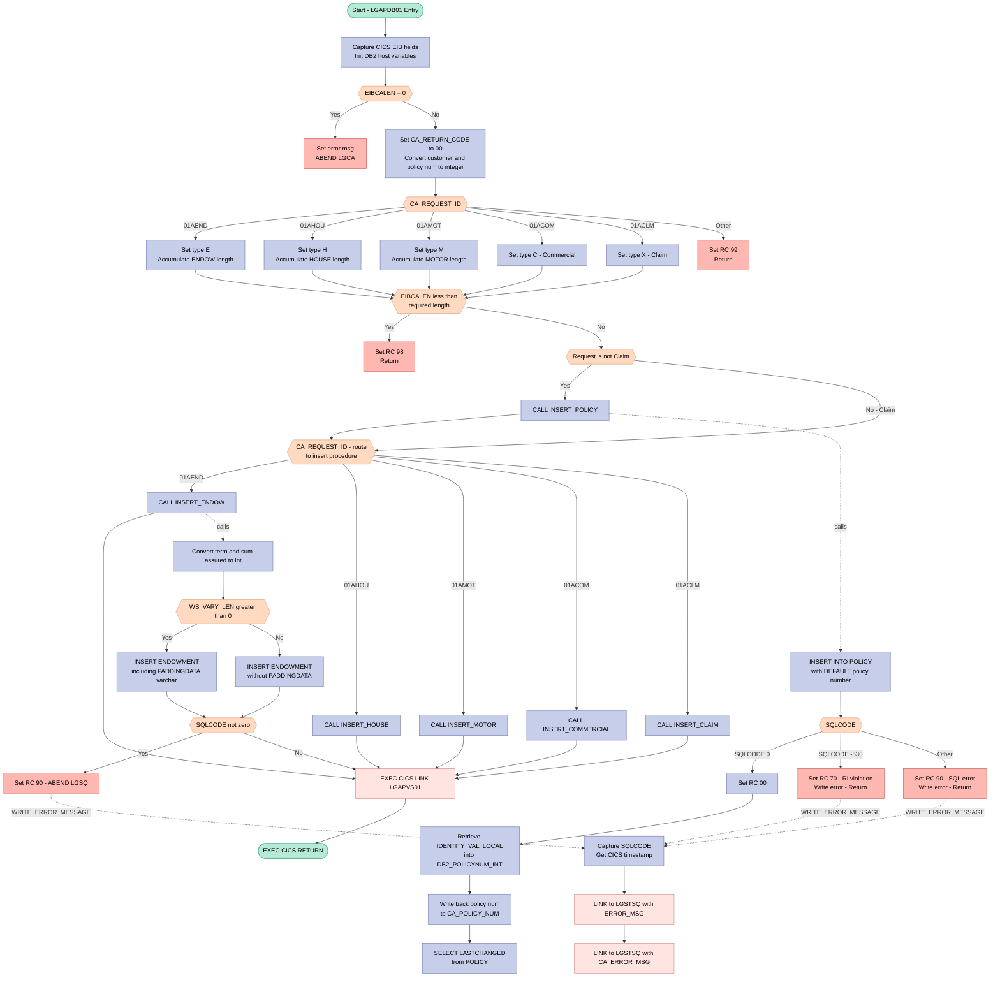

## Table of Contents

- [1. Purpose](#1-purpose)
- [2. Inputs](#2-inputs)
  - [2.1 Communication Area (COMMAREA) — Passed via `COMM_AREA_PTR`](#21-communication-area-commarea--passed-via-comm_area_ptr)
  - [2.2 CICS Execution Environment](#22-cics-execution-environment)
  - [2.3 DB2 Database (via EXEC SQL)](#23-db2-database-via-exec-sql)
- [3. Outputs](#3-outputs)
- [4. Processing Logic](#4-processing-logic)
  - [4.1 Mermaid Flow Diagram](#41-mermaid-flow-diagram)
  - [4.2 Processing Logic Description](#42-processing-logic-description)
  - [4.3 Database Tables](#43-database-tables)
- [5. Paragraphs](#5-paragraphs)
- [6. Dependencies](#6-dependencies)
  - [6.1 Communication Area (COMMAREA)](#61-communication-area-commarea)
  - [6.2 DB2 Database Tables](#62-db2-database-tables)
  - [6.3 DB2 SQL Constructs](#63-db2-sql-constructs)
  - [6.4 CICS Services](#64-cics-services)
  - [6.5 Linked / Called External Programs](#65-linked--called-external-programs)
  - [6.6 Included Copybooks / Inline Definitions](#66-included-copybooks--inline-definitions)
- [7. Constraints](#7-constraints)
  - [7.1 CICS Environment and Communication Area Constraints](#71-cics-environment-and-communication-area-constraints)
  - [7.2 Request Type and Control Flow Constraints](#72-request-type-and-control-flow-constraints)
  - [7.3 Execution Sequencing and Operational Constraints](#73-execution-sequencing-and-operational-constraints)
  - [7.4 Database Integrity and Error Handling Constraints](#74-database-integrity-and-error-handling-constraints)
  - [7.5 Data Formatting and Storage Constraints](#75-data-formatting-and-storage-constraints)
- [8. Error Handling](#8-error-handling)
  - [8.1 Missing Communication Area (COMMAREA) Validation](#81-missing-communication-area-commarea-validation)
  - [8.2 Unrecognized Request Identifier Handling](#82-unrecognized-request-identifier-handling)
  - [8.3 DB2 SQL Error Handling](#83-db2-sql-error-handling)
  - [8.4 Return Code Communication](#84-return-code-communication)
  - [8.5 Diagnostic Logging via WRITE_ERROR_MESSAGE](#85-diagnostic-logging-via-write_error_message)
  - [8.6 CICS ABEND-Based Transaction Backout](#86-cics-abend-based-transaction-backout)
- [9. Examples](#9-examples)
  - [9.1 Example 1: Successfully Adding a Motor Policy](#91-example-1-successfully-adding-a-motor-policy)
  - [9.2 Example 2: Invalid Request Identifier Handling](#92-example-2-invalid-request-identifier-handling)
  - [9.3 Example 3: Referential Integrity Violation on Customer Number](#93-example-3-referential-integrity-violation-on-customer-number)

## 1. Purpose

`LGAPDB01` is a CICS-hosted PL/I program that serves as the DB2 persistence layer for adding new insurance policies to the General Insurance application. Invoked via a CICS COMMAREA, it accepts a request type code (`CA_REQUEST_ID`) that identifies which category of policy to create — endowment, house, motor, commercial, or claim — and then performs the corresponding DB2 INSERT operations: first into the parent POLICY table (obtaining the system-generated policy number via `IDENTITY_VAL_LOCAL`), and then into the appropriate detail table (ENDOWMENT, HOUSE, MOTOR, COMMERCIAL, or CLAIM). Upon successful completion, the DB2-assigned policy number is returned to the caller through the COMMAREA, the program links to a downstream validation program (`LGAPVS01`), and it sets structured return codes to communicate success, referential integrity violations, general SQL errors, insufficient COMMAREA length, or unrecognized request types back to the originating transaction.

## 2. Inputs

### 2.1 Communication Area (COMMAREA) — Passed via `COMM_AREA_PTR`

The program is invoked as a CICS linked program and receives all external input through a COMMAREA pointer (`COMM_AREA_PTR`). The following fields are consumed from it:

- **`CA_REQUEST_ID`** *(CHAR(6))*
  - Operation code that controls the main processing flow; supported values are `'01AEND'` (endowment), `'01AHOU'` (house), `'01AMOT'` (motor), `'01ACOM'` (commercial), and `'01ACLM'` (claim). Determines which DB2 INSERT procedure is called.

- **`CA_CUSTOMER_NUM`** *(PIC '9999999999')*
  - Customer identifier supplied by the caller. Converted to binary integer (`DB2_CUSTOMERNUM_INT`) and used as the foreign key in the INSERT into the POLICY table.

- **`CA_POLICY_NUM`** *(PIC '9999999999')*
  - Policy number supplied by the caller; also used as the policy key reference (`DB2_C_PolicyNum_INT`) for the CLAIM INSERT. After a POLICY INSERT, the DB2-generated number is written back to this field.

- **Common Policy Fields** (`CA_POLICY_COMMON`) — present for all non-claim policy types:
  - **`CA_ISSUE_DATE`** *(CHAR(10))* — Policy issue date; inserted into POLICY.ISSUEDATE and COMMERCIAL.StartDate.
  - **`CA_EXPIRY_DATE`** *(CHAR(10))* — Policy expiry date; inserted into POLICY.EXPIRYDATE and COMMERCIAL.RenewalDate.
  - **`CA_BROKERID`** *(PIC '9999999999')* — Broker identifier; converted to integer and inserted into POLICY.BROKERID.
  - **`CA_BROKERSREF`** *(CHAR(10))* — Broker's reference string; inserted directly into POLICY.BROKERSREFERENCE.
  - **`CA_PAYMENT`** *(PIC '999999')* — Premium payment amount; converted to integer and inserted into POLICY.PAYMENT.

- **Endowment-Specific Fields** (`CA_ENDOWMENT`) — used when `CA_REQUEST_ID = '01AEND'`:
  - **`CA_E_WITH_PROFITS`** *(CHAR(1))* — With-profits indicator flag.
  - **`CA_E_EQUITIES`** *(CHAR(1))* — Equities indicator flag.
  - **`CA_E_MANAGED_FUND`** *(CHAR(1))* — Managed-fund indicator flag.
  - **`CA_E_FUND_NAME`** *(CHAR(10))* — Name of the investment fund.
  - **`CA_E_TERM`** *(PIC '99')* — Policy term in years; converted to short integer.
  - **`CA_E_SUM_ASSURED`** *(PIC '999999')* — Sum assured; converted to integer and inserted into ENDOWMENT.SUMASSURED.
  - **`CA_E_LIFE_ASSURED`** *(CHAR(31))* — Name of the life assured.
  - **`CA_E_PADDING_DATA`** *(CHAR(32348))* — Optional variable-length padding data for the ENDOWMENT VARCHAR column; present only when COMMAREA exceeds the minimum required length.

- **House-Specific Fields** (`CA_HOUSE`) — used when `CA_REQUEST_ID = '01AHOU'`:
  - **`CA_H_PROPERTY_TYPE`** *(CHAR(15))* — Type of property.
  - **`CA_H_BEDROOMS`** *(PIC '999')* — Number of bedrooms; converted to short integer.
  - **`CA_H_VALUE`** *(PIC '99999999')* — Property value; converted to integer.
  - **`CA_H_HOUSE_NAME`** *(CHAR(20))* — House name.
  - **`CA_H_HOUSE_NUMBER`** *(CHAR(4))* — House number.
  - **`CA_H_POSTCODE`** *(CHAR(8))* — Property postcode.

- **Motor-Specific Fields** (`CA_MOTOR`) — used when `CA_REQUEST_ID = '01AMOT'`:
  - **`CA_M_MAKE`** *(CHAR(15))* — Vehicle manufacturer.
  - **`CA_M_MODEL`** *(CHAR(15))* — Vehicle model.
  - **`CA_M_VALUE`** *(PIC '999999')* — Vehicle value; converted to integer.
  - **`CA_M_REGNUMBER`** *(CHAR(7))* — Vehicle registration number.
  - **`CA_M_COLOUR`** *(CHAR(8))* — Vehicle colour.
  - **`CA_M_CC`** *(PIC '9999')* — Engine cubic capacity; converted to short integer.
  - **`CA_M_MANUFACTURED`** *(CHAR(10))* — Year/date of manufacture.
  - **`CA_M_PREMIUM`** *(PIC '999999')* — Motor premium amount; converted to integer.
  - **`CA_M_ACCIDENTS`** *(PIC '999999')* — Number of prior accidents; converted to integer.

- **Commercial-Specific Fields** (`CA_COMMERCIAL`) — used when `CA_REQUEST_ID = '01ACOM'`:
  - **`CA_B_Address`** *(CHAR(255))* — Business premises address.
  - **`CA_B_Postcode`** *(CHAR(8))* — Business premises postcode.
  - **`CA_B_Latitude`** *(CHAR(11))* — Geographic latitude of the premises.
  - **`CA_B_Longitude`** *(CHAR(11))* — Geographic longitude of the premises.
  - **`CA_B_Customer`** *(CHAR(255))* — Customer description for the commercial policy.
  - **`CA_B_PropType`** *(CHAR(255))* — Commercial property type description.
  - **`CA_B_FirePeril`** *(PIC '9999')* — Fire peril rating; converted to short integer.
  - **`CA_B_FirePremium`** *(PIC '99999999')* — Fire peril premium; converted to integer.
  - **`CA_B_CrimePeril`** *(PIC '9999')* — Crime peril rating; converted to short integer.
  - **`CA_B_CrimePremium`** *(PIC '99999999')* — Crime peril premium; converted to integer.
  - **`CA_B_FloodPeril`** *(PIC '9999')* — Flood peril rating; converted to short integer.
  - **`CA_B_FloodPremium`** *(PIC '99999999')* — Flood peril premium; converted to integer.
  - **`CA_B_WeatherPeril`** *(PIC '9999')* — Weather peril rating; converted to short integer.
  - **`CA_B_WeatherPremium`** *(PIC '99999999')* — Weather peril premium; converted to integer.
  - **`CA_B_Status`** *(PIC '9999')* — Commercial policy approval status; converted to short integer and inserted into COMMERCIAL.STATUS.
  - **`CA_B_RejectReason`** *(CHAR(255))* — Reason for rejection, if applicable.

- **Claim-Specific Fields** (`CA_CLAIM`) — used when `CA_REQUEST_ID = '01ACLM'`:
  - **`CA_C_Num`** *(PIC '9999999999')* — Claim number reference; used as the ClaimNumber key in the CLAIM INSERT.
  - **`CA_C_Date`** *(CHAR(10))* — Date of the claim.
  - **`CA_C_Paid`** *(PIC '99999999')* — Amount paid for the claim; converted to integer and inserted into CLAIM.PAID.
  - **`CA_C_Value`** *(PIC '99999999')* — Assessed value of the claim; converted to integer and inserted into CLAIM.VALUE.
  - **`CA_C_Cause`** *(CHAR(255))* — Description of the cause of the claim.
  - **`CA_C_Observations`** *(CHAR(255))* — Additional observations about the claim.

### 2.2 CICS Execution Environment

- **`EIBCALEN`** — CICS-provided length of the received COMMAREA. Used to validate that the COMMAREA is present and long enough for the requested policy type before any processing takes place.
- **`EIBTRNID`**, **`EIBTRMID`**, **`EIBTASKN`** — CICS execution interface block fields providing the transaction ID, terminal ID, and task number of the current CICS task; captured into working-storage header fields at program initialisation.

### 2.3 DB2 Database (via EXEC SQL)

- **POLICY table** — The program inserts a new policy row and retrieves the system-generated `POLICYNUMBER` (via `IDENTITY_VAL_LOCAL`) and the assigned `LASTCHANGED` timestamp back into the COMMAREA.
- **ENDOWMENT, HOUSE, MOTOR, COMMERCIAL, CLAIM tables** — Each policy-type-specific table is the target of an INSERT driven entirely by the COMMAREA input fields described above; no data is read back from these tables.

## 3. Outputs

**Communication Area (COMMAREA) — Returned to Caller**

- `CA_RETURN_CODE` — Two-digit return code written back to the caller via the COMMAREA to indicate the outcome of the add-policy operation:
  - `'00'` — success
  - `'70'` — referential integrity violation on POLICY INSERT (SQLCODE -530)
  - `'90'` — general SQL error on any INSERT
  - `'98'` — COMMAREA too short for the requested policy type
  - `'99'` — unrecognised `CA_REQUEST_ID`
- `CA_POLICY_NUM` — Written back after a successful POLICY INSERT with the DB2-generated policy number retrieved via `IDENTITY_VAL_LOCAL()`, allowing the caller to obtain the new policy's identifier
- `CA_LASTCHANGED` — Populated via a SELECT on the POLICY table after INSERT to retrieve the DB2-assigned `LASTCHANGED` timestamp, which is returned to the caller and also forwarded as `RequestDate` in the COMMERCIAL INSERT
- `CA_C_Num` — Written back after a CLAIM INSERT with the claim number (`DB2_C_Num_INT`), returning the assigned claim identifier to the caller

---

**DB2 Database Writes**

- `POLICY` table INSERT (all non-CLAIM requests: `01AEND`, `01AHOU`, `01AMOT`, `01ACOM`):
  - Columns written: `POLICYNUMBER` (DEFAULT/identity), `CUSTOMERNUMBER`, `ISSUEDATE`, `EXPIRYDATE`, `POLICYTYPE`, `LASTCHANGED` (CURRENT TIMESTAMP), `BROKERID`, `BROKERSREFERENCE`, `PAYMENT`
- `ENDOWMENT` table INSERT (request `01AEND`):
  - Columns written: `POLICYNUMBER`, `WITHPROFITS`, `EQUITIES`, `MANAGEDFUND`, `FUNDNAME`, `TERM`, `SUMASSURED`, `LIFEASSURED`, and optionally `PADDINGDATA` (VARCHAR, only if extra COMMAREA data is present)
- `HOUSE` table INSERT (request `01AHOU`):
  - Columns written: `POLICYNUMBER`, `PROPERTYTYPE`, `BEDROOMS`, `VALUE`, `HOUSENAME`, `HOUSENUMBER`, `POSTCODE`
- `MOTOR` table INSERT (request `01AMOT`):
  - Columns written: `POLICYNUMBER`, `MAKE`, `MODEL`, `VALUE`, `REGNUMBER`, `COLOUR`, `CC`, `YEAROFMANUFACTURE`, `PREMIUM`, `ACCIDENTS`
- `COMMERCIAL` table INSERT (request `01ACOM`):
  - Columns written: `POLICYNUMBER`, `RequestDate` (from `CA_LASTCHANGED`), `StartDate` (from `CA_ISSUE_DATE`), `RenewalDate` (from `CA_EXPIRY_DATE`), `Address`, `Zipcode`, `LatitudeN`, `LongitudeW`, `Customer`, `PropertyType`, `FirePeril`, `FirePremium`, `CrimePeril`, `CrimePremium`, `FloodPeril`, `FloodPremium`, `WeatherPeril`, `WeatherPremium`, `Status`, `RejectionReason`
- `CLAIM` table INSERT (request `01ACLM`):
  - Columns written: `ClaimNumber`, `PolicyNumber`, `ClaimDate`, `Paid`, `Value`, `Cause`, `Observations`

---

**CICS Program Links and External Calls**

- `LGAPVS01` — Called unconditionally via `EXEC CICS LINK` after all DB2 INSERTs, with the full COMMAREA passed (length 32500); produces side effects in the linked program
- `LGSTSQ` (via `WRITE_ERROR_MESSAGE`) — Called via `EXEC CICS LINK` to write diagnostic messages to a Transient Data Queue (TDQ) on any error condition; two messages are written per error invocation:
  - `ERROR_MSG` — structured error record containing date, time, program name (`LGIPOL01`), customer number (`EM_CUSNUM`), policy number (`EM_POLNUM`), SQL request identifier (`EM_SQLREQ`), and SQLCODE (`EM_SQLRC`)
  - `CA_ERROR_MSG` — up to 90 bytes of the raw COMMAREA prefixed with `'COMMAREA='`, providing a snapshot of the caller's input at the time of the error

---

**CICS Abend Signals**

- `ABEND 'LGCA'` — Issued (with NODUMP) when no COMMAREA is received (`EIBCALEN = 0`); terminates the task abnormally
- `ABEND 'LGSQ'` — Issued (with NODUMP) on a non-zero SQLCODE from any of the subordinate INSERTs (ENDOWMENT, HOUSE, MOTOR, COMMERCIAL, CLAIM); forces a backout of the preceding POLICY INSERT

## 4. Processing Logic

### 4.1 Mermaid Flow Diagram



---

### 4.2 Processing Logic Description

#### 4.2.1 High-level Summary

`LGAPDB01` is the DB2 data-access layer program for **adding a new insurance policy** in the GenApp system. It is called via `EXEC CICS LINK` from the presentation/business-logic layer. Depending on the policy type code received in the Communication Area (`CA_REQUEST_ID`), it inserts a parent row into the `POLICY` table and then inserts the corresponding type-specific detail row into one of: `ENDOWMENT`, `HOUSE`, `MOTOR`, `COMMERCIAL`, or `CLAIM`. After all DB2 work completes successfully, it links to `LGAPVS01` (VSAM layer) before returning to the caller.

---

#### 4.2.2 Execution Flow

**Step 1 – Entry and EIB Capture**
The program is an Options(Main) PL/I procedure receiving the Communication Area pointer. It immediately captures CICS EIB fields (transaction ID, terminal ID, task number, COMMAREA length) into working-storage and initialises all DB2 host-variable integer structures to zero.

**Step 2 – COMMAREA Presence Check**
If `EIBCALEN = 0` (no Communication Area was passed), an error message is written and CICS ABEND code `LGCA` is issued. This is a hard stop — the program cannot proceed without data.

**Step 3 – Initialise Return Code and Convert Keys**
`CA_RETURN_CODE` is set to `'00'` (success assumption). `CA_CUSTOMER_NUM` and `CA_POLICY_NUM` are converted from their picture-9 formats into `FIXED BIN(31)` host variables (`DB2_CUSTOMERNUM_INT`, `DB2_C_PolicyNum_INT`) ready for DB2 use. Both are also placed in the error-message structure for diagnostic capture.

**Step 4 – Request Routing and Policy-Type Assignment**
A `SELECT` on `CA_REQUEST_ID` determines the operation:

| Request ID | Policy Type Code | Length Added to Minimum |
|------------|-----------------|------------------------|
| `01AEND`   | `E` (Endowment) | `WS_FULL_ENDOW_LEN` (124) |
| `01AHOU`   | `H` (House)     | `WS_FULL_HOUSE_LEN` (130) |
| `01AMOT`   | `M` (Motor)     | `WS_FULL_MOTOR_LEN` (137) |
| `01ACOM`   | `C` (Commercial)| *(no additional length)*  |
| `01ACLM`   | `X` (Claim)     | *(no additional length)*  |
| Other      | —               | RC `99` → immediate return |

**Step 5 – COMMAREA Length Validation**
The accumulated required length is compared to `EIBCALEN`. If the actual length is insufficient, `CA_RETURN_CODE = '98'` is set and the program returns immediately to the caller — preventing any DB2 activity with truncated data.

**Step 6 – INSERT_POLICY (all except Claims)**
For every request except `01ACLM`, `INSERT_POLICY` is called:
- Converts `CA_BROKERID` and `CA_PAYMENT` to integer host variables.
- Executes `INSERT INTO POLICY` with `POLICYNUMBER DEFAULT` — letting DB2 generate the policy number via an identity column. `LASTCHANGED` is set to `CURRENT TIMESTAMP`.
- Checks `SQLCODE`:
  - `0` → success, RC `00`.
  - `-530` → referential integrity violation (customer does not exist), RC `70`, error written, immediate CICS RETURN.
  - Other → general SQL error, RC `90`, error written, immediate CICS RETURN.
- On success, `IDENTITY_VAL_LOCAL()` retrieves the newly generated policy number into `DB2_POLICYNUM_INT`, which is written back to `CA_POLICY_NUM` so the caller knows the assigned number.
- A follow-up `SELECT` retrieves the `LASTCHANGED` timestamp from the newly inserted `POLICY` row and stores it in `CA_LASTCHANGED`.

**Step 7 – Type-Specific INSERT**
A second `SELECT` on `CA_REQUEST_ID` calls the appropriate procedure:

- **INSERT_ENDOW**: Converts term and sum-assured to integers. Checks whether extra padding data exists in the COMMAREA (`WS_VARY_LEN > 0`). If yes, includes the `PADDINGDATA` VARCHAR column; otherwise omits it. On any non-zero SQLCODE, sets RC `90`, writes the error, and issues ABEND `LGSQ` (which triggers CICS unit-of-work backout, rolling back the previously inserted `POLICY` row).
- **INSERT_HOUSE**: Converts bedroom count and property value to integers. Single `INSERT INTO HOUSE`. Non-zero SQLCODE → RC `90`, ABEND `LGSQ`.
- **INSERT_MOTOR**: Converts value, CC, premium, and accident count to integers. Single `INSERT INTO MOTOR`. Non-zero SQLCODE → RC `90`, ABEND `LGSQ`.
- **INSERT_COMMERCIAL**: Converts all nine numeric peril/premium/status fields to integers. Single `INSERT INTO COMMERCIAL` including address, geocoordinates, peril ratings, premiums, status, and rejection reason. Non-zero SQLCODE → RC `90`, ABEND `LGSQ`.
- **INSERT_CLAIM**: Converts paid amount and claim value to integers. Single `INSERT INTO CLAIM` using the policy number originally passed in the COMMAREA (not a newly generated one, since no `POLICY` row is created for claims). Writes `CA_C_Num` back after insert. Non-zero SQLCODE → RC `90`, ABEND `LGSQ`.

**Step 8 – VSAM Link**
After all DB2 inserts succeed, `EXEC CICS LINK PROGRAM('LGAPVS01')` is called passing the full 32,500-byte COMMAREA. This delegates any VSAM-based persistence responsibilities to the VSAM layer.

**Step 9 – Return**
`EXEC CICS RETURN` passes control back to the calling program. `CA_RETURN_CODE` and `CA_POLICY_NUM` carry the results.

**WRITE_ERROR_MESSAGE Sub-procedure**
Called on any DB2 error. It captures the SQLCODE, obtains the current date/time via `EXEC CICS ASKTIME` / `EXEC CICS FORMATTIME`, then calls `LGSTSQ` twice via `EXEC CICS LINK` — once with the structured error message (customer number, policy number, SQL request name, SQLCODE) and once with up to 90 bytes of raw COMMAREA content, to a Transient Data Queue for post-mortem diagnostics.

---

#### 4.2.3 External Interactions

| System | Interaction | Purpose |
|--------|-------------|---------|
| DB2 `POLICY` | `INSERT` | Creates the parent policy record; DB2 identity column generates the policy number |
| DB2 `ENDOWMENT` | `INSERT` | Stores endowment-specific details linked by policy number |
| DB2 `HOUSE` | `INSERT` | Stores house insurance details linked by policy number |
| DB2 `MOTOR` | `INSERT` | Stores motor insurance details linked by policy number |
| DB2 `COMMERCIAL` | `INSERT` | Stores commercial property insurance details linked by policy number |
| DB2 `CLAIM` | `INSERT` | Stores a new claim against an existing policy |
| CICS `LGAPVS01` | `EXEC CICS LINK` | VSAM-layer add program, invoked after successful DB2 inserts |
| CICS `LGSTSQ` | `EXEC CICS LINK` | Error-logging program that writes diagnostic messages to a TDQ |

---

#### 4.2.4 Plain Language Summary

When a new insurance policy needs to be created, this program acts as the **database writer**. It receives a request packet describing the type of policy (endowment savings plan, house insurance, motor insurance, commercial property insurance, or an insurance claim) along with all the relevant details and the customer it belongs to.

The program first performs several safety checks: it confirms a data packet was actually sent, that the packet is long enough to contain all expected fields, and that the request code is one it recognises. If any check fails, it returns an error code immediately without touching the database.

For all policy types except claims, it first writes a common policy record to the database, letting the database automatically assign a unique policy number. It then writes a second, type-specific record containing the detailed information (e.g., vehicle make and model for motor, or property address and peril ratings for commercial). For claims, only a claim record is written, linked to an existing policy.

If any database write fails due to a referential integrity problem (e.g., the customer doesn't exist), it returns code `70`. For other database errors it returns code `90` and — critically — triggers a CICS ABEND (`LGSQ`) that rolls back all database changes made in that transaction, keeping the data consistent. All errors are also logged to a diagnostic queue with timestamp, customer number, policy number, and the DB2 error code. On success, it links to a companion VSAM-layer program before returning to the caller with return code `00` and the newly assigned policy number.

---

### 4.3 Database Tables

```erDiagram
    POLICY {
        int POLICYNUMBER "Identity column auto-generated"
        int CUSTOMERNUMBER "FK to customer"
        string ISSUEDATE "Policy start date CHAR10"
        string EXPIRYDATE "Policy end date CHAR10"
        string POLICYTYPE "E H M C X"
        string LASTCHANGED "Timestamp CHAR26"
        int BROKERID "Broker identifier"
        string BROKERSREFERENCE "Broker ref CHAR10"
        int PAYMENT "Premium payment amount"
    }

    ENDOWMENT {
        int POLICYNUMBER "FK to POLICY"
        string WITHPROFITS "With-profits flag CHAR1"
        string EQUITIES "Equities flag CHAR1"
        string MANAGEDFUND "Managed fund flag CHAR1"
        string FUNDNAME "Fund name CHAR10"
        int TERM "Policy term in years SMALLINT"
        int SUMASSURED "Sum assured amount"
        string LIFEASSURED "Life assured name CHAR31"
        string PADDINGDATA "Optional VARCHAR extra data"
    }

    HOUSE {
        int POLICYNUMBER "FK to POLICY"
        string PROPERTYTYPE "Property type CHAR15"
        int BEDROOMS "Number of bedrooms SMALLINT"
        int VALUE "Property value"
        string HOUSENAME "House name CHAR20"
        string HOUSENUMBER "House number CHAR4"
        string POSTCODE "Postcode CHAR8"
    }

    MOTOR {
        int POLICYNUMBER "FK to POLICY"
        string MAKE "Vehicle make CHAR15"
        string MODEL "Vehicle model CHAR15"
        int VALUE "Vehicle value"
        string REGNUMBER "Registration number CHAR7"
        string COLOUR "Vehicle colour CHAR8"
        int CC "Engine CC SMALLINT"
        string YEAROFMANUFACTURE "Manufacture year CHAR10"
        int PREMIUM "Motor premium"
        int ACCIDENTS "Accident count"
    }

    COMMERCIAL {
        int POLICYNUMBER "FK to POLICY"
        string REQUESTDATE "Request timestamp CHAR26"
        string STARTDATE "Policy start date CHAR10"
        string RENEWALDATE "Policy renewal date CHAR10"
        string ADDRESS "Property address CHAR255"
        string ZIPCODE "Postcode CHAR8"
        string LATITUDEN "Latitude CHAR11"
        string LONGITUDEW "Longitude CHAR11"
        string CUSTOMER "Customer name CHAR255"
        string PROPERTYTYPE "Property type CHAR255"
        int FIREPERIL "Fire peril rating SMALLINT"
        int FIREPREMIUM "Fire premium"
        int CRIMEPERIL "Crime peril rating SMALLINT"
        int CRIMEPREMIUM "Crime premium"
        int FLOODPERIL "Flood peril rating SMALLINT"
        int FLOODPREMIUM "Flood premium"
        int WEATHERPERIL "Weather peril rating SMALLINT"
        int WEATHERPREMIUM "Weather premium"
        int STATUS "Application status SMALLINT"
        string REJECTIONREASON "Rejection reason CHAR255"
    }

    CLAIM {
        int CLAIMNUMBER "Claim identifier"
        int POLICYNUMBER "FK to POLICY"
        string CLAIMDATE "Claim date CHAR10"
        int PAID "Amount paid"
        int VALUE "Claim value"
        string CAUSE "Cause of claim CHAR255"
        string OBSERVATIONS "Observations CHAR255"
    }

    POLICY ||--o{ ENDOWMENT : "has"
    POLICY ||--o{ HOUSE : "has"
    POLICY ||--o{ MOTOR : "has"
    POLICY ||--o{ COMMERCIAL : "has"
    POLICY ||--o{ CLAIM : "has"
```

## 5. Paragraphs

- **LGAPDB01**
  - **Purpose**: Serves as the main entry point and driver procedure for inserting policy records (Endowment, House, Motor, Commercial) or Claim records into DB2 database tables and propagating updates to VSAM storage via CICS program linkage.
  - **Operations Performed**:
    - Captures CICS execution environment metadata (`EIBTRNID`, `EIBTRMID`, `EIBTASKN`, `EIBCALEN`) into working storage fields.
    - Validates the presence of the communication area, logging an error and triggering an abend if absent.
    - Converts communication area input values (`CA_CUSTOMER_NUM`, `CA_POLICY_NUM`) to DB2 host variable formats and initializes default return codes.
    - Evaluates `CA_REQUEST_ID` to validate required COMMAREA lengths and assign policy type indicators (`DB2_POLICYTYPE`).
    - Dispatches calls to `INSERT_POLICY` (for non-claim operations) and the appropriate specific sub-procedure based on the request type.
    - Links to program `LGAPVS01` to synchronize the newly added policy or claim details into VSAM storage.
    - Issues `EXEC CICS RETURN` to conclude transaction processing.
  - **Control Flow**:
    - Conditional `IF (EIBCALEN = 0)` checks for missing COMMAREA.
    - `SELECT (CA_REQUEST_ID)` structure determines policy type, validates lengths, and sets return code `'99'` for unrecognized request IDs.
    - `IF (EIBCALEN < WS_REQUIRED_CA_LEN)` terminates processing with return code `'98'` if the communication area is undersized.
    - `IF (CA_REQUEST_ID <> '01ACLM')` controls invocation of the base `INSERT_POLICY` routine.
    - Second `SELECT (CA_REQUEST_ID)` executes target-specific insert routines (`INSERT_ENDOW`, `INSERT_HOUSE`, `INSERT_MOTOR`, `INSERT_COMMERCIAL`, `INSERT_CLAIM`).
  - **Interactions with External Systems**:
    - Interacts with CICS runtime via `EXEC CICS ABEND` (code `'LGCA'`), `EXEC CICS LINK PROGRAM('LGAPVS01')`, and `EXEC CICS RETURN`.

- **INSERT_POLICY**
  - **Purpose**: Inserts a new base policy record into the DB2 `POLICY` table, generates a unique policy number, and retrieves the generated policy timestamp and identifier.
  - **Operations Performed**:
    - Maps numeric broker identifier (`CA_BROKERID`) and payment amount (`CA_PAYMENT`) to binary integer DB2 host variables.
    - Executes an `INSERT` statement into the `POLICY` table with host variables and `CURRENT TIMESTAMP`.
    - Evaluates `SQLCODE` outcome and sets corresponding return codes (`'00'` for success, `'70'` for referential integrity violations, `'90'` for other SQL errors).
    - Retrieves the newly generated auto-increment policy number using the DB2 scalar function `IDENTITY_VAL_LOCAL()`.
    - Stores the generated policy number back into the communication area (`CA_POLICY_NUM`) and error diagnostic fields.
    - Executes a `SELECT` statement on the `POLICY` table to retrieve the assigned `LASTCHANGED` timestamp into `CA_LASTCHANGED`.
  - **Control Flow**:
    - Evaluates `SELECT (SQLCODE)`:
      - `WHEN (0)` sets `CA_RETURN_CODE = '00'`.
      - `WHEN (-530)` sets `CA_RETURN_CODE = '70'`, calls `WRITE_ERROR_MESSAGE`, and returns immediately via `EXEC CICS RETURN`.
      - `OTHERWISE` sets `CA_RETURN_CODE = '90'`, calls `WRITE_ERROR_MESSAGE`, and exits via `EXEC CICS RETURN`.
  - **Interactions with External Systems**:
    - Executes DB2 SQL statements: `INSERT INTO POLICY`, `SET :DB2_POLICYNUM_INT = IDENTITY_VAL_LOCAL()`, and `SELECT LASTCHANGED FROM POLICY`.
    - Invokes `EXEC CICS RETURN` upon unrecoverable SQL errors.

- **INSERT_ENDOW**
  - **Purpose**: Inserts detailed endowment insurance policy data into the DB2 `ENDOWMENT` table, handling variable-length trailing padding data if provided.
  - **Operations Performed**:
    - Converts endowment term (`CA_E_TERM`) and sum assured (`CA_E_SUM_ASSURED`) to integer host variables.
    - Calculates the length of any optional trailing padding data in the COMMAREA.
    - Populates the varying-length character field (`WS_VARY_FIELD`) when padding data exists.
    - Executes an `INSERT` statement into the `ENDOWMENT` table using either full parameter set (including `PADDINGDATA`) or basic parameter set.
    - Inspects `SQLCODE` and handles errors by setting `CA_RETURN_CODE = '90'`, logging diagnostics, and forcing a transaction abend to trigger DB2 rollback.
  - **Control Flow**:
    - Evaluates `IF (WS_VARY_LEN > 0)` to choose between inserting with or without the `PADDINGDATA` column.
    - Evaluates `IF (SQLCODE <> 0)` to handle SQL failures, logging errors, abending with code `'LGSQ'`, and returning control to CICS.
  - **Interactions with External Systems**:
    - Executes DB2 SQL `INSERT INTO ENDOWMENT`.
    - Calls CICS service `EXEC CICS ABEND ABCODE('LGSQ') NODUMP` to back out preceding database changes on failure, followed by `EXEC CICS RETURN`.

- **INSERT_HOUSE**
  - **Purpose**: Inserts property and home insurance coverage details into the DB2 `HOUSE` table.
  - **Operations Performed**:
    - Converts property value (`CA_H_VALUE`) and bedroom count (`CA_H_BEDROOMS`) to binary integer host variables.
    - Sets SQL tracking identifier (`EM_SQLREQ = ' INSERT HOUSE '`).
    - Executes an `INSERT` statement into the `HOUSE` table referencing the DB2-generated policy number and property attributes.
    - Evaluates `SQLCODE` for errors, sets `CA_RETURN_CODE = '90'`, logs error details, and abends the task on error.
  - **Control Flow**:
    - Conditional `IF (SQLCODE <> 0)` checks for database execution errors to trigger error handling, task abend, and exit.
  - **Interactions with External Systems**:
    - Executes DB2 SQL `INSERT INTO HOUSE`.
    - Triggers `EXEC CICS ABEND ABCODE('LGSQ') NODUMP` and `EXEC CICS RETURN` on SQL failure.

- **INSERT_MOTOR**
  - **Purpose**: Inserts motor vehicle insurance coverage attributes into the DB2 `MOTOR` table.
  - **Operations Performed**:
    - Formats motor vehicle numerical values (value, engine CC, premium, accident count) into binary integer host variables.
    - Sets SQL tracking identifier (`EM_SQLREQ = ' INSERT MOTOR '`).
    - Executes an `INSERT` statement into the `MOTOR` table using the parent policy number and vehicle specification fields.
    - Validates execution via `SQLCODE`, triggering error logging and transaction abend upon failure.
  - **Control Flow**:
    - Conditional `IF (SQLCODE <> 0)` detects SQL errors, sets `CA_RETURN_CODE = '90'`, and initiates error termination logic.
  - **Interactions with External Systems**:
    - Executes DB2 SQL `INSERT INTO MOTOR`.
    - Invokes `EXEC CICS ABEND ABCODE('LGSQ') NODUMP` and `EXEC CICS RETURN` when SQL errors occur.

- **INSERT_COMMERCIAL**
  - **Purpose**: Inserts commercial property insurance policy details, including peril coverages, premium breakdowns, and geographic coordinates, into the DB2 `COMMERCIAL` table.
  - **Operations Performed**:
    - Converts peril and premium amounts (Fire, Crime, Flood, Weather) and business status (`CA_B_Status`) into corresponding binary integer host variables.
    - Sets SQL tracking identifier (`EM_SQLREQ = ' INSERT COMMER'`).
    - Executes an `INSERT` statement into the `COMMERCIAL` table linking the record to the parent policy number, timestamps, property addresses, peril ratings, and rejection reasons.
    - Evaluates `SQLCODE` to determine execution success and initiate rollback/abend on error.
  - **Control Flow**:
    - Conditional `IF (SQLCODE <> 0)` branches to error logging, assigns `CA_RETURN_CODE = '90'`, and abends the transaction.
  - **Interactions with External Systems**:
    - Executes DB2 SQL `INSERT INTO COMMERCIAL`.
    - Invokes `EXEC CICS ABEND ABCODE('LGSQ') NODUMP` and `EXEC CICS RETURN` upon encountering SQL errors.

- **INSERT_CLAIM**
  - **Purpose**: Inserts an insurance claim record into the DB2 `CLAIM` table for an existing policy.
  - **Operations Performed**:
    - Converts claim monetary values (`CA_C_Paid`, `CA_C_Value`) to binary integer host variables.
    - Sets SQL tracking identifier (`EM_SQLREQ = ' INSERT CLAIM'`).
    - Executes an `INSERT` statement into the `CLAIM` table with claim numbers, dates, monetary amounts, causes, and observations.
    - Copies the assigned claim number back into the communication area (`CA_C_Num`).
    - Evaluates `SQLCODE` and triggers error logging and transaction abend if insertion fails.
  - **Control Flow**:
    - Conditional `IF (SQLCODE <> 0)` initiates error handling, sets `CA_RETURN_CODE = '90'`, and abends the transaction.
  - **Interactions with External Systems**:
    - Executes DB2 SQL `INSERT INTO CLAIM`.
    - Invokes `EXEC CICS ABEND ABCODE('LGSQ') NODUMP` and `EXEC CICS RETURN` on failure.

- **WRITE_ERROR_MESSAGE**
  - **Purpose**: Formats and transmits error diagnostic records and COMMAREA snapshots to a CICS Transient Data Queue (TDQ) subprogram (`LGSTSQ`).
  - **Operations Performed**:
    - Copies the active `SQLCODE` into the error message structure (`EM_SQLRC`).
    - Obtains absolute system time via `EXEC CICS ASKTIME` and formats it into date and time strings via `EXEC CICS FORMATTIME`.
    - Populates timestamp fields (`EM_DATE`, `EM_TIME`) in the error structure.
    - Links to error logging program `LGSTSQ` passing the formatted `ERROR_MSG`.
    - Extracts up to 90 bytes of the active COMMAREA payload into `CA_ERROR_MSG` and links to `LGSTSQ` to log COMMAREA data.
  - **Control Flow**:
    - Conditional `IF (EIBCALEN > 0)` verifies if COMMAREA data exists.
    - Nested conditional `IF (EIBCALEN < 91)` extracts the exact COMMAREA length, while `ELSE` extracts the maximum 90 bytes before linking to `LGSTSQ`.
  - **Interactions with External Systems**:
    - Executes CICS system calls `EXEC CICS ASKTIME` and `EXEC CICS FORMATTIME`.
    - Links to external CICS logging program `LGSTSQ` via `EXEC CICS LINK PROGRAM('LGSTSQ')`.

## 6. Dependencies

### 6.1 Communication Area (COMMAREA)

- **COMM_AREA** — The primary input/output interface passed by pointer (`COMM_AREA_PTR`) from the calling program. It supplies all request parameters and receives results back.
  - **CA_REQUEST_ID** — A 6-character code (`01AEND`, `01AHOU`, `01AMOT`, `01ACOM`, `01ACLM`) that selects which policy type INSERT procedure is executed; drives the entire control flow.
  - **CA_RETURN_CODE** — Output field written back to the caller indicating success (`00`), referential integrity violation (`70`), SQL error (`90`), insufficient COMMAREA length (`98`), or unrecognised request (`99`).
  - **CA_CUSTOMER_NUM** — 10-digit customer identifier supplied by the caller; converted to a binary integer host variable and inserted as the foreign key into the POLICY table.
  - **CA_POLICY_NUM** — 10-digit policy number field; populated on return with the DB2-generated identity value after a successful INSERT into the POLICY table.
  - **CA_ISSUE_DATE** — Policy issue date (CHAR 10) used in INSERTs to POLICY and COMMERCIAL tables.
  - **CA_EXPIRY_DATE** — Policy expiry date (CHAR 10) used in INSERTs to POLICY and COMMERCIAL tables.
  - **CA_PAYMENT** — 6-digit premium payment amount inserted into the POLICY table PAYMENT column.
  - **CA_BROKERID** — 10-digit broker identifier inserted into the POLICY table BROKERID column.
  - **CA_BROKERSREF** — Broker reference string inserted into POLICY table BROKERSREFERENCE column.
  - **CA_LASTCHANGED** — 26-character timestamp retrieved from the POLICY table after INSERT and returned to the caller; also used as RequestDate in COMMERCIAL INSERT.
  - **CA_ENDOWMENT fields** (`CA_E_WITH_PROFITS`, `CA_E_EQUITIES`, `CA_E_MANAGED_FUND`, `CA_E_FUND_NAME`, `CA_E_TERM`, `CA_E_SUM_ASSURED`, `CA_E_LIFE_ASSURED`, `CA_E_PADDING_DATA`) — Endowment-specific input fields mapped to the ENDOWMENT table.
  - **CA_HOUSE fields** (`CA_H_PROPERTY_TYPE`, `CA_H_BEDROOMS`, `CA_H_VALUE`, `CA_H_HOUSE_NAME`, `CA_H_HOUSE_NUMBER`, `CA_H_POSTCODE`) — House-specific input fields mapped to the HOUSE table.
  - **CA_MOTOR fields** (`CA_M_MAKE`, `CA_M_MODEL`, `CA_M_VALUE`, `CA_M_REGNUMBER`, `CA_M_COLOUR`, `CA_M_CC`, `CA_M_MANUFACTURED`, `CA_M_PREMIUM`, `CA_M_ACCIDENTS`) — Motor-specific input fields mapped to the MOTOR table.
  - **CA_COMMERCIAL fields** (`CA_B_Address`, `CA_B_Postcode`, `CA_B_Latitude`, `CA_B_Longitude`, `CA_B_Customer`, `CA_B_PropType`, `CA_B_FirePeril`, `CA_B_FirePremium`, `CA_B_CrimePeril`, `CA_B_CrimePremium`, `CA_B_FloodPeril`, `CA_B_FloodPremium`, `CA_B_WeatherPeril`, `CA_B_WeatherPremium`, `CA_B_Status`, `CA_B_RejectReason`) — Commercial-specific input fields mapped to the COMMERCIAL table.
  - **CA_CLAIM fields** (`CA_C_Num`, `CA_C_Date`, `CA_C_Paid`, `CA_C_Value`, `CA_C_Cause`, `CA_C_Observations`) — Claim-specific input fields mapped to the CLAIM table.

### 6.2 DB2 Database Tables

- **POLICY** — Primary table receiving an INSERT for every non-claim request; a DB2 identity column auto-generates the policy number, which is retrieved via `IDENTITY_VAL_LOCAL()`.
- **ENDOWMENT** — Receives an INSERT (with or without the PADDINGDATA VARCHAR column) when `CA_REQUEST_ID = '01AEND'`; linked to POLICY by the generated policy number.
- **HOUSE** — Receives an INSERT when `CA_REQUEST_ID = '01AHOU'`; linked to POLICY by the generated policy number.
- **MOTOR** — Receives an INSERT when `CA_REQUEST_ID = '01AMOT'`; linked to POLICY by the generated policy number.
- **COMMERCIAL** — Receives an INSERT when `CA_REQUEST_ID = '01ACOM'`; linked to POLICY by the generated policy number; uses `CA_ISSUE_DATE` as StartDate and `CA_EXPIRY_DATE` as RenewalDate.
- **CLAIM** — Receives an INSERT when `CA_REQUEST_ID = '01ACLM'`; does not insert into POLICY first; links to an existing policy via `DB2_C_Policynum_INT`.

### 6.3 DB2 SQL Constructs

- **SQLCA (`EXEC SQL INCLUDE SQLCA`)** — The SQL Communications Area included at compile time; provides `SQLCODE` used after every INSERT to detect success, referential integrity violations (−530), or other errors.
- **`IDENTITY_VAL_LOCAL()`** — DB2 scalar function called after the POLICY INSERT to retrieve the most recently generated identity value for use as the foreign key in subordinate table INSERTs.
- **`CURRENT TIMESTAMP`** — DB2 special register used to populate the LASTCHANGED column on the POLICY INSERT.

### 6.4 CICS Services

- **EIB Fields** (`EIBTRNID`, `EIBTRMID`, `EIBTASKN`, `EIBCALEN`) — Exec Interface Block fields accessed at program entry to initialise working-storage header fields and to validate that a COMMAREA was received.
- **`EXEC CICS ABEND ABCODE('LGCA') NODUMP`** — Issued when no COMMAREA is present, terminating the task abnormally.
- **`EXEC CICS ABEND ABCODE('LGSQ') NODUMP`** — Issued after a failed subordinate-table INSERT to force backout of the already-committed POLICY INSERT.
- **`EXEC CICS RETURN`** — Returns control to the caller after normal completion or error conditions.
- **`EXEC CICS ASKTIME` / `EXEC CICS FORMATTIME`** — Called within `WRITE_ERROR_MESSAGE` to obtain and format the current date and time for diagnostic messages.

### 6.5 Linked / Called External Programs

- **LGAPVS01** — Invoked unconditionally via `EXEC CICS LINK` with the full COMMAREA (LENGTH 32500) after all DB2 INSERTs; its role is post-INSERT processing (e.g., audit or notification).
- **LGSTSQ** — Invoked via `EXEC CICS LINK` inside `WRITE_ERROR_MESSAGE` (called twice: once for the formatted error message and once for the raw COMMAREA data) to write diagnostic entries to a Transient Data Queue.

### 6.6 Included Copybooks / Inline Definitions

- **LGPOLICY** (inline-expanded) — Defines the layouts for DB2 table host variable structures (`DB2_CUSTOMER`, `DB2_POLICY`, `DB2_ENDOWMENT`, `DB2_HOUSE`, `DB2_MOTOR`, `DB2_COMMERCIAL`, `DB2_CLAIM`) and all policy-length constants (`WS_POLICY_LENGTHS`).
- **LGCMAREA** (inline-expanded) — Defines the complete COMMAREA structure (`COMM_AREA`) with all policy-type sub-structures, used as the input/output interface with the caller.

## 7. Constraints

### 7.1 CICS Environment and Communication Area Constraints

- **Communication Area Presence Requirement**:
  - The program enforces that a valid COMMAREA must be passed upon invocation.
  - Implementation: Checked via `IF (EIBCALEN = 0)`. If true, an error message (`NO COMMAREA RECEIVED`) is formatted and logged, and the transaction is terminated abnormally with CICS ABEND code `'LGCA'` (`NODUMP`).

- **Minimum Communication Area Length Constraints**:
  - The COMMAREA length (`EIBCALEN`) must satisfy minimum byte length requirements depending on the request type:
    - Base header length constraint: Fixed minimum of 28 bytes (`WS_CA_HEADER_LEN = 28`).
    - Endowment policy request (`01AEND`): Requires at least 152 bytes (`WS_CA_HEADER_LEN` of 28 + `WS_FULL_ENDOW_LEN` of 124).
    - House policy request (`01AHOU`): Requires at least 158 bytes (`WS_CA_HEADER_LEN` of 28 + `WS_FULL_HOUSE_LEN` of 130).
    - Motor policy request (`01AMOT`): Requires at least 165 bytes (`WS_CA_HEADER_LEN` of 28 + `WS_FULL_MOTOR_LEN` of 137).
    - Commercial policy (`01ACOM`) and Claim (`01ACLM`) requests: Evaluated against the base header length requirement of 28 bytes.
  - Implementation: Enforced via `IF (EIBCALEN < WS_REQUIRED_CA_LEN)`. If the length is insufficient, `CA_RETURN_CODE` is set to `'98'` and execution is terminated via `EXEC CICS RETURN`.

### 7.2 Request Type and Control Flow Constraints

- **Valid Request Identifier Values**:
  - The `CA_REQUEST_ID` field must match one of the predefined 6-character operation codes:
    - `'01AEND'` (Add Endowment Policy)
    - `'01AHOU'` (Add House Policy)
    - `'01AMOT'` (Add Motor Policy)
    - `'01ACOM'` (Add Commercial Policy)
    - `'01ACLM'` (Add Claim)
  - Implementation: Evaluated through `SELECT (CA_REQUEST_ID)`. If an unrecognized request identifier is passed, `CA_RETURN_CODE` is set to `'99'` and processing stops immediately.

- **Request-to-Policy Type Mapping**:
  - The database policy type code (`DB2_POLICYTYPE`) is constrained by `CA_REQUEST_ID`:
    - `'01AEND'` maps to `'E'`
    - `'01AHOU'` maps to `'H'`
    - `'01AMOT'` maps to `'M'`
    - `'01ACOM'` maps to `'C'`
    - `'01ACLM'` maps to `'X'`

### 7.3 Execution Sequencing and Operational Constraints

- **Parent-Child Insertion Sequencing for Policies**:
  - For non-claim operations (`CA_REQUEST_ID <> '01ACLM'`), the parent record must be successfully created in the `POLICY` table prior to inserting the specific policy subtype record into the child table (`ENDOWMENT`, `HOUSE`, `MOTOR`, or `COMMERCIAL`).
  - Implementation: `INSERT_POLICY` is executed first to obtain the DB2-generated identity key (`IDENTITY_VAL_LOCAL()`) into `DB2_POLICYNUM_INT`, which is subsequently used as the foreign key in child table insertions.

- **Claim Operation Bypass**:
  - When `CA_REQUEST_ID = '01ACLM'`, the parent `POLICY` table insertion is bypassed because claims attach to existing policies rather than creating a new parent policy record.
  - Implementation: Controlled by `If (CA_REQUEST_ID <> '01ACLM') THEN CALL INSERT_POLICY;`, using `CA_POLICY_NUM` mapped to `DB2_C_PolicyNum_INT` as the existing policy reference.

- **Timestamp and Identity Retrieval Sequencing**:
  - The generated policy number and timestamp are dependent on successful parent insertion:
    - `IDENTITY_VAL_LOCAL()` must be invoked immediately after `INSERT INTO POLICY` to retrieve the allocated `POLICYNUMBER`.
    - A subsequent `SELECT LASTCHANGED` from `POLICY` is executed to retrieve the database timestamp generated via `CURRENT TIMESTAMP`.

- **Downstream VSAM Synchronization Sequencing**:
  - Following successful Db2 insertions, the program executes a mandatory link to the VSAM layer program `LGAPVS01` passing the COMMAREA with a fixed length of 32,500 bytes.
  - Implementation: `EXEC CICS LINK PROGRAM('LGAPVS01') COMMAREA(COMM_AREA) LENGTH(32500)`.

### 7.4 Database Integrity and Error Handling Constraints

- **Foreign Key and Referential Integrity Enforcement**:
  - During the `POLICY` table insertion, the customer number (`CUSTOMERNUMBER`) must reference a valid, existing customer record.
  - Implementation: If Db2 returns `SQLCODE = -530` (referential integrity violation), `CA_RETURN_CODE` is set to `'70'`, error diagnostics are logged via `WRITE_ERROR_MESSAGE`, and the program terminates via `EXEC CICS RETURN`.

- **SQL Failure Handling and Transaction Rollback**:
  - Any unexpected non-zero SQLCODE during parent policy insertion sets `CA_RETURN_CODE` to `'90'` and returns to the caller.
  - Any non-zero SQLCODE during subtype table insertion (`INSERT_ENDOW`, `INSERT_HOUSE`, `INSERT_MOTOR`, `INSERT_COMMERCIAL`, `INSERT_CLAIM`) triggers an immediate rollback to back out the preceding parent `POLICY` insertion.
  - Implementation: Enforced via `EXEC CICS ABEND ABCODE('LGSQ') NODUMP;` after logging diagnostics to `LGSTSQ`.

### 7.5 Data Formatting and Storage Constraints

- **Numeric Type Conversion Restrictions**:
  - All numeric character/picture inputs from the COMMAREA must be valid numbers capable of conversion into binary host variables (`FIXED BIN(15)` or `FIXED BIN(31)`):
    - `CA_CUSTOMER_NUM` (PIC '9(10)') converted to `DB2_CUSTOMERNUM_INT` (FIXED BIN(31))
    - `CA_BROKERID` (PIC '9(10)') converted to `DB2_BROKERID_INT` (FIXED BIN(31))
    - `CA_PAYMENT` (PIC '9(6)') converted to `DB2_PAYMENT_INT` (FIXED BIN(31))
    - `CA_E_TERM` (PIC '99') converted to `DB2_E_TERM_SINT` (FIXED BIN(15))
    - `CA_E_SUM_ASSURED` (PIC '9(6)') converted to `DB2_E_SUMASSURED_INT` (FIXED BIN(31))
    - `CA_H_VALUE` (PIC '9(8)') converted to `DB2_H_VALUE_INT` (FIXED BIN(31))
    - `CA_H_BEDROOMS` (PIC '999') converted to `DB2_H_BEDROOMS_SINT` (FIXED BIN(15))
    - `CA_M_VALUE` (PIC '9(6)'), `CA_M_PREMIUM` (PIC '9(6)'), `CA_M_ACCIDENTS` (PIC '9(6)') converted to `FIXED BIN(31)`
    - `CA_M_CC` (PIC '9999') converted to `DB2_M_CC_SINT` (FIXED BIN(15))
    - Commercial perils and status converted to `FIXED BIN(15)`, and commercial premiums converted to `FIXED BIN(31)`
    - `CA_C_Paid` (PIC '9(8)') and `CA_C_Value` (PIC '9(8)') converted to `FIXED BIN(31)`

- **Variable-Length Field (VARCHAR) Constraints for Endowment**:
  - Variable-length padding data for endowment policies is constrained by available COMMAREA size beyond the required structure size:
    - Calculation: `WS_VARY_LEN = EIBCALEN - WS_REQUIRED_CA_LEN`.
    - Maximum buffer limit: `WS_VARY_CHAR` is fixed at a maximum capacity of 3,900 characters.
    - If `WS_VARY_LEN > 0`, the substring up to `WS_VARY_LEN` is populated into the SQL VARCHAR host structure (`WS_VARY_FIELD`) and inserted into the `PADDINGDATA` column. If `WS_VARY_LEN <= 0`, an alternative INSERT statement excluding the `PADDINGDATA` column is executed.

## 8. Error Handling

### 8.1 Missing Communication Area (COMMAREA) Validation

- **Zero-length COMMAREA check:** At program entry, the EIBCALEN field is tested. If it equals zero, indicating that no communication area was received, the program populates the error message text with 'NO COMMAREA RECEIVED', invokes the `WRITE_ERROR_MESSAGE` procedure, and issues a CICS ABEND with abend code `LGCA` and NODUMP, terminating processing immediately.

- **Insufficient COMMAREA length check:** After determining the request type, the actual COMMAREA length (EIBCALEN) is compared against the minimum required length calculated for the specific policy type. If the received area is shorter than required, `CA_RETURN_CODE` is set to `'98'` and a CICS RETURN is issued, sending the error code back to the caller without performing any database operations.

### 8.2 Unrecognized Request Identifier Handling

- **Invalid CA_REQUEST_ID at pre-processing SELECT:** A PL/I `SELECT` statement evaluates `CA_REQUEST_ID` against the five valid request codes (`01AEND`, `01AHOU`, `01AMOT`, `01ACOM`, `01ACLM`). If none match, the `OTHERWISE` branch sets `CA_RETURN_CODE` to `'99'` and immediately issues a CICS RETURN, notifying the caller that the request is unrecognized without any DB2 activity.

- **Invalid CA_REQUEST_ID at dispatch SELECT:** A second `SELECT` on `CA_REQUEST_ID` directs execution to the appropriate INSERT procedure. The `OTHERWISE` branch again sets `CA_RETURN_CODE` to `'99'` as a defensive fallback in the unlikely event an unrecognized code reaches this point.

### 8.3 DB2 SQL Error Handling

- **Referential integrity violation on POLICY INSERT (SQLCODE -530):** Inside `INSERT_POLICY`, after the DB2 INSERT into the POLICY table, the resulting SQLCODE is evaluated using a `SELECT` statement. A SQLCODE of `-530` specifically represents a referential integrity violation (e.g., the customer number does not exist). In this case, `CA_RETURN_CODE` is set to `'70'`, the `WRITE_ERROR_MESSAGE` procedure is called to log diagnostic details, and a CICS RETURN is issued.

- **General SQL error on POLICY INSERT (non-zero, non-530 SQLCODE):** The `OTHERWISE` branch of the same `SELECT` handles all other non-zero SQLCODES from the POLICY INSERT. `CA_RETURN_CODE` is set to `'90'`, the error is logged via `WRITE_ERROR_MESSAGE`, and a CICS RETURN is issued.

- **SQL error on ENDOWMENT INSERT:** After the INSERT into the ENDOWMENT table, `SQLCODE` is checked with an IF condition. Any non-zero SQLCODE sets `CA_RETURN_CODE` to `'90'`, calls `WRITE_ERROR_MESSAGE`, and then issues a CICS ABEND with code `LGSQ` (NODUMP) to force a backout of the previously committed POLICY table row, followed by a CICS RETURN.

- **SQL error on HOUSE INSERT:** Identical pattern to the endowment error handler — non-zero SQLCODE triggers `CA_RETURN_CODE = '90'`, error message logging, a CICS ABEND `LGSQ` NODUMP for backout, and CICS RETURN.

- **SQL error on MOTOR INSERT:** Same pattern as HOUSE and ENDOWMENT — non-zero SQLCODE results in return code `'90'`, error logging, ABEND `LGSQ` NODUMP, and CICS RETURN.

- **SQL error on COMMERCIAL INSERT:** Same pattern — non-zero SQLCODE sets `CA_RETURN_CODE` to `'90'`, calls `WRITE_ERROR_MESSAGE`, issues ABEND `LGSQ` NODUMP, and CICS RETURN.

- **SQL error on CLAIM INSERT:** Same pattern — non-zero SQLCODE sets `CA_RETURN_CODE` to `'90'`, calls `WRITE_ERROR_MESSAGE`, issues ABEND `LGSQ` NODUMP, and CICS RETURN.

### 8.4 Return Code Communication

- **Success indicator:** After a successful POLICY INSERT (SQLCODE 0), `CA_RETURN_CODE` is explicitly set to `'00'` to confirm the operation succeeded.
- **Error codes returned to caller:** All error paths set `CA_RETURN_CODE` to a specific value (`'70'` for referential integrity, `'90'` for general SQL error, `'98'` for insufficient COMMAREA, `'99'` for unrecognized request) before returning, providing structured outcome signalling to the invoking program.

### 8.5 Diagnostic Logging via WRITE_ERROR_MESSAGE

- **Centralized error logging procedure:** A dedicated `WRITE_ERROR_MESSAGE` procedure captures diagnostic context whenever a SQL or structural error occurs. It:
    - Captures the current SQLCODE into the error message structure field `EM_SQLRC`.
    - Obtains the current timestamp using CICS ASKTIME and formats it with CICS FORMATTIME, populating `EM_DATE` and `EM_TIME`.
    - Writes the full structured error message (including date, time, program name, customer number, policy number, SQL request identifier, and SQLCODE) to a transient data queue (TDQ) by calling the `LGSTSQ` program via CICS LINK.
    - Additionally logs up to 90 bytes of the raw COMMAREA content to the same TDQ queue, truncating if the COMMAREA is shorter than 90 bytes. This provides a snapshot of the input data at the time of failure.
- **Pre-population of diagnostic fields:** Before each DB2 operation, the `EM_SQLREQ` field is set to a label identifying the specific SQL statement (e.g., `' INSERT POLICY'`, `' INSERT ENDOW '`), so that when an error is logged, the message identifies exactly which database operation failed.
- **Customer and policy number preservation:** The customer number (`EM_CUSNUM`) and policy number (`EM_POLNUM`) are populated in the error message structure early in processing so they are available for logging if any subsequent error occurs.

### 8.6 CICS ABEND-Based Transaction Backout

- **ABEND for missing COMMAREA (`LGCA`):** Issued with NODUMP when EIBCALEN is zero. This abend code distinguishes a missing COMMAREA condition from other failures.
- **ABEND for subordinate table INSERT failures (`LGSQ`):** Issued with NODUMP in each policy-type-specific INSERT procedure (ENDOWMENT, HOUSE, MOTOR, COMMERCIAL, CLAIM) when a non-zero SQLCODE is detected. The explicit comment in the code states the intent is to cause a CICS-managed backout of the previously written POLICY table row, preserving data consistency by rolling back the partial transaction.

## 9. Examples

### 9.1 Example 1: Successfully Adding a Motor Policy

This example illustrates adding a new motor insurance policy for an existing customer in the Db2 database.

#### 9.1.1 Input Data
```text
CA_REQUEST_ID        : '01AMOT'
CA_CUSTOMER_NUM      : 0000000001
CA_ISSUE_DATE        : '2023-01-15'
CA_EXPIRY_DATE       : '2024-01-14'
CA_BROKERID          : 0000000100
CA_BROKERSREF        : 'BRK-MOT-01'
CA_PAYMENT           : 000500
CA_M_MAKE            : 'Ford'
CA_M_MODEL           : 'Focus'
CA_M_VALUE           : 015000
CA_M_REGNUMBER       : 'AB12CDE'
CA_M_COLOUR          : 'Blue'
CA_M_CC              : 1600
CA_M_MANUFACTURED    : '2020-05-10'
CA_M_PREMIUM         : 000500
CA_M_ACCIDENTS       : 000000
```

#### 9.1.2 Expected Output
```text
CA_RETURN_CODE       : '00'
CA_POLICY_NUM        : 0000001055 (Db2-generated identity value)
CA_LASTCHANGED       : '2023-01-15-10.00.00.000000' (timestamp from POLICY record)
```

#### 9.1.3 Explanation
1. `LGAPDB01` validates `CA_REQUEST_ID` (`01AMOT`), sets the internal policy type flag (`DB2_POLICYTYPE`) to `'M'`, and checks that the passed commarea meets the minimum required length.
2. It executes `INSERT_POLICY` to insert a new row into the `POLICY` table with common policy data. Upon a successful insert (`SQLCODE = 0`), it retrieves the generated identity key via `IDENTITY_VAL_LOCAL()` into `CA_POLICY_NUM` and queries the generated `LASTCHANGED` timestamp.
3. Based on `CA_REQUEST_ID`, it calls `INSERT_MOTOR`, inserting motor-specific details linked by the generated `POLICYNUMBER`.
4. The program synchronizes with the VSAM data store by linking to `LGAPVS01` and returns control with `CA_RETURN_CODE = '00'`.

---

### 9.2 Example 2: Invalid Request Identifier Handling

This example illustrates how the program handles an invalid or unsupported request type code.

#### 9.2.1 Input Data
```text
CA_REQUEST_ID        : '999999'
CA_CUSTOMER_NUM      : 0000000001
```

#### 9.2.2 Expected Output
```text
CA_RETURN_CODE       : '99'
```

#### 9.2.3 Explanation
1. During the initial `SELECT (CA_REQUEST_ID)` evaluation, `'999999'` does not match any valid policy add request identifiers (`'01AEND'`, `'01AHOU'`, `'01AMOT'`, `'01ACOM'`, or `'01ACLM'`).
2. The logic enters the `OTHERWISE` branch, sets `CA_RETURN_CODE = '99'`, and issues `EXEC CICS RETURN` immediately without attempting any database operations.

---

### 9.3 Example 3: Referential Integrity Violation on Customer Number

This example illustrates the handling of a referential integrity failure when adding a house policy for a customer number that does not exist in the database.

#### 9.3.1 Input Data
```text
CA_REQUEST_ID        : '01AHOU'
CA_CUSTOMER_NUM      : 0999999999 (Non-existent customer ID)
CA_ISSUE_DATE        : '2023-06-01'
CA_EXPIRY_DATE       : '2024-05-31'
CA_BROKERID          : 0000000200
CA_BROKERSREF        : 'HOU-REF-99'
CA_PAYMENT           : 000750
CA_H_PROPERTY_TYPE   : 'Detached'
CA_H_BEDROOMS        : 004
CA_H_VALUE           : 00350000
CA_H_HOUSE_NAME      : 'Hilltop Cottage'
CA_H_HOUSE_NUMBER    : '12'
CA_H_POSTCODE        : 'SW1A 1AA'
```

#### 9.3.2 Expected Output
```text
CA_RETURN_CODE       : '70'
```

#### 9.3.3 Explanation
1. The request ID `'01AHOU'` is validated and `DB2_POLICYTYPE` is set to `'H'`.
2. `INSERT_POLICY` attempts to insert the parent policy record into the `POLICY` table referencing non-existent customer `0999999999`.
3. Db2 returns a foreign key referential constraint violation (`SQLCODE = -530`).
4. The procedure traps `SQLCODE = -530`, sets `CA_RETURN_CODE = '70'`, logs the error to the transient data queue via `WRITE_ERROR_MESSAGE` (`LGSTSQ`), and issues `EXEC CICS RETURN` to terminate processing before any child table insert occurs.

---

Generated by IBM Bob Premium Package for Z
