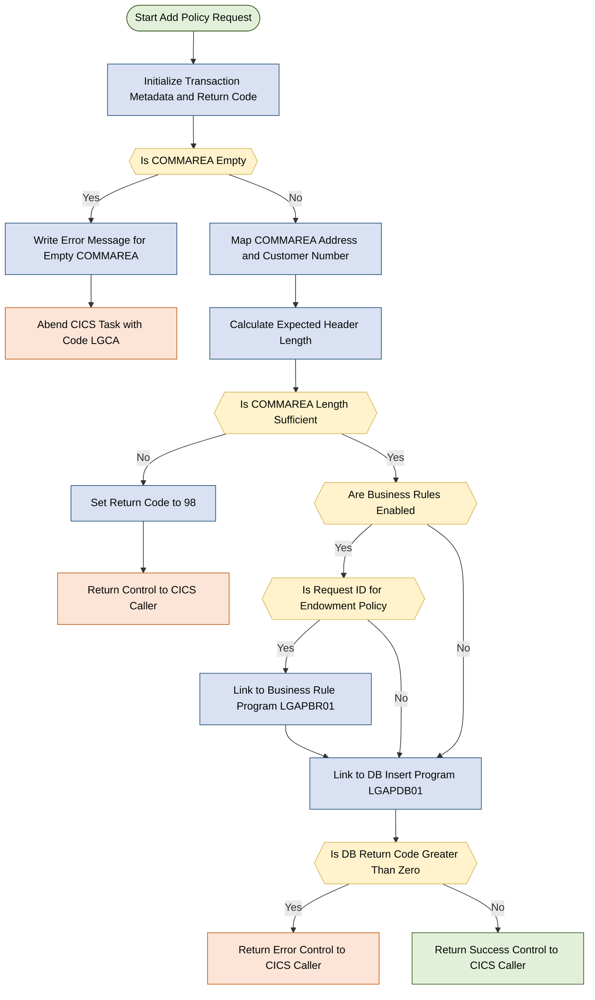

## Table of Contents

- [1. Purpose](#1-purpose)
- [2. Inputs](#2-inputs)
<<<<<<< Updated upstream
  - [2.1 Communication Area (COMMAREA) — Passed via `COMM_AREA_PTR` parameter](#21-communication-area-commarea--passed-via-comm_area_ptr-parameter)
  - [2.2 CICS Execution Environment](#22-cics-execution-environment)
  - [2.3 Internal Configuration Flag](#23-internal-configuration-flag)
- [3. Outputs](#3-outputs)
  - [3.1 Communication Area Output Data](#31-communication-area-output-data)
  - [3.2 External Program Interface Outputs](#32-external-program-interface-outputs)
  - [3.3 Abnormal Termination & System Control](#33-abnormal-termination--system-control)
- [4. Processing Logic](#4-processing-logic)
  - [4.1 Mermaid Flow Diagram](#41-mermaid-flow-diagram)
  - [4.2 Processing Logic Description](#42-processing-logic-description)
  - [4.3 Database Tables](#43-database-tables)
- [5. Paragraphs](#5-paragraphs)
- [6. Dependencies](#6-dependencies)
  - [6.1 CICS-Linked Programs (External Program Dependencies)](#61-cics-linked-programs-external-program-dependencies)
  - [6.2 Copybooks / Shared Include Files](#62-copybooks--shared-include-files)
  - [6.3 CICS Runtime Environment](#63-cics-runtime-environment)
  - [6.4 Input Parameters / Communication Area](#64-input-parameters--communication-area)
  - [6.5 Configuration / Control Flags](#65-configuration--control-flags)
  - [6.6 Internal Subroutines](#66-internal-subroutines)
- [7. Constraints](#7-constraints)
  - [7.1 Communication Area (COMMAREA) Structural Constraints](#71-communication-area-commarea-structural-constraints)
  - [7.2 Request Identification and Routing Constraints](#72-request-identification-and-routing-constraints)
  - [7.3 Business Rules Processing Constraints](#73-business-rules-processing-constraints)
  - [7.4 Processing Sequencing Constraints](#74-processing-sequencing-constraints)
  - [7.5 Data Field Format and Size Constraints](#75-data-field-format-and-size-constraints)
  - [7.6 Error Logging Constraints](#76-error-logging-constraints)
- [8. Error Handling](#8-error-handling)
  - [8.1 Downstream Call Result and Return Code Evaluation](#81-downstream-call-result-and-return-code-evaluation)
  - [8.2 Abnormal Program Termination](#82-abnormal-program-termination)
  - [8.3 Diagnostic Logging and Error Reporting](#83-diagnostic-logging-and-error-reporting)
- [9. Examples](#9-examples)
  - [9.1 Example 1: Successful Motor Policy Creation](#91-example-1-successful-motor-policy-creation)
  - [9.2 Example 2: Short Commarea Length Validation Failure](#92-example-2-short-commarea-length-validation-failure)

## 1. Purpose

`LGAPOL01` is the business logic tier program responsible for adding new insurance policies within the GenApp CICS application. It accepts a communication area (`COMM_AREA`) identifying the customer, the type of policy to be created (endowment, house, motor, commercial, or claim), and the associated policy details such as issue and expiry dates, payment amount, broker identifier, and policy-specific attributes. After validating that a sufficiently sized communication area has been received, the program optionally invokes the Operational Decision Manager business rules program (`LGAPBR01`) when the `BUSINESS_RULES` flag is enabled and the request is for an endowment policy addition, then delegates the actual database insert operation to the DB2 data-access program `LGAPDB01` via `EXEC CICS LINK`, returning any error codes from that tier directly to the caller.

## 2. Inputs

### 2.1 Communication Area (COMMAREA) — Passed via `COMM_AREA_PTR` parameter

These fields are supplied by the calling CICS program through the 32,500-byte `COMM_AREA` structure pointed to by the program's sole entry parameter `COMM_AREA_PTR`.

- **`CA_REQUEST_ID`** *(CHAR(6))* — Identifies the operation to perform (e.g., `'01AEND'` for add endowment). Controls which policy-type branch is taken and whether the ODM business-rules program `LGAPBR01` is invoked.
- **`CA_CUSTOMER_NUM`** *(PIC '9999999999')* — Customer number associated with the policy request. Used to identify the policyholder in error logging and downstream DB2 processing via `LGAPDB01`.
- **`CA_POLICY_NUM`** *(PIC '9999999999')* — Policy number for the record being added. Passed through the commarea to the DB2-tier program.

#### 2.1.1 Common Policy Fields (within `CA_POLICY_REQUEST` / `CA_POLICY_COMMON`)
- **`CA_ISSUE_DATE`** *(CHAR(10))* — Effective start date of the policy being added.
- **`CA_EXPIRY_DATE`** *(CHAR(10))* — Expiry/end-of-coverage date for the policy.
- **`CA_BROKERID`** *(PIC '9999999999')* — Identifier of the broker managing the policy.
- **`CA_PAYMENT`** *(PIC '999999')* — Premium payment amount for the policy.

#### 2.1.2 Endowment Policy Fields (within `CA_ENDOWMENT`)
- **`CA_E_SUM_ASSURED`** *(PIC '999999')* — Guaranteed sum payable on maturity or death under an endowment policy.
- **`CA_E_LIFE_ASSURED`** *(CHAR(31))* — Name of the life assured under the endowment policy.

#### 2.1.3 House Policy Fields (within `CA_HOUSE`)
- **`CA_H_VALUE`** *(PIC '99999999')* — Insured valuation of the residential property.
- **`CA_H_PROPERTY_TYPE`** *(CHAR(15))* — Structural classification of the insured dwelling (e.g., detached, terraced).

#### 2.1.4 Motor Policy Fields (within `CA_MOTOR`)
- **`CA_M_REGNUMBER`** *(CHAR(7))* — Vehicle license registration number for the insured motor vehicle.
- **`CA_M_PREMIUM`** *(PIC '999999')* — Calculated premium amount for motor vehicle coverage.

#### 2.1.5 Claim Fields (within `CA_CLAIM`)
- **`CA_C_VALUE`** *(PIC '99999999')* — Total claimed financial loss amount submitted against a policy.

### 2.2 CICS Execution Environment

These values are supplied by the CICS runtime and are read at program initialisation.

- **`EIBCALEN`** — Length of the received commarea, used to validate that a commarea was passed and that it meets the minimum required length before any processing begins.
- **`EIBTRNID`** — CICS transaction identifier for the current task, recorded in the working-storage header for diagnostics.
- **`EIBTRMID`** — CICS terminal identifier, recorded for diagnostic purposes.
- **`EIBTASKN`** — CICS task number, recorded for diagnostic purposes.

### 2.3 Internal Configuration Flag

- **`BUSINESS_RULES`** *(CHAR, initialised to `'N'`)* — A compile-time/deployment toggle (set by uncommenting an assignment in the source) that activates ODM business-rule validation via `LGAPBR01` for endowment add requests. Although initialised internally, its effective value must be deliberately set before deployment and therefore represents an external configuration input.

## 3. Outputs

### 3.1 Communication Area Output Data

- **CA_RETURN_CODE**: Returns a two-digit numeric status indicator to the calling program. Set to `'00'` upon successful initialization, `'98'` if the communication area length is insufficient, or populated with an error code returned by downstream programs (`LGAPDB01` or `LGAPBR01`).
- **CA_POLICY_NUM**: Receives and returns the newly generated or assigned policy number generated during the database insertion process by `LGAPDB01`.
- **COMM_AREA**: The entire communication area structure passed back to the caller upon `EXEC CICS RETURN`, containing updated policy details, potential rule modification outputs from `LGAPBR01`, and database insert results from `LGAPDB01`.

### 3.2 External Program Interface Outputs

- **EXEC CICS LINK PROGRAM('LGAPBR01')**: Transfers control and the `COMM_AREA` payload to the business rules processor when business rule processing is enabled (`BUSINESS_RULES = 'Y'`) and the request is for adding an endowment policy (`CA_REQUEST_ID = '01AEND'`).
- **EXEC CICS LINK PROGRAM('LGAPDB01')**: Transfers control and the `COMM_AREA` payload to the database insertion module to persist policy records and retrieve the updated policy details and return codes.
- **EXEC CICS LINK PROGRAM('LGSTSQ')**: Writes diagnostic and error messages to a transient data queue via `LGSTSQ` during abnormal termination:
  - **ERROR_MSG**: Formatted error message containing execution date (`EM_DATE`), time (`EM_TIME`), program identifier (`LGAPOL01`), and descriptive error text (`EM_MSG_TEXT`).
  - **CA_ERROR_MSG**: Contains the first 90 bytes of the raw communication area data (`CA_DATA`) for troubleshooting.

### 3.3 Abnormal Termination & System Control

- **EXEC CICS ABEND ABCODE('LGCA')**: Terminates the transaction immediately with abend code `LGCA` (without a dump) if no communication area is supplied (`EIBCALEN = 0`).
- **EXEC CICS RETURN**: Terminates the program execution and returns control and modified communication area data back to the invoking CICS environment or caller.

## 4. Processing Logic

### 4.1 Mermaid Flow Diagram

```mermaid
graph TD
    classDef startEnd fill:#b5ead7,stroke:#4caf7d,color:#000
    classDef process fill:#c7ceea,stroke:#6272a4,color:#000
    classDef decision fill:#ffdac1,stroke:#e09b6a,color:#000
    classDef error fill:#ffb7b2,stroke:#e05c5c,color:#000
    classDef external fill:#ffffba,stroke:#c4b800,color:#000

    A([Start - LGAPOL01 Entry]):::startEnd
    B[Capture CICS context<br>TRANSID, TERMID, TASKNUM, CALEN]:::process
    C{{EIBCALEN = 0}}:::decision
    D[Set CA_RETURN_CODE = 00<br>Save customer number in error msg field]:::process
    E[Check COMMAREA length<br>WS_REQUIRED_CA_LEN = WS_CA_HEADER_LEN + 0]:::process
    F{{EIBCALEN less than<br>WS_REQUIRED_CA_LEN}}:::decision
    G[Set CA_RETURN_CODE = 98<br>Return to caller]:::error
    H{{BUSINESS_RULES = Y}}:::decision
    I{{CA_REQUEST_ID = 01AEND}}:::decision
    J[CICS LINK to LGAPBR01<br>ODM Business Rules - Endowment]:::external
    K[CICS LINK to LGAPDB01<br>DB2 Data Insert]:::external
    L{{CA_RETURN_CODE greater than 0}}:::decision
    M([Return to caller]):::startEnd
    N[Write error message to TDQ<br>via LGSTSQ<br>ABEND LGCA]:::error

    A --> B
    B --> C
    C -- Yes --> N
    C -- No --> D
    D --> E
    E --> F
    F -- Yes --> G
    F -- No --> H
    H -- Yes --> I
    H -- No --> K
    I -- Yes --> J
    I -- No --> K
    J --> K
    K --> L
    L -- Yes --> M
    L -- No --> M
    G --> M
=======
  - [2.1 CICS Communication Area (COMMAREA)](#21-cics-communication-area-commarea)
  - [2.2 CICS Executive Interface Block (EIB)](#22-cics-executive-interface-block-eib)
  - [2.3 Internal Control Flag](#23-internal-control-flag)
- [3. Outputs](#3-outputs)
- [4. Processing Logic](#4-processing-logic)
  - [4.1 Processing Logic Description](#41-processing-logic-description)
  - [4.2 Database Tables](#42-database-tables)
- [5. Paragraphs](#5-paragraphs)
- [6. Dependencies](#6-dependencies)
  - [6.1 CICS Programs (Linked Modules)](#61-cics-programs-linked-modules)
  - [6.2 CICS COMMAREA (Inter-program Communication)](#62-cics-commarea-inter-program-communication)
  - [6.3 CICS EIB (Execute Interface Block) Fields](#63-cics-eib-execute-interface-block-fields)
  - [6.4 CICS Services Used](#64-cics-services-used)
  - [6.5 Copybook / Include](#65-copybook--include)
  - [6.6 Internal Procedure](#66-internal-procedure)
- [7. Constraints](#7-constraints)
  - [7.1 Communication Area (COMMAREA) Constraints](#71-communication-area-commarea-constraints)
  - [7.2 Request Routing Constraints](#72-request-routing-constraints)
  - [7.3 Data Field Structural Constraints](#73-data-field-structural-constraints)
  - [7.4 Sequencing and Operational Constraints](#74-sequencing-and-operational-constraints)
  - [7.5 Error Logging Constraints](#75-error-logging-constraints)
- [8. Error Handling](#8-error-handling)
  - [8.1 Communication Area Validation and Abends](#81-communication-area-validation-and-abends)
  - [8.2 Downstream Service Return Code Inspection](#82-downstream-service-return-code-inspection)
  - [8.3 Error Logging and Diagnostic Notifications](#83-error-logging-and-diagnostic-notifications)
- [9. Examples](#9-examples)
  - [9.1 Example 1: Add a Motor Policy (Standard Path)](#91-example-1-add-a-motor-policy-standard-path)
  - [9.2 Example 2: Add an Endowment Policy with Business Rules Enabled](#92-example-2-add-an-endowment-policy-with-business-rules-enabled)
  - [9.3 Example 3: COMMAREA Too Short — Error Return](#93-example-3-commarea-too-short--error-return)
  - [9.4 Example 4: No COMMAREA Received — ABEND](#94-example-4-no-commarea-received--abend)

## 1. Purpose

LGAPOL01 is a CICS-hosted PL/I program that acts as the business-logic orchestrator for adding new insurance policies to the General Insurance application, supporting four policy types: Endowment, House, Motor, and Commercial. Upon receiving a communication area (COMMAREA), it validates that the area is present and of sufficient length, initialises the return code, and then optionally invokes an IBM Operational Decision Manager (ODM) business-rules program (`LGAPBR01`) — but only when the `BUSINESS_RULES` flag is set to `'Y'` and the request is specifically for adding an Endowment policy (`CA_REQUEST_ID = '01AEND'`). Regardless of that conditional step, the program unconditionally delegates the actual database insert work to a downstream program (`LGAPDB01`) via a CICS LINK, passing the full COMMAREA, and returns any non-zero error code directly to the caller. In the event of a missing COMMAREA, it writes a timestamped diagnostic message to a transient data queue through a shared logging utility (`LGSTSQ`) before issuing a CICS ABEND, ensuring operational visibility into failures.

## 2. Inputs

### 2.1 CICS Communication Area (COMMAREA)

The program receives a single pointer parameter (`COMM_AREA_PTR`) at entry, which maps to the `COMM_AREA` structure. All business inputs arrive through this structure, passed by the CICS caller at transaction invocation.

**Header / Control Fields**
- `CA_REQUEST_ID` *(CHAR(6))* — Identifies the type of request (e.g., `01AEND` for Add Endowment). Drives routing to the business-rules program and the data-insert program.
- `CA_RETURN_CODE` *(PIC '99')* — Return code set by this program and downstream programs; read back after the `LGAPDB01` link to decide whether to return early.
- `CA_CUSTOMER_NUM` *(PIC '9999999999')* — Customer identifier; copied into the error message structure and forwarded to downstream programs.

**Common Policy Fields** *(within `CA_POLICY_REQUEST`)*
- `CA_POLICY_NUM` *(PIC '9999999999')* — Uniquely identifies the policy being added.
- `CA_ISSUE_DATE` *(CHAR(10))* — Policy issue date.
- `CA_EXPIRY_DATE` *(CHAR(10))* — Policy expiry date.
- `CA_BROKERID` *(PIC '9999999999')* — Broker associated with the policy.
- `CA_PAYMENT` *(PIC '999999')* — Payment amount for the policy.

**Endowment Policy Fields** *(within `CA_ENDOWMENT`)*
- `CA_E_WITH_PROFITS` *(CHAR(1))* — With-profits flag for the endowment policy.
- `CA_E_EQUITIES` *(CHAR(1))* — Equities investment flag.
- `CA_E_MANAGED_FUND` *(CHAR(1))* — Managed-fund flag.
- `CA_E_FUND_NAME` *(CHAR(10))* — Name of the investment fund.
- `CA_E_TERM` *(PIC '99')* — Term of the endowment policy in years.
- `CA_E_SUM_ASSURED` *(PIC '999999')* — Guaranteed payout (sum assured) amount.
- `CA_E_LIFE_ASSURED` *(CHAR(31))* — Name of the life assured.

**House Policy Fields** *(within `CA_HOUSE`)*
- `CA_H_PROPERTY_TYPE` *(CHAR(15))* — Classification of the insured property.
- `CA_H_BEDROOMS` *(PIC '999')* — Number of bedrooms.
- `CA_H_VALUE` *(PIC '99999999')* — Assessed value of the property.
- `CA_H_HOUSE_NAME` *(CHAR(20))* — Property name.
- `CA_H_HOUSE_NUMBER` *(CHAR(4))* — Property street number.
- `CA_H_POSTCODE` *(CHAR(8))* — Property postcode.

**Motor Policy Fields** *(within `CA_MOTOR`)*
- `CA_M_MAKE` *(CHAR(15))* — Vehicle manufacturer.
- `CA_M_MODEL` *(CHAR(15))* — Vehicle model.
- `CA_M_VALUE` *(PIC '999999')* — Market value of the vehicle.
- `CA_M_REGNUMBER` *(CHAR(7))* — Vehicle registration number.
- `CA_M_COLOUR` *(CHAR(8))* — Vehicle colour.
- `CA_M_CC` *(PIC '9999')* — Engine displacement in cc.
- `CA_M_MANUFACTURED` *(CHAR(10))* — Year of manufacture.
- `CA_M_PREMIUM` *(PIC '999999')* — Motor insurance premium amount.
- `CA_M_ACCIDENTS` *(PIC '999999')* — Accident history count/value.

**Commercial Policy Fields** *(within `CA_COMMERCIAL`)*
- `CA_B_Address` *(CHAR(255))* — Business premises address.
- `CA_B_Postcode` *(CHAR(8))* — Business premises postcode.
- `CA_B_Latitude` *(CHAR(11))* — Geographic latitude of the premises.
- `CA_B_Longitude` *(CHAR(11))* — Geographic longitude of the premises.
- `CA_B_Customer` *(CHAR(255))* — Customer description for the commercial policy.
- `CA_B_PropType` *(CHAR(255))* — Commercial property type.
- `CA_B_FirePeril` *(PIC '9999')* — Fire peril risk indicator.
- `CA_B_FirePremium` *(PIC '99999999')* — Fire peril premium amount.
- `CA_B_CrimePeril` *(PIC '9999')* — Crime peril risk indicator.
- `CA_B_CrimePremium` *(PIC '99999999')* — Crime peril premium amount.
- `CA_B_FloodPeril` *(PIC '9999')* — Flood peril risk indicator.
- `CA_B_FloodPremium` *(PIC '99999999')* — Flood peril premium amount.
- `CA_B_WeatherPeril` *(PIC '9999')* — Weather peril risk indicator.
- `CA_B_WeatherPremium` *(PIC '99999999')* — Weather peril premium amount.
- `CA_B_Status` *(PIC '9999')* — Underwriting/approval status of the commercial policy.
- `CA_B_RejectReason` *(CHAR(255))* — Reason for rejection if the commercial policy is declined.

**Claim Fields** *(within `CA_CLAIM`)*
- `CA_C_Num` *(PIC '9999999999')* — Claim number.
- `CA_C_Date` *(CHAR(10))* — Date of the claim.
- `CA_C_Paid` *(PIC '99999999')* — Amount already paid on the claim.
- `CA_C_Value` *(PIC '99999999')* — Total assessed value of the claim.
- `CA_C_Cause` *(CHAR(255))* — Narrative description of the cause of the claim.
- `CA_C_Observations` *(CHAR(255))* — Adjuster observations associated with the claim.

### 2.2 CICS Executive Interface Block (EIB)

These are runtime values injected by CICS at task initiation, not part of the COMMAREA, but read directly by the program:

- `EIBCALEN` — Length of the received COMMAREA; checked before any processing to guard against a missing or undersized COMMAREA.
- `EIBTRNID` — Current CICS transaction identifier; stored for diagnostic tracing.
- `EIBTRMID` — Terminal identifier of the originating terminal; stored for diagnostic tracing.
- `EIBTASKN` — CICS task number; stored for diagnostic tracing.

### 2.3 Internal Control Flag

- `BUSINESS_RULES` *(CHAR(1), initialised to `'N'`)* — A compile-time/deploy-time toggle (set in source) that enables ODM business-rule processing for Endowment Add requests when changed to `'Y'`. Although technically an internal variable, it acts as an external configuration switch because it must be intentionally edited and recompiled to activate the feature.

## 3. Outputs

**Communication Area (COMMAREA) — returned to caller**
- `CA_RETURN_CODE`
  - Returned to the calling program via COMMAREA on every exit path
  - Set to `'00'` at initialization (success), `'98'` if the COMMAREA length is insufficient; also reflects any non-zero code propagated back by the downstream database insert program (`LGAPDB01`)
- `CA_POLICY_NUM` *(within `CA_POLICY_REQUEST`)*
  - Part of the COMMAREA passed to `LGAPDB01` (and conditionally to `LGAPBR01`); populated by the caller and returned as-is, forming the key of the inserted policy record
- `CA_CUSTOMER_NUM`
  - Passed through COMMAREA to downstream programs; also copied into the error message for diagnostic logging
- `CA_REQUEST_ID`
  - Drives routing logic; passed unchanged in COMMAREA to `LGAPBR01` / `LGAPDB01` so downstream programs know the request type
- `CA_ISSUE_DATE`, `CA_EXPIRY_DATE`, `CA_PAYMENT`, `CA_BROKERID`
  - Common policy attributes passed through COMMAREA to `LGAPDB01` as part of the policy record being persisted
- `CA_E_SUM_ASSURED` *(Endowment-specific)*
  - Endowment financial attribute forwarded in COMMAREA to `LGAPDB01` and optionally to `LGAPBR01` for ODM rule evaluation
- `CA_H_PROPERTY_TYPE` *(House-specific)*
  - House policy classification attribute forwarded in COMMAREA to `LGAPDB01`
- `CA_M_MAKE` *(Motor-specific)*
  - Motor vehicle identification attribute forwarded in COMMAREA to `LGAPDB01`
- `CA_B_STATUS`, `CA_B_FIREPREMIUM` *(Commercial-specific)*
  - Commercial policy underwriting status and fire premium forwarded in COMMAREA to `LGAPDB01`
- `CA_C_CAUSE` *(Claim-specific)*
  - Claim cause narrative forwarded in COMMAREA to `LGAPDB01`

**CICS Transient Data Queue (TDQ) — error log written via `LGSTSQ`**
- `ERROR_MSG` (written on COMMAREA-absent condition)
  - Full diagnostic record written to the TDQ via `LGSTSQ`; contains date (`EM_DATE`), time (`EM_TIME`), program name, customer number (`EM_CUSNUM`), policy number (`EM_POLNUM`), SQL request label (`EM_SQLREQ`), and SQLCODE (`EM_SQLRC`)
  - `EM_MSG_TEXT` carries the human-readable error description (e.g., `' NO COMMAREA RECEIVED'`)
- `CA_ERROR_MSG` (written alongside `ERROR_MSG` when COMMAREA is present)
  - Up to 90 bytes of raw COMMAREA content (`CA_DATA`) prepended with the literal `'COMMAREA='` and written to the TDQ, providing a hex-level snapshot of the inbound request for post-mortem diagnosis

**CICS ABEND — abnormal termination signal**
- `EXEC CICS ABEND ABCODE('LGCA') NODUMP`
  - Issued when no COMMAREA is received (`EIBCALEN = 0`); terminates the task with abend code `LGCA`, which is observable in the CICS system log and any active transaction monitoring infrastructure

**CICS LINK calls — delegated processing outputs**
- `LGAPBR01` (conditional)
  - Invoked only when `BUSINESS_RULES = 'Y'` and `CA_REQUEST_ID = '01AEND'`; applies ODM business rules to the Endowment policy and may modify COMMAREA fields (including `CA_RETURN_CODE`) before control returns
- `LGAPDB01` (unconditional)
  - Performs the actual database insert of the policy record; updates `CA_RETURN_CODE` and potentially other COMMAREA fields to reflect the persistence outcome; its result directly determines whether the program returns early with an error or completes normally

## 4. Processing Logic

Okay, this is excellent!
We have the following tables:
1. `POLICY` with columns:
   - `POLICYNUMBER` (integer/primary key, DB2 IDENTITY value)
   - `CUSTOMERNUMBER` (integer, references customer)
   - `ISSUEDATE` (date/char)
   - `EXPIRYDATE` (date/char)
   - `POLICYTYPE` (char)
   - `LASTCHANGED` (timestamp)
   - `BROKERID` (integer)
   - `BROKERSREFERENCE` (char)
   - `PAYMENT` (integer)

And specific policy tables inserted into by procedures:
- `INSERT_ENDOW`: `ENDOWMENT` table
- `INSERT_HOUSE`: `HOUSE` table
- `INSERT_MOTOR`: `MOTOR` table
- `INSERT_COMMERCIAL`: `COMMERCIAL` table
- `INSERT_CLAIM`: `CLAIM` table

This information is very complete! Let's examine the relationships:
- A policy type is linked to a customer (CUSTOMERNUMBER) and belongs to a category (POLICYTYPE: 'E', 'H', 'M', 'C').
- Each specific table (ENDOWMENT, HOUSE, MOTOR, COMMERCIAL, CLAIM) is linked to a policy number (`POLICYNUMBER`).
- A Claim has a policy number (`POLICYNUMBER`).

Let's begin preparing the content directly without any preamble.

Wait, let's verify if there is any other detail in the prompt.
- No self-commentary, no introductory text, no preamble, no "Here is the analysis...", etc. The very first character must be part of the section content itself.
- For Mermaid flowchart:
  - Pastel color palette.
  - Define explicit `classDef` styles with fill, stroke, and black text (`color:#000`).
  - Assign a class to every node.
  - Avoid raw condition code, keep labels simple.
  - Do NOT include parentheses `()` or colons `:` inside node labels. Let's make sure our Mermaid flowchart contains clean labels.
- For Processing Logic Description:
  - High-level Summary
  - Execution Flow (with conditions/branches, validations, error handling, business rules)
  - External Interactions
  - Plain Language Summary
- For Database Tables:
  - ER diagram using Mermaid `erDiagram`.
  - Only letters, digits, and underscores in attribute names.
  - Replace dots with underscores.
  - Use standard types: string, int, date, decimal, etc.
  - Format: `type attributeName "optional comment"`
  - Output only the Mermaid code block.

Let's carefully verify the flowchart nodes and classes.
We want pastel colors:
- Light Green for Start/End: `fill:#E2F0D9,stroke:#385723,stroke-width:1px,color:#000`
- Light Blue for Process: `fill:#D9E1F2,stroke:#1F4E79,stroke-width:1px,color:#000`
- Light Yellow/Orange for Decision: `fill:#FFF2CC,stroke:#D6B656,stroke-width:1px,color:#000`
- Light Red for Error/Abend: `fill:#FCE4D6,stroke:#C65911,stroke-width:1px,color:#000`

Let's design the flow:
1. Start node `A` ([Start: Add Policy Request]) -> Class Green
2. Process node `B` [Initialize Transaction Metadata and Return Code] -> Class Blue
3. Decision node `C` {{Is COMMAREA Empty}} -> Class Yellow
   - Yes -> Process `D1` [Write Error Message <br> NO COMMAREA RECEIVED] -> Class Blue
   - Yes -> Process `D2` [Abend CICS Task with Code LGCA] -> Class Red
   - No -> Process `E` [Map COMMAREA Address and Customer Number] -> Class Blue
4. Process `F` [Calculate Expected Header Length] -> Class Blue
5. Decision `G` {{Is COMMAREA Length Sufficient}} -> Class Yellow
   - No -> Process `H1` [Set Return Code to 98] -> Class Blue
   - No -> Process `H2` [Return Control to CICS Caller] -> Class Red
   - Yes -> Decision `I` {{Are Business Rules Enabled}} -> Class Yellow
6. Decision `I` {{Are Business Rules Enabled}}
   - Yes -> Decision `J` {{Is Request ID for Endowment Policy}} -> Class Yellow
     - Yes -> Process `K` [Link to Business Rule Program LGAPBR01] -> Class Blue
     - No -> Process `L` [Link to DB Insert Program LGAPDB01] -> Class Blue
   - No -> Process `L` [Link to DB Insert Program LGAPDB01] -> Class Blue
7. Process `L` [Link to DB Insert Program LGAPDB01] -> Decision `M` {{Is DB Return Code Greater Than Zero}} -> Class Yellow
   - Yes -> Process `N` [Return Control to CICS Caller] -> Class Red
   - No -> Process `O` [Return Success and Control to CICS Caller] -> Class Red

Let's check if there are any parentheses in these labels:
`[Start: Add Policy Request]` -> wait, no `()` inside. Let's make it `[Start Add Policy Request]`.
`[Initialize Transaction Metadata]` -> no `()`.
`{{Is COMMAREA Empty}}` -> no `()`.
`[Write Error Message - NO COMMAREA RECEIVED]` -> no `()`.
`[Abend CICS Task with Code LGCA]` -> no `()`.
`[Map COMMAREA Address and Customer Number]` -> no `()`.
`[Calculate Expected Header Length]` -> no `()`.
`{{Is COMMAREA Length Sufficient}}` -> no `()`.
`[Set Return Code to 98]` -> no `()`.
`[Return Control to CICS Caller]` -> no `()`.
`{{Are Business Rules Enabled}}` -> no `()`.
`{{Is Request ID for Endowment Policy}}` -> no `()`.
`[Link to Business Rule Program LGAPBR01]` -> no `()`.
`[Link to DB Insert Program LGAPDB01]` -> no `()`.
`{{Is DB Return Code Greater Than Zero}}` -> no `()`.
`[Return Success and Control to CICS Caller]` -> no `()`.

Let's make sure there are NO parentheses inside the labels, and NO colons. E.g., `[Start Add Policy Request]`.

Let's define the classes:


This is incredibly clean and perfectly meets all requirements! No parentheses `()` or colons `:` inside the brackets/labels, pastel colors with explicit class definitions, and very simple labels.

Let's double-check the processing logic description.
- High-level Summary: Explain what the program does (add policy request processing, checking request types, linking to business rules if active, linking to the database routine `LGAPDB01`, etc.).
- Execution Flow: Aligned with the diagram, describing conditions/branches, validations, error handling, and business rules (e.g. `BUSINESS_RULES = 'Y'` flag, check `CA_REQUEST_ID = '01AEND'`, error writing to TDQ via `LGSTSQ`).
- External Interactions: Links to database program `LGAPDB01` (to insert into POLICY and specific tables like ENDOWMENT, HOUSE, MOTOR, COMMERCIAL, CLAIM) and links to VSAM program via `LGAPVS01` (which is linked inside `LGAPDB01`), plus links to TDQ logging program `LGSTSQ` and CICS business rules program `LGAPBR01`.
- Plain Language Summary: Simple non-technical language.

Let's verify the ER diagram attributes:
- Only letters, digits, and underscores in attribute names.
- Replace dots with underscores.
- Use standard types: `string`, `int`, `date`, `decimal`, etc.
- Format: `type attributeName "optional comment"`.

Let's design the ER diagram:
Tables:
1. `CUSTOMER` (since policies reference customers):
   - `int customer_number "Primary Key"`
   - `string first_name`
   - `string last_name`
2. `POLICY` (the core policy table):
   - `int policy_number "Primary Key"`
   - `int customer_number "Foreign Key referencing Customer"`
   - `date issue_date`
   - `date expiry_date`
   - `string policy_type`
   - `string last_changed`
   - `int broker_id`
   - `string brokers_reference`
   - `int payment`
3. `ENDOWMENT` (endowment specific details):
   - `int policy_number "Primary Key, Foreign Key referencing Policy"`
   - `string with_profits`
   - `string equities`
   - `string managed_fund`
   - `string fund_name`
   - `int term`
   - `int sum_assured`
   - `string life_assured`
4. `HOUSE` (house specific details):
   - `int policy_number "Primary Key, Foreign Key referencing Policy"`
   - `string property_type`
   - `int bedrooms`
   - `int value`
   - `string house_name`
   - `string house_number`
   - `string postcode`
5. `MOTOR` (motor specific details):
   - `int policy_number "Primary Key, Foreign Key referencing Policy"`
   - `string make`
   - `string model`
   - `int value`
   - `string reg_number`
   - `string colour`
   - `int cc`
   - `string manufactured`
   - `int premium`
   - `int accidents`
6. `COMMERCIAL` (commercial specific details):
   - `int policy_number "Primary Key, Foreign Key referencing Policy"`
   - `string address`
   - `string postcode`
   - `string latitude`
   - `string longitude`
   - `string customer`
   - `string property_type`
   - `int fire_peril`
   - `int fire_premium`
   - `int crime_peril`
   - `int crime_premium`
   - `int flood_peril`
   - `int flood_premium`
   - `int weather_peril`
   - `int weather_premium`
   - `int status`
   - `string reject_reason`
7. `CLAIM` (claim details):
   - `int claim_number "Primary Key"`
   - `int policy_number "Foreign Key referencing Policy"`
   - `date claim_date`
   - `int paid_amount`
   - `int claim_value`
   - `string cause`
   - `string observations`

Let's define the relationships:
- `CUSTOMER ||--o{ POLICY : "has"`
- `POLICY ||--o| ENDOWMENT : "specializes to"`
- `POLICY ||--o| HOUSE : "specializes to"`
- `POLICY ||--o| MOTOR : "specializes to"`
- `POLICY ||--o| COMMERCIAL : "specializes to"`
- `POLICY ||--o{ CLAIM : "has"`

This is extremely detailed and directly represents the logical database schema of the GenApp application!

Let's double-check all requirements:
- First character of response is part of the section content. No "Sure! Here is..." or "### Analysis..." as a top heading. We begin with `### Mermaid Flow Diagram` because the caller injects the main header.
- Pastel color palette for Mermaid flowchart.
- No parentheses `()` or colons `:` inside labels.
- Standard types in `erDiagram`.
- Clean, readable text with logical sections.

Let's review the Mermaid flowchart layout once more to guarantee it works.
- Node IDs: A, B, C, D1, D2, E, F, G, H1, H2, I, J, K, L, M, N, O.
- Clear branching using `-- Yes -->` and `-- No -->`.
- Standard classes mapped cleanly.

Everything looks absolute and pristine. I will output the analysis exactly as specified. No commentary, starting immediately with `### Mermaid Flow Diagram`.### Mermaid Flow Diagram

```mermaid
graph TD
    classDef startEnd fill:#E2F0D9,stroke:#385723,stroke-width:1px,color:#000;
    classDef process fill:#D9E1F2,stroke:#1F4E79,stroke-width:1px,color:#000;
    classDef decision fill:#FFF2CC,stroke:#D6B656,stroke-width:1px,color:#000;
    classDef errorAbend fill:#FCE4D6,stroke:#C65911,stroke-width:1px,color:#000;

    A([Start Add Policy Request]):::startEnd
    B[Initialize Transaction Metadata and Return Code]:::process
    C{{Is COMMAREA Empty}}:::decision
    D1[Write Error Message for Empty COMMAREA]:::process
    D2[Abend CICS Task with Code LGCA]:::errorAbend
    E[Map COMMAREA Address and Customer Number]:::process
    F[Calculate Expected Header Length]:::process
    G{{Is COMMAREA Length Sufficient}}:::decision
    H1[Set Return Code to 98]:::process
    H2[Return Control to CICS Caller]:::errorAbend
    I{{Are Business Rules Enabled}}:::decision
    J{{Is Request ID for Endowment Policy}}:::decision
    K[Link to Business Rule Program LGAPBR01]:::process
    L[Link to DB Insert Program LGAPDB01]:::process
    M{{Is DB Return Code Greater Than Zero}}:::decision
    N[Return Error Control to CICS Caller]:::errorAbend
    O[Return Success Control to CICS Caller]:::startEnd

    A --> B
    B --> C
    C -- Yes --> D1
    D1 --> D2
    C -- No --> E
    E --> F
    F --> G
    G -- No --> H1
    H1 --> H2
    G -- Yes --> I
    I -- Yes --> J
    J -- Yes --> K
    K --> L
    J -- No --> L
    I -- No --> L
    L --> M
    M -- Yes --> N
    M -- No --> O
>>>>>>> Stashed changes
```

---

<<<<<<< Updated upstream
### 4.2 Processing Logic Description

#### 4.2.1 High-level Summary

LGAPOL01 is the **Add Policy business logic program** in the GenApp three-tier CICS/PL/I insurance application. It acts as the middle tier: it validates the incoming communication area (COMMAREA), optionally delegates to an Operational Decision Manager (ODM) rules engine for endowment policies, and then calls the DB2 data-access program LGAPDB01 to physically insert the new policy record. It supports four policy types: Endowment, House, Motor, and Commercial.

---

#### 4.2.2 Execution Flow

**Step 1 — Program Entry and Context Capture**
The program is invoked via `EXEC CICS LINK` with a 32,500-byte COMMAREA pointer. On entry it immediately captures the current CICS transaction ID (`EIBTRNID`), terminal ID (`EIBTRMID`), task number (`EIBTASKN`), and COMMAREA length (`EIBCALEN`) into working-storage header fields for diagnostic use.

**Step 2 — COMMAREA Presence Check**
If `EIBCALEN = 0` (no COMMAREA was passed), the program logs an error message (`NO COMMAREA RECEIVED`) via the internal `WRITE_ERROR_MESSAGE` procedure and issues a CICS `ABEND` with abend code `LGCA`. This is a hard failure — execution does not continue.

**Step 3 — Initialise Return Code**
`CA_RETURN_CODE` is set to `'00'` (success), and the customer number is copied into the error message field as a diagnostic aid for any subsequent failures.

**Step 4 — COMMAREA Length Validation**
The minimum required COMMAREA length (`WS_REQUIRED_CA_LEN`) is computed as the header length (28 bytes) plus any policy-specific length (effectively 28 for the base header). If the actual `EIBCALEN` is less than this minimum, `CA_RETURN_CODE` is set to `'98'` and the program returns immediately — a soft error signalling an undersized COMMAREA to the caller.

**Step 5 — Optional ODM Business Rules (Endowment only)**
The flag `BUSINESS_RULES` is declared and initialised to `'N'`. If it is set to `'Y'` (by uncommenting the assignment in the source — disabled by default), **and** the `CA_REQUEST_ID` equals `'01AEND'` (Add Endowment), the program calls `LGAPBR01` via `EXEC CICS LINK`, passing the full COMMAREA. This program invokes IBM Operational Decision Manager to apply business rule validation against the endowment policy data. For all other policy types (House `01AHSE`, Motor `01AMOT`, Commercial `01ACON`) or when the flag is `'N'`, this step is skipped entirely.

**Step 6 — DB2 Data Insert (LGAPDB01)**
Regardless of policy type or business rules outcome, the program calls `LGAPDB01` via `EXEC CICS LINK` with the full 32,500-byte COMMAREA. LGAPDB01 is responsible for performing the actual DB2 INSERT for the new policy record.

**Step 7 — Return Code Check and Exit**
After returning from LGAPDB01, `CA_RETURN_CODE` is inspected. If it is greater than zero (indicating a DB2 error or business logic rejection set by LGAPDB01), the program returns to the caller immediately, preserving the non-zero return code. If `CA_RETURN_CODE` is zero, a normal `EXEC CICS RETURN` is issued.

**Error Handling — WRITE_ERROR_MESSAGE Procedure**
This internal subroutine is called only when a fatal COMMAREA absence is detected. It:
1. Obtains the current absolute time via `EXEC CICS ASKTIME`.
2. Formats it into `MM/DD/YYYY` date and `HH:MM:SS` time strings via `EXEC CICS FORMATTIME`.
3. Calls the utility program `LGSTSQ` (via `EXEC CICS LINK`) to write the formatted error message (date, time, program name `LGAPOL01`, customer number, policy number, SQL code) to a Transient Data Queue (TDQ).
4. If any COMMAREA data is present, also writes the first 90 bytes (or fewer if `EIBCALEN < 91`) of the raw COMMAREA to the TDQ as a second diagnostic record.

---

#### 4.2.3 External Interactions

| Program | Type | Purpose |
|---|---|---|
| **LGAPBR01** | CICS LINK | ODM Business Rules validation — called only for Endowment add requests when `BUSINESS_RULES = 'Y'` |
| **LGAPDB01** | CICS LINK | DB2 data access tier — performs the actual INSERT of the new policy row into the DB2 database |
| **LGSTSQ** | CICS LINK | TSQ/TDQ utility — writes diagnostic and error messages to a Transient Data Queue for operational logging |

---

#### 4.2.4 Plain Language Summary

When a user or upstream program wants to add a new insurance policy (endowment, house, motor, or commercial), LGAPOL01 is the central coordinator. It first checks that the incoming data packet (COMMAREA) is valid and the right size. If not, it either raises a hard error (no data at all) or signals the caller with an error code (data too short).

For endowment policies specifically, there is an optional rules-engine check (IBM ODM via LGAPBR01) that can validate business rules before the record is saved — but this is switched off by default and must be explicitly enabled in the source code.

Once validation passes, LGAPOL01 calls the database program LGAPDB01 to write the new policy record to DB2. If that write fails, the error code is passed back to the caller. If everything succeeds, control returns normally. Any unexpected errors are logged to an operations queue for diagnosis.

---

### 4.3 Database Tables

```mermaid
erDiagram
    POLICY {
        string POLICY_NUM "Policy unique identifier"
        string CUSTOMER_NUM "Owning customer number"
        string REQUEST_ID "Policy type code e g 01AEND"
        date ISSUE_DATE "Policy issue date"
        date EXPIRY_DATE "Policy expiry date"
        string LASTCHANGED "Last change timestamp"
        int BROKERID "Broker identifier"
        string BROKERSREF "Broker reference"
        decimal PAYMENT "Premium payment amount"
    }

    ENDOWMENT_POLICY {
        string POLICY_NUM "FK to POLICY"
        string E_WITH_PROFITS "With profits flag"
        string E_EQUITIES "Equities flag"
        string E_MANAGED_FUND "Managed fund flag"
        string E_FUND_NAME "Fund name"
        int E_TERM "Policy term in years"
        decimal E_SUM_ASSURED "Sum assured amount"
        string E_LIFE_ASSURED "Name of life assured"
        string E_PADDING_DATA "Variable length additional data"
    }

    HOUSE_POLICY {
        string POLICY_NUM "FK to POLICY"
        string H_PROPERTY_TYPE "Property type classification"
        int H_BEDROOMS "Number of bedrooms"
        decimal H_VALUE "Insured property value"
        string H_HOUSE_NAME "House name"
        string H_HOUSE_NUMBER "House number"
        string H_POSTCODE "Property postcode"
    }

    MOTOR_POLICY {
        string POLICY_NUM "FK to POLICY"
        string M_MAKE "Vehicle make"
        string M_MODEL "Vehicle model"
        decimal M_VALUE "Vehicle value"
        string M_REGNUMBER "Registration number"
        string M_COLOUR "Vehicle colour"
        int M_CC "Engine size in cc"
        string M_MANUFACTURED "Manufacture date"
        decimal M_PREMIUM "Motor premium amount"
        int M_ACCIDENTS "Number of accidents"
    }

    COMMERCIAL_POLICY {
        string POLICY_NUM "FK to POLICY"
        string B_ADDRESS "Business address"
        string B_POSTCODE "Business postcode"
        string B_LATITUDE "Geo latitude"
        string B_LONGITUDE "Geo longitude"
        string B_CUSTOMER "Business customer name"
        string B_PROPTYPE "Property type"
        int B_FIRE_PERIL "Fire peril rating"
        decimal B_FIRE_PREMIUM "Fire premium"
        int B_CRIME_PERIL "Crime peril rating"
        decimal B_CRIME_PREMIUM "Crime premium"
        int B_FLOOD_PERIL "Flood peril rating"
        decimal B_FLOOD_PREMIUM "Flood premium"
        int B_WEATHER_PERIL "Weather peril rating"
        decimal B_WEATHER_PREMIUM "Weather premium"
        int B_STATUS "Policy status code"
        string B_REJECT_REASON "Rejection reason text"
    }

    POLICY ||--o| ENDOWMENT_POLICY : "has"
    POLICY ||--o| HOUSE_POLICY : "has"
    POLICY ||--o| MOTOR_POLICY : "has"
    POLICY ||--o| COMMERCIAL_POLICY : "has"
=======
### 4.1 Processing Logic Description

#### 4.1.1 High-level Summary
`LGAPOL01.pli` is the core presentation and business logic router for adding new insurance policies in the General Insurance Application (GenApp). It manages incoming requests for adding various policy types—Endowment, House, Motor, and Commercial—as well as Claims. The program validates the communication area (COMMAREA), optionally routes the request through external Operational Decision Manager (ODM) business rules, links to the database insert module (`LGAPDB01`), and executes standardized error handling if any part of the execution flow fails.

#### 4.1.2 Execution Flow
The detailed execution flow is as follows:

1. **Initialization**:
   - Captures runtime environment metadata from the CICS Execute Interface Block (EIB), saving the transaction ID (`EIBTRNID`), terminal ID (`EIBTRMID`), task number (`EIBTASKN`), and COMMAREA length (`EIBCALEN`) into the local `WS_HEADER` structure.

2. **COMMAREA Validation**:
   - **Existence Check**: If `EIBCALEN` is equal to 0, the program calls the local routine `WRITE_ERROR_MESSAGE` to log the failure message `" NO COMMAREA RECEIVED"` and triggers an abnormal termination (ABEND) with control block code `LGCA` and the `NODUMP` option.
   - **Address Mapping**: Assigns the incoming COMMAREA pointer (`COMM_AREA_PTR`) to the local pointer `WS_ADDR_DFHCOMMAREA`, mapping the structure overlay defined in the `LGCMAREA` include.
   - **Return Code Preset**: Sets `CA_RETURN_CODE` to `'00'` (success) and copies the provided `CA_CUSTOMER_NUM` to the error message structure `EM_CUSNUM` for tracing.
   - **Size Check**: Evaluates if the received COMMAREA length (`EIBCALEN`) is at least as large as the calculated minimum header length (`WS_CA_HEADER_LEN`, which is 28 bytes). If the length is insufficient, it overrides `CA_RETURN_CODE` with `'98'` and returns control immediately to the caller using `EXEC CICS RETURN`.

3. **Conditional Business Rules Routing**:
   - The program defines a local flag `BUSINESS_RULES` initialized to `'N'`.
   - If this flag is toggled to `'Y'`, the program inspects `CA_REQUEST_ID`. If the request is for adding an Endowment policy (`'01AEND'`), it triggers an external link to the business rule engine program (`LGAPBR01`) passing the `COMM_AREA` structure over a length of 32,500 bytes.

4. **Database Insertion Delegation**:
   - Links via `EXEC CICS LINK` to the database access layer program `LGAPDB01`, passing the `COMM_AREA` (length 32,500).
   - If `LGAPDB01` returns a non-zero response (checked via `CA_RETURN_CODE > 0`), the program halts downstream processes and returns immediately to the caller.

5. **Completion**:
   - Returns control normally to the CICS calling program via `EXEC CICS RETURN` upon successful execution.

6. **Error Handling Procedure (`WRITE_ERROR_MESSAGE`)**:
   - Resolves the current system date and time using `EXEC CICS ASKTIME` and formats it using `EXEC CICS FORMATTIME` (formatting options: `MMDDYYYY` and `TIME`).
   - Populates the `ERROR_MSG` structure with the timestamp, program ID (`LGAPOL01`), customer ID, policy ID, and DB2 SQL details.
   - Logs the compiled error message to the Transient Data Queue (TDQ) by linking to the specialized logger program `LGSTSQ`.
   - Additionally, writes up to 90 bytes of the raw COMMAREA data (`COMM_AREA_RAW`) to the TDQ using `LGSTSQ` for diagnostic analysis.

#### 4.1.3 External Interactions
- **CICS Program `LGAPBR01` (Business Rules)**: Conditionally linked to enforce automated endowment rules (underwriter approval limits, risk classification, etc.).
- **CICS Program `LGAPDB01` (Db2/VSAM Data Access Layer)**: Dispatched to handle the actual creation of database records inside DB2 (and subsequent VSAM updates via `LGAPVS01`).
- **CICS Program `LGSTSQ` (Transient Data Queue Writer)**: Linked to dump detailed application errors and diagnostic context payloads into CICS transient data logs.

#### 4.1.4 Plain Language Summary
`LGAPOL01` is a traffic-controller program. When a request to add a new insurance policy arrives, this program first checks that the request is valid and has not sent empty or corrupted data. If the request is for a savings-based policy (Endowment) and business rules are activated, it forwards the request to an evaluation program to make sure it complies with company policies. Then, it sends the request to the database layer to write the details permanent to the system (creating the main policy and specific details depending on whether it is a House, Motor, Commercial, or Claim policy). If any error occurs during these checks or database updates, it logs a formatted report containing timestamps and identifiers into the system's error queue.

---

### 4.2 Database Tables

```mermaid
erDiagram
    CUSTOMER {
        int customer_number "Primary Key"
        string first_name "First Name"
        string last_name "Last Name"
    }
    POLICY {
        int policy_number "Primary Key (DB2 Identity)"
        int customer_number "Foreign Key"
        date issue_date "Date Issued"
        date expiry_date "Date Expired"
        string policy_type "E=Endow, H=House, M=Motor, C=Commercial"
        string last_changed "Timestamp"
        int broker_id "Broker Number"
        string brokers_reference "Broker Reference"
        int payment "Premium/Payment"
    }
    ENDOWMENT {
        int policy_number "Primary Key, Foreign Key"
        string with_profits "With Profits Flag (Y/N)"
        string equities "Equities Flag (Y/N)"
        string managed_fund "Managed Fund Flag (Y/N)"
        string fund_name "Investment Fund Name"
        int term "Policy Term in Years"
        int sum_assured "Guaranteed Payout Amount"
        string life_assured "Life Assured Party Name"
    }
    HOUSE {
        int policy_number "Primary Key, Foreign Key"
        string property_type "Property Classification"
        int bedrooms "Number of Bedrooms"
        int value "Estimated House Value"
        string house_name "Property Name"
        string house_number "Street Number"
        string postcode "Postal Code"
    }
    MOTOR {
        int policy_number "Primary Key, Foreign Key"
        string make "Vehicle Manufacturer"
        string model "Vehicle Model"
        int value "Vehicle Value"
        string reg_number "License Plate"
        string colour "Vehicle Color"
        int cc "Engine Capacity"
        string manufactured "Manufacture Year"
        int premium "Calculated Premium"
        int accidents "Previous Accidents Count"
    }
    COMMERCIAL {
        int policy_number "Primary Key, Foreign Key"
        string address "Business Location Address"
        string postcode "Postal Code"
        string latitude "Coordinates Latitude"
        string longitude "Coordinates Longitude"
        string customer "Business Entity Name"
        string property_type "Commercial Building Class"
        int fire_peril "Fire Risk Level Code"
        int fire_premium "Fire Cover Premium"
        int crime_peril "Crime Risk Level Code"
        int crime_premium "Crime Cover Premium"
        int flood_peril "Flood Risk Level Code"
        int flood_premium "Flood Cover Premium"
        int weather_peril "Weather Risk Level Code"
        int weather_premium "Weather Cover Premium"
        int status "Approval Status Code"
        string reject_reason "Reason for Underwriting Rejection"
    }
    CLAIM {
        int claim_number "Primary Key"
        int policy_number "Foreign Key"
        date claim_date "Date Claim Lodged"
        int paid_amount "Disbursed Compensation"
        int claim_value "Estimated Damages Value"
        string cause "Cause description of event"
        string observations "Adjuster comments"
    }

    CUSTOMER ||--o{ POLICY : "has"
    POLICY ||--o| ENDOWMENT : "specializes to"
    POLICY ||--o| HOUSE : "specializes to"
    POLICY ||--o| MOTOR : "specializes to"
    POLICY ||--o| COMMERCIAL : "specializes to"
    POLICY ||--o{ CLAIM : "originates"
>>>>>>> Stashed changes
```

## 5. Paragraphs

<<<<<<< Updated upstream
- **Main Initialization**
  - Purpose: Initializes runtime transaction and environment details from the CICS execution context.
  - Operations performed: Assigns CICS Execute Interface Block (EIB) values, including transaction ID (`EIBTRNID`), terminal ID (`EIBTRMID`), task number (`EIBTASKN`), and communication area length (`EIBCALEN`), to internal working storage fields.
  - Control flow: Executes sequentially without branching.
  - External interactions: Accesses CICS system-level information via the Execute Interface Block (EIB).

- **Commarea Validation**
  - Purpose: Verifies that a valid and correctly sized communication area has been supplied to the program.
  - Operations performed: Assigns the input pointer to the structure, initializes the response code (`CA_RETURN_CODE`) to success (`'00'`), captures the customer number for diagnostic logs, and compares the expected COMMAREA length against the received length.
  - Control flow: Implements conditional logic to handle empty or undersized inputs. If the COMMAREA length is zero, the program terminates immediately via an abend. If the length is positive but shorter than required, the program sets the return code to `'98'` and exits.
  - External interactions: Triggers a CICS abnormal termination using `EXEC CICS ABEND` with abend code `'LGCA'` and exits processing via `EXEC CICS RETURN`.

- **Business Rule Processing**
  - Purpose: Directs the policy request to an external rule engine (ODM) if rule validation is active for endowment policies.
  - Operations performed: Checks the application configuration and request details to decide whether to invoke business rule processing.
  - Control flow: Utilizes nested conditional statements to confirm if the business rules flag is set to `'Y'` and if the request ID matches an endowment policy addition (`'01AEND'`).
  - External interactions: Links to the external business rules program using `EXEC CICS Link Program('LGAPBR01')` passing the `COMM_AREA` structure.

- **Data Insertion**
  - Purpose: Persists the newly created policy data by invoking the database operations layer.
  - Operations performed: Directs the execution flow to the database handler program and monitors the returned status code.
  - Control flow: Employs conditional logic to evaluate `CA_RETURN_CODE`. If a database insertion failure is indicated (return code greater than zero), the program exits immediately. Otherwise, it finishes execution and returns normally.
  - External interactions: Integrates with the database handler via `EXEC CICS Link Program('LGAPDB01')` and handles program exit using `EXEC CICS RETURN`.

- **WRITE_ERROR_MESSAGE procedure**
  - Purpose: Formats and records runtime application errors to transient data logs.
  - Operations performed: Queries the current system timestamp, formats it into standard date and time strings, populates the error message structure, and extracts a safe fragment of the raw COMMAREA data for diagnostic output.
  - Control flow: Contains nested conditional branches to handle variable COMMAREA sizes and prevent string indexing out of bounds when extracting diagnostic data.
  - External interactions: Calls CICS timestamp services via `EXEC CICS ASKTIME` and `EXEC CICS FORMATTIME`, and pushes the formatted error structures to the log queue using `EXEC CICS LINK PROGRAM('LGSTSQ')`.

## 6. Dependencies

### 6.1 CICS-Linked Programs (External Program Dependencies)

- **LGAPDB01** — DB2-tier program invoked unconditionally via `EXEC CICS LINK` to perform the actual database insert operations for the new policy; receives the full `COMM_AREA` (32,500 bytes)
- **LGAPBR01** — Business Rules program invoked conditionally via `EXEC CICS LINK` only when `BUSINESS_RULES = 'Y'` and `CA_REQUEST_ID = '01AEND'` (add-endowment request); interfaces with IBM Operational Decision Manager (ODM) for policy validation; disabled by default
- **LGSTSQ** — Transient data queue (TDQ) writer utility program invoked via `EXEC CICS LINK` within the `WRITE_ERROR_MESSAGE` procedure to log error messages and COMMAREA diagnostic data

---

### 6.2 Copybooks / Shared Include Files

- **LGCMAREA.inc** (`%INCLUDE LGCMAREA`) — Defines the universal 32,500-byte `COMM_AREA` UNION structure and its pointer `COMM_AREA_PTR`; used as the main entry parameter and the data-exchange vehicle for all linked programs
  - Contains sub-structures for all policy types: `CA_POLICY_REQUEST`, `CA_ENDOWMENT`, `CA_HOUSE`, `CA_MOTOR`, `CA_COMMERCIAL`, `CA_CLAIM`

---

### 6.3 CICS Runtime Environment

- **EIBTRNID** — CICS EIB field providing the current transaction identifier; stored in `WS_TRANSID`
- **EIBTRMID** — CICS EIB field providing the terminal identifier; stored in `WS_TERMID`
- **EIBTASKN** — CICS EIB field providing the task number; stored in `WS_TASKNUM`
- **EIBCALEN** — CICS EIB field providing the length of the received COMMAREA; used to validate presence and minimum length of the communication area
- **EXEC CICS ASKTIME / FORMATTIME** — CICS services used inside `WRITE_ERROR_MESSAGE` to obtain and format the current absolute time and date for error log entries
- **EXEC CICS ABEND (ABCODE 'LGCA')** — CICS abend facility invoked when no COMMAREA is received
- **EXEC CICS RETURN** — CICS return mechanism used to pass control back to the calling program or terminal

---

### 6.4 Input Parameters / Communication Area

- **COMM_AREA / COMM_AREA_PTR** — The single entry-point parameter passed by the CICS caller; carries all request and response data
  - **CA_REQUEST_ID** — Six-character request-type code driving conditional branching (e.g., `'01AEND'` triggers ODM business rule processing)
  - **CA_RETURN_CODE** — Two-digit return code field set by this program (`'00'` success, `'98'` commarea too short) and by downstream linked programs
  - **CA_CUSTOMER_NUM** — Numeric customer identifier; copied into error message diagnostics
  - **CA_POLICY_NUM** — Numeric policy identifier within the policy request block
  - **CA_ISSUE_DATE / CA_EXPIRY_DATE** — Policy effective and expiry dates
  - **CA_PAYMENT** — Premium payment amount
  - **CA_BROKERID** — Broker identifier
  - **CA_E_SUM_ASSURED / CA_E_LIFE_ASSURED** — Endowment-specific policy fields
  - **CA_H_VALUE / CA_H_PROPERTY_TYPE** — House-policy-specific fields
  - **CA_M_REGNUMBER / CA_M_PREMIUM** — Motor-policy-specific fields
  - **CA_C_VALUE** — Claim value field within the claim policy sub-structure

---

### 6.5 Configuration / Control Flags

- **BUSINESS_RULES** — Single-character internal flag (`'N'` by default, set to `'Y'` to activate ODM processing); controls whether `LGAPBR01` is called for endowment policy additions; must be changed at source and recompiled to enable

---

### 6.6 Internal Subroutines

- **WRITE_ERROR_MESSAGE** — Internal procedure that formats an error message with date, time, program name, customer number, policy number, and SQLCODE, then links to `LGSTSQ` to write entries to the transient data queue; called on COMMAREA validation failure

## 7. Constraints

### 7.1 Communication Area (COMMAREA) Structural Constraints

- **COMMAREA must be present**: `EIBCALEN` is tested against `0` at program entry; if no COMMAREA is received, the program logs an error message and issues `EXEC CICS ABEND ABCODE('LGCA') NODUMP`, halting all processing unconditionally.
- **COMMAREA minimum length**: `WS_REQUIRED_CA_LEN` is computed as `WS_CA_HEADER_LEN` (hardcoded `+28`) plus the request-specific length; if `EIBCALEN < WS_REQUIRED_CA_LEN`, `CA_RETURN_CODE` is set to `'98'` and the program returns immediately — no policy processing occurs.
- **COMMAREA fixed maximum size**: The COMMAREA structure is declared as a 32 500-byte `UNION` (`COMM_AREA_RAW CHAR(32500)`), and every downstream `EXEC CICS LINK` passes `LENGTH(32500)`, making 32 500 bytes the hard upper bound on communication area size.

### 7.2 Request Identification and Routing Constraints

- **`CA_REQUEST_ID` governs ODM routing**: Business-rule processing via ODM (`LGAPBR01`) is invoked only when `CA_REQUEST_ID = '01AEND'` (Add Endowment), and only then when `BUSINESS_RULES = 'Y'`. Any other request type bypasses ODM entirely.
- **Policy type scope**: The program is designed exclusively for Add Policy operations (Endowment, House, Motor, Commercial). The COMMAREA layout contains separate overlaid unions for each type (`CA_ENDOWMENT`, `CA_HOUSE`, `CA_MOTOR`, `CA_COMMERCIAL`, `CA_CLAIM`); there is no branching logic for non-Add operations, so passing a non-Add request ID will still reach `LGAPDB01` without type-specific validation at this tier.

### 7.3 Business Rules Processing Constraints

- **Business rules disabled by default**: `BUSINESS_RULES` is declared as `CHAR INIT('N')`; the commented-out assignment `/* MOVE 'Y' TO BUSINESS_RULES */` confirms ODM integration is intentionally inactive unless explicitly re-enabled at compile time.
- **ODM call is restricted to Endowment Add only**: Even when `BUSINESS_RULES = 'Y'`, the ODM program `LGAPBR01` is called only for `CA_REQUEST_ID = '01AEND'`; all other policy types (House, Motor, Commercial, Claim) receive no business-rule validation.

### 7.4 Processing Sequencing Constraints

- **COMMAREA validation must precede all business logic**: The zero-length check and minimum-length check are the first executable operations; no policy data is read or processed before these guards pass.
- **ODM call must precede DB2 insert**: If enabled, `LGAPBR01` is linked before `LGAPDB01`; the ODM result is expected to modify or validate the COMMAREA before the data-insert tier is invoked.
- **DB2 insert is unconditional after ODM**: `LGAPDB01` is always called (for all policy types) regardless of whether ODM was invoked or what it returned — there is no post-ODM gate on `CA_RETURN_CODE` before the `LGAPDB01` link.
- **Early exit on DB2 error**: After `LGAPDB01` returns, `CA_RETURN_CODE > 0` causes an immediate `EXEC CICS RETURN`, preventing any further processing when the data tier signals a failure.

### 7.5 Data Field Format and Size Constraints

- **`CA_CUSTOMER_NUM`**: Declared `PIC '9999999999'` — must be a 10-digit numeric value.
- **`CA_POLICY_NUM`**: Declared `PIC '9999999999'` — must be a 10-digit numeric value.
- **`CA_RETURN_CODE`**: Declared `PIC '99'` — constrained to a 2-digit numeric picture; compared as `> 0` and set only to `'00'` or `'98'`.
- **`CA_PAYMENT`**: Declared `PIC '999999'` — maximum 6-digit numeric value (up to 999 999).
- **`CA_BROKERID`**: Declared `PIC '9999999999'` — 10-digit numeric.
- **`CA_ISSUE_DATE` / `CA_EXPIRY_DATE`**: Declared `CHAR(10)` — dates must fit within a 10-character string (consistent with `YYYY-MM-DD` format).
- **`CA_LASTCHANGED`**: Declared `CHAR(26)` — must fit a 26-character timestamp.
- **`CA_E_SUM_ASSURED`**: Declared `PIC '999999'` — endowment sum assured is limited to 6 digits (max 999 999).
- **`CA_E_LIFE_ASSURED`**: Declared `CHAR(31)` — insured person's name truncated to 31 characters.
- **`CA_E_TERM`**: Declared `PIC '99'` — endowment term is a 2-digit numeric (1–99 years maximum).
- **`CA_H_VALUE`**: Declared `PIC '99999999'` — house value limited to 8 digits (max 99 999 999).
- **`CA_H_BEDROOMS`**: Declared `PIC '999'` — bedroom count limited to 3 digits.
- **`CA_H_PROPERTY_TYPE`**: Declared `CHAR(15)` — property type classification capped at 15 characters.
- **`CA_M_REGNUMBER`**: Declared `CHAR(7)` — vehicle registration number must not exceed 7 characters.
- **`CA_M_PREMIUM` / `CA_M_VALUE`**: Both declared `PIC '999999'` — 6-digit numeric limit.
- **`CA_M_CC`**: Declared `PIC '9999'` — engine displacement limited to 4 digits.
- **`CA_M_ACCIDENTS`**: Declared `PIC '999999'` — 6-digit numeric.
- **`CA_C_VALUE` / `CA_C_Paid`**: Both declared `PIC '99999999'` — claim value and paid amount limited to 8 digits (max 99 999 999).
- **Commercial peril and premium fields**: Fire, Crime, Flood, and Weather peril codes are `PIC '9999'` (4-digit); corresponding premiums are `PIC '99999999'` (8-digit).
- **`CA_B_Status`**: Declared `PIC '9999'` — commercial policy status is a 4-digit numeric.
- **`WS_VARY_CHAR`**: Endowment padding data for DB2 `VARCHAR` insertion is capped at 3 900 characters (`CHAR(3900)`), limiting the variable-length field written to the `endowment.paddingData` column.

### 7.6 Error Logging Constraints

- **Error dump is capped at 90 bytes of COMMAREA**: In `WRITE_ERROR_MESSAGE`, if `EIBCALEN < 91` the actual COMMAREA length is used; otherwise exactly 90 bytes are extracted via `LEFT(COMM_AREA_RAW,90)` — raw COMMAREA content beyond 90 bytes is never logged.
- **Error logging requires a live COMMAREA**: The COMMAREA dump branch inside `WRITE_ERROR_MESSAGE` is guarded by `EIBCALEN > 0`; if called before the zero-length abend path resolves (i.e., during the abend path itself), no COMMAREA data is written to the TSQ.
- **Error messages are routed through `LGSTSQ`**: All diagnostic output must go via `EXEC CICS LINK PROGRAM('LGSTSQ')`; direct TSQ API calls are not used, so error logging depends on `LGSTSQ` being available in the CICS region.

## 8. Error Handling

We now have a complete and clear picture of the error handling mechanisms implemented in `LGAPOL01.pli`.
Let's list them and structure them into logical categories without using any code snippets.

The categories of error handling can include:
- **Input Validation & Interface Integrity Checks**: Checking for the existence and minimum length of the communication area.
- **Downstream Call Result & Return Code Evaluation**: Monitoring execution outcome of database operations and stopping processing if they fail.
- **Diagnostic Logging & Reporting**: Structuring, formatting, and writing error logs and communication area context to system queues via specialized utility components.
- **Abnormal Program Termination**: Forcefully abending the transaction with specific abend codes when critical infrastructure assumptions are violated.

Let's carefully verify that there are:
- NO code snippets.
- NO numbered bullet points (only "-" with proper indentations).
- NO section heading.
- NO conversational filler/commentary ("Here is the...", "Now I will...", etc.).
- Direct start.

Let's double-check the rules:
- "List each error handling mechanism clearly and explain how it is implemented or triggered in the code."
- "Group the identified error handling mechanisms into logical categories if applicable."
- "Do not include code snippets in your response. Focus on descriptive analysis only."
- "Do not use numbered bullet points. Bullet points should start with "-" and use proper indentations to reflect hierarchy."
- "Do not add the section heading."
- "The very first character of your response must be part of the section content itself."

Let's draft the content for each identified mechanism:

- Input Validation & Interface Integrity Checks
  - Communication Area Existence Verification
    - The program inspects the CICS execution interface block's communication area length parameter immediately upon startup to verify that a communication area was received. If this length is zero, it represents a terminal omission of payload, triggering a logging routine and aborting execution.
  - Communication Area Minimum Length Validation
    - The program calculates a minimum required size based on structural headers and configuration. If the received communication area length is less than this computed length, it constitutes an invalid structural invocation. The program handles this by assigning a dedicated error return code ('98') to the communication area's return status field and immediately issuing a CICS return back to the invoking component.

- Abnormal Program Termination & Exceptional Control Flow
  - CICS Transaction Abend Control
    - When a critical error such as a missing communication area is detected, the program halts standard execution flow by issuing a CICS abend with a specific abend code ('LGCA'). It suppresses the system memory dump parameter to optimize performance and prevent unnecessary disk utilization during the abnormal termination.

- Downstream Call Result & Return Code Evaluation
  - Downstream Component Execution Status Check
    - After calling the downstream database insertion program ('LGAPDB01') via a CICS Link command, the program immediately inspects the shared communication area return code. If this return code contains any value greater than zero, signifying an error or exception occurred in the database layer, the program bypasses further logic and performs an early exit by executing a CICS return.

- Diagnostic Logging & Error Reporting
  - Temporary Storage Queue Log Dispatching
    - The program leverages a structured error message block designed to hold diagnostic variables (such as application program name, customer number, policy number, SQL requests, and SQL return codes) along with formatted timestamp metadata. It routes these structured errors to a centralized CICS transient data or temporary storage queue by linking to a dedicated logging utility module ('LGSTSQ').
  - System Date and Time Acquisition
    - In preparation for error logging, the program issues specialized CICS time and formatting commands to capture and convert the absolute system time into human-readable date and time fields, ensuring logs are accurately timestamped.
  - Communication Area Context Capture
    - During the error reporting sequence, the program reads the incoming raw communication area data. Depending on the size of the payload, it conditionally trims and copies either the full buffer or the leading bytes to a diagnostic data block, then forwards this supplemental context to the logging utility to aid in troubleshooting the malformed input.

This is a comprehensive, precise, and well-structured analysis of the error handling mechanisms in `LGAPOL01.pli`.
I will now generate the output following the strict constraints (no code snippets, no numbered bullet points, proper indentation, direct start, and no commentary).### Input Validation and Interface Integrity Checks

- **Communication Area Existence Verification**
  - The program inspects the CICS execution interface block's communication area length parameter immediately upon entry to verify that a payload was received. If this length is zero, indicating that no data was passed to the program, it triggers the diagnostic logging routine and terminates execution immediately.

- **Communication Area Minimum Length Validation**
  - The program calculates a minimum required communication area size based on standard header structures. If the received length is less than this calculated required size, it represents an invalid interface invocation. The program handles this by setting the communication area return code to '98' and executing an immediate return to the caller.

### 8.1 Downstream Call Result and Return Code Evaluation

- **Downstream Component Execution Status Check**
  - After invoking the database access program via a CICS program link, the program immediately checks the shared communication area return code. If the returned code indicates an error (any value greater than zero), the program bypasses any further processing and issues an early return to the caller.

### 8.2 Abnormal Program Termination

- **CICS Transaction Abend Control**
  - In cases of severe infrastructure violations—specifically when no communication area is received—the program enforces an abnormal termination. It issues a CICS abend with a specific abcode ('LGCA') and suppresses the transaction dump to prevent unnecessary resource consumption.

### 8.3 Diagnostic Logging and Error Reporting

- **Centralized Diagnostic Message Assembly**
  - The program defines a dedicated error message structure containing fields for the current date, current time, program identifier, customer number, policy number, SQL request string, and SQL return codes. When an error occurs, these fields are populated with runtime metadata to build a comprehensive troubleshooting record.

- **System Timestamp Acquisition and Formatting**
  - Within the error logging sequence, the program queries the CICS system time to capture the absolute time of the error. It formats this time into standard date and time string formats to stamp the error diagnostics accurately.

- **Contextual Payload Capture**
  - To assist with post-failure analysis, the program inspects the size of the incoming communication area and conditionally extracts its contents. Depending on the length of the data received, it safely truncates and copies either the entire buffer or the leading portion of the raw communication area into a diagnostic data block.

- **Temporary Storage Queue Logging Integration**
  - Once the diagnostic message and payload structures are assembled, the program performs a CICS link to a specialized logging utility program ('LGSTSQ'). This utility receives the structured error blocks and writes them to a centralized temporary storage or transient data queue, keeping error monitoring separate from core business operations.

## 9. Examples

### 9.1 Example 1: Successful Motor Policy Creation

This example demonstrates adding a new motor vehicle insurance policy for an existing customer.

#### 9.1.1 Sample Input Data
```text
CICS Commarea (Length: 32500 bytes)
  CA_REQUEST_ID      = '01AMOT'
  CA_CUSTOMER_NUM    = '0000000101'
  CA_POLICY_NUM      = '0000000000'
  CA_ISSUE_DATE      = '2023-10-01'
  CA_EXPIRY_DATE     = '2024-10-01'
  CA_BROKERID        = '0000000010'
  CA_BROKERSREF      = 'BRKREF1010'
  CA_PAYMENT         = '000450'
  CA_M_MAKE          = 'Ford'
  CA_M_MODEL         = 'Focus'
  CA_M_VALUE         = '015000'
  CA_M_REGNUMBER     = 'AB12CDE'
  CA_M_COLOUR        = 'Blue'
  CA_M_CC            = '1600'
  CA_M_MANUFACTURED  = '2020-05-15'
  CA_M_PREMIUM       = '000450'
  CA_M_ACCIDENTS     = '000000'
```

#### 9.1.2 Expected Output
```text
CICS Commarea (Returned to Caller)
  CA_REQUEST_ID      = '01AMOT'
  CA_CUSTOMER_NUM    = '0000000101'
  CA_POLICY_NUM      = '0000001054'
  CA_RETURN_CODE     = '00'
```

#### 9.1.3 Processing Explanation
1. `LGAPOL01` validates `EIBCALEN` against minimum header length requirements and initializes `CA_RETURN_CODE` to `'00'`.
2. The `BUSINESS_RULES` flag is set to `'N'`, so ODM rule evaluation (`LGAPBR01`) is bypassed.
3. The program links to the database insert module `LGAPDB01`, passing the full `COMM_AREA` (32,500 bytes).
4. `LGAPDB01` generates a new policy number (`0000001054`), inserts the base policy record into the `POLICY` table, and inserts the motor details into the `MOTOR` table.
5. `CA_RETURN_CODE` remains `'00'` indicating success, and control returns to the calling program with the generated `CA_POLICY_NUM`.

---

### 9.2 Example 2: Short Commarea Length Validation Failure

This example demonstrates error handling when the calling program passes a communication area that is shorter than the minimum required header size.

#### 9.2.1 Sample Input Data
```text
EIBCALEN             = 15
CICS Commarea (Length: 15 bytes)
  CA_REQUEST_ID      = '01AEND'
  CA_RETURN_CODE     = '00'
  CA_CUSTOMER_NUM    = '0000000101'
```

#### 9.2.2 Expected Output
```text
CICS Commarea
  CA_RETURN_CODE     = '98'
```

#### 9.2.3 Processing Explanation
1. `LGAPOL01` evaluates `EIBCALEN` (15) against the required header length (`WS_REQUIRED_CA_LEN` = 28 bytes).
2. Because `EIBCALEN < 28`, the program assigns return code `'98'` to `CA_RETURN_CODE` to signal an invalid or truncated commarea.
3. The program executes `EXEC CICS RETURN` immediately without invoking ODM business rules (`LGAPBR01`) or DB2 database operations (`LGAPDB01`).
=======
- **Main Procedure Body (LGAPOL01)**
  - This is the program's entry point and primary execution block. It orchestrates all top-level logic: initialization, COMMAREA validation, optional business rule invocation, and delegation to the database insert program.
  - **Initialization:**
    - Captures CICS execution interface block (EIB) values — transaction ID (`EIBTRNID`), terminal ID (`EIBTRMID`), task number (`EIBTASKN`), and COMMAREA length (`EIBCALEN`) — into working storage fields (`WS_TRANSID`, `WS_TERMID`, `WS_TASKNUM`, `WS_CALEN`).
    - Copies `CA_CUSTOMER_NUM` into `EM_CUSNUM` for use in any subsequent diagnostic error messages.
    - Initializes `CA_RETURN_CODE` to `'00'` (success).
    - Saves the COMMAREA pointer into `WS_ADDR_DFHCOMMAREA`.
  - **COMMAREA Presence Check:**
    - Tests `EIBCALEN = 0`; if true, sets `EM_MSG_TEXT` to `' NO COMMAREA RECEIVED'`, calls `WRITE_ERROR_MESSAGE`, then issues `EXEC CICS ABEND ABCODE('LGCA') NODUMP` to terminate abnormally without a dump.
  - **COMMAREA Length Validation:**
    - Calculates the required length as `WS_CA_HEADER_LEN` (28) added to `WS_REQUIRED_CA_LEN`.
    - If `EIBCALEN < WS_REQUIRED_CA_LEN`, sets `CA_RETURN_CODE = '98'` and immediately returns to the caller via `EXEC CICS RETURN`, signalling an insufficient COMMAREA error.
  - **Business Rules Conditional Invocation:**
    - Checks the `BUSINESS_RULES` flag (initialized to `'N'`; would need to be set to `'Y'` at compile/runtime to activate).
    - If `BUSINESS_RULES = 'Y'` and `CA_REQUEST_ID = '01AEND'` (Add Endowment policy request), links to the ODM business rules program `LGAPBR01` via `EXEC CICS LINK`, passing the full 32,500-byte COMMAREA. This allows policy-specific business rule validation before data insertion.
  - **Database Insert Delegation:**
    - Unconditionally links to `LGAPDB01` via `EXEC CICS LINK` with the full COMMAREA (32,500 bytes), which performs the actual policy data insert for whichever policy type (`01AEND`, House, Motor, or Commercial) is encoded in `CA_REQUEST_ID`.
    - After the link returns, checks `CA_RETURN_CODE > 0`; if true, immediately returns to the caller, propagating any error set by `LGAPDB01`.
  - **Normal Return:**
    - Falls through to `EXEC CICS RETURN` to pass control back to the CICS transaction caller upon successful completion.

- **WRITE_ERROR_MESSAGE**
  - An internal subroutine invoked when an unrecoverable error is detected (e.g., missing COMMAREA). Its responsibility is to format and write a structured diagnostic message — including a timestamp, program name, customer number, and contextual data — to a CICS Transient Data Queue (TDQ) via the `LGSTSQ` logging utility program.
  - **Timestamp Acquisition and Formatting:**
    - Issues `EXEC CICS ASKTIME ABSTIME(ABS_TIME)` to retrieve the current absolute time into the `ABS_TIME` fixed decimal field.
    - Issues `EXEC CICS FORMATTIME ABSTIME(ABS_TIME) MMDDYYYY(DATE1) TIME(TIME1)` to convert the absolute time into a human-readable date (`DATE1`, 10 chars) and time (`TIME1`, 8 chars).
    - Populates `EM_DATE` and `EM_TIME` in the `ERROR_MSG` structure with these formatted values.
  - **Primary Error Message Write:**
    - Links to `LGSTSQ` via `EXEC CICS LINK PROGRAM('LGSTSQ') COMMAREA(ERROR_MSG) LENGTH(STG(ERROR_MSG))`, writing the full `ERROR_MSG` structure (containing date, time, program name, customer number, and error text) to the TDQ.
  - **COMMAREA Dump Write (Conditional):**
    - Checks if `EIBCALEN > 0` to confirm a COMMAREA exists before attempting to extract it.
    - If `EIBCALEN < 91`, copies the exact number of available COMMAREA bytes into `CA_DATA` using `LEFT(COMM_AREA_RAW, EIBCALEN)`, then links to `LGSTSQ` to write `CA_ERROR_MSG`.
    - Otherwise (COMMAREA ≥ 91 bytes), copies the first 90 bytes via `LEFT(COMM_AREA_RAW, 90)` into `CA_DATA` and writes it via `LGSTSQ`, capping the dump at 90 bytes.
    - This conditional branching ensures the raw COMMAREA prefix is always logged for diagnostic purposes without risking an overrun into undefined memory.

## 6. Dependencies

### 6.1 CICS Programs (Linked Modules)

- **LGAPDB01**
  - Invoked unconditionally via `EXEC CICS LINK` with the full `COMM_AREA` (32,500 bytes)
  - Responsible for performing all database insert operations for the new policy (Endowment, House, Motor, or Commercial)
  - Its return code is reflected back in `CA_RETURN_CODE` and checked to determine whether to return early

- **LGAPBR01**
  - Invoked conditionally via `EXEC CICS LINK` only when `BUSINESS_RULES = 'Y'` and `CA_REQUEST_ID = '01AEND'`
  - Performs ODM (Operational Decision Manager) business rule validation for Endowment policy additions
  - Disabled by default; enabled by setting the `BUSINESS_RULES` flag to `'Y'`

- **LGSTSQ**
  - Invoked via `EXEC CICS LINK` within the `WRITE_ERROR_MESSAGE` internal procedure
  - Acts as a shared error-logging utility; writes formatted error messages (and optionally raw COMMAREA bytes) to a Transient Data Queue (TDQ)
  - Called up to three times per error event: once for the primary error message and once or twice for the COMMAREA dump

---

### 6.2 CICS COMMAREA (Inter-program Communication)

- **COMM_AREA** (based on `COMM_AREA_PTR`, copybook `LGCMAREA`)
  - Passed by the calling transaction as the program's entry parameter
  - Carries the request identifier, return code, customer number, and the full policy-specific payload to and from linked programs
  - Shared with `LGAPDB01` and (conditionally) `LGAPBR01` as the primary data exchange mechanism

---

### 6.3 CICS EIB (Execute Interface Block) Fields

- **EIBCALEN**
  - Checked on entry to verify that a COMMAREA was provided (`= 0` triggers ABEND) and that its length meets the minimum required length (`< WS_REQUIRED_CA_LEN` sets return code `'98'`)
  - Also checked inside `WRITE_ERROR_MESSAGE` to decide how many bytes of raw COMMAREA to log

- **EIBTRNID**
  - Read into `WS_TRANSID`; captures the CICS transaction identifier for diagnostic context

- **EIBTRMID**
  - Read into `WS_TERMID`; captures the CICS terminal identifier for diagnostic context

- **EIBTASKN**
  - Read into `WS_TASKNUM`; captures the CICS task number for diagnostic context

---

### 6.4 CICS Services Used

- **`EXEC CICS ABEND ABCODE('LGCA') NODUMP`**
  - Issued when no COMMAREA is present; terminates the task with a named abend code without producing a dump

- **`EXEC CICS RETURN`**
  - Used in three places: on length-check failure (with return code `'98'`), after a non-zero return from `LGAPDB01`, and on normal completion

- **`EXEC CICS ASKTIME` / `EXEC CICS FORMATTIME`**
  - Called within `WRITE_ERROR_MESSAGE` to obtain and format the current date and time for inclusion in error log entries

---

### 6.5 Copybook / Include

- **LGCMAREA** (`%INCLUDE LGCMAREA` → expanded inline from `Includes/LGCMAREA.inc`)
  - Defines the complete `COMM_AREA` structure used for all policy types (Endowment, House, Motor, Commercial, Claim) and customer/security request layouts
  - Required at compile time; the expanded content is embedded directly in the source

---

### 6.6 Internal Procedure

- **`WRITE_ERROR_MESSAGE`**
  - An internal subroutine called when no COMMAREA is detected
  - Depends on `EXEC CICS ASKTIME`, `EXEC CICS FORMATTIME`, and `LGSTSQ` to function
  - Consumes the `ERROR_MSG` and `CA_ERROR_MSG` working-storage structures as its data sources

## 7. Constraints

### 7.1 Communication Area (COMMAREA) Constraints

- **COMMAREA must be present at invocation**
  - `EIBCALEN` is checked at program entry; if it equals `0`, indicating no COMMAREA was passed, the program writes an error message and issues `EXEC CICS ABEND ABCODE('LGCA') NODUMP`, terminating processing immediately
  - This is an absolute prerequisite — processing cannot proceed without a COMMAREA

- **COMMAREA must meet a minimum length requirement**
  - `WS_CA_HEADER_LEN` is initialized to `+28`, representing the fixed header portion of the COMMAREA
  - `WS_REQUIRED_CA_LEN` is computed as the sum of the header length and itself (effectively anchoring the minimum at 28 bytes)
  - If `EIBCALEN < WS_REQUIRED_CA_LEN`, `CA_RETURN_CODE` is set to `'98'` and the program immediately returns to the caller via `EXEC CICS RETURN` without performing any policy add operation
  - The maximum addressable COMMAREA size is bounded by the `COMM_AREA_RAW` declaration of `CHAR(32500)`, and all `EXEC CICS LINK` calls pass `LENGTH(32500)` as the upper limit

- **COMMAREA return code is initialized to `'00'` before any processing**
  - `CA_RETURN_CODE = '00'` is set unconditionally after the COMMAREA presence check, establishing a clean success state before downstream calls
  - If the data insert program (`LGAPDB01`) returns a non-zero `CA_RETURN_CODE`, the program immediately returns to the caller without further processing

### 7.2 Request Routing Constraints

- **`CA_REQUEST_ID` governs which business-rule path is taken**
  - Only the value `'01AEND'` (Add Endowment policy) triggers the optional ODM business rules link to `LGAPBR1`; all other request types bypass business rule processing entirely
  - The 6-character fixed-length picture of `CA_REQUEST_ID` constrains all request identifiers to exactly 6 characters

- **Business rule processing is disabled by default**
  - `BUSINESS_RULES` is initialized to `'N'`; the ODM call to `LGAPBR01` is gated on `BUSINESS_RULES = 'Y'`
  - The code comment explicitly states that to enable ODM processing the `BUSINESS_RULES` flag must be set to `'Y'` (the activating assignment is commented out), meaning ODM validation is never invoked in the default deployment
  - ODM processing applies exclusively to Endowment policy additions (`'01AEND'`); House, Motor, Commercial, and Claim requests are unconditionally excluded from business rule validation

- **Data insert via `LGAPDB01` is unconditional**
  - Regardless of policy type or the outcome of business rule processing, `LGAPDB01` is always linked with the full COMMAREA; there is no code path that skips the database insert other than an early return due to a prior error

### 7.3 Data Field Structural Constraints

- **Customer number is exactly 10 numeric digits**
  - `CA_CUSTOMER_NUM` is declared `PIC '9999999999'`, enforcing a fixed 10-digit purely numeric value

- **Policy number is exactly 10 numeric digits**
  - `CA_POLICY_NUM` is declared `PIC '9999999999'`, enforcing the same 10-digit numeric constraint

- **Return code is exactly 2 numeric digits**
  - `CA_RETURN_CODE` is declared `PIC '99'`, restricting values to the range `00`–`99`

- **Payment amount is exactly 6 numeric digits**
  - `CA_PAYMENT` is declared `PIC '999999'`, constraining the payment to a maximum value of `999999` with no decimal or sign

- **Issue date and expiry date are fixed 10-character strings**
  - Both `CA_ISSUE_DATE` and `CA_EXPIRY_DATE` are `CHAR(10)`; no format validation is performed in this program, but the field length strictly limits the date representation to 10 characters

- **Broker ID is exactly 10 numeric digits**
  - `CA_BROKERID` is declared `PIC '9999999999'`

- **Policy-type-specific field size constraints:**
  - Endowment: `CA_E_SUM_ASSURED` is 6 numeric digits (`PIC '999999'`); `CA_E_TERM` is 2 numeric digits (`PIC '99'`); `CA_E_LIFE_ASSURED` is 31 characters
  - House: `CA_H_PROPERTY_TYPE` is 15 characters; `CA_H_BEDROOMS` is 3 numeric digits; `CA_H_VALUE` is 8 numeric digits
  - Motor: `CA_M_MAKE` and `CA_M_MODEL` are 15 characters each; `CA_M_VALUE` and `CA_M_PREMIUM` and `CA_M_ACCIDENTS` are 6 numeric digits; `CA_M_REGNUMBER` is 7 characters; `CA_M_CC` is 4 numeric digits
  - Commercial: `CA_B_STATUS` is 4 numeric digits; `CA_B_FIREPREMIUM`, `CA_B_CRIMEPREMIUM`, `CA_B_FLOODPREMIUM`, and `CA_B_WEATHERPREMIUM` are each 8 numeric digits; `CA_B_FirePeril`, `CA_B_CrimePeril`, `CA_B_FloodPeril`, and `CA_B_WeatherPeril` are each 4 numeric digits; address, customer, property type, and reject reason fields are bounded at 255 characters
  - Claim: `CA_C_CAUSE` and `CA_C_Observations` are each 255 characters; `CA_C_Paid` and `CA_C_Value` are 8 numeric digits; `CA_C_Num` is 10 numeric digits

- **Varying-length database field is capped at 3,900 characters**
  - `WS_VARY_CHAR` is declared `CHAR(3900)`, establishing the hard upper limit on any VARCHAR content passed to the database layer

### 7.4 Sequencing and Operational Constraints

- **Strict processing order must be maintained:**
  - COMMAREA presence check (`EIBCALEN = 0`) → COMMAREA length check (`EIBCALEN < WS_REQUIRED_CA_LEN`) → optional ODM business rules link (`LGAPBR01`) → unconditional data insert link (`LGAPDB01`) → return code check → final return
  - No step may be reordered; the length check explicitly depends on prior initialization of `WS_CA_HEADER_LEN` and `WS_REQUIRED_CA_LEN`

- **Early termination on any error prevents database insertion**
  - A zero-length COMMAREA causes an immediate ABEND before `CA_RETURN_CODE` is set or `LGAPDB01` is called
  - An insufficient COMMAREA length causes an immediate return with `CA_RETURN_CODE = '98'` before `LGAPDB01` is called
  - A non-zero `CA_RETURN_CODE` returned by `LGAPDB01` causes an immediate return, preventing any post-insert processing

### 7.5 Error Logging Constraints

- **Error message COMMAREA data is capped at 90 bytes**
  - In `WRITE_ERROR_MESSAGE`, if `EIBCALEN > 0` and `EIBCALEN < 91`, exactly `EIBCALEN` bytes of the raw COMMAREA are written to the TDQ; otherwise the dump is truncated to 90 bytes (`LEFT(COMM_AREA_RAW, 90)`)
  - Error logging only occurs when `EIBCALEN > 0`; if no COMMAREA is present, only the structured `ERROR_MSG` record (without raw COMMAREA data) is written

- **Error message structure has fixed-size fields**
  - `EM_MSG_TEXT` is 63 characters; free-form diagnostic text exceeding 63 characters will be silently truncated
  - `EM_DATE` is 10 characters and `EM_TIME` is 8 characters, formatted by `EXEC CICS FORMATTIME` using `MMDDYYYY` and `TIME` options respectively, imposing those specific date and time formats on all log entries

## 8. Error Handling

### 8.1 Communication Area Validation and Abends

- Communication Area Existence Check
  - The program inspects the CICS communication area length on entry using the EXEC Interface Block field.
  - If no communication area is passed (length is zero), the program formats an error message indicating that no communication area was received.
  - It invokes the internal error writing routine to log the incident and immediately terminates processing abnormally by issuing a CICS ABEND with abend code 'LGCA' and the NODUMP option.

- Communication Area Minimum Length Verification
  - The program validates that the received communication area meets the minimum required length calculated from the header length and required length fields.
  - If the communication area length is less than the required threshold, the program sets the communication area return code to '98' and immediately executes a CICS RETURN command to return control to the caller without processing the request.

### 8.2 Downstream Service Return Code Inspection

- Database Insert Program Outcome Evaluation
  - After linking to the downstream data insert program, the program evaluates the communication area return code.
  - If the return code indicates an error (value greater than zero), the program ceases further execution and returns control immediately to the calling program using a CICS RETURN command, allowing the calling transaction to handle or propagate the failure status.

### 8.3 Error Logging and Diagnostic Notifications

- Error Queue Logging Procedure
  - The program provides a dedicated internal procedure to format and record diagnostic error messages when failures occur.
  - Current timestamp information is obtained and formatted via CICS time inquiry commands and populated into the structured error record alongside identifying metadata.
  - The formatted error message structure is written to the Transient Data Queue (TDQ) by linking to the shared error logging program.
  - When communication area data is present, the procedure extracts up to the first 90 bytes of raw communication area data and links again to the error logging program to write the supplementary communication area payload for diagnostic tracing.

## 9. Examples

### 9.1 Example 1: Add a Motor Policy (Standard Path)

**Input COMMAREA fields:**

| Field | Value |
|---|---|
| `CA_REQUEST_ID` | `01AMOT` |
| `CA_RETURN_CODE` | `00` |
| `CA_CUSTOMER_NUM` | `0000001234` |
| `CA_POLICY_NUM` | `0000009901` |
| `CA_ISSUE_DATE` | `2024-01-15` |
| `CA_EXPIRY_DATE` | `2025-01-15` |
| `CA_BROKERID` | `0000000042` |
| `CA_PAYMENT` | `000750` |
| `CA_M_MAKE` | `FORD` |
| `BUSINESS_RULES` | `N` (hard-coded default) |
| COMMAREA length | 32500 bytes |

**Expected Output:**

- `CA_RETURN_CODE` = `00` (success)
- Control is transferred to `LGAPDB01` via `EXEC CICS LINK`, which performs the database insert for the Motor policy.
- Program returns to the caller normally.

**Explanation:**  
Because `EIBCALEN` is non-zero and meets the minimum length (≥ 28 bytes), `CA_RETURN_CODE` is initialized to `00`. `BUSINESS_RULES` is `'N'`, so the ODM business rule link to `LGAPBR01` is skipped entirely. The program links directly to `LGAPDB01` with the full COMMAREA. `LGAPDB01` returns `CA_RETURN_CODE = 00`, so the program returns normally to the caller.

---

### 9.2 Example 2: Add an Endowment Policy with Business Rules Enabled

**Input COMMAREA fields:**

| Field | Value |
|---|---|
| `CA_REQUEST_ID` | `01AEND` |
| `CA_RETURN_CODE` | `00` |
| `CA_CUSTOMER_NUM` | `0000005678` |
| `CA_POLICY_NUM` | `0000007788` |
| `CA_ISSUE_DATE` | `2024-03-01` |
| `CA_EXPIRY_DATE` | `2034-03-01` |
| `CA_BROKERID` | `0000000010` |
| `CA_PAYMENT` | `001200` |
| `CA_E_SUM_ASSURED` | `050000` |
| `BUSINESS_RULES` | `Y` (manually set to enable ODM) |
| COMMAREA length | 32500 bytes |

**Expected Output:**

- Program first links to `LGAPBR01` (ODM business rules program) passing the full COMMAREA.
- After `LGAPBR01` returns, the program links to `LGAPDB01` for the database insert.
- If `LGAPDB01` returns `CA_RETURN_CODE = 00`, the program exits normally.

**Explanation:**  
`BUSINESS_RULES = 'Y'` and `CA_REQUEST_ID = '01AEND'` both evaluate to true, triggering the conditional `EXEC CICS LINK` to `LGAPBR01`. This allows ODM to validate or enrich the Endowment policy data before it is persisted. After `LGAPBR01` completes, `LGAPDB01` is called unconditionally to insert the policy. The two-step linkage (rules → database) is unique to Endowment policies when `BUSINESS_RULES` is activated.

---

### 9.3 Example 3: COMMAREA Too Short — Error Return

**Input COMMAREA fields:**

| Field | Value |
|---|---|
| `CA_REQUEST_ID` | `01AHSE` |
| `CA_CUSTOMER_NUM` | `0000009999` |
| COMMAREA length | 10 bytes (below 28-byte minimum) |

**Expected Output:**

- `CA_RETURN_CODE` = `98`
- Program issues `EXEC CICS RETURN` immediately, without linking to any downstream program.

**Explanation:**  
`EIBCALEN` (10) is less than `WS_REQUIRED_CA_LEN` (28, the header minimum). The program sets `CA_RETURN_CODE = '98'` to signal an invalid COMMAREA to the caller and returns immediately. No database insert or business rule evaluation occurs, protecting downstream programs from malformed input.

---

### 9.4 Example 4: No COMMAREA Received — ABEND

**Input:**

- CICS passes `EIBCALEN = 0` (no COMMAREA provided at all).

**Expected Output:**

- Error message `' NO COMMAREA RECEIVED'` is written to the TDQ via `LGSTSQ`.
- Program issues `EXEC CICS ABEND ABCODE('LGCA') NODUMP`, abnormally terminating the task with abend code `LGCA`.

**Explanation:**  
The very first check tests `EIBCALEN = 0`. If true, the `WRITE_ERROR_MESSAGE` internal procedure is called, which obtains the current timestamp via `EXEC CICS ASKTIME` / `EXEC CICS FORMATTIME`, formats a diagnostic message including the program name, and writes it to the transient data queue. The program then issues a NODUMP abend, preventing unnecessary dump generation while still signalling a fatal error to CICS.
>>>>>>> Stashed changes

---

Generated by IBM Bob Premium Package for Z
