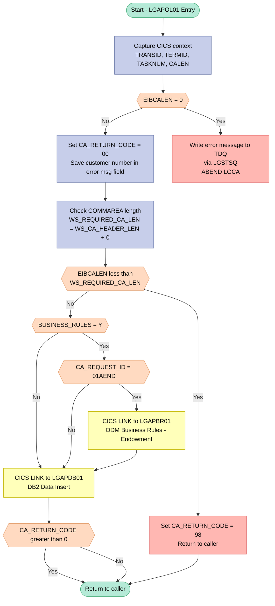
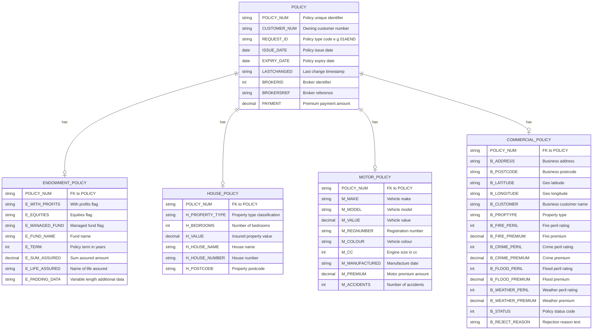

## Table of Contents

- [1. Purpose](#1-purpose)
- [2. Inputs](#2-inputs)
  - [2.1 Communication Area (COMMAREA) — Passed via `COMM_AREA_PTR` parameter](#21-communication-area-commarea--passed-via-comm_area_ptr-parameter)
  - [2.2 CICS Execution Environment](#22-cics-execution-environment)
  - [2.3 Internal Configuration Flag](#23-internal-configuration-flag)
- [3. Outputs](#3-outputs)
  - [3.1 Communication Area Output Data](#31-communication-area-output-data)
  - [3.2 External Program Interface Outputs](#32-external-program-interface-outputs)
  - [3.3 Abnormal Termination & System Control](#33-abnormal-termination--system-control)
- [4. Processing Logic](#4-processing-logic)
  - [4.1 Mermaid Flow Diagram](#41-mermaid-flow-diagram)
  - [4.2 Processing Logic Description](#42-processing-logic-description)
  - [4.3 Database Tables](#43-database-tables)
- [5. Paragraphs](#5-paragraphs)
- [6. Dependencies](#6-dependencies)
  - [6.1 CICS-Linked Programs (External Program Dependencies)](#61-cics-linked-programs-external-program-dependencies)
  - [6.2 Copybooks / Shared Include Files](#62-copybooks--shared-include-files)
  - [6.3 CICS Runtime Environment](#63-cics-runtime-environment)
  - [6.4 Input Parameters / Communication Area](#64-input-parameters--communication-area)
  - [6.5 Configuration / Control Flags](#65-configuration--control-flags)
  - [6.6 Internal Subroutines](#66-internal-subroutines)
- [7. Constraints](#7-constraints)
  - [7.1 Communication Area (COMMAREA) Structural Constraints](#71-communication-area-commarea-structural-constraints)
  - [7.2 Request Identification and Routing Constraints](#72-request-identification-and-routing-constraints)
  - [7.3 Business Rules Processing Constraints](#73-business-rules-processing-constraints)
  - [7.4 Processing Sequencing Constraints](#74-processing-sequencing-constraints)
  - [7.5 Data Field Format and Size Constraints](#75-data-field-format-and-size-constraints)
  - [7.6 Error Logging Constraints](#76-error-logging-constraints)
- [8. Error Handling](#8-error-handling)
  - [8.1 Downstream Call Result and Return Code Evaluation](#81-downstream-call-result-and-return-code-evaluation)
  - [8.2 Abnormal Program Termination](#82-abnormal-program-termination)
  - [8.3 Diagnostic Logging and Error Reporting](#83-diagnostic-logging-and-error-reporting)
- [9. Examples](#9-examples)
  - [9.1 Example 1: Successful Motor Policy Creation](#91-example-1-successful-motor-policy-creation)
  - [9.2 Example 2: Short Commarea Length Validation Failure](#92-example-2-short-commarea-length-validation-failure)

## 1. Purpose

`LGAPOL01` is the business logic tier program responsible for adding new insurance policies within the GenApp CICS application. It accepts a communication area (`COMM_AREA`) identifying the customer, the type of policy to be created (endowment, house, motor, commercial, or claim), and the associated policy details such as issue and expiry dates, payment amount, broker identifier, and policy-specific attributes. After validating that a sufficiently sized communication area has been received, the program optionally invokes the Operational Decision Manager business rules program (`LGAPBR01`) when the `BUSINESS_RULES` flag is enabled and the request is for an endowment policy addition, then delegates the actual database insert operation to the DB2 data-access program `LGAPDB01` via `EXEC CICS LINK`, returning any error codes from that tier directly to the caller.

## 2. Inputs

### 2.1 Communication Area (COMMAREA) — Passed via `COMM_AREA_PTR` parameter

These fields are supplied by the calling CICS program through the 32,500-byte `COMM_AREA` structure pointed to by the program's sole entry parameter `COMM_AREA_PTR`.

- **`CA_REQUEST_ID`** *(CHAR(6))* — Identifies the operation to perform (e.g., `'01AEND'` for add endowment). Controls which policy-type branch is taken and whether the ODM business-rules program `LGAPBR01` is invoked.
- **`CA_CUSTOMER_NUM`** *(PIC '9999999999')* — Customer number associated with the policy request. Used to identify the policyholder in error logging and downstream DB2 processing via `LGAPDB01`.
- **`CA_POLICY_NUM`** *(PIC '9999999999')* — Policy number for the record being added. Passed through the commarea to the DB2-tier program.

#### 2.1.1 Common Policy Fields (within `CA_POLICY_REQUEST` / `CA_POLICY_COMMON`)
- **`CA_ISSUE_DATE`** *(CHAR(10))* — Effective start date of the policy being added.
- **`CA_EXPIRY_DATE`** *(CHAR(10))* — Expiry/end-of-coverage date for the policy.
- **`CA_BROKERID`** *(PIC '9999999999')* — Identifier of the broker managing the policy.
- **`CA_PAYMENT`** *(PIC '999999')* — Premium payment amount for the policy.

#### 2.1.2 Endowment Policy Fields (within `CA_ENDOWMENT`)
- **`CA_E_SUM_ASSURED`** *(PIC '999999')* — Guaranteed sum payable on maturity or death under an endowment policy.
- **`CA_E_LIFE_ASSURED`** *(CHAR(31))* — Name of the life assured under the endowment policy.

#### 2.1.3 House Policy Fields (within `CA_HOUSE`)
- **`CA_H_VALUE`** *(PIC '99999999')* — Insured valuation of the residential property.
- **`CA_H_PROPERTY_TYPE`** *(CHAR(15))* — Structural classification of the insured dwelling (e.g., detached, terraced).

#### 2.1.4 Motor Policy Fields (within `CA_MOTOR`)
- **`CA_M_REGNUMBER`** *(CHAR(7))* — Vehicle license registration number for the insured motor vehicle.
- **`CA_M_PREMIUM`** *(PIC '999999')* — Calculated premium amount for motor vehicle coverage.

#### 2.1.5 Claim Fields (within `CA_CLAIM`)
- **`CA_C_VALUE`** *(PIC '99999999')* — Total claimed financial loss amount submitted against a policy.

### 2.2 CICS Execution Environment

These values are supplied by the CICS runtime and are read at program initialisation.

- **`EIBCALEN`** — Length of the received commarea, used to validate that a commarea was passed and that it meets the minimum required length before any processing begins.
- **`EIBTRNID`** — CICS transaction identifier for the current task, recorded in the working-storage header for diagnostics.
- **`EIBTRMID`** — CICS terminal identifier, recorded for diagnostic purposes.
- **`EIBTASKN`** — CICS task number, recorded for diagnostic purposes.

### 2.3 Internal Configuration Flag

- **`BUSINESS_RULES`** *(CHAR, initialised to `'N'`)* — A compile-time/deployment toggle (set by uncommenting an assignment in the source) that activates ODM business-rule validation via `LGAPBR01` for endowment add requests. Although initialised internally, its effective value must be deliberately set before deployment and therefore represents an external configuration input.

## 3. Outputs

### 3.1 Communication Area Output Data

- **CA_RETURN_CODE**: Returns a two-digit numeric status indicator to the calling program. Set to `'00'` upon successful initialization, `'98'` if the communication area length is insufficient, or populated with an error code returned by downstream programs (`LGAPDB01` or `LGAPBR01`).
- **CA_POLICY_NUM**: Receives and returns the newly generated or assigned policy number generated during the database insertion process by `LGAPDB01`.
- **COMM_AREA**: The entire communication area structure passed back to the caller upon `EXEC CICS RETURN`, containing updated policy details, potential rule modification outputs from `LGAPBR01`, and database insert results from `LGAPDB01`.

### 3.2 External Program Interface Outputs

- **EXEC CICS LINK PROGRAM('LGAPBR01')**: Transfers control and the `COMM_AREA` payload to the business rules processor when business rule processing is enabled (`BUSINESS_RULES = 'Y'`) and the request is for adding an endowment policy (`CA_REQUEST_ID = '01AEND'`).
- **EXEC CICS LINK PROGRAM('LGAPDB01')**: Transfers control and the `COMM_AREA` payload to the database insertion module to persist policy records and retrieve the updated policy details and return codes.
- **EXEC CICS LINK PROGRAM('LGSTSQ')**: Writes diagnostic and error messages to a transient data queue via `LGSTSQ` during abnormal termination:
  - **ERROR_MSG**: Formatted error message containing execution date (`EM_DATE`), time (`EM_TIME`), program identifier (`LGAPOL01`), and descriptive error text (`EM_MSG_TEXT`).
  - **CA_ERROR_MSG**: Contains the first 90 bytes of the raw communication area data (`CA_DATA`) for troubleshooting.

### 3.3 Abnormal Termination & System Control

- **EXEC CICS ABEND ABCODE('LGCA')**: Terminates the transaction immediately with abend code `LGCA` (without a dump) if no communication area is supplied (`EIBCALEN = 0`).
- **EXEC CICS RETURN**: Terminates the program execution and returns control and modified communication area data back to the invoking CICS environment or caller.

## 4. Processing Logic

### 4.1 Mermaid Flow Diagram



---

### 4.2 Processing Logic Description

#### 4.2.1 High-level Summary

LGAPOL01 is the **Add Policy business logic program** in the GenApp three-tier CICS/PL/I insurance application. It acts as the middle tier: it validates the incoming communication area (COMMAREA), optionally delegates to an Operational Decision Manager (ODM) rules engine for endowment policies, and then calls the DB2 data-access program LGAPDB01 to physically insert the new policy record. It supports four policy types: Endowment, House, Motor, and Commercial.

---

#### 4.2.2 Execution Flow

**Step 1 — Program Entry and Context Capture**
The program is invoked via `EXEC CICS LINK` with a 32,500-byte COMMAREA pointer. On entry it immediately captures the current CICS transaction ID (`EIBTRNID`), terminal ID (`EIBTRMID`), task number (`EIBTASKN`), and COMMAREA length (`EIBCALEN`) into working-storage header fields for diagnostic use.

**Step 2 — COMMAREA Presence Check**
If `EIBCALEN = 0` (no COMMAREA was passed), the program logs an error message (`NO COMMAREA RECEIVED`) via the internal `WRITE_ERROR_MESSAGE` procedure and issues a CICS `ABEND` with abend code `LGCA`. This is a hard failure — execution does not continue.

**Step 3 — Initialise Return Code**
`CA_RETURN_CODE` is set to `'00'` (success), and the customer number is copied into the error message field as a diagnostic aid for any subsequent failures.

**Step 4 — COMMAREA Length Validation**
The minimum required COMMAREA length (`WS_REQUIRED_CA_LEN`) is computed as the header length (28 bytes) plus any policy-specific length (effectively 28 for the base header). If the actual `EIBCALEN` is less than this minimum, `CA_RETURN_CODE` is set to `'98'` and the program returns immediately — a soft error signalling an undersized COMMAREA to the caller.

**Step 5 — Optional ODM Business Rules (Endowment only)**
The flag `BUSINESS_RULES` is declared and initialised to `'N'`. If it is set to `'Y'` (by uncommenting the assignment in the source — disabled by default), **and** the `CA_REQUEST_ID` equals `'01AEND'` (Add Endowment), the program calls `LGAPBR01` via `EXEC CICS LINK`, passing the full COMMAREA. This program invokes IBM Operational Decision Manager to apply business rule validation against the endowment policy data. For all other policy types (House `01AHSE`, Motor `01AMOT`, Commercial `01ACON`) or when the flag is `'N'`, this step is skipped entirely.

**Step 6 — DB2 Data Insert (LGAPDB01)**
Regardless of policy type or business rules outcome, the program calls `LGAPDB01` via `EXEC CICS LINK` with the full 32,500-byte COMMAREA. LGAPDB01 is responsible for performing the actual DB2 INSERT for the new policy record.

**Step 7 — Return Code Check and Exit**
After returning from LGAPDB01, `CA_RETURN_CODE` is inspected. If it is greater than zero (indicating a DB2 error or business logic rejection set by LGAPDB01), the program returns to the caller immediately, preserving the non-zero return code. If `CA_RETURN_CODE` is zero, a normal `EXEC CICS RETURN` is issued.

**Error Handling — WRITE_ERROR_MESSAGE Procedure**
This internal subroutine is called only when a fatal COMMAREA absence is detected. It:
1. Obtains the current absolute time via `EXEC CICS ASKTIME`.
2. Formats it into `MM/DD/YYYY` date and `HH:MM:SS` time strings via `EXEC CICS FORMATTIME`.
3. Calls the utility program `LGSTSQ` (via `EXEC CICS LINK`) to write the formatted error message (date, time, program name `LGAPOL01`, customer number, policy number, SQL code) to a Transient Data Queue (TDQ).
4. If any COMMAREA data is present, also writes the first 90 bytes (or fewer if `EIBCALEN < 91`) of the raw COMMAREA to the TDQ as a second diagnostic record.

---

#### 4.2.3 External Interactions

| Program | Type | Purpose |
|---|---|---|
| **LGAPBR01** | CICS LINK | ODM Business Rules validation — called only for Endowment add requests when `BUSINESS_RULES = 'Y'` |
| **LGAPDB01** | CICS LINK | DB2 data access tier — performs the actual INSERT of the new policy row into the DB2 database |
| **LGSTSQ** | CICS LINK | TSQ/TDQ utility — writes diagnostic and error messages to a Transient Data Queue for operational logging |

---

#### 4.2.4 Plain Language Summary

When a user or upstream program wants to add a new insurance policy (endowment, house, motor, or commercial), LGAPOL01 is the central coordinator. It first checks that the incoming data packet (COMMAREA) is valid and the right size. If not, it either raises a hard error (no data at all) or signals the caller with an error code (data too short).

For endowment policies specifically, there is an optional rules-engine check (IBM ODM via LGAPBR01) that can validate business rules before the record is saved — but this is switched off by default and must be explicitly enabled in the source code.

Once validation passes, LGAPOL01 calls the database program LGAPDB01 to write the new policy record to DB2. If that write fails, the error code is passed back to the caller. If everything succeeds, control returns normally. Any unexpected errors are logged to an operations queue for diagnosis.

---

### 4.3 Database Tables



## 5. Paragraphs

- **Main Initialization**
  - Purpose: Initializes runtime transaction and environment details from the CICS execution context.
  - Operations performed: Assigns CICS Execute Interface Block (EIB) values, including transaction ID (`EIBTRNID`), terminal ID (`EIBTRMID`), task number (`EIBTASKN`), and communication area length (`EIBCALEN`), to internal working storage fields.
  - Control flow: Executes sequentially without branching.
  - External interactions: Accesses CICS system-level information via the Execute Interface Block (EIB).

- **Commarea Validation**
  - Purpose: Verifies that a valid and correctly sized communication area has been supplied to the program.
  - Operations performed: Assigns the input pointer to the structure, initializes the response code (`CA_RETURN_CODE`) to success (`'00'`), captures the customer number for diagnostic logs, and compares the expected COMMAREA length against the received length.
  - Control flow: Implements conditional logic to handle empty or undersized inputs. If the COMMAREA length is zero, the program terminates immediately via an abend. If the length is positive but shorter than required, the program sets the return code to `'98'` and exits.
  - External interactions: Triggers a CICS abnormal termination using `EXEC CICS ABEND` with abend code `'LGCA'` and exits processing via `EXEC CICS RETURN`.

- **Business Rule Processing**
  - Purpose: Directs the policy request to an external rule engine (ODM) if rule validation is active for endowment policies.
  - Operations performed: Checks the application configuration and request details to decide whether to invoke business rule processing.
  - Control flow: Utilizes nested conditional statements to confirm if the business rules flag is set to `'Y'` and if the request ID matches an endowment policy addition (`'01AEND'`).
  - External interactions: Links to the external business rules program using `EXEC CICS Link Program('LGAPBR01')` passing the `COMM_AREA` structure.

- **Data Insertion**
  - Purpose: Persists the newly created policy data by invoking the database operations layer.
  - Operations performed: Directs the execution flow to the database handler program and monitors the returned status code.
  - Control flow: Employs conditional logic to evaluate `CA_RETURN_CODE`. If a database insertion failure is indicated (return code greater than zero), the program exits immediately. Otherwise, it finishes execution and returns normally.
  - External interactions: Integrates with the database handler via `EXEC CICS Link Program('LGAPDB01')` and handles program exit using `EXEC CICS RETURN`.

- **WRITE_ERROR_MESSAGE procedure**
  - Purpose: Formats and records runtime application errors to transient data logs.
  - Operations performed: Queries the current system timestamp, formats it into standard date and time strings, populates the error message structure, and extracts a safe fragment of the raw COMMAREA data for diagnostic output.
  - Control flow: Contains nested conditional branches to handle variable COMMAREA sizes and prevent string indexing out of bounds when extracting diagnostic data.
  - External interactions: Calls CICS timestamp services via `EXEC CICS ASKTIME` and `EXEC CICS FORMATTIME`, and pushes the formatted error structures to the log queue using `EXEC CICS LINK PROGRAM('LGSTSQ')`.

## 6. Dependencies

### 6.1 CICS-Linked Programs (External Program Dependencies)

- **LGAPDB01** — DB2-tier program invoked unconditionally via `EXEC CICS LINK` to perform the actual database insert operations for the new policy; receives the full `COMM_AREA` (32,500 bytes)
- **LGAPBR01** — Business Rules program invoked conditionally via `EXEC CICS LINK` only when `BUSINESS_RULES = 'Y'` and `CA_REQUEST_ID = '01AEND'` (add-endowment request); interfaces with IBM Operational Decision Manager (ODM) for policy validation; disabled by default
- **LGSTSQ** — Transient data queue (TDQ) writer utility program invoked via `EXEC CICS LINK` within the `WRITE_ERROR_MESSAGE` procedure to log error messages and COMMAREA diagnostic data

---

### 6.2 Copybooks / Shared Include Files

- **LGCMAREA.inc** (`%INCLUDE LGCMAREA`) — Defines the universal 32,500-byte `COMM_AREA` UNION structure and its pointer `COMM_AREA_PTR`; used as the main entry parameter and the data-exchange vehicle for all linked programs
  - Contains sub-structures for all policy types: `CA_POLICY_REQUEST`, `CA_ENDOWMENT`, `CA_HOUSE`, `CA_MOTOR`, `CA_COMMERCIAL`, `CA_CLAIM`

---

### 6.3 CICS Runtime Environment

- **EIBTRNID** — CICS EIB field providing the current transaction identifier; stored in `WS_TRANSID`
- **EIBTRMID** — CICS EIB field providing the terminal identifier; stored in `WS_TERMID`
- **EIBTASKN** — CICS EIB field providing the task number; stored in `WS_TASKNUM`
- **EIBCALEN** — CICS EIB field providing the length of the received COMMAREA; used to validate presence and minimum length of the communication area
- **EXEC CICS ASKTIME / FORMATTIME** — CICS services used inside `WRITE_ERROR_MESSAGE` to obtain and format the current absolute time and date for error log entries
- **EXEC CICS ABEND (ABCODE 'LGCA')** — CICS abend facility invoked when no COMMAREA is received
- **EXEC CICS RETURN** — CICS return mechanism used to pass control back to the calling program or terminal

---

### 6.4 Input Parameters / Communication Area

- **COMM_AREA / COMM_AREA_PTR** — The single entry-point parameter passed by the CICS caller; carries all request and response data
  - **CA_REQUEST_ID** — Six-character request-type code driving conditional branching (e.g., `'01AEND'` triggers ODM business rule processing)
  - **CA_RETURN_CODE** — Two-digit return code field set by this program (`'00'` success, `'98'` commarea too short) and by downstream linked programs
  - **CA_CUSTOMER_NUM** — Numeric customer identifier; copied into error message diagnostics
  - **CA_POLICY_NUM** — Numeric policy identifier within the policy request block
  - **CA_ISSUE_DATE / CA_EXPIRY_DATE** — Policy effective and expiry dates
  - **CA_PAYMENT** — Premium payment amount
  - **CA_BROKERID** — Broker identifier
  - **CA_E_SUM_ASSURED / CA_E_LIFE_ASSURED** — Endowment-specific policy fields
  - **CA_H_VALUE / CA_H_PROPERTY_TYPE** — House-policy-specific fields
  - **CA_M_REGNUMBER / CA_M_PREMIUM** — Motor-policy-specific fields
  - **CA_C_VALUE** — Claim value field within the claim policy sub-structure

---

### 6.5 Configuration / Control Flags

- **BUSINESS_RULES** — Single-character internal flag (`'N'` by default, set to `'Y'` to activate ODM processing); controls whether `LGAPBR01` is called for endowment policy additions; must be changed at source and recompiled to enable

---

### 6.6 Internal Subroutines

- **WRITE_ERROR_MESSAGE** — Internal procedure that formats an error message with date, time, program name, customer number, policy number, and SQLCODE, then links to `LGSTSQ` to write entries to the transient data queue; called on COMMAREA validation failure

## 7. Constraints

### 7.1 Communication Area (COMMAREA) Structural Constraints

- **COMMAREA must be present**: `EIBCALEN` is tested against `0` at program entry; if no COMMAREA is received, the program logs an error message and issues `EXEC CICS ABEND ABCODE('LGCA') NODUMP`, halting all processing unconditionally.
- **COMMAREA minimum length**: `WS_REQUIRED_CA_LEN` is computed as `WS_CA_HEADER_LEN` (hardcoded `+28`) plus the request-specific length; if `EIBCALEN < WS_REQUIRED_CA_LEN`, `CA_RETURN_CODE` is set to `'98'` and the program returns immediately — no policy processing occurs.
- **COMMAREA fixed maximum size**: The COMMAREA structure is declared as a 32 500-byte `UNION` (`COMM_AREA_RAW CHAR(32500)`), and every downstream `EXEC CICS LINK` passes `LENGTH(32500)`, making 32 500 bytes the hard upper bound on communication area size.

### 7.2 Request Identification and Routing Constraints

- **`CA_REQUEST_ID` governs ODM routing**: Business-rule processing via ODM (`LGAPBR01`) is invoked only when `CA_REQUEST_ID = '01AEND'` (Add Endowment), and only then when `BUSINESS_RULES = 'Y'`. Any other request type bypasses ODM entirely.
- **Policy type scope**: The program is designed exclusively for Add Policy operations (Endowment, House, Motor, Commercial). The COMMAREA layout contains separate overlaid unions for each type (`CA_ENDOWMENT`, `CA_HOUSE`, `CA_MOTOR`, `CA_COMMERCIAL`, `CA_CLAIM`); there is no branching logic for non-Add operations, so passing a non-Add request ID will still reach `LGAPDB01` without type-specific validation at this tier.

### 7.3 Business Rules Processing Constraints

- **Business rules disabled by default**: `BUSINESS_RULES` is declared as `CHAR INIT('N')`; the commented-out assignment `/* MOVE 'Y' TO BUSINESS_RULES */` confirms ODM integration is intentionally inactive unless explicitly re-enabled at compile time.
- **ODM call is restricted to Endowment Add only**: Even when `BUSINESS_RULES = 'Y'`, the ODM program `LGAPBR01` is called only for `CA_REQUEST_ID = '01AEND'`; all other policy types (House, Motor, Commercial, Claim) receive no business-rule validation.

### 7.4 Processing Sequencing Constraints

- **COMMAREA validation must precede all business logic**: The zero-length check and minimum-length check are the first executable operations; no policy data is read or processed before these guards pass.
- **ODM call must precede DB2 insert**: If enabled, `LGAPBR01` is linked before `LGAPDB01`; the ODM result is expected to modify or validate the COMMAREA before the data-insert tier is invoked.
- **DB2 insert is unconditional after ODM**: `LGAPDB01` is always called (for all policy types) regardless of whether ODM was invoked or what it returned — there is no post-ODM gate on `CA_RETURN_CODE` before the `LGAPDB01` link.
- **Early exit on DB2 error**: After `LGAPDB01` returns, `CA_RETURN_CODE > 0` causes an immediate `EXEC CICS RETURN`, preventing any further processing when the data tier signals a failure.

### 7.5 Data Field Format and Size Constraints

- **`CA_CUSTOMER_NUM`**: Declared `PIC '9999999999'` — must be a 10-digit numeric value.
- **`CA_POLICY_NUM`**: Declared `PIC '9999999999'` — must be a 10-digit numeric value.
- **`CA_RETURN_CODE`**: Declared `PIC '99'` — constrained to a 2-digit numeric picture; compared as `> 0` and set only to `'00'` or `'98'`.
- **`CA_PAYMENT`**: Declared `PIC '999999'` — maximum 6-digit numeric value (up to 999 999).
- **`CA_BROKERID`**: Declared `PIC '9999999999'` — 10-digit numeric.
- **`CA_ISSUE_DATE` / `CA_EXPIRY_DATE`**: Declared `CHAR(10)` — dates must fit within a 10-character string (consistent with `YYYY-MM-DD` format).
- **`CA_LASTCHANGED`**: Declared `CHAR(26)` — must fit a 26-character timestamp.
- **`CA_E_SUM_ASSURED`**: Declared `PIC '999999'` — endowment sum assured is limited to 6 digits (max 999 999).
- **`CA_E_LIFE_ASSURED`**: Declared `CHAR(31)` — insured person's name truncated to 31 characters.
- **`CA_E_TERM`**: Declared `PIC '99'` — endowment term is a 2-digit numeric (1–99 years maximum).
- **`CA_H_VALUE`**: Declared `PIC '99999999'` — house value limited to 8 digits (max 99 999 999).
- **`CA_H_BEDROOMS`**: Declared `PIC '999'` — bedroom count limited to 3 digits.
- **`CA_H_PROPERTY_TYPE`**: Declared `CHAR(15)` — property type classification capped at 15 characters.
- **`CA_M_REGNUMBER`**: Declared `CHAR(7)` — vehicle registration number must not exceed 7 characters.
- **`CA_M_PREMIUM` / `CA_M_VALUE`**: Both declared `PIC '999999'` — 6-digit numeric limit.
- **`CA_M_CC`**: Declared `PIC '9999'` — engine displacement limited to 4 digits.
- **`CA_M_ACCIDENTS`**: Declared `PIC '999999'` — 6-digit numeric.
- **`CA_C_VALUE` / `CA_C_Paid`**: Both declared `PIC '99999999'` — claim value and paid amount limited to 8 digits (max 99 999 999).
- **Commercial peril and premium fields**: Fire, Crime, Flood, and Weather peril codes are `PIC '9999'` (4-digit); corresponding premiums are `PIC '99999999'` (8-digit).
- **`CA_B_Status`**: Declared `PIC '9999'` — commercial policy status is a 4-digit numeric.
- **`WS_VARY_CHAR`**: Endowment padding data for DB2 `VARCHAR` insertion is capped at 3 900 characters (`CHAR(3900)`), limiting the variable-length field written to the `endowment.paddingData` column.

### 7.6 Error Logging Constraints

- **Error dump is capped at 90 bytes of COMMAREA**: In `WRITE_ERROR_MESSAGE`, if `EIBCALEN < 91` the actual COMMAREA length is used; otherwise exactly 90 bytes are extracted via `LEFT(COMM_AREA_RAW,90)` — raw COMMAREA content beyond 90 bytes is never logged.
- **Error logging requires a live COMMAREA**: The COMMAREA dump branch inside `WRITE_ERROR_MESSAGE` is guarded by `EIBCALEN > 0`; if called before the zero-length abend path resolves (i.e., during the abend path itself), no COMMAREA data is written to the TSQ.
- **Error messages are routed through `LGSTSQ`**: All diagnostic output must go via `EXEC CICS LINK PROGRAM('LGSTSQ')`; direct TSQ API calls are not used, so error logging depends on `LGSTSQ` being available in the CICS region.

## 8. Error Handling

We now have a complete and clear picture of the error handling mechanisms implemented in `LGAPOL01.pli`.
Let's list them and structure them into logical categories without using any code snippets.

The categories of error handling can include:
- **Input Validation & Interface Integrity Checks**: Checking for the existence and minimum length of the communication area.
- **Downstream Call Result & Return Code Evaluation**: Monitoring execution outcome of database operations and stopping processing if they fail.
- **Diagnostic Logging & Reporting**: Structuring, formatting, and writing error logs and communication area context to system queues via specialized utility components.
- **Abnormal Program Termination**: Forcefully abending the transaction with specific abend codes when critical infrastructure assumptions are violated.

Let's carefully verify that there are:
- NO code snippets.
- NO numbered bullet points (only "-" with proper indentations).
- NO section heading.
- NO conversational filler/commentary ("Here is the...", "Now I will...", etc.).
- Direct start.

Let's double-check the rules:
- "List each error handling mechanism clearly and explain how it is implemented or triggered in the code."
- "Group the identified error handling mechanisms into logical categories if applicable."
- "Do not include code snippets in your response. Focus on descriptive analysis only."
- "Do not use numbered bullet points. Bullet points should start with "-" and use proper indentations to reflect hierarchy."
- "Do not add the section heading."
- "The very first character of your response must be part of the section content itself."

Let's draft the content for each identified mechanism:

- Input Validation & Interface Integrity Checks
  - Communication Area Existence Verification
    - The program inspects the CICS execution interface block's communication area length parameter immediately upon startup to verify that a communication area was received. If this length is zero, it represents a terminal omission of payload, triggering a logging routine and aborting execution.
  - Communication Area Minimum Length Validation
    - The program calculates a minimum required size based on structural headers and configuration. If the received communication area length is less than this computed length, it constitutes an invalid structural invocation. The program handles this by assigning a dedicated error return code ('98') to the communication area's return status field and immediately issuing a CICS return back to the invoking component.

- Abnormal Program Termination & Exceptional Control Flow
  - CICS Transaction Abend Control
    - When a critical error such as a missing communication area is detected, the program halts standard execution flow by issuing a CICS abend with a specific abend code ('LGCA'). It suppresses the system memory dump parameter to optimize performance and prevent unnecessary disk utilization during the abnormal termination.

- Downstream Call Result & Return Code Evaluation
  - Downstream Component Execution Status Check
    - After calling the downstream database insertion program ('LGAPDB01') via a CICS Link command, the program immediately inspects the shared communication area return code. If this return code contains any value greater than zero, signifying an error or exception occurred in the database layer, the program bypasses further logic and performs an early exit by executing a CICS return.

- Diagnostic Logging & Error Reporting
  - Temporary Storage Queue Log Dispatching
    - The program leverages a structured error message block designed to hold diagnostic variables (such as application program name, customer number, policy number, SQL requests, and SQL return codes) along with formatted timestamp metadata. It routes these structured errors to a centralized CICS transient data or temporary storage queue by linking to a dedicated logging utility module ('LGSTSQ').
  - System Date and Time Acquisition
    - In preparation for error logging, the program issues specialized CICS time and formatting commands to capture and convert the absolute system time into human-readable date and time fields, ensuring logs are accurately timestamped.
  - Communication Area Context Capture
    - During the error reporting sequence, the program reads the incoming raw communication area data. Depending on the size of the payload, it conditionally trims and copies either the full buffer or the leading bytes to a diagnostic data block, then forwards this supplemental context to the logging utility to aid in troubleshooting the malformed input.

This is a comprehensive, precise, and well-structured analysis of the error handling mechanisms in `LGAPOL01.pli`.
I will now generate the output following the strict constraints (no code snippets, no numbered bullet points, proper indentation, direct start, and no commentary).### Input Validation and Interface Integrity Checks

- **Communication Area Existence Verification**
  - The program inspects the CICS execution interface block's communication area length parameter immediately upon entry to verify that a payload was received. If this length is zero, indicating that no data was passed to the program, it triggers the diagnostic logging routine and terminates execution immediately.

- **Communication Area Minimum Length Validation**
  - The program calculates a minimum required communication area size based on standard header structures. If the received length is less than this calculated required size, it represents an invalid interface invocation. The program handles this by setting the communication area return code to '98' and executing an immediate return to the caller.

### 8.1 Downstream Call Result and Return Code Evaluation

- **Downstream Component Execution Status Check**
  - After invoking the database access program via a CICS program link, the program immediately checks the shared communication area return code. If the returned code indicates an error (any value greater than zero), the program bypasses any further processing and issues an early return to the caller.

### 8.2 Abnormal Program Termination

- **CICS Transaction Abend Control**
  - In cases of severe infrastructure violations—specifically when no communication area is received—the program enforces an abnormal termination. It issues a CICS abend with a specific abcode ('LGCA') and suppresses the transaction dump to prevent unnecessary resource consumption.

### 8.3 Diagnostic Logging and Error Reporting

- **Centralized Diagnostic Message Assembly**
  - The program defines a dedicated error message structure containing fields for the current date, current time, program identifier, customer number, policy number, SQL request string, and SQL return codes. When an error occurs, these fields are populated with runtime metadata to build a comprehensive troubleshooting record.

- **System Timestamp Acquisition and Formatting**
  - Within the error logging sequence, the program queries the CICS system time to capture the absolute time of the error. It formats this time into standard date and time string formats to stamp the error diagnostics accurately.

- **Contextual Payload Capture**
  - To assist with post-failure analysis, the program inspects the size of the incoming communication area and conditionally extracts its contents. Depending on the length of the data received, it safely truncates and copies either the entire buffer or the leading portion of the raw communication area into a diagnostic data block.

- **Temporary Storage Queue Logging Integration**
  - Once the diagnostic message and payload structures are assembled, the program performs a CICS link to a specialized logging utility program ('LGSTSQ'). This utility receives the structured error blocks and writes them to a centralized temporary storage or transient data queue, keeping error monitoring separate from core business operations.

## 9. Examples

### 9.1 Example 1: Successful Motor Policy Creation

This example demonstrates adding a new motor vehicle insurance policy for an existing customer.

#### 9.1.1 Sample Input Data
```text
CICS Commarea (Length: 32500 bytes)
  CA_REQUEST_ID      = '01AMOT'
  CA_CUSTOMER_NUM    = '0000000101'
  CA_POLICY_NUM      = '0000000000'
  CA_ISSUE_DATE      = '2023-10-01'
  CA_EXPIRY_DATE     = '2024-10-01'
  CA_BROKERID        = '0000000010'
  CA_BROKERSREF      = 'BRKREF1010'
  CA_PAYMENT         = '000450'
  CA_M_MAKE          = 'Ford'
  CA_M_MODEL         = 'Focus'
  CA_M_VALUE         = '015000'
  CA_M_REGNUMBER     = 'AB12CDE'
  CA_M_COLOUR        = 'Blue'
  CA_M_CC            = '1600'
  CA_M_MANUFACTURED  = '2020-05-15'
  CA_M_PREMIUM       = '000450'
  CA_M_ACCIDENTS     = '000000'
```

#### 9.1.2 Expected Output
```text
CICS Commarea (Returned to Caller)
  CA_REQUEST_ID      = '01AMOT'
  CA_CUSTOMER_NUM    = '0000000101'
  CA_POLICY_NUM      = '0000001054'
  CA_RETURN_CODE     = '00'
```

#### 9.1.3 Processing Explanation
1. `LGAPOL01` validates `EIBCALEN` against minimum header length requirements and initializes `CA_RETURN_CODE` to `'00'`.
2. The `BUSINESS_RULES` flag is set to `'N'`, so ODM rule evaluation (`LGAPBR01`) is bypassed.
3. The program links to the database insert module `LGAPDB01`, passing the full `COMM_AREA` (32,500 bytes).
4. `LGAPDB01` generates a new policy number (`0000001054`), inserts the base policy record into the `POLICY` table, and inserts the motor details into the `MOTOR` table.
5. `CA_RETURN_CODE` remains `'00'` indicating success, and control returns to the calling program with the generated `CA_POLICY_NUM`.

---

### 9.2 Example 2: Short Commarea Length Validation Failure

This example demonstrates error handling when the calling program passes a communication area that is shorter than the minimum required header size.

#### 9.2.1 Sample Input Data
```text
EIBCALEN             = 15
CICS Commarea (Length: 15 bytes)
  CA_REQUEST_ID      = '01AEND'
  CA_RETURN_CODE     = '00'
  CA_CUSTOMER_NUM    = '0000000101'
```

#### 9.2.2 Expected Output
```text
CICS Commarea
  CA_RETURN_CODE     = '98'
```

#### 9.2.3 Processing Explanation
1. `LGAPOL01` evaluates `EIBCALEN` (15) against the required header length (`WS_REQUIRED_CA_LEN` = 28 bytes).
2. Because `EIBCALEN < 28`, the program assigns return code `'98'` to `CA_RETURN_CODE` to signal an invalid or truncated commarea.
3. The program executes `EXEC CICS RETURN` immediately without invoking ODM business rules (`LGAPBR01`) or DB2 database operations (`LGAPDB01`).

---

Generated by IBM Bob Premium Package for Z
