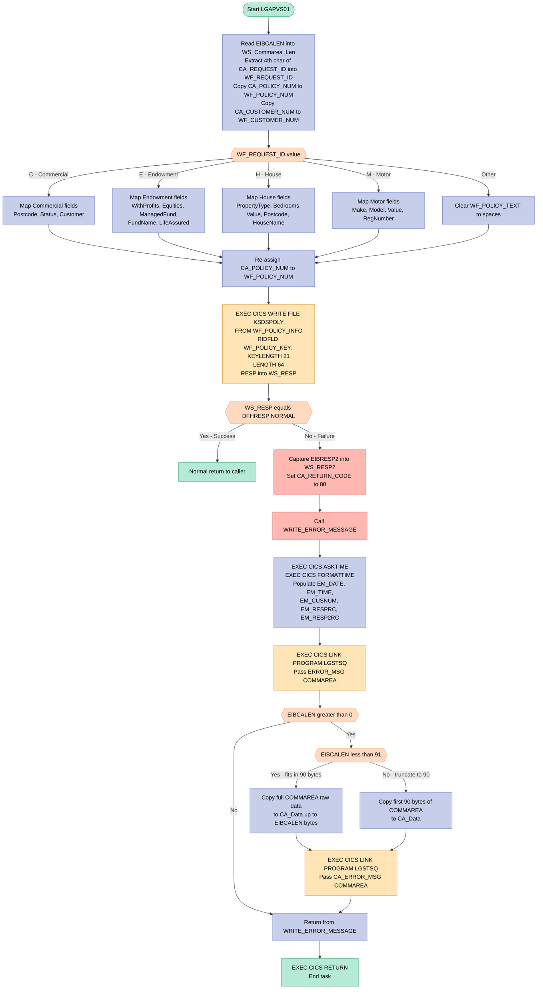
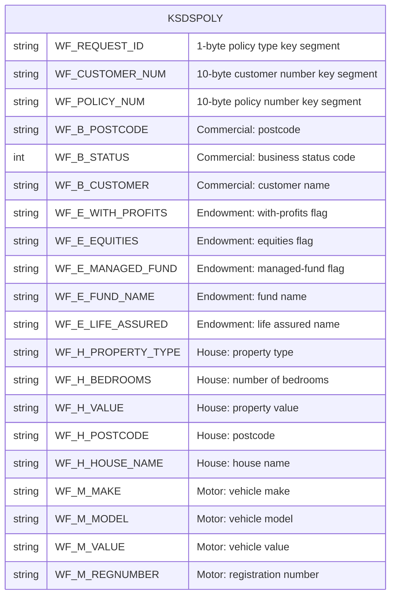

## Table of Contents

- [1. Purpose](#1-purpose)
- [2. Inputs](#2-inputs)
- [3. Outputs](#3-outputs)
- [4. Processing Logic](#4-processing-logic)
  - [4.1 Mermaid Flow Diagram](#41-mermaid-flow-diagram)
  - [4.2 Processing Logic Description](#42-processing-logic-description)
  - [4.3 Database Tables](#43-database-tables)
- [5. Paragraphs](#5-paragraphs)
- [6. Dependencies](#6-dependencies)
- [7. Constraints](#7-constraints)
  - [7.1 Data Validation and Input Constraints](#71-data-validation-and-input-constraints)
  - [7.2 File and Storage Constraints](#72-file-and-storage-constraints)
  - [7.3 Conditional Restrictions and Process Flow](#73-conditional-restrictions-and-process-flow)
  - [7.4 Sequencing Constraints](#74-sequencing-constraints)
- [8. Error Handling](#8-error-handling)
  - [8.1 CICS File Write Response Check](#81-cics-file-write-response-check)
  - [8.2 Return Code Propagation to Caller](#82-return-code-propagation-to-caller)
  - [8.3 Secondary Response Code Capture](#83-secondary-response-code-capture)
  - [8.4 Structured Error Message Logging via WRITE_ERROR_MESSAGE](#84-structured-error-message-logging-via-write_error_message)
  - [8.5 Communication Area Dump in Error Logging](#85-communication-area-dump-in-error-logging)
  - [8.6 Fallback for Unknown Request Type](#86-fallback-for-unknown-request-type)
  - [8.7 Controlled Program Termination After Error](#87-controlled-program-termination-after-error)
- [9. Examples](#9-examples)
  - [9.1 Example 1: Successful Motor Policy Addition](#91-example-1-successful-motor-policy-addition)
  - [9.2 Example 2: Duplicate Record or File Write Error](#92-example-2-duplicate-record-or-file-write-error)

## 1. Purpose

LGAPVS01 is a CICS PL/I program in the insurance policy application. It adds a new policy record to the VSAM KSDS file KSDSPOLY. It takes the request type, customer number, and policy number from the communication area. It then copies the matching commercial, endowment, house, or motor policy details into a working record. It writes that record to the file under a combined key of request type, customer number, and policy number. If the write fails, the program sets the return code to '80' to tell the caller the add failed. It also records the failure by logging an error message with the date, time, customer and policy identifiers, and CICS response codes, along with a portion of the communication area. It then returns control to the caller.

## 2. Inputs

**Communication Area (COMMAREA) — passed via `COMM_AREA_PTR` parameter**

- `CA_REQUEST_ID` *(CHAR(6))* — Identifies the type of request; the 4th character is extracted to select the policy branch (`C` = Commercial, `E` = Endowment, `H` = House, `M` = Motor)
- `CA_RETURN_CODE` *(PIC '99')* — Output field written back to the caller; set to `'80'` when the VSAM write fails
- `CA_CUSTOMER_NUM` *(PIC '9999999999')* — Customer identifier supplied by the caller; copied into the VSAM record key to link the policy to its owner
- `CA_POLICY_NUM` *(PIC '9999999999')* — Policy number supplied by the caller; used as part of the VSAM KSDS record key and stored in the policy record
- **Commercial policy fields** *(active when request type = `'C'`)*
  - `CA_B_Postcode` *(CHAR(8))* — Business postcode stored in the Commercial policy record
  - `CA_B_Status` *(PIC '9999')* — Approval/processing status of the commercial policy
  - `CA_B_Customer` *(CHAR(255))* — Customer name or description associated with the commercial policy
- **Endowment policy fields** *(active when request type = `'E'`)*
  - `CA_E_WITH_PROFITS` *(CHAR(1))* — Flag indicating whether the endowment is with-profits
  - `CA_E_EQUITIES` *(CHAR(1))* — Flag indicating equities investment option
  - `CA_E_MANAGED_FUND` *(CHAR(1))* — Flag indicating managed fund investment option
  - `CA_E_FUND_NAME` *(CHAR(10))* — Name of the investment fund
  - `CA_E_LIFE_ASSURED` *(CHAR(31))* — Name of the life assured person
- **House policy fields** *(active when request type = `'H'`)*
  - `CA_H_PROPERTY_TYPE` *(CHAR(15))* — Classification of the property (e.g., `DETACHED`, `BUNGALOW`)
  - `CA_H_BEDROOMS` *(PIC '999')* — Number of bedrooms
  - `CA_H_VALUE` *(PIC '99999999')* — Declared value of the property
  - `CA_H_POSTCODE` *(CHAR(8))* — Postcode of the insured property
  - `CA_H_HOUSE_NAME` *(CHAR(20))* — Name or identifier of the insured property
- **Motor policy fields** *(active when request type = `'M'`)*
  - `CA_M_MAKE` *(CHAR(15))* — Vehicle manufacturer (e.g., `FORD`, `TOYOTA`)
  - `CA_M_MODEL` *(CHAR(15))* — Vehicle model name
  - `CA_M_VALUE` *(PIC '999999')* — Declared value of the vehicle
  - `CA_M_REGNUMBER` *(CHAR(7))* — Vehicle registration number

**CICS Runtime Inputs**

- `EIBCALEN` — CICS-provided length of the passed COMMAREA; used to guard against logging an oversized or absent communication area in the error handler

**External File**

- `KSDSPOLY` *(VSAM KSDS)* — Target dataset to which the new policy record is written; the program is an output producer to this file, but any CICS-level file definition attributes (CI size, key offset/length) are implicit inputs that constrain the write operation

## 3. Outputs

- **VSAM KSDS Policy Record Write (KSDSPOLY)**
  - `WF_Policy_Info` — Complete policy record buffer (64 bytes) written to the VSAM KSDS dataset KSDSPOLY via `EXEC CICS WRITE FILE`. Contains the composite key (`WF_Policy_Key`: request type, customer number, policy number) and the policy-type-specific data block (Commercial, Endowment, House, or Motor) selected by `WF_Request_ID`.
  - `WF_Policy_Key` — 21-byte record identifier (RIDFLD) passed to the WRITE command to uniquely identify the new policy row in KSDSPOLY.

- **Communication Area Return Code**
  - `CA_RETURN_CODE` — Two-digit picture field in the caller’s commarea. Set to `'80'` when the CICS WRITE operation fails, signalling an error condition back to the invoking transaction.

- **Error Logging via CICS LINK to Program LGSTSQ**
  - `ERROR_MSG` — Formatted error commarea passed to `LGSTSQ` containing:
    - Date/time of failure (`EM_DATE`, `EM_TIME`)
    - Program identifier (`LGAPVS01`)
    - Policy number (`EM_POLNUM`) and customer number (`EM_CUSNUM`)
    - CICS primary and secondary response codes (`EM_RESPRC`, `EM_RESP2RC`)
    - Static context text (`' PNUM='`, `' CNUM='`, `' Write file KSDSPOLY'`, `' RESP='`, `' RESP2='`)
  - `CA_ERROR_MSG` — Secondary commarea passed to `LGSTSQ` containing the original input commarea (truncated to 90 characters) for audit/trace purposes.

- **CICS Control Flow**
  - `EXEC CICS RETURN` — Terminates the task, returning control to CICS (executed both on error after logging and on successful completion).

## 4. Processing Logic

### 4.1 Mermaid Flow Diagram

---

### 4.2 Processing Logic Description

#### 4.2.1 High-level Summary

`LGAPVS01` is a CICS PL/I program whose sole business purpose is to **add a new insurance policy record** to a VSAM Key-Sequenced Data Set (KSDS) called `KSDSPOLY`. It accepts a communication area (`COMMAREA`) from a calling program, determines the type of policy being added (Commercial, Endowment, House, or Motor), maps the relevant policy fields from the COMMAREA into a working record structure, and then writes that record to the VSAM file. If the write fails, it records diagnostic information and signals an error back to the caller.

---

#### 4.2.2 Execution Flow

**Step 1 — Initialisation**
The program receives control via a `COMMAREA` pointer. It immediately captures the CICS-provided COMMAREA length (`EIBCALEN`) into `WS_Commarea_Len`, then extracts the **fourth character** of `CA_REQUEST_ID` into the one-character working field `WF_REQUEST_ID`. This single character is the routing key that determines which policy type is being processed. The policy number (`CA_POLICY_NUM`) and customer number (`CA_CUSTOMER_NUM`) are also copied into their respective working fields (`WF_POLICY_NUM`, `WF_CUSTOMER_NUM`), which will form part of the composite 21-byte VSAM record key.

**Step 2 — Policy Type Routing (SELECT)**
A `SELECT` statement branches on `WF_REQUEST_ID`:

| Value | Policy Type | Fields Mapped |
|-------|-------------|---------------|
| `C` | Commercial | Postcode, Status, Customer name |
| `E` | Endowment | WithProfits flag, Equities flag, ManagedFund flag, FundName, LifeAssured name |
| `H` | House | PropertyType, Bedrooms, Value, Postcode, HouseName |
| `M` | Motor | Make, Model, Value, RegistrationNumber |
| Other | Unknown | `WF_POLICY_TEXT` blanked to spaces |

All four policy-type data areas share the same storage union (`WF_POLICY_DATA`), meaning only the relevant type's fields occupy the single 43-byte data portion of the written record.

**Step 3 — Policy Number Re-assignment**
After the SELECT block, `CA_POLICY_NUM` is assigned to `WF_POLICY_NUM` a second time (line 242), ensuring the policy number in the working key area is current before the write.

**Step 4 — VSAM Write**
`EXEC CICS WRITE FILE('KSDSPOLY')` writes the 64-byte `WF_POLICY_INFO` structure to the KSDS. The record is identified by the 21-byte composite key `WF_POLICY_KEY`, which consists of:
- `WF_REQUEST_ID` (1 byte) — policy type indicator
- `WF_CUSTOMER_NUM` (10 bytes) — owning customer
- `WF_POLICY_NUM` (10 bytes) — policy identifier

The CICS response code is captured in `WS_RESP`.

**Step 5 — Response Code Check**
`WS_RESP` is compared against `DFHRESP(NORMAL)`:
- **Success** (`WS_RESP = DFHRESP(NORMAL)`): The program falls through to a plain `RETURN`, ending normally with no return code set (implying success to the caller).
- **Failure** (`WS_RESP ≠ DFHRESP(NORMAL)`): The secondary CICS response code `EIBRESP2` is captured into `WS_RESP2`, `CA_RETURN_CODE` is set to `'80'` (error signal to the caller), the internal `WRITE_ERROR_MESSAGE` procedure is called, and then `EXEC CICS RETURN` terminates the task.

**Step 6 — Error Logging (WRITE_ERROR_MESSAGE)**
This nested procedure performs structured diagnostic logging:
1. **Timestamp acquisition**: `EXEC CICS ASKTIME` obtains the current absolute time; `EXEC CICS FORMATTIME` converts it to `MMDDYYYY` date and `HHMMSS` time strings.
2. **Error record population**: The `ERROR_MSG` structure is filled with the date, time, program identifier (`LGAPVS01`), policy number, customer number, primary response code (`WS_RESP`), and secondary response code (`WS_RESP2`), along with a literal label `Write file KSDSPOLY`.
3. **First log write**: `EXEC CICS LINK PROGRAM('LGSTSQ')` is called with `ERROR_MSG` as the COMMAREA — this passes the formatted error record to the logging utility program `LGSTSQ`.
4. **COMMAREA dump** (conditional): If `EIBCALEN > 0`, a second log entry is written containing the raw COMMAREA bytes. If `EIBCALEN < 91`, the full COMMAREA is captured; otherwise the first 90 bytes are used. This raw dump aids post-mortem diagnosis by showing exactly what data was passed when the failure occurred.

---

#### 4.2.3 External Interactions

| System | Command | Purpose |
|---|---|---|
| VSAM KSDS `KSDSPOLY` | `EXEC CICS WRITE FILE` | Writes a new 64-byte policy record keyed by request-type + customer + policy number |
| CICS program `LGSTSQ` | `EXEC CICS LINK` (×2 max) | Logging utility: receives formatted error messages and raw COMMAREA dump for diagnostic purposes |
| CICS time services | `EXEC CICS ASKTIME` / `FORMATTIME` | Obtains and formats the current timestamp for error log entries |

---

#### 4.2.4 Plain Language Summary

When a user or upstream program wants to add a new insurance policy, it calls `LGAPVS01` and passes in a data packet (COMMAREA) containing the policy type, customer number, policy number, and policy-specific details. The program reads the policy type code, picks out the right set of fields for that type (car insurance details, house details, etc.), packages them into a standard record layout, and saves the record to the central policy file (`KSDSPOLY`) on the mainframe. If the save succeeds, the program quietly returns control. If it fails for any reason, it stamps an error code onto the COMMAREA so the caller knows something went wrong, and also writes a detailed diagnostic log entry — including the exact error codes and a copy of the input data — to help support staff investigate the problem.

---

### 4.3 Database Tables

## 5. Paragraphs

- **LGAPVS01**
  - **Purpose**: Serves as the main entry procedure for the program, orchestrating the extraction of policy input data from the CICS communication area, constructing the VSAM policy record, writing the record to the VSAM dataset `KSDSPOLY`, and handling errors.
  - **Operations**:
    - Captures the incoming communication area length from `EIBCALEN`.
    - Extracts the request type character from the 4th position of `CA_REQUEST_ID` into `WF_REQUEST_ID`.
    - Maps `CA_POLICY_NUM` and `CA_CUSTOMER_NUM` to `WF_POLICY_NUM` and `WF_CUSTOMER_NUM` to construct the composite key (`WF_POLICY_KEY`).
    - Maps type-specific policy data fields (Commercial, Endowment, House, Motor) from `COMM_AREA` into the corresponding working structure overlay `WF_POLICY_DATA`.
    - Writes the 64-byte record from `WF_POLICY_INFO` to the VSAM KSDS dataset `KSDSPOLY`.
    - Checks the CICS response code; if abnormal, sets `CA_RETURN_CODE` to `'80'`, invokes `WRITE_ERROR_MESSAGE`, and terminates processing via `EXEC CICS RETURN`.
  - **Control Flow**:
    - Uses a `SELECT (WF_Request_ID)` statement with `WHEN ('C')`, `WHEN ('E')`, `WHEN ('H')`, `WHEN ('M')`, and `OTHERWISE` branches to handle different policy types.
    - Evaluates `WS_RESP <> DFHRESP(NORMAL)` in an `IF` construct to trigger error handling and program termination.
  - **Interactions**:
    - Receives input data through the CICS `COMM_AREA_PTR` communication area.
    - Performs file I/O using `EXEC CICS WRITE FILE('KSDSPOLY')`.

- **WRITE_ERROR_MESSAGE**
  - **Purpose**: Formats and logs diagnostic error information and communication area content to the Transient Data Queue (TDQ) subprogram `LGSTSQ` when an error occurs during policy write operations.
  - **Operations**:
    - Retrieves the current absolute system timestamp using `EXEC CICS ASKTIME`.
    - Formats the timestamp into date (`MMDDYYYY`) and time strings using `EXEC CICS FORMATTIME`.
    - Populates the `ERROR_MSG` structure with date, time, customer number (`CA_CUSTOMER_NUM`), response code (`WS_RESP`), and second response code (`WS_RESP2`).
    - Calls program `LGSTSQ` via `EXEC CICS LINK` to log the primary error details.
    - Copies up to 90 bytes of raw communication area data into `CA_ERROR_MSG` and links to `LGSTSQ` again to log the commarea payload.
  - **Control Flow**:
    - Evaluates `EIBCALEN > 0` to confirm commarea presence.
    - Uses an `IF (EIBCALEN < 91)` / `ELSE` conditional branch to safely truncate or extract commarea data up to 90 bytes.
  - **Interactions**:
    - Executes `EXEC CICS ASKTIME` and `EXEC CICS FORMATTIME` for CICS time services.
    - Interacts with external error logging program `LGSTSQ` using `EXEC CICS LINK`.

## 6. Dependencies

- **CICS Services & System Interfaces**
  - EXEC CICS WRITE FILE — writes the new policy record to the VSAM KSDS dataset KSDSPOLY
  - EXEC CICS ASKTIME — retrieves the current absolute time for error-message timestamping
  - EXEC CICS FORMATTIME — converts absolute time to readable date/time (MMDDYYYY and TIME formats)
  - EXEC CICS LINK — invokes external program LGSTSQ to log error details
  - EXEC CICS RETURN — returns control to the caller (on error path)
  - EIBCALEN — CICS system field giving the length of the received COMMAREA
  - EIBRESP2 — CICS secondary response code captured after a failed WRITE FILE
  - DFHRESP(NORMAL) — CICS symbolic constant used to test for successful completion

- **External Programs / Transactions**
  - LGSTSQ — linked-to program that writes error/audit messages; receives either ERROR_MSG or CA_ERROR_MSG commarea

- **Data Stores / Files**
  - VSAM KSDS dataset KSDSPOLY — target file for the policy record insert; keyed by the 21-byte composite key (request type + customer number + policy number)

- **Communication Area (COMMAREA) Input/Output**
  - CA_REQUEST_ID (6 chars) — 4th character drives the policy-type branch (C, E, H, M)
  - CA_POLICY_NUM (10 digits) — becomes part of the VSAM record key and is copied to the working policy structure
  - CA_CUSTOMER_NUM (10 digits) — becomes part of the VSAM record key and is copied to the working policy structure
  - CA_RETURN_CODE (PIC 99) — set to '80' on WRITE FILE failure to signal error to caller
  - Policy-type-specific sections (CA_COMMERCIAL, CA_ENDOWMENT, CA_HOUSE, CA_MOTOR) — source fields moved into the working policy data union based on request type

- **Copybooks / Include Structures**
  - LGCMAREA.inc — defines the full COMMAREA layout (included inline in the source shown)

- **Working Storage / Internal Structures**
  - WF_POLICY_INFO (with WF_POLICY_KEY and WF_POLICY_DATA union) — buffer passed to WRITE FILE
  - WS_RESP, WS_RESP2 — CICS response holders
  - ERROR_MSG / CA_ERROR_MSG — structures built for the LGSTSQ link

- **Environment / Configuration Dependencies**
  - CICS region with File Control Table entry for KSDSPOLY
  - Program LGSTSQ must be defined and available in the CICS PPT
  - VSAM cluster KSDSPOLY must exist and be OPEN/ENABLED in CICS

## 7. Constraints

### 7.1 Data Validation and Input Constraints

- Request Type Identification
  - The request type is determined exclusively by the 4th character of `CA_REQUEST_ID` (`SUBSTR(CA_Request_ID, 4, 1)`).
  - Valid policy type codes expected by the program logic are:
    - `'C'` for Commercial policies.
    - `'E'` for Endowment policies.
    - `'H'` for House policies.
    - `'M'` for Motor policies.
  - If the 4th character does not match one of these four valid values, the program falls into the `OTHERWISE` branch of the `SELECT` construct and clears the policy data area (`WF_Policy_Text = ' '`).

- Field Length and Data Type Constraints
  - Customer Number (`CA_CUSTOMER_NUM` / `WF_Customer_Num`): Fixed at 10 numeric characters (`PIC '9999999999'`).
  - Policy Number (`CA_POLICY_NUM` / `WF_Policy_Num`): Fixed at 10 numeric characters (`PIC '9999999999'`).
  - Policy Specific Data Fields:
    - Commercial Policy: `WF_B_Postcode` (8 characters), `WF_B_Status` (15-bit fixed binary / `PIC '9999'` in COMMAREA), `WF_B_Customer` (31 characters).
    - Endowment Policy: `WF_E_WITH_PROFITS` (1 character), `WF_E_EQUITIES` (1 character), `WF_E_MANAGED_FUND` (1 character), `WF_E_FUND_NAME` (10 characters), `WF_E_LIFE_ASSURED` (30 characters mapped from 31-character COMMAREA field).
    - House Policy: `WF_H_PROPERTY_TYPE` (15 characters), `WF_H_BEDROOMS` (`PIC '(3)9'`), `WF_H_VALUE` (`PIC '(8)9'`), `WF_H_POSTCODE` (8 characters), `WF_H_HOUSE_NAME` (9 characters mapped from 20-character COMMAREA field).
    - Motor Policy: `WF_M_MAKE` (15 characters), `WF_M_MODEL` (15 characters), `WF_M_VALUE` (`PIC '(6)9'`), `WF_M_REGNUMBER` (7 characters).

### 7.2 File and Storage Constraints

- VSAM Dataset Record Structure
  - Target Dataset: The record is written to the VSAM dataset named `KSDSPOLY`.
  - Record Key Length: Exactly 21 bytes (`KeyLength(21)`), mapped by `WF_Policy_Key` consisting of:
    - `WF_Request_ID` (1 byte)
    - `WF_Customer_Num` (10 bytes)
    - `WF_Policy_Num` (10 bytes)
  - Record Length: Fixed length of 64 bytes (`Length(64)`), mapped by `WF_Policy_Info` (21 bytes key + 43 bytes data union `WF_Policy_Data`).

### 7.3 Conditional Restrictions and Process Flow

- Communication Area Dependency
  - The program assumes the communication area pointer `COMM_AREA_PTR` points to valid memory formatted per `COMM_AREA`.
  - Communication area length (`EIBCALEN`) is checked during error reporting:
    - If `EIBCALEN > 0` and `EIBCALEN < 91`, the full length is captured in `CA_Data`.
    - If `EIBCALEN >= 91`, only the first 90 bytes are truncated and captured in `CA_Data`.

- Response Handling and Error Flow
  - Normal execution proceeds only if `WS_RESP = DFHRESP(NORMAL)` on the `EXEC CICS WRITE` statement.
  - If `WS_RESP <> DFHRESP(NORMAL)`:
    - `CA_RETURN_CODE` is explicitly set to `'80'`.
    - `WRITE_ERROR_MESSAGE` procedure is called to log diagnostics.
    - Program terminates immediately via `EXEC CICS RETURN`.

### 7.4 Sequencing Constraints

- Error Logging Sequencing
  - When a write error occurs, timestamps are generated sequentially using `EXEC CICS ASKTIME` followed by `EXEC CICS FORMATTIME` before invoking the logging program.
  - Diagnostic information is logged via `EXEC CICS LINK PROGRAM('LGSTSQ')` in two distinct consecutive calls:
    - First call sends the structured error message block (`ERROR_MSG`).
    - Second conditional call (if `EIBCALEN > 0`) sends the captured COMMAREA payload (`CA_ERROR_MSG`).

## 8. Error Handling

### 8.1 CICS File Write Response Check

- After the `EXEC CICS WRITE FILE` command attempts to add a new policy record to the VSAM KSDS dataset `KSDSPOLY`, the primary CICS response code is captured in `WS_RESP` via the `RESP` option
- The response is immediately compared against `DFHRESP(NORMAL)` — the standard CICS indicator for a successful command completion
- If the response differs from `DFHRESP(NORMAL)`, an error branch is entered, meaning any VSAM or CICS condition (such as `DUPREC`, `FILENOTFOUND`, or `ILLOGIC`) will trigger the error path without requiring separate condition handlers for each case

### 8.2 Return Code Propagation to Caller

- When the CICS write fails, `CA_RETURN_CODE` in the communication area is set to the literal value `'80'`, signalling to the invoking program that the policy add operation was unsuccessful
- This value is the sole status indicator communicated back to the caller; no additional success code is set on the normal path, implying that the absence of `'80'` denotes success

### 8.3 Secondary Response Code Capture

- Upon detecting a non-normal CICS response, the secondary CICS response code is immediately captured from the EIB field `EIBRESP2` into the working field `WS_RESP2`
- `EIBRESP2` provides more granular detail about why the CICS condition was raised (e.g., distinguishing between different causes of an `ILLOGIC` condition on a file write), and is used downstream exclusively for error message enrichment

### 8.4 Structured Error Message Logging via WRITE_ERROR_MESSAGE

- On any write failure, a dedicated internal procedure `WRITE_ERROR_MESSAGE` is called before the program terminates
- This procedure assembles a timestamped diagnostic record using the following steps:
  - The current absolute time is retrieved via `EXEC CICS ASKTIME`, then formatted into a human-readable date (`MMDDYYYY`) and time string via `EXEC CICS FORMATTIME`
  - The formatted date and time, along with the customer number, primary response code (`WS_RESP`), and secondary response code (`WS_RESP2`), are embedded into the `ERROR_MSG` structure, which also contains static labels identifying the program name (`LGAPVS01`) and the failing resource (`Write file KSDSPOLY`)
  - The completed error message is dispatched by linking to the external logging program `LGSTSQ` via `EXEC CICS LINK`, passing `ERROR_MSG` as the COMMAREA

### 8.5 Communication Area Dump in Error Logging

- After logging the primary error message, `WRITE_ERROR_MESSAGE` checks whether a COMMAREA was passed to the program by testing `EIBCALEN > 0`
- If a COMMAREA is present and its length is less than 91 bytes, the raw COMMAREA bytes are copied verbatim (up to `EIBCALEN` bytes) into the `CA_Data` field of `CA_ERROR_MSG`, and a second call to `LGSTSQ` is made to log it
- If the COMMAREA is 91 bytes or longer, only the first 90 bytes are extracted and logged, preventing buffer overflow into `CA_Data` which is sized at 90 characters
- This two-tier size check acts as both a defensive boundary guard and a mechanism to preserve as much diagnostic context as possible about the input that caused the failure

### 8.6 Fallback for Unknown Request Type

- Within the `SELECT` statement that routes processing based on `WF_REQUEST_ID`, an `OTHERWISE` branch handles any request type character that is not one of the four recognised values (`C`, `E`, `H`, `M`)
- In this fallback, the policy text working field `WF_Policy_Text` is blanked out, neutralising any residual data in the overlapping `UNION` structure before the write is attempted
- No error code is set and no immediate termination occurs at this point; the program continues to attempt the VSAM write with a blank data area, effectively silently absorbing an unrecognised request type

### 8.7 Controlled Program Termination After Error

- After `WRITE_ERROR_MESSAGE` returns, the program issues `EXEC CICS RETURN`, which transfers control back to CICS and ends the transaction cleanly
- This ensures the task does not continue processing after a file write failure, avoiding any partial or inconsistent state, while still allowing CICS to handle task cleanup and resource release in an orderly manner

## 9. Examples

### 9.1 Example 1: Successful Motor Policy Addition

This example illustrates adding a new motor policy to the VSAM dataset `KSDSPOLY`.

#### 9.1.1 Input Data
The calling program invokes `LGAPVS01` via `EXEC CICS LINK` passing a `COMM_AREA` populated with the following fields:

- `CA_REQUEST_ID`: `'01AM01'` (where position 4 `'M'` indicates a Motor policy request)
- `CA_CUSTOMER_NUM`: `0000000101`
- `CA_POLICY_NUM`: `0000005001`
- `CA_RETURN_CODE`: `00`
- `CA_M_MAKE`: `'FORD'`
- `CA_M_MODEL`: `'FOCUS'`
- `CA_M_VALUE`: `012000`
- `CA_M_REGNUMBER`: `'AB12CDE'`

#### 9.1.2 Expected Output
- **VSAM KSDSPOLY Record Written**:
  - `WF_Policy_Key` (21 bytes): `'M00000001010000005001'`
  - `WF_Policy_Info` (64 bytes total): Contains the key followed by the motor data (`'FORD'`, `'FOCUS'`, `012000`, `'AB12CDE'`).
- `CA_RETURN_CODE`: Remains unchanged (e.g., `'00'`).
- **CICS Condition**: Normal return to caller without error logging.

#### 9.1.3 Explanation
1. `LGAPVS01` extracts the 4th character of `CA_REQUEST_ID` (`'M'`) into `WF_Request_ID` and maps `CA_POLICY_NUM` and `CA_CUSTOMER_NUM` to construct the record key `WF_Policy_Key`.
2. The `SELECT (WF_Request_ID)` statement matches `WHEN ('M')` and moves the vehicle details (`CA_M_MAKE`, `CA_M_MODEL`, `CA_M_VALUE`, and `CA_M_REGNUMBER`) into `WF_M_Policy_Data`.
3. An `EXEC CICS WRITE FILE('KSDSPOLY')` command is executed with `Length(64)` and `KeyLength(21)`.
4. `WS_RESP` returns `DFHRESP(NORMAL)`, skipping error handling and returning successfully.

---

### 9.2 Example 2: Duplicate Record or File Write Error

This example demonstrates program behavior when writing a house policy fails due to a VSAM error (such as `DUPREC` or file unavailable).

#### 9.2.1 Input Data
The calling program passes a `COMM_AREA` with:

- `CA_REQUEST_ID`: `'01AH01'` (where position 4 `'H'` indicates a House policy request)
- `CA_CUSTOMER_NUM`: `0000000202`
- `CA_POLICY_NUM`: `0000005002` (a key already existing in `KSDSPOLY`)
- `CA_RETURN_CODE`: `00`
- `CA_H_PROPERTY_TYPE`: `'DETACHED'`
- `CA_H_BEDROOMS`: `004`
- `CA_H_VALUE`: `00350000`
- `CA_H_POSTCODE`: `'SW1A1AA '`
- `CA_H_HOUSE_NAME`: `'OAK MANOR'`

#### 9.2.2 Expected Output
- `CA_RETURN_CODE`: `'80'`
- **Error Logs**: Two error records linked to `LGSTSQ`:
  - Formatted error line containing timestamp, program name `LGAPVS01`, `PNUM=0000005002`, `CNUM=0000000202`, and the non-zero `WS_RESP` / `WS_RESP2` codes.
  - COMMAREA snapshot containing the first 90 bytes of `COMM_AREA_RAW`.

#### 9.2.3 Explanation
1. The program extracts `'H'` from `CA_REQUEST_ID` and populates `WF_H_Policy_Data` with property type, bedrooms, property value, postcode, and house name.
2. The program issues `EXEC CICS WRITE FILE('KSDSPOLY')` with the key `'H00000002020000005002'`.
3. The CICS file write operation fails because the key already exists (or another VSAM error occurs), returning a non-normal response in `WS_RESP`.
4. The program detects `WS_RESP <> DFHRESP(NORMAL)`, updates `CA_RETURN_CODE` to `'80'`, calls `WRITE_ERROR_MESSAGE` to log the failure via `EXEC CICS LINK PROGRAM('LGSTSQ')`, and executes `EXEC CICS RETURN` to terminate processing.

---

Generated by IBM Bob Premium Package for Z
