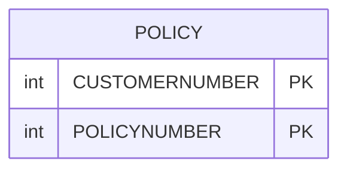

## Table of Contents

- [1. Purpose](#1-purpose)
- [2. Inputs](#2-inputs)
- [3. Outputs](#3-outputs)
- [4. Processing Logic](#4-processing-logic)
  - [4.1 Mermaid Flow Diagram](#41-mermaid-flow-diagram)
  - [4.2 Processing Logic Description](#42-processing-logic-description)
  - [4.3 Database Tables (if applicable)](#43-database-tables-if-applicable)
- [5. Paragraphs](#5-paragraphs)
- [6. Dependencies](#6-dependencies)
  - [6.1 CICS Communication Area (COMMAREA)](#61-cics-communication-area-commarea)
  - [6.2 Copybooks / Include Members](#62-copybooks--include-members)
  - [6.3 DB2 Database](#63-db2-database)
  - [6.4 CICS-Linked External Programs](#64-cics-linked-external-programs)
  - [6.5 CICS Runtime Services](#65-cics-runtime-services)
- [7. Constraints](#7-constraints)
  - [7.1 Communication Area (COMMAREA) Constraints](#71-communication-area-commarea-constraints)
  - [7.2 Request Identifier (`CA_REQUEST_ID`) Constraints](#72-request-identifier-ca_request_id-constraints)
  - [7.3 DB2 Delete Operation Constraints](#73-db2-delete-operation-constraints)
  - [7.4 Data Type and Format Constraints](#74-data-type-and-format-constraints)
  - [7.5 Sequencing and Processing Order Constraints](#75-sequencing-and-processing-order-constraints)
  - [7.6 Error Logging Constraints](#76-error-logging-constraints)
- [8. Error Handling](#8-error-handling)
- [9. Examples](#9-examples)
  - [9.1 Example 1: Successful Motor Policy Deletion](#91-example-1-successful-motor-policy-deletion)
  - [9.2 Example 2: Invalid Request Identifier](#92-example-2-invalid-request-identifier)
  - [9.3 Example 3: Database Deletion Error](#93-example-3-database-deletion-error)

## 1. Purpose

`LGDPDB01` is a CICS-hosted PL/I program that handles the deletion of insurance policies from a DB2 database. Invoked via a CICS COMMAREA, it accepts a customer number, a policy number, and a request identifier that specifies the type of policy to be removed (endowment, house, commercial, or motor). After validating the COMMAREA length and converting the input identifiers into DB2 integer host variables, it issues a SQL `DELETE` against the `POLICY` table, relying on DB2 foreign-key cascade rules to propagate the deletion to the corresponding policy-type detail table. On success it links to program `LGDPVS01` to complete any associated view or screen processing; on failure it sets an appropriate return code (`90` for a DB2 error, `98` for an undersized COMMAREA, `99` for an unrecognised request ID) and, where applicable, writes a timestamped diagnostic message containing the customer number, policy number, and SQLCODE to a transient data queue via the `LGSTSQ` utility program.

## 2. Inputs

**CICS Communication Area (COMMAREA)**

Passed via pointer `COMM_AREA_PTR` at program entry; the entire interface to the outside world is carried through this structure.

- **`COMM_AREA`** — Top-level structure overlaying `DFHCOMMAREA`; raw bytes are also accessible as `COMM_AREA_RAW` for diagnostic logging
  - **`CA_REQUEST_ID`** (`CHAR(6)`) — Identifies the operation and policy type to perform; valid values are `01DEND` (endowment), `01DHOU` (house), `01DCOM` (commercial), and `01DMOT` (motor); drives the main `SELECT` dispatch
  - **`CA_RETURN_CODE`** (`PIC '99'`) — Initialised to `00` on entry; set by the program to reflect outcome (`00` = success, `90` = DB2 error, `98` = COMMAREA too short, `99` = unrecognised request ID); also readable by the caller as an output
  - **`CA_CUSTOMER_NUM`** (`PIC '9999999999'`) — Ten-digit customer identifier supplied by the caller; converted to `DB2_CUSTOMERNUM_INT` and used as a WHERE-clause predicate in the DB2 DELETE
  - **`CA_POLICY_REQUEST`** — Sub-structure carrying all policy-related input fields:
    - **`CA_POLICY_NUM`** (`PIC '9999999999'`) — Ten-digit policy identifier supplied by the caller; converted to `DB2_POLICYNUM_INT` and used as the second WHERE-clause predicate in the DB2 DELETE
    - **`CA_POLICY_COMMON`** — Common policy attributes forwarded unchanged to `LGDPVS01` via `EXEC CICS LINK`:
      - **`CA_ISSUE_DATE`** (`CHAR(10)`) — Policy inception date
      - **`CA_EXPIRY_DATE`** (`CHAR(10)`) — Policy expiry date
      - **`CA_BROKERID`** (`PIC '9999999999'`) — Broker identifier associated with the policy
      - **`CA_PAYMENT`** (`PIC '999999'`) — Premium payment amount
    - **`CA_ENDOWMENT`** — Policy-type-specific fields for endowment policies (used when `CA_REQUEST_ID` = `01DEND`); includes fund name, term, sum assured, and life assured name
    - **`CA_MOTOR`** — Policy-type-specific fields for motor policies (used when `CA_REQUEST_ID` = `01DMOT`); includes vehicle make, model, registration number, value, and premium

**DB2 Host Variables (derived from COMMAREA inputs)**

These are internal integer conversions of the caller-supplied identifiers; they are the direct bindings into SQL and are populated entirely from COMMAREA fields.

- **`DB2_CUSTOMERNUM_INT`** (`FIXED BIN(31)`) — Integer form of `CA_CUSTOMER_NUM`; bound to the `CUSTOMERNUMBER` column in the `DELETE FROM POLICY` statement
- **`DB2_POLICYNUM_INT`** (`FIXED BIN(31)`) — Integer form of `CA_POLICY_NUM`; bound to the `POLICYNUMBER` column in the same DELETE statement

**CICS Execution Environment**

Implicit inputs provided by the CICS runtime at task initialisation; not passed by the caller but consumed by the program.

- **`EIBCALEN`** — Length of the received COMMAREA; tested to detect a missing COMMAREA (= 0, triggers ABEND `LGCA`) and an undersized COMMAREA (< 28 bytes, returns code `98`)
- **`EIBTRNID`** — Four-character transaction identifier of the current CICS task; stored in `WS_TRANSID` for diagnostic purposes
- **`EIBTRMID`** — Four-character terminal identifier; stored in `WS_TERMID` for diagnostics
- **`EIBTASKN`** — Numeric task number; stored in `WS_TASKNUM` for diagnostics

**Linked Program Interfaces**

Data passed outbound to subordinate programs; these represent inputs consumed by those programs that originate from this program's COMMAREA.

- **`LGDPVS01`** (via `EXEC CICS LINK`) — Receives the full `COMM_AREA` (32 500 bytes) after the DB2 DELETE succeeds; processes the policy-type-specific deletion in the appropriate sub-table (endowment, house, commercial, or motor)
- **`LGSTSQ`** (via `EXEC CICS LINK`) — Receives `ERROR_MSG` and a slice of `COMM_AREA_RAW` for transient data queue (TDQ) error logging; invoked only on failure paths

## 3. Outputs

- Communication Area Outputs
  - `CA_RETURN_CODE`: Returns the execution status code to the calling program (`00` for success, `90` for database errors, `98` if the communication area is too short, or `99` for an invalid or unrecognised request ID).
  - `COMM_AREA`: Passes the modified communication area structure containing updated return status and policy parameters back to the calling program or forwards it to `LGDPVS01` via `EXEC CICS LINK`.

- Database Modifications
  - `POLICY` Table: Deletes the policy row matching `CUSTOMERNUMBER` (`DB2_CUSTOMERNUM_INT`) and `POLICYNUMBER` (`DB2_POLICYNUM_INT`). Due to foreign key relationships, this delete cascades to the corresponding policy-type specific tables (Endowment, House, Motor, or Commercial).

- Error and Diagnostic Outputs
  - `ERROR_MSG`: Formatted error message containing execution date (`EM_DATE`), time (`EM_TIME`), customer number (`EM_CUSNUM`), policy number (`EM_POLNUM`), operation name (`EM_SQLREQ`), SQL return code (`EM_SQLRC`), or text explanation (`EM_MSG_TEXT`) passed to the error logging queue program `LGSTSQ`.
  - `CA_ERROR_MSG`: Communication area dump structure holding up to 90 bytes of `COMM_AREA_RAW` (`CA_DATA`) passed to `LGSTSQ` to aid in diagnostic tracing.
  - CICS ABEND (`LGCA`): Terminates execution with an abend code of `LGCA` and no dump when the program is invoked without an input communication area (`EIBCALEN = 0`).

## 4. Processing Logic

### 4.1 Mermaid Flow Diagram

```mermaid
graph TD
    classDef startEnd fill:#E8F5E9,stroke:#81C784,stroke-width:2px,color:#000;
    classDef process fill:#E1F5FE,stroke:#4FC3F7,stroke-width:2px,color:#000;
    classDef decision fill:#FFF9C4,stroke:#FFF176,stroke-width:2px,color:#000;
    classDef errorNode fill:#FFEBEE,stroke:#E57373,stroke-width:2px,color:#000;

    Start([Start Program LGDPDB01]) :::startEnd
    CheckCommareaLen{{Is Commarea Length = 0?}} :::decision
    LogCommareaError[Format No Commarea Error Message<br>Call WRITE_ERROR_MESSAGE] :::errorNode
    AbendLGCA([Abend LGCA NODUMP]) :::startEnd
    InitVars[Initialize Header Variables<br>Set Return Code to 00] :::process
    CheckMinLen{{Is Commarea Length Less Than Header Length 28?}} :::decision
    SetRc98[Set Return Code to 98] :::errorNode
    ReturnCaller([EXEC CICS RETURN]) :::startEnd
    ConvertKeys[Convert Customer and Policy Numbers to DB2 Integers] :::process
    CheckReqId{{Evaluate CA_REQUEST_ID}} :::decision
    ExecSqlDelete[Execute SQL DELETE FROM POLICY<br>where Customer Number and Policy Number Match] :::process
    CheckSqlCode{{Is SQLCODE = 0?}} :::decision
    SetRc90[Set Return Code to 90<br>Call WRITE_ERROR_MESSAGE] :::errorNode
    LinkLGDPVS01[EXEC CICS LINK to LGDPVS01<br>Pass Full Commarea] :::process
    SetRc99[Set Return Code to 99 Invalid Request ID] :::errorNode

    Start --> CheckCommareaLen
    CheckCommareaLen -- Yes --> LogCommareaError
    LogCommareaError --> AbendLGCA
    CheckCommareaLen -- No --> InitVars
    InitVars --> CheckMinLen
    CheckMinLen -- Yes --> SetRc98
    SetRc98 --> ReturnCaller
    CheckMinLen -- No --> ConvertKeys
    ConvertKeys --> CheckReqId
    CheckReqId -- Valid Policy Request --> ExecSqlDelete
    CheckReqId -- Invalid Request --> SetRc99
    SetRc99 --> ReturnCaller
    ExecSqlDelete --> CheckSqlCode
    CheckSqlCode -- No --> SetRc90
    SetRc90 --> ReturnCaller
    CheckSqlCode -- Yes --> LinkLGDPVS01
    LinkLGDPVS01 --> ReturnCaller
```

---

### 4.2 Processing Logic Description

#### 4.2.1 High-level Summary
`LGDPDB01` is a CICS PL/I data access program in the General Insurance Application responsible for deleting policy records from the Db2 relational database. It validates incoming request structures, removes the matching row from the root Db2 `POLICY` table (relying on database cascade deletion rules for policy-specific tables), and invokes `LGDPVS01` to maintain corresponding VSAM datasets.

#### 4.2.2 Execution Flow
1. **Entry & Commarea Validation**:
   - The program intercepts execution parameters from CICS.
   - It checks `EIBCALEN` to ensure a communication area is present. If `EIBCALEN = 0`, it builds an error message, logs it via `WRITE_ERROR_MESSAGE`, and abends with code `LGCA`.
   - If present, it checks whether `EIBCALEN` is at least the header length of 28 bytes (`WS_CA_HEADER_LEN`). If shorter, it sets `CA_RETURN_CODE = '98'` (Short Commarea) and issues `EXEC CICS RETURN`.

2. **Data Initialization & Conversion**:
   - Initializes `CA_RETURN_CODE` to `'00'`.
   - Captures runtime metadata (`EIBTRNID`, `EIBTRMID`, `EIBTASKN`).
   - Converts `CA_CUSTOMER_NUM` and `CA_POLICY_NUM` to 31-bit binary host integers (`DB2_CUSTOMERNUM_INT`, `DB2_POLICYNUM_INT`) and saves them for diagnostic logging.

3. **Request Identifier Evaluation**:
   - Evaluates `CA_REQUEST_ID` for supported deletion types:
     - `'01DEND'` (Endowment Policy Delete)
     - `'01DHOU'` (House Policy Delete)
     - `'01DCOM'` (Commercial Policy Delete)
     - `'01DMOT'` (Motor Policy Delete)
   - If unrecognised, sets `CA_RETURN_CODE = '99'` and terminates via `EXEC CICS RETURN`.

4. **Db2 Policy Row Deletion (`DELETE_POLICY_DB2_INFO`)**:
   - Issues `EXEC SQL DELETE FROM POLICY WHERE CUSTOMERNUMBER = :DB2_CUSTOMERNUM_INT AND POLICYNUMBER = :DB2_POLICYNUM_INT`.
   - Relies on Db2 referential integrity / foreign keys defined with cascading deletes to automatically remove associated subtype records from child tables (`ENDOWMENT`, `HOUSE`, `MOTOR`, `COMMERCIAL`).
   - Verifies `SQLCODE`. If non-zero, sets `CA_RETURN_CODE = '90'`, calls `WRITE_ERROR_MESSAGE` to log the failure and the SQLCODE, and immediately returns to the calling program.

5. **VSAM Synchronization**:
   - Upon successful SQL deletion, issues `EXEC CICS LINK PROGRAM('LGDPVS01')` passing the 32,500-byte communication area to synchronize the deletion in the VSAM data store.

6. **Error Logging Subroutine (`WRITE_ERROR_MESSAGE`)**:
   - Formats the current date and time using `EXEC CICS ASKTIME` and `EXEC CICS FORMATTIME`.
   - Populates `ERROR_MSG` with timestamp, program name, customer number, policy number, and the failing `SQLCODE`.
   - Links to error handler `LGSTSQ` passing `ERROR_MSG`.
   - Links again to `LGSTSQ` passing up to 90 bytes of the commarea (`CA_ERROR_MSG`) for diagnostic debugging.

#### 4.2.3 External Interactions
- **Db2 Database**: Executes dynamic SQL against the `POLICY` table to remove the policy by customer and policy number.
- **`LGDPVS01`**: CICS program linked to propagate policy deletions to VSAM-managed datasets.
- **`LGSTSQ`**: CICS error handling program linked via transient data queues to record formatted diagnostic messages and Commarea dumps.

#### 4.2.4 Plain Language Summary
When an insurance policy is cancelled or removed, `LGDPDB01` handles the deletion process within the mainframe database. It first checks that valid customer and policy identifiers were provided and confirms which type of policy is being deleted (motor, house, endowment, or commercial). It deletes the main policy record from the Db2 database, which automatically removes any linked policy-specific details. Finally, it calls a secondary program to ensure that the policy is also removed from legacy indexed files (VSAM) and reports any database errors encountered.

---

### 4.3 Database Tables (if applicable)



## 5. Paragraphs

**LGDPDB01 Program Entry**  
- Main procedure entry point accepting DFHEIPTR and COMM_AREA_PTR parameters with Options(Main,Reentrant)  
- Defines all working storage variables, structures, and DB2 host variables at program scope  

**WS_HEADER Runtime Information**  
- Declares working storage header with eyecatcher, transaction ID, terminal ID, task number, commarea address, and length fields  
- Initialized with program identifier 'LGDPDB01------WS' and zero/empty values  

**WS_TIME_DATE Time/Date Variables**  
- Declares WS_ABSTIME (packed decimal), WS_TIME (char 8), WS_DATE (char 10) for CICS ASKTIME/FORMATTIME operations  

**ERROR_MSG Structure**  
- Composite error message structure containing date, time, program name, and variable section with message text, customer number, policy number, SQL request type, and SQLCODE  
- Uses UNION for variable message portion with embedded literals (' CNUM=', ' PNUM=', ' SQLCODE=')  

**CA_ERROR_MSG Structure**  
- Simplified commarea error capture with literal 'COMMAREA=' prefix and 90-byte data field  

**WS_COMMAREA_LENGTHS Validation Constants**  
- Defines minimum commarea header length (28 bytes) for validation checking  

**DB2_IN_INTEGERS Host Variables**  
- Declares DB2_CUSTOMERNUM_INT and DB2_POLICYNUM_INT as FIXED BIN(31) for SQL parameter binding  

**SQLCA Include**  
- EXEC SQL INCLUDE SQLCA brings in DB2 SQL communications area for SQLCODE/SQLSTATE access  

**COMM_AREA Communication Area Definition**  
- UNION-based structure mapped over COMM_AREA_PTR with raw 32500-char overlay and typed fields  
- Contains CA_REQUEST_ID (6 chars), CA_RETURN_CODE (PIC 99), CA_CUSTOMER_NUM (PIC 9(10))  
- CA_REQUEST_SPECIFIC UNION with multiple request types: INITIALISER, CUSTOMER_REQUEST, CUSTSECR_REQUEST, POLICY_REQUEST  
- POLICY_REQUEST includes policy number, common fields (dates, broker, payment), and POLICY_SPECIFIC UNION for endowment/house/motor/commercial/claim variants  

**Program Initialization**  
- Captures EIBTRNID, EIBTRMID, EIBTASKN into WS_HEADER fields  
- Zeroes DB2_IN_INTEGERS structure  

**Commarea Validation**  
- Checks EIBCALEN = 0 → writes 'NO COMMAREA RECEIVED' error, calls WRITE_ERROR_MESSAGE, abends with ABCODE('LGCA') NODUMP  
- Initializes CA_RETURN_CODE = '00', saves EIBCALEN and COMM_AREA_PTR  
- Validates EIBCALEN >= WS_CA_HEADER_LEN (28) → sets CA_RETURN_CODE = '98' and returns if too short  

**Input Data Conversion**  
- Converts CA_CUSTOMER_NUM and CA_POLICY_NUM to DB2 integer host variables  
- Copies same values to EM_CUSNUM and EM_POLNUM for error message context  

**Request Dispatch SELECT**  
- SELECT on CA_REQUEST_ID with WHEN matching '01DEND','01DHOU','01DCOM','01DMOT'  
- On match: calls DELETE_POLICY_DB2_INFO, then EXEC CICS LINK to LGDPVS01 with full 32500-byte commarea  
- OTHERWISE: sets CA_RETURN_CODE = '99' (invalid request)  

**Program Return**  
- EXEC CICS RETURN to caller followed by PL/I RETURN statement  

**DELETE_POLICY_DB2_INFO**  
- Internal procedure: sets EM_SQLREQ = ' DELETE POLICY  '  
- EXEC SQL DELETE FROM POLICY WHERE CUSTOMERNUMBER = :DB2_CUSTOMERNUM_INT AND POLICYNUMBER = :DB2_POLICYNUM_INT  
- Checks SQLCODE <> 0 → sets CA_RETURN_CODE = '90', calls WRITE_ERROR_MESSAGE, EXEC CICS RETURN  
- Treats SQLCODE 0 and 100 (not found) as success (record absent)  

**WRITE_ERROR_MESSAGE**  
- Internal procedure: saves SQLCODE to EM_SQLRC  
- EXEC CICS ASKTIME → FORMATTIME to populate WS_DATE (MMDDYYYY) and WS_TIME  
- Copies to EM_DATE/EM_TIME, links to LGSTSQ with ERROR_MSG commarea  
- If EIBCALEN > 0: writes first 90 bytes (or full length if <91) of COMM_AREA_RAW to CA_ERROR_MSG, links to LGSTSQ again

## 6. Dependencies

### 6.1 CICS Communication Area (COMMAREA)

- **`DFHCOMMAREA` / `COMM_AREA`** — The primary interface through which the calling program passes input and receives output. Mapped via pointer `COMM_AREA_PTR` using the structure defined in `Includes/LGCMAREA.inc`. Contains the request ID, return code, customer number, and policy-type-specific sub-structures.
  - **`CA_REQUEST_ID`** — Six-character code that drives the routing logic; accepted values are `01DEND` (endowment), `01DHOU` (house), `01DCOM` (commercial), and `01DMOT` (motor).
  - **`CA_RETURN_CODE`** — Status code written back to the caller (`00` = success, `90` = DB2 error, `98` = COMMAREA too short, `99` = unrecognised request ID).
  - **`CA_CUSTOMER_NUM`** — Customer identifier used as a DB2 DELETE predicate.
  - **`CA_POLICY_NUM`** — Policy identifier used as a DB2 DELETE predicate.
  - **`CA_POLICY_REQUEST`** — Sub-structure holding policy-type-specific fields (endowment, motor, etc.) forwarded to the VSAM layer.

### 6.2 Copybooks / Include Members

- **`Includes/LGCMAREA.inc`** — Defines the full `COMM_AREA` union structure (included via `%INCLUDE LGCMAREA`). Required at compile time to map all COMMAREA fields used throughout the program.
- **`SQLCA`** (`EXEC SQL INCLUDE SQLCA`) — DB2-supplied SQL Communication Area providing `SQLCODE` and related fields used for DB2 error detection after the DELETE statement.

### 6.3 DB2 Database

- **`POLICY` table** — The DB2 table from which a row is deleted. The DELETE is keyed on `CUSTOMERNUMBER` and `POLICYNUMBER`. Due to defined foreign-key constraints, the delete cascades to the appropriate policy-type child table (endowment, house, motor, or commercial).
  - **`DB2_CUSTOMERNUM_INT`** — `FIXED BIN(31)` host variable bound to the `CUSTOMERNUMBER` column.
  - **`DB2_POLICYNUM_INT`** — `FIXED BIN(31)` host variable bound to the `POLICYNUMBER` column.

### 6.4 CICS-Linked External Programs

- **`LGDPVS01`** — Invoked via `EXEC CICS LINK` after the DB2 delete succeeds for any recognised request type. Handles deletion of the corresponding VSAM record for the same customer and policy. Receives the full `COMM_AREA` at length 32500.
- **`LGSTSQ`** — Error-logging utility invoked via `EXEC CICS LINK` within the `WRITE_ERROR_MESSAGE` procedure. Receives the `ERROR_MSG` structure (containing date, time, program name, customer number, policy number, and SQLCODE) and optionally the first 90 bytes of the raw COMMAREA, writing them to a Transient Data Queue (TDQ).

### 6.5 CICS Runtime Services

- **`EXEC CICS ABEND ABCODE('LGCA') NODUMP`** — Issued when `EIBCALEN = 0` (no COMMAREA received), terminating the task with abend code `LGCA`.
- **`EXEC CICS RETURN`** — Used to return control to the caller at normal exit points and after DB2 or COMMAREA error conditions.
- **`EXEC CICS ASKTIME`** / **`EXEC CICS FORMATTIME`** — Used within `WRITE_ERROR_MESSAGE` to obtain and format the current timestamp for inclusion in error log entries.
- **EIB Fields** — The Execute Interface Block fields `EIBTRNID`, `EIBTRMID`, `EIBTASKN`, and `EIBCALEN` supply the transaction ID, terminal ID, task number, and COMMAREA length at runtime.

## 7. Constraints

### 7.1 Communication Area (COMMAREA) Constraints

- **COMMAREA must be present**: If `EIBCALEN = 0` (no COMMAREA passed by the caller), the program immediately issues a CICS ABEND with code `LGCA`. Processing cannot proceed without a COMMAREA.
  - Enforced at lines 212–216 via an `IF` check on `EIBCALEN` followed by `EXEC CICS ABEND ABCODE('LGCA') NODUMP`.

- **COMMAREA minimum length**: The COMMAREA must be at least 28 bytes (`WS_CA_HEADER_LEN = 28`), which covers the header fields (`CA_REQUEST_ID`, `CA_RETURN_CODE`, and `CA_CUSTOMER_NUM`). If `EIBCALEN < 28`, return code `98` is set and the program returns immediately without performing any deletion.
  - Enforced at lines 224–227.

- **COMMAREA maximum raw size**: The `COMM_AREA_RAW` overlay field is declared as `CHAR(32500)`, capping the absolute maximum COMMAREA size at 32,500 bytes. The `EXEC CICS LINK` to `LGDPVS01` passes exactly `LENGTH(32500)`, so the downstream program always receives the full 32,500-byte buffer regardless of actual content.

---

### 7.2 Request Identifier (`CA_REQUEST_ID`) Constraints

- **Only four valid request codes are accepted**: `CA_REQUEST_ID` must be exactly one of `'01DEND'` (endowment), `'01DHOU'` (house), `'01DCOM'` (commercial), or `'01DMOT'` (motor). Any other value is rejected.
  - Enforced at lines 240–249 via a `SELECT` statement; the `OTHERWISE` branch sets `CA_RETURN_CODE = '99'` and no database operation is performed.

- **Request ID is a fixed 6-character code**: `CA_REQUEST_ID` is declared as `CHAR(6)`, so the caller must supply exactly six characters. No partial or variable-length codes are interpreted.

---

### 7.3 DB2 Delete Operation Constraints

- **Delete requires both customer number and policy number**: The `DELETE FROM POLICY` statement filters by `CUSTOMERNUMBER = :DB2_CUSTOMERNUM_INT AND POLICYNUMBER = :DB2_POLICYNUM_INT`. Both fields must be supplied; neither alone is sufficient to identify the target row.
  - Enforced via the SQL `WHERE` clause at lines 269–270.

- **SQL SQLCODE must be 0 for success**: Any non-zero SQLCODE (including unexpected errors) causes `CA_RETURN_CODE = '90'`, an error message to be written, and an immediate `EXEC CICS RETURN`. The only implicitly tolerated non-zero code is `SQLCODE 100` (record not found), treated as a logical success because the comment at lines 272–273 states "end result is record does not exist" — however, the code as written does **not** explicitly exclude 100; any non-zero SQLCODE triggers the error path.
  - Enforced at lines 274–278.

- **Cascading delete is governed by DB2 foreign key constraints**: The comment at lines 260–262 states that because of `FOREIGN KEY` definitions on the database, deleting the row from the `POLICY` table should automatically propagate the delete to the appropriate policy-type table (Endowment, House, Motor, or Commercial). The program does not issue separate `DELETE` statements for child tables; correctness depends entirely on the DB2 schema's referential integrity rules being in place.

---

### 7.4 Data Type and Format Constraints

- **Customer number is a 10-digit numeric picture**: `CA_CUSTOMER_NUM` is declared as `PIC '9999999999'`, restricting it to exactly 10 decimal digits. Non-numeric content would cause a data exception at the point of assignment to `DB2_CUSTOMERNUM_INT` (a `FIXED BIN(31)` host variable).

- **Policy number is a 10-digit numeric picture**: `CA_POLICY_NUM` is declared as `PIC '9999999999'`, with the same numeric restriction and the same risk of a data exception on conversion to `DB2_POLICYNUM_INT`.

- **Return code is a 2-digit numeric picture**: `CA_RETURN_CODE` is declared as `PIC '99'`, restricting it to values `00`–`99`. Only three values are ever written by this program: `'00'` (success), `'90'` (DB2 error), `'98'` (short COMMAREA), and `'99'` (invalid request ID).

- **Host variables are 31-bit binary integers**: `DB2_CUSTOMERNUM_INT` and `DB2_POLICYNUM_INT` are both `FIXED BIN(31)`, limiting valid customer and policy numbers to values in the range 0–2,147,483,647.

---

### 7.5 Sequencing and Processing Order Constraints

- **COMMAREA presence check precedes all other processing**: The zero-length COMMAREA check (lines 212–216) is the very first conditional test executed, before any field is read or any DB2 variable is initialized from COMMAREA content.

- **COMMAREA length check precedes field access**: The minimum-length check (lines 224–227) occurs before `CA_CUSTOMER_NUM` and `CA_POLICY_NUM` are read (lines 230–231), preventing out-of-bounds access to COMMAREA fields.

- **DB2 delete must complete before linking to `LGDPVS01`**: `DELETE_POLICY_DB2_INFO` is called first; only if it returns normally (SQLCODE = 0) does the program proceed to `EXEC CICS LINK PROGRAM('LGDPVS01')`. A DB2 error causes an immediate `EXEC CICS RETURN`, bypassing the link entirely.

- **Return code is initialized to `'00'` before any branch**: `CA_RETURN_CODE = '00'` is set at line 219, before the request-ID dispatch. This ensures the default outcome is success unless explicitly overwritten by an error branch.

---

### 7.6 Error Logging Constraints

- **Error messages are written via `LGSTSQ` only on failure**: `WRITE_ERROR_MESSAGE` is called only from the no-COMMAREA path and the DB2 error path, not on successful completion.

- **COMMAREA data logged is capped at 90 bytes**: When logging error context, the program writes at most 90 bytes of the raw COMMAREA to the TDQ. If `EIBCALEN < 91` it writes exactly `EIBCALEN` bytes; otherwise it writes 90 bytes. This prevents oversized log entries.
  - Enforced at lines 305–317.

- **Error logging only occurs if COMMAREA is present**: The COMMAREA dump inside `WRITE_ERROR_MESSAGE` is guarded by `IF (EIBCALEN > 0)` (line 305), so no attempt is made to read COMMAREA data if the length is zero.

## 8. Error Handling

**Communication Area (COMMAREA) Validation**

- **Missing COMMAREA detection:** At program entry, the CICS-provided field `EIBCALEN` is checked against zero. If no COMMAREA was passed by the caller, an error message is set, the `WRITE_ERROR_MESSAGE` procedure is invoked to log diagnostic information, and the program issues an `EXEC CICS ABEND` with abend code `LGCA` and `NODUMP` to terminate the transaction immediately. This is the most severe response in the program and prevents any further processing without valid input.

- **Short COMMAREA detection:** A second length check compares `EIBCALEN` against the minimum required header length (`WS_CA_HEADER_LEN`, set to 28 bytes). If the received COMMAREA is smaller than the required minimum, `CA_RETURN_CODE` is set to `'98'` and the program returns immediately to the caller via `EXEC CICS RETURN`, without attempting any database operation or logging.

---

**Request ID Validation**

- **Unrecognised request type:** The `CA_REQUEST_ID` field in the COMMAREA is evaluated using a `SELECT` statement. Only the values `'01DEND'`, `'01DHOU'`, `'01DCOM'`, and `'01DMOT'` are treated as valid. Any other value falls into the `OTHERWISE` branch, where `CA_RETURN_CODE` is set to `'99'` and the program returns to the caller. No error message is logged for this condition; it is surfaced purely through the return code.

---

**DB2 SQL Error Handling**

- **DELETE statement failure:** After executing the SQL `DELETE` against the `POLICY` table, the `SQLCODE` field from the SQLCA is checked. The program intentionally treats both `SQLCODE = 0` (success) and `SQLCODE = 100` (row not found) as acceptable outcomes, reflecting a design decision that "record does not exist" is an acceptable end state for a delete operation. Any other non-zero `SQLCODE` value is treated as an error: `CA_RETURN_CODE` is set to `'90'`, `WRITE_ERROR_MESSAGE` is called to produce a diagnostic log entry, and the program returns to the caller via `EXEC CICS RETURN` without proceeding to the subsequent `EXEC CICS LINK` to `LGDPVS01`.

---

**Error Logging and Notification (`WRITE_ERROR_MESSAGE` procedure)**

- **Structured diagnostic message construction:** The `WRITE_ERROR_MESSAGE` procedure assembles a formatted error record that includes the current date and time (obtained via `EXEC CICS ASKTIME` and `EXEC CICS FORMATTIME`), the program name (`LGDPDB01`), the customer number, the policy number, the SQL request description, and the `SQLCODE` value. This provides a full diagnostic record for each error event.

- **TDQ logging via `LGSTSQ`:** The assembled `ERROR_MSG` structure is written to a Transient Data Queue by linking to the utility program `LGSTSQ` using `EXEC CICS LINK`. This externalises the error event for operational monitoring or post-incident analysis.

- **COMMAREA dump to TDQ:** In addition to the primary error message, up to 90 bytes of the raw COMMAREA content are captured and also written to the TDQ via `LGSTSQ`. If the actual COMMAREA length is less than 91 bytes, only the available bytes are written; otherwise, the first 90 bytes are extracted. This provides input-data context alongside the error details, aiding in fault diagnosis.

---

**Return Code Signalling to the Caller**

- **Standardised return codes:** `CA_RETURN_CODE` in the COMMAREA is used as the primary mechanism to communicate the outcome of the operation back to the calling program:
  - `'00'` — initialised at program entry; indicates success if no error condition is encountered.
  - `'90'` — set when a DB2 SQL error occurs during the `DELETE` operation.
  - `'98'` — set when the received COMMAREA is shorter than the required minimum length.
  - `'99'` — set when the `CA_REQUEST_ID` does not match any recognised request type.

## 9. Examples

### 9.1 Example 1: Successful Motor Policy Deletion

This example illustrates the standard path for deleting an existing motor insurance policy (`01DMOT`) associated with a specific customer.

#### 9.1.1 Input Data
* **Communication Area Header & Keys:**
  * `CA_REQUEST_ID`: `'01DMOT'`
  * `CA_CUSTOMER_NUM`: `0000000001`
  * `CA_POLICY_NUM`: `0000000042`
* **CICS Environment:**
  * `EIBCALEN`: `32500`

#### 9.1.2 Expected Output
* **`CA_RETURN_CODE`**: `'00'` (Success)
* **Db2 State**: The corresponding row in the `POLICY` table where `CUSTOMERNUMBER = 1` and `POLICYNUMBER = 42` is removed (cascading foreign keys remove associated child records in policy type tables).
* **Downstream Invocation**: `LGDPDB01` issues `EXEC CICS LINK PROGRAM('LGDPVS01')` passing the communication area to perform corresponding deletions in VSAM data stores.

#### 9.1.3 Explanation
1. The program validates that `EIBCALEN` is greater than or equal to `WS_CA_HEADER_LEN` (28 bytes).
2. It initializes `CA_RETURN_CODE` to `'00'` and converts `CA_CUSTOMER_NUM` and `CA_POLICY_NUM` into 31-bit binary host integers (`DB2_CUSTOMERNUM_INT = 1`, `DB2_POLICYNUM_INT = 42`).
3. The `SELECT` block matches `CA_REQUEST_ID = '01DMOT'` and calls `DELETE_POLICY_DB2_INFO`.
4. The embedded SQL `DELETE FROM POLICY` executes with `SQLCODE = 0`.
5. Control proceeds to link to `LGDPVS01` to synchronize VSAM storage before returning control with code `'00'`.

---

### 9.2 Example 2: Invalid Request Identifier

This example demonstrates program behavior when an unrecognized or unsupported operation code is supplied in the communication area.

#### 9.2.1 Input Data
* **Communication Area Header & Keys:**
  * `CA_REQUEST_ID`: `'01DXXX'` (Unrecognized operation)
  * `CA_CUSTOMER_NUM`: `0000000005`
  * `CA_POLICY_NUM`: `0000000100`
* **CICS Environment:**
  * `EIBCALEN`: `32500`

#### 9.2.2 Expected Output
* **`CA_RETURN_CODE`**: `'99'` (Unrecognized Request ID)
* **Db2 State**: No SQL delete operation is executed against Db2 tables.
* **Downstream Invocation**: No downstream programs (`LGDPVS01` or `LGSTSQ`) are invoked.

#### 9.2.3 Explanation
1. `LGDPDB01` verifies that a valid COMMAREA length is passed.
2. The `SELECT ( CA_REQUEST_ID )` statement checks against recognized request identifiers (`'01DEND'`, `'01DHOU'`, `'01DCOM'`, `'01DMOT'`).
3. Because `'01DXXX'` matches none of the recognized values, the `OTHERWISE` clause executes, setting `CA_RETURN_CODE` to `'99'`.
4. The program skips database processing and issues `EXEC CICS RETURN` to immediately hand control back to the caller.

---

### 9.3 Example 3: Database Deletion Error

This example demonstrates error handling and transient data queue logging when a Db2 database failure occurs during record deletion.

#### 9.3.1 Input Data
* **Communication Area Header & Keys:**
  * `CA_REQUEST_ID`: `'01DEND'`
  * `CA_CUSTOMER_NUM`: `0000000012`
  * `CA_POLICY_NUM`: `0000000550`
* **CICS / Db2 Environment:**
  * `EIBCALEN`: `32500`
  * Db2 returns a negative SQL code (e.g., `SQLCODE = -904` due to resource unavailability).

#### 9.3.2 Expected Output
* **`CA_RETURN_CODE`**: `'90'` (Db2 Error)
* **Error Queue Output**: Two records written to the transient data queue via `LGSTSQ`:
  * Formatted error string containing current timestamp, program name `LGDPDB01`, customer number, policy number, SQL statement name (`DELETE POLICY`), and `SQLCODE = -00904`.
  * The first 90 bytes of the input communication area payload.
* **Downstream Invocation**: `LGDPVS01` is skipped; `LGDPDB01` terminates immediately via `EXEC CICS RETURN`.

#### 9.3.3 Explanation
1. The request ID `'01DEND'` is matched, and `DELETE_POLICY_DB2_INFO` is invoked.
2. The `DELETE FROM POLICY` statement fails with `SQLCODE <> 0`.
3. The procedure sets `CA_RETURN_CODE = '90'` and invokes `WRITE_ERROR_MESSAGE`.
4. `WRITE_ERROR_MESSAGE` uses `EXEC CICS ASKTIME` and `FORMATTIME` to populate timestamp fields and links to `LGSTSQ` to record error diagnostics.
5. The procedure executes `EXEC CICS RETURN` directly, preventing `LGDPVS01` from executing.

---

Generated by IBM Bob Premium Package for Z
