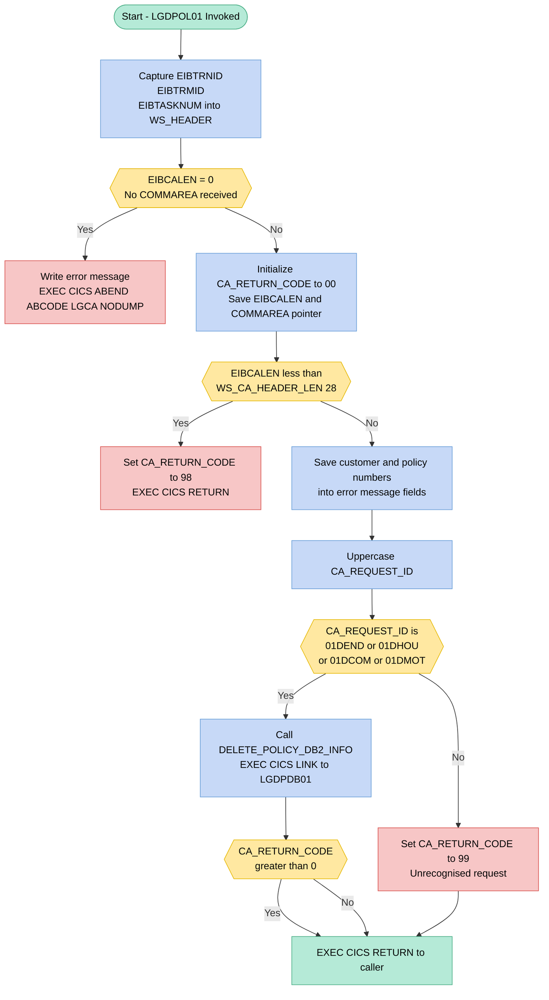
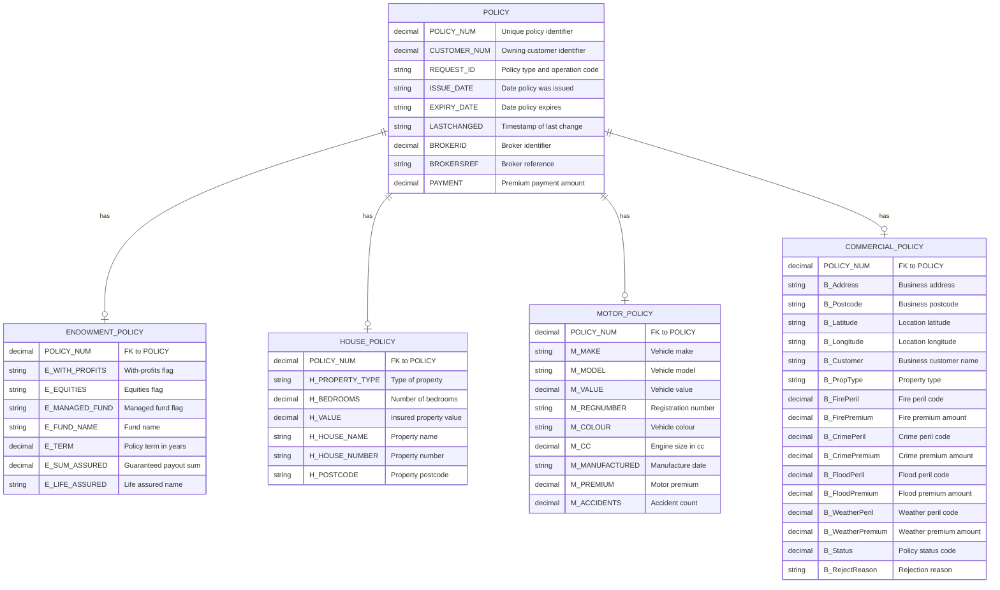

## Table of Contents

- [1. Purpose](#1-purpose)
- [2. Inputs](#2-inputs)
- [3. Outputs](#3-outputs)
- [4. Processing Logic](#4-processing-logic)
  - [4.1 Mermaid Flow Diagram](#41-mermaid-flow-diagram)
  - [4.2 Processing Logic Description](#42-processing-logic-description)
  - [4.3 Database Tables](#43-database-tables)
- [5. Paragraphs](#5-paragraphs)
- [6. Dependencies](#6-dependencies)
  - [6.1 CICS Middleware and System Services](#61-cics-middleware-and-system-services)
  - [6.2 External Programs and Subroutines](#62-external-programs-and-subroutines)
  - [6.3 Data Structures and Copybooks](#63-data-structures-and-copybooks)
  - [6.4 Input Parameters and Operational Controls](#64-input-parameters-and-operational-controls)
- [7. Constraints](#7-constraints)
  - [7.1 Communication Area (COMMAREA) Constraints](#71-communication-area-commarea-constraints)
  - [7.2 Request Identifier (`CA_REQUEST_ID`) Constraints](#72-request-identifier-ca_request_id-constraints)
  - [7.3 Return Code (`CA_RETURN_CODE`) Constraints](#73-return-code-ca_return_code-constraints)
  - [7.4 Data Type and Field Format Constraints](#74-data-type-and-field-format-constraints)
  - [7.5 Processing Sequencing Constraints](#75-processing-sequencing-constraints)
  - [7.6 Error Logging Constraints](#76-error-logging-constraints)
- [8. Error Handling](#8-error-handling)
  - [8.1 Communication Area Validation and Error Handling](#81-communication-area-validation-and-error-handling)
  - [8.2 Request Identification Validation](#82-request-identification-validation)
  - [8.3 Downstream Program Invocation and Error Propagation](#83-downstream-program-invocation-and-error-propagation)
  - [8.4 Error Logging and Diagnostic Notifications](#84-error-logging-and-diagnostic-notifications)
- [9. Examples](#9-examples)
  - [9.1 Example 1: Delete an Endowment Policy (Success)](#91-example-1-delete-an-endowment-policy-success)
  - [9.2 Example 2: Unrecognised Request ID](#92-example-2-unrecognised-request-id)
  - [9.3 Example 3: Commarea Too Short](#93-example-3-commarea-too-short)
  - [9.4 Example 4: Delete a Motor Policy Where the Backend Reports an Error](#94-example-4-delete-a-motor-policy-where-the-backend-reports-an-error)

## 1. Purpose

LGDPOL01 is a CICS business logic program within the General Insurance Application designed to process policy deletion requests across multiple insurance categories, including endowment, house, commercial, and motor policies. It serves as an intermediary service layer that validates incoming communication area parameters—such as verifying request identifiers and ensuring sufficient communication payload length—before delegating the actual database deletion operations to the underlying data access program LGDPDB01. By coordinating the deletion workflow and returning appropriate status indicators, the program ensures that policy records and their associated domain-specific table entries are removed from the system in a controlled and consistent manner.

## 2. Inputs

**CICS Communication Area (COMMAREA)**

The program receives a single pointer parameter `COMM_AREA_PTR` (declared in the procedure statement) that points to the communication area passed by the CICS runtime. All external inputs to the program are fields within this structure.

- **`CA_REQUEST_ID`** *(CHAR(6))* — Identifies the operation and policy type to perform; valid values are `01DEND` (endowment), `01DHOU` (house), `01DCOM` (commercial), and `01DMOT` (motor). Controls which deletion path is executed.
- **`CA_CUSTOMER_NUM`** *(PIC 9999999999)* — The 10-digit customer identifier passed in by the caller; used to identify the owner of the policy being deleted.
- **`CA_POLICY_NUM`** *(PIC 9999999999)* — The 10-digit policy identifier passed in by the caller; identifies the specific policy record to be deleted from DB2.
- **`CA_RETURN_CODE`** *(PIC 99)* — Initialized to `00` by this program but read back by the caller after return; acts as the status output flowing to the upstream caller.

  **Common Policy Fields** (within `CA_POLICY_COMMON`, passed through to the backend `LGDPDB01`):
  - **`CA_ISSUE_DATE`** *(CHAR(10))* — Issue date of the policy.
  - **`CA_EXPIRY_DATE`** *(CHAR(10))* — Expiry date of the policy.
  - **`CA_BROKERID`** *(PIC 9999999999)* — Broker identifier associated with the policy.
  - **`CA_PAYMENT`** *(PIC 999999)* — Premium payment amount for the policy.

  **Endowment-Specific Fields** (within `CA_ENDOWMENT`, used when `CA_REQUEST_ID` = `01DEND`):
  - **`CA_E_SUM_ASSURED`** *(PIC 999999)* — Guaranteed sum assured for the endowment policy.

  **House-Specific Fields** (within `CA_HOUSE`, used when `CA_REQUEST_ID` = `01DHOU`):
  - **`CA_H_VALUE`** *(PIC 99999999)* — Insured value of the residential property.

  **Motor-Specific Fields** (within `CA_MOTOR`, used when `CA_REQUEST_ID` = `01DMOT`):
  - **`CA_M_VALUE`** *(PIC 999999)* — Declared market value of the insured vehicle.

  **Commercial-Specific Fields** (within `CA_COMMERCIAL`, used when `CA_REQUEST_ID` = `01DCOM`):
  - **`CA_B_FirePremium`** *(PIC 99999999)* — Fire peril premium for the commercial property policy.

  **Claim Fields** (within `CA_CLAIM`, passed through to the backend):
  - **`CA_C_Paid`** *(PIC 99999999)* — Cumulative claim payout amount disbursed to date.

**CICS Execution Environment (EIB Fields)**

These values are supplied by the CICS runtime at program invocation and are read directly by the program.

- **`EIBCALEN`** — Length of the received COMMAREA; validated to be non-zero and at least 28 bytes (`WS_CA_HEADER_LEN`) before processing proceeds.
- **`EIBTRNID`** — CICS transaction identifier; captured into `WS_TRANSID` for diagnostic context.
- **`EIBTRMID`** — CICS terminal identifier; captured into `WS_TERMID` for diagnostic context.
- **`EIBTASKN`** — CICS task number; captured into `WS_TASKNUM` for diagnostic context.

**Linked Backend Program**

- **`LGDPDB01`** *(CHAR(8), literal `'LGDPDB01'`)* — The name of the CICS program invoked via `EXEC CICS LINK` to perform the actual DB2 deletion. The entire COMMAREA is forwarded to it with a fixed length of 32,500 bytes.

## 3. Outputs

**Communication Area (COMMAREA) — Returned to Calling Program**

- `CA_RETURN_CODE`
  - Written back to the caller via the shared COMMAREA to indicate the outcome of the delete request
  - `'00'` — successful initialisation; further outcome is determined by the linked DB2 program
  - `'98'` — COMMAREA received was too short (below the minimum header length)
  - `'99'` — the `CA_REQUEST_ID` was not recognised as a valid delete request type

**CICS Program Link — `LGDPDB01` (DB2 Delete Backend)**

- The full COMMAREA (32,500 bytes) is passed to `LGDPDB01` via `EXEC CICS LINK`; this program performs the actual DB2 row deletion
- The following fields, passed within the COMMAREA, drive and reflect the database delete operation:
  - `CA_REQUEST_ID` — identifies the type of policy to delete (`01DEND`, `01DHOU`, `01DCOM`, `01DMOT`)
  - `CA_CUSTOMER_NUM` — identifies the owning customer record
  - `CA_POLICY_NUM` — identifies the specific policy row to be deleted
  - `CA_RETURN_CODE` — may be updated by `LGDPDB01` to signal a DB2 failure back through the chain
  - Common policy fields populated in the COMMAREA at the time of deletion:
    - `CA_ISSUE_DATE`, `CA_EXPIRY_DATE`, `CA_PAYMENT`, `CA_BROKERID`
  - Policy-type-specific fields present in the COMMAREA (union overlay selected by `CA_REQUEST_ID`):
    - Endowment: `CA_E_SUM_ASSURED`
    - House: `CA_H_VALUE`
    - Motor: `CA_M_VALUE`
    - Commercial: `CA_B_FIREPREMIUM`
    - Claim: `CA_C_PAID`

**CICS Transient Data Queue (TDQ) — Error Diagnostic Output via `LGSTSQ`**

- Written only when no COMMAREA is received at program entry (EIBCALEN = 0)
- Two separate `EXEC CICS LINK PROGRAM('LGSTSQ')` calls are issued, writing to a TDQ (CSMT):
  - `ERROR_MSG` — formatted diagnostic record containing:
    - `EM_DATE` / `EM_TIME` — timestamp of the error
    - Program identifier (`LGDPOL01`) embedded as a literal
    - `EM_CUSNUM` — customer number captured at the point of error
    - `EM_POLNUM` — policy number captured at the point of error
    - `EM_SQLREQ` / `EM_SQLRC` — SQL request name and return code (available for population by error-raising logic)
    - `EM_MSG_TEXT` — free-text message, e.g. `' NO COMMAREA RECEIVED'`
  - `CA_ERROR_MSG` (`CA_DATA`) — up to 90 bytes of raw COMMAREA content, written as a secondary diagnostic record to assist in diagnosing the failed invocation

**CICS Abend**

- `EXEC CICS ABEND ABCODE('LGCA') NODUMP` — issued when no COMMAREA is received; terminates the task with abend code `LGCA` and suppresses a system dump; this is an observable side effect signalled to the CICS task manager and any monitoring infrastructure

## 4. Processing Logic

### 4.1 Mermaid Flow Diagram



---

### 4.2 Processing Logic Description

#### 4.2.1 High-level Summary

`LGDPOL01` is a CICS PL/I front-end program that handles deletion of insurance policy records from a DB2 database. It validates the inbound communication area (COMMAREA), identifies the policy type being deleted (Endowment, House, Commercial, or Motor) from the request identifier, and delegates the actual DB2 deletion to a backend program (`LGDPDB01`) via an `EXEC CICS LINK`. It acts as a router and validator, ensuring only well-formed, recognised requests reach the database tier.

---

#### 4.2.2 Execution Flow

**Step 1 – Program Initialisation**
Upon entry, the program captures runtime context from the CICS Execute Interface Block (EIB): the transaction ID (`EIBTRNID`), terminal ID (`EIBTRMID`), and task number (`EIBTASKN`) are stored in the `WS_HEADER` working-storage structure. These are used for diagnostic and error-reporting purposes.

**Step 2 – COMMAREA Presence Check**
`EIBCALEN` (the EIB field holding the length of the passed COMMAREA) is tested for zero. A zero value means no COMMAREA was passed by the caller, which is a fatal condition. In this case:
- An error message `' NO COMMAREA RECEIVED'` is written to the transient data queue via `WRITE_ERROR_MESSAGE`.
- The task is terminated abnormally with `EXEC CICS ABEND ABCODE('LGCA') NODUMP`, producing an abend code `LGCA` without generating a storage dump.

**Step 3 – COMMAREA Length Validation**
If a COMMAREA is present, `CA_RETURN_CODE` is initialised to `'00'` and the COMMAREA length and pointer are saved. The COMMAREA length is then compared against the minimum required header length (`WS_CA_HEADER_LEN = 28` bytes). If it is too short:
- `CA_RETURN_CODE` is set to `'98'` (invalid COMMAREA length).
- `EXEC CICS RETURN` is issued immediately, sending control back to the caller with the error code.

**Step 4 – Error Diagnostics Setup**
The customer number (`CA_CUSTOMER_NUM`) and policy number (`CA_POLICY_NUM`) are copied into the error message structure (`EM_CUSNUM`, `EM_POLNUM`) so they are available if an error message needs to be written later.

**Step 5 – Request ID Normalisation**
`CA_REQUEST_ID` is converted to uppercase via the built-in `UPPERCASE` function. This ensures case-insensitive matching on the request type code.

**Step 6 – Request ID Routing (SELECT)**
A `SELECT` statement evaluates `CA_REQUEST_ID` against the four supported deletion request codes:

| Request ID | Policy Type     |
|------------|----------------|
| `01DEND`   | Endowment       |
| `01DHOU`   | House           |
| `01DCOM`   | Commercial      |
| `01DMOT`   | Motor           |

- **Recognised request:** `DELETE_POLICY_DB2_INFO` is called. If `CA_RETURN_CODE` is greater than `0` on return (indicating a DB2 error reported by the backend), the program returns immediately to the caller with that error code.
- **Unrecognised request:** `CA_RETURN_CODE` is set to `'99'` and execution falls through to the final `EXEC CICS RETURN`.

**Step 7 – Return to Caller**
`EXEC CICS RETURN` is issued to return control to the calling program with `CA_RETURN_CODE` set to the appropriate value (`'00'` for success, `'98'`, `'99'`, or a DB2-originated code for failures).

---

#### 4.2.3 Subroutine: `DELETE_POLICY_DB2_INFO`

This internal procedure performs a synchronous CICS program call to the backend database module:

```
EXEC CICS LINK PROGRAM(LGDPDB01)
          COMMAREA(COMM_AREA)
          LENGTH(32500);
```

- `LGDPDB01` is the DB2 data-access program responsible for executing the actual `DELETE` SQL against the Policy table and the appropriate policy-type table (Endowment, House, Motor, or Commercial). Foreign key cascade rules in the DB2 schema ensure the related type-specific row is also deleted.
- The full 32,500-byte COMMAREA (containing request ID, customer number, policy number, and all policy details) is passed to `LGDPDB01`.
- On return, `CA_RETURN_CODE` within the COMMAREA reflects the outcome of the DB2 operation.

---

#### 4.2.4 Subroutine: `WRITE_ERROR_MESSAGE`

Called only when no COMMAREA is received. It:
1. Obtains the current absolute time using `EXEC CICS ASKTIME ABSTIME(WS_ABSTIME)`.
2. Formats it into a human-readable date (`MM/DD/YYYY`) and time (`HH:MM:SS`) using `EXEC CICS FORMATTIME`.
3. Links to `LGSTSQ` (a transient data queue logging utility) twice:
   - First, to write the main `ERROR_MSG` structure (date, time, program name, customer number, policy number).
   - Second, to write up to 90 bytes of the raw COMMAREA content for additional diagnostic context — or as much as is available if `EIBCALEN` is less than 90.

---

#### 4.2.5 External Interactions

| Program / System | Interaction Type | Purpose |
|-----------------|-----------------|---------|
| `LGDPDB01`      | `EXEC CICS LINK` | Performs the DB2 `DELETE` on the Policy table and cascades to the relevant policy-type table |
| `LGSTSQ`        | `EXEC CICS LINK` | Writes diagnostic error messages to a CICS transient data queue (`CSMT`) |
| DB2 (via LGDPDB01) | SQL DELETE (indirect) | Removes the policy row and, via foreign key constraints, the corresponding Endowment/House/Motor/Commercial row |

---

#### 4.2.6 Plain Language Summary

`LGDPOL01` is the "gatekeeper" for deleting an insurance policy. When called, it first checks that it has been given the information it needs (the COMMAREA). If no information is provided, it raises a fatal error. If the information is too short, it returns an error code `98`. It then looks at the request type code to determine what kind of policy is being deleted — endowment, house, commercial, or motor. For any recognised type, it hands the work off to a database program (`LGDPDB01`) that does the actual deletion from the database. If the request type is not recognised, it returns error code `99`. All results — success or failure — are communicated back to the caller through the return code in the shared data area.

---

### 4.3 Database Tables



## 5. Paragraphs

- **LGDPOL01 (Main Procedure)**
  - Serves as the program entry point for deleting an insurance policy record from DB2.
  - Initialises diagnostic header fields (`WS_TRANSID`, `WS_TERMID`, `WS_TASKNUM`) from the CICS EIB fields `EIBTRNID`, `EIBTRMID`, and `EIBTASKN`.
  - Validates that a communication area (COMMAREA) was passed by checking `EIBCALEN = 0`; if absent, writes an error message and issues `EXEC CICS ABEND ABCODE('LGCA') NODUMP` to terminate abnormally.
  - Initialises `CA_RETURN_CODE` to `'00'` and saves the COMMAREA length and pointer into working-storage fields.
  - Performs a minimum-length check (`EIBCALEN < WS_CA_HEADER_LEN`): if the COMMAREA is too short, sets `CA_RETURN_CODE` to `'98'` and returns to the caller immediately.
  - Copies customer and policy numbers into the error-message structure for potential diagnostic use.
  - Converts `CA_REQUEST_ID` to uppercase and evaluates it with a `SELECT` statement:
    - When the value is one of `'01DEND'`, `'01DHOU'`, `'01DCOM'`, or `'01DMOT'`, calls `DELETE_POLICY_DB2_INFO`; if that routine returns a non-zero `CA_RETURN_CODE`, control returns immediately to the caller.
    - For any other value (`OTHERWISE`), sets `CA_RETURN_CODE` to `'99'` to signal an unrecognised request.
  - Issues `EXEC CICS RETURN` to hand control back to the calling CICS environment.

- **DELETE_POLICY_DB2_INFO**
  - Encapsulates the DB2 policy-deletion logic by delegating to a backend CICS program.
  - Issues `EXEC CICS LINK PROGRAM(LGDPDB01) COMMAREA(COMM_AREA) LENGTH(32500)` to invoke `LGDPDB01`, which performs the actual deletion from the DB2 policy table and, via foreign-key cascade, from the appropriate policy-type table (Endowment, House, Motor, or Commercial).
  - No conditional logic or loops are present; the procedure is a single-step delegation.
  - The COMMAREA passed to `LGDPDB01` contains all fields needed to identify the policy, including `CA_CUSTOMER_NUM`, `CA_POLICY_NUM`, and `CA_REQUEST_ID`.

- **WRITE_ERROR_MESSAGE**
  - Provides centralised error-logging functionality by writing diagnostic information to a CICS transient data queue (TDQ).
  - Retrieves the current timestamp using `EXEC CICS ASKTIME ABSTIME(WS_ABSTIME)` and formats it into date (`WS_DATE`, MM/DD/YYYY) and time (`WS_TIME`) fields via `EXEC CICS FORMATTIME`.
  - Populates `EM_DATE` and `EM_TIME` in the `ERROR_MSG` structure.
  - Calls the logging program `LGSTSQ` via `EXEC CICS LINK PROGRAM('LGSTSQ') COMMAREA(ERROR_MSG)` to write the formatted error message.
  - Conditionally writes a portion of the raw COMMAREA for additional context:
    - If `EIBCALEN > 0` and less than 91 bytes, copies exactly `EIBCALEN` bytes from `COMM_AREA_RAW` into `CA_DATA` and links to `LGSTSQ` again with `CA_ERROR_MSG`.
    - If `EIBCALEN` is 91 or greater, copies the first 90 bytes into `CA_DATA` and links to `LGSTSQ`.
  - Interacts exclusively with CICS services (time, TDQ write via linked program); no direct DB2 access occurs here.

## 6. Dependencies

### 6.1 CICS Middleware and System Services
- **CICS Transaction Server APIs**
  - **EXEC CICS LINK**: Synchronously transfers control to external backend subprograms (`LGDPDB01` and `LGSTSQ`), passing data buffers via `COMMAREA` and receiving execution results.
  - **EXEC CICS ASKTIME / FORMATTIME**: Retrieves the current system timestamp in absolute format (`WS_ABSTIME`) and converts it into formatted date (`MMDDYYYY`) and time strings for diagnostic error logging.
  - **EXEC CICS ABEND**: Terminates task processing abnormally with user abend code `LGCA` and `NODUMP` if the transaction is initiated without a valid communication area (`EIBCALEN = 0`).
  - **EXEC CICS RETURN**: Relinquishes program control and returns execution flow to the calling CICS transaction or caller.
- **CICS Execute Interface Block (EIB)**
  - **EIBCALEN**: Supplies the length of the incoming communication area, used to validate minimum required header length (`28` bytes) and allocate error log slices.
  - **EIBTRNID, EIBTRMID, EIBTASKN**: Provides runtime contextual metadata including Transaction Identifier, Terminal Identifier, and Task Number for operational tracking in working storage.

### 6.2 External Programs and Subroutines
- **LGDPDB01 (`LGDPDB01`)**: Target backend database service program invoked via `EXEC CICS LINK` with the 32,500-byte `COMM_AREA` to execute relational Db2 delete operations across base policy tables and specific child policy tables (e.g., Endowment, House, Commercial, Motor).
- **LGSTSQ**: Centralized error-logging subprogram invoked via `EXEC CICS LINK` to write error descriptions (`ERROR_MSG`) and communication area memory snapshots (`CA_ERROR_MSG`) to a CICS Transient Data Queue (TDQ/CSMT).

### 6.3 Data Structures and Copybooks
- **LGCMAREA (`Includes/LGCMAREA.inc`)**: Common communication area copybook mapped to `COMM_AREA_PTR` defining the shared data layout, including header request/response control blocks and specific payload layouts (`CA_ENDOWMENT`, `CA_HOUSE`, `CA_MOTOR`, `CA_COMMERCIAL`, `CA_CLAIM`).

### 6.4 Input Parameters and Operational Controls
- **COMM_AREA_PTR / COMM_AREA**: Pointer and underlying based structure passed by the invoking CICS program, delivering input policy parameters:
  - **CA_REQUEST_ID**: 6-character action code determining target policy type for deletion (`01DEND` for Endowment, `01DHOU` for House, `01DCOM` for Commercial, `01DMOT` for Motor).
  - **CA_CUSTOMER_NUM**: 10-digit identifier for the customer owning the policy.
  - **CA_POLICY_NUM**: 10-digit identifier specifying the exact policy to be deleted.
- **CA_RETURN_CODE**: 2-digit status response indicator returned to the caller (`00` for success, `98` for insufficient commarea length, `99` for invalid/unrecognized request ID).

## 7. Constraints

### 7.1 Communication Area (COMMAREA) Constraints

- **COMMAREA must be present at invocation**: `EIBCALEN` is checked against `0` immediately on entry. If no COMMAREA is passed (`EIBCALEN = 0`), the program writes an error message and issues `EXEC CICS ABEND ABCODE('LGCA') NODUMP`, terminating the transaction unconditionally.
  - This is enforced at lines 190–194.

- **COMMAREA minimum length of 28 bytes**: `WS_CA_HEADER_LEN` is initialised to `28`. If `EIBCALEN < 28`, `CA_RETURN_CODE` is set to `'98'` and the program returns immediately without processing. The COMMAREA must be at least large enough to contain the header fields (`CA_REQUEST_ID`, `CA_RETURN_CODE`, `CA_CUSTOMER_NUM`).
  - Enforced at lines 202–205.

- **Maximum COMMAREA size of 32,500 bytes**: The COMMAREA union field `COMM_AREA_RAW` is declared as `CHAR(32500)`, and the `EXEC CICS LINK` to `LGDPDB01` specifies `LENGTH(32500)`. This caps the maximum COMMAREA payload passed to the backend program.

---

### 7.2 Request Identifier (`CA_REQUEST_ID`) Constraints

- **`CA_REQUEST_ID` must be one of four recognised values**: Before routing, the field is uppercased via `UPPERCASE(CA_REQUEST_ID)` and evaluated in a `SELECT` statement. Only the following four 6-character codes are accepted:
  - `'01DEND'` — Delete Endowment policy
  - `'01DHOU'` — Delete House policy
  - `'01DCOM'` — Delete Commercial policy
  - `'01DMOT'` — Delete Motor policy
  - Any other value causes `CA_RETURN_CODE` to be set to `'99'` and the program returns without performing any deletion.
  - Enforced at lines 215–227.

- **`CA_REQUEST_ID` is normalised to uppercase**: The value is unconditionally converted to uppercase before matching, preventing case-sensitive mismatches from rejecting otherwise valid requests.

---

### 7.3 Return Code (`CA_RETURN_CODE`) Constraints

- **Return code is initialised to `'00'` before processing**: The field is explicitly set to `'00'` at line 197, ensuring no residual value from the calling program affects downstream logic.

- **Only three defined return code values are produced by this program**:
  - `'00'` — Successful initialisation (set at entry; downstream result depends on `LGDPDB01`)
  - `'98'` — COMMAREA too short (header length check failed)
  - `'99'` — Unrecognised `CA_REQUEST_ID`

- **Non-zero return code from `DELETE_POLICY_DB2_INFO` causes immediate return**: After calling `LGDPDB01`, if `CA_RETURN_CODE > 0` (as set by the backend program), the program performs `EXEC CICS RETURN` immediately without further processing (lines 220–222). The actual database-level return code is delegated to and owned by `LGDPDB01`.

---

### 7.4 Data Type and Field Format Constraints

- **`CA_POLICY_NUM`** is declared as `PIC '9999999999'` — must be a 10-digit numeric value.
- **`CA_CUSTOMER_NUM`** is declared as `PIC '9999999999'` — must be a 10-digit numeric value.
- **`CA_REQUEST_ID`** is declared as `CHAR(6)` — exactly 6 characters; shorter or differently structured request codes will not match any valid `WHEN` clause.
- **`CA_RETURN_CODE`** is declared as `PIC '99'` — constrained to exactly 2 numeric digits.
- **`CA_PAYMENT`** is declared as `PIC '999999'` — 6-digit numeric premium amount; no fractional or negative values are representable.
- **`CA_BROKERID`** is declared as `PIC '9999999999'` — 10-digit numeric; non-numeric broker identifiers are not supported.
- **`CA_E_SUM_ASSURED`** is declared as `PIC '999999'` — 6-digit numeric, capping the endowment sum assured at 999,999.
- **`CA_H_VALUE`** is declared as `PIC '99999999'` — 8-digit numeric, capping the insured house value at 99,999,999.
- **`CA_M_VALUE`** is declared as `PIC '999999'` — 6-digit numeric, capping the motor vehicle valuation at 999,999.
- **`CA_B_FIREPREMIUM`** is declared as `PIC '99999999'` — 8-digit numeric, capping the commercial fire premium at 99,999,999.
- **`CA_C_PAID`** is declared as `PIC '99999999'` — 8-digit numeric, capping the claim paid amount at 99,999,999.
- **`CA_NUM_POLICIES`** is declared as `PIC '999'` — 3-digit numeric, limiting the maximum policy count to 999.
- **`CA_ISSUE_DATE`** and **`CA_EXPIRY_DATE`** are declared as `CHAR(10)` — no programmatic format validation (e.g. `YYYY-MM-DD`) is enforced at this layer; format correctness is the caller's responsibility.

---

### 7.5 Processing Sequencing Constraints

- **COMMAREA presence check must pass before any other processing**: The `EIBCALEN = 0` check is the very first conditional executed. No field initialisation, routing, or business logic proceeds until this check is satisfied.

- **COMMAREA length check must pass before field access**: Only after confirming `EIBCALEN >= 28` does the program access `CA_CUSTOMER_NUM` and `CA_POLICY_NUM` for error logging purposes, avoiding out-of-bounds references.

- **`CA_REQUEST_ID` uppercasing must occur before routing**: The `UPPERCASE` call (line 215) is mandated before the `SELECT` statement (line 217), ensuring consistent matching regardless of how the caller supplied the value.

- **`DELETE_POLICY_DB2_INFO` must complete and return a non-error code before the program proceeds to normal return**: If the backend link sets a non-zero `CA_RETURN_CODE`, the program exits via `EXEC CICS RETURN` immediately, preventing any additional processing steps.

---

### 7.6 Error Logging Constraints

- **Error message logging is conditional on COMMAREA availability**: Within `WRITE_ERROR_MESSAGE`, COMMAREA content is only written to the TDQ if `EIBCALEN > 0` (line 267), preventing null-pointer or zero-length data writes.

- **COMMAREA dump to TDQ is capped at 90 bytes**: If `EIBCALEN >= 91`, only the first 90 bytes of `COMM_AREA_RAW` are written to the TDQ via `LEFT(COMM_AREA_RAW, 90)` (line 275). If `EIBCALEN < 91`, only the actual available bytes are written (line 269). This prevents oversized diagnostic messages.

- **`WRITE_ERROR_MESSAGE` is only invoked on fatal entry failure**: The procedure is called exclusively when no COMMAREA is present (`EIBCALEN = 0`), which is the only condition severe enough to trigger an ABEND. All other error conditions (return codes `'98'`, `'99'`) return silently via `EXEC CICS RETURN`.

## 8. Error Handling

### 8.1 Communication Area Validation and Error Handling

- Missing Communication Area Validation
  - The program inspects the CICS Execute Interface Block length field to determine whether a communication area was passed on entry.
  - If no communication area is received (length is zero), an error description indicating missing input is assigned to the error message structure.
  - The program invokes the internal error logging routine to record the failure and terminates execution abnormally by issuing a CICS ABEND with abend code 'LGCA' and the NODUMP option.

- Communication Area Length Validation
  - The program validates whether the received communication area length meets the minimum required length defined by the header length threshold.
  - If the communication area length is insufficient, the return code field in the communication area is set to '98' (indicating an invalid communication area length).
  - The program immediately returns control to the invoking CICS environment via a CICS RETURN command without further processing.

### 8.2 Request Identification Validation

- Request Type Validation
  - The communication area request identifier is converted to uppercase and evaluated using a selective case structure against recognized delete transaction codes for endowment, house, commercial, and motor policies.
  - If an unrecognized request identifier is provided, control falls through to the default branch where the communication area return code is set to '99' (indicating an unrecognized request).
  - The program then exits cleanly and returns control to the caller with the error return code set.

### 8.3 Downstream Program Invocation and Error Propagation

- Backend Database Service Error Propagation
  - When a valid request type is processed, the program links to the database access program, passing the full communication area.
  - After execution returns from the database layer, the communication area return code is inspected.
  - If the return code indicates an error (value greater than zero), the program immediately terminates its execution path and issues a CICS RETURN, allowing the return code and error state set by the database layer to propagate back to the calling client.

### 8.4 Error Logging and Diagnostic Notifications

- Error Logging Subroutine Execution
  - When an error requires diagnostic recording, the internal logging procedure obtains the current system timestamp and formats it into date and time fields.
  - The procedure populates the error message structure with the timestamp, program name, customer number, and policy number.
  - An error logging transaction program is invoked via CICS LINK, passing the structured error message to be recorded in a transient data queue.

- Partial Communication Area Capture
  - In addition to logging the primary error structure, the logging procedure checks if any communication area data exists.
  - If communication area data is present, the procedure extracts either the full received length (if less than 91 bytes) or the leading 90 bytes of raw data and places it into a diagnostic communication area message structure.
  - A second call to the error logging transaction program is executed to write the extracted communication area content to the transient data queue for troubleshooting purposes.

## 9. Examples

### 9.1 Example 1: Delete an Endowment Policy (Success)

**Input COMMAREA:**
| Field | Value |
|---|---|
| `CA_REQUEST_ID` | `01DEND` |
| `CA_CUSTOMER_NUM` | `0000000042` |
| `CA_POLICY_NUM` | `0000000101` |
| `CA_ISSUE_DATE` | `2015-06-01` |
| `CA_EXPIRY_DATE` | `2035-06-01` |
| `CA_PAYMENT` | `001200` |
| `CA_E_SUM_ASSURED` | `050000` |
| EIBCALEN (commarea length) | ≥ 28 |

**Expected Output:**
| Field | Value |
|---|---|
| `CA_RETURN_CODE` | `00` |

**How it works:**  
The program receives a commarea with `CA_REQUEST_ID = '01DEND'`. After confirming the commarea length is at least 28 bytes, it matches the `SELECT` on `CA_REQUEST_ID` against the `WHEN ('01DEND', '01DHOU', '01DCOM', '01DMOT')` branch. `DELETE_POLICY_DB2_INFO` is called, which issues an `EXEC CICS LINK` to `LGDPDB01` to delete the matching endowment policy row from DB2. Assuming `LGDPDB01` succeeds, `CA_RETURN_CODE` remains `00` and control returns to the caller.

---

### 9.2 Example 2: Unrecognised Request ID

**Input COMMAREA:**
| Field | Value |
|---|---|
| `CA_REQUEST_ID` | `01XINV` |
| `CA_CUSTOMER_NUM` | `0000000099` |
| `CA_POLICY_NUM` | `0000000200` |
| EIBCALEN | ≥ 28 |

**Expected Output:**
| Field | Value |
|---|---|
| `CA_RETURN_CODE` | `99` |

**How it works:**  
The commarea is large enough, so the length check passes. `CA_REQUEST_ID` is uppercased and evaluated in the `SELECT`. It does not match any of the four valid codes (`01DEND`, `01DHOU`, `01DCOM`, `01DMOT`), so the `OTHERWISE` branch executes, setting `CA_RETURN_CODE = '99'`. The program then issues `EXEC CICS RETURN`, signalling an unrecognised request to the caller without touching the database.

---

### 9.3 Example 3: Commarea Too Short

**Input COMMAREA:**
| Field | Value |
|---|---|
| `CA_REQUEST_ID` | `01DMOT` |
| EIBCALEN | `15` (less than the required 28 bytes) |

**Expected Output:**
| Field | Value |
|---|---|
| `CA_RETURN_CODE` | `98` |

**How it works:**  
The commarea length held in `EIBCALEN` (15) is less than `WS_CA_HEADER_LEN` (28). The length check fires immediately, sets `CA_RETURN_CODE = '98'`, and issues `EXEC CICS RETURN`. No policy type routing or DB2 deletion is attempted.

---

### 9.4 Example 4: Delete a Motor Policy Where the Backend Reports an Error

**Input COMMAREA:**
| Field | Value |
|---|---|
| `CA_REQUEST_ID` | `01DMOT` |
| `CA_CUSTOMER_NUM` | `0000000077` |
| `CA_POLICY_NUM` | `0000000305` |
| `CA_M_VALUE` | `012500` |
| EIBCALEN | ≥ 28 |

**Expected Output (set by `LGDPDB01`):**
| Field | Value |
|---|---|
| `CA_RETURN_CODE` | `12` *(non-zero error set by backend)* |

**How it works:**  
`CA_REQUEST_ID = '01DMOT'` matches the valid branch. `DELETE_POLICY_DB2_INFO` links to `LGDPDB01`, passing the full commarea. If `LGDPDB01` cannot find or delete the requested policy (e.g., record not found), it sets `CA_RETURN_CODE` to a non-zero value. Back in `LGDPOL01`, the check `IF ( CA_RETURN_CODE > 0 )` is true, so the program immediately issues `EXEC CICS RETURN`, preserving the error code for the caller without further processing.

---

Generated by IBM Bob Premium Package for Z
