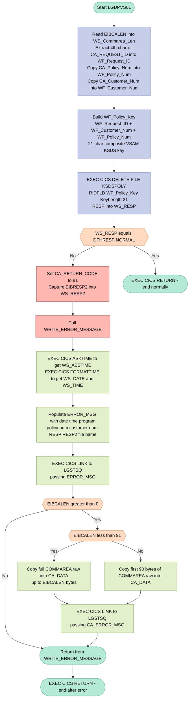
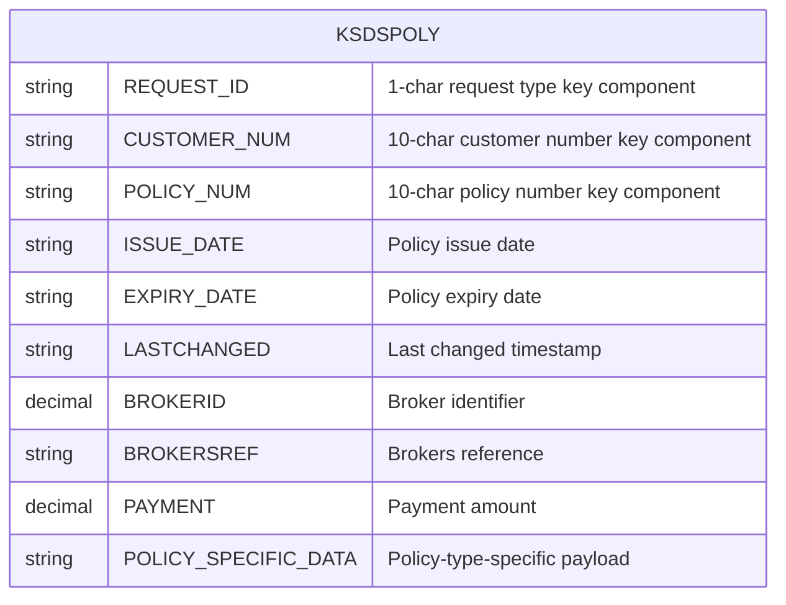

## Table of Contents

- [1. Purpose](#1-purpose)
- [2. Inputs](#2-inputs)
- [3. Outputs](#3-outputs)
- [4. Processing Logic](#4-processing-logic)
  - [4.1 Mermaid Flow Diagram](#41-mermaid-flow-diagram)
  - [4.2 Processing Logic Description](#42-processing-logic-description)
  - [4.3 Database Tables](#43-database-tables)
- [5. Paragraphs](#5-paragraphs)
- [6. Dependencies](#6-dependencies)
  - [6.1 CICS Services](#61-cics-services)
  - [6.2 VSAM Dataset](#62-vsam-dataset)
  - [6.3 External Programs / Modules](#63-external-programs--modules)
  - [6.4 Communication Area (COMMAREA) — Input/Output Interface](#64-communication-area-commarea--inputoutput-interface)
  - [6.5 Internal Subroutines](#65-internal-subroutines)
- [7. Constraints](#7-constraints)
  - [7.1 Data Validation & Field Format Constraints](#71-data-validation--field-format-constraints)
  - [7.2 Key Construction & VSAM Delete Constraints](#72-key-construction--vsam-delete-constraints)
  - [7.3 Response Code & Error Handling Constraints](#73-response-code--error-handling-constraints)
  - [7.4 Error Logging (WRITE_ERROR_MESSAGE) Constraints](#74-error-logging-write_error_message-constraints)
  - [7.5 Sequencing & Control-Flow Constraints](#75-sequencing--control-flow-constraints)
- [8. Error Handling](#8-error-handling)
  - [8.1 CICS File Operation Response Code Check](#81-cics-file-operation-response-code-check)
  - [8.2 Error Message Construction and Logging](#82-error-message-construction-and-logging)
  - [8.3 Communication Area Content Logging](#83-communication-area-content-logging)
  - [8.4 Return Code Signalling to the Caller](#84-return-code-signalling-to-the-caller)
- [9. Examples](#9-examples)
  - [9.1 Example 1: Successful Policy Deletion](#91-example-1-successful-policy-deletion)
  - [9.2 Example 2: Failed Policy Deletion (Record Not Found)](#92-example-2-failed-policy-deletion-record-not-found)
  - [9.3 Example 2: Failed Policy Deletion (Record Not Found)](#93-example-2-failed-policy-deletion-record-not-found)

## 1. Purpose

LGDPVS01 is a CICS PL/I program that deletes an insurance policy record from the VSAM KSDS file (`KSDSPOLY`). It receives a communication area containing a customer number, a policy number, and a request identifier, constructs a 21-character composite key, and issues a CICS `DELETE` command against the policy file. If the delete succeeds, control is returned to the caller with no return code set; if it fails, the program sets return code `81` in the commarea and invokes a structured error-logging routine that captures the current date and time, formats a diagnostic message containing the policy number, customer number, and CICS response codes, and links to the shared logging program `LGSTSQ` — optionally appending a raw dump of the commarea contents — before returning to the caller.

## 2. Inputs

**Communication Area (COMMAREA) — passed via `COMM_AREA_PTR` pointer parameter**

- `CA_REQUEST_ID` *(CHAR(6))* — Identifies the type of request being processed; the fourth character is extracted to build the VSAM KSDS delete key
  - `WF_REQUEST_ID` — Single-character working copy derived from `CA_REQUEST_ID`; forms the leading byte of the 21-character VSAM key
- `CA_CUSTOMER_NUM` *(PIC '9999999999')* — 10-digit customer number from the commarea; copied into the VSAM key and embedded in the error message on failure
  - `WF_CUSTOMER_NUM` *(CHAR(10))* — Working copy of the customer number; contributes to the composite VSAM record key
- `CA_POLICY_REQUEST` — Policy-specific section of the commarea union, providing the policy number for the delete key
  - `CA_POLICY_NUM` *(PIC '9999999999')* — 10-digit policy number identifying the specific VSAM KSDS record to delete
    - `WF_POLICY_NUM` *(CHAR(10))* — Working copy of the policy number; contributes to the composite VSAM record key
- `CA_RETURN_CODE` *(PIC '99')* — Output field written back to the caller; set to `'81'` when the CICS DELETE command returns a non-normal response
- `COMM_AREA_RAW` *(CHAR(32500))* — Raw character overlay of the entire commarea (UNION alternative); up to 90 bytes are captured into the diagnostic log message when the delete fails

**CICS Runtime-Provided Fields**

- `EIBCALEN` — CICS Execute Interface Block field supplying the length of the commarea; used to guard boundary checks before logging raw commarea content
- `EIBRESP2` — Secondary CICS response code captured after a failed DELETE FILE command; included in the error message sent to the `LGSTSQ` logging program

**VSAM File**

- `KSDSPOLY` — VSAM KSDS dataset targeted by `EXEC CICS DELETE FILE`; the composite 21-character key (`WF_POLICY_KEY` = `WF_REQUEST_ID` + `WF_CUSTOMER_NUM` + `WF_POLICY_NUM`) is used as `RIDFLD` to locate and delete the policy record

**Linked Program Input**

- `ERROR_MSG` — Structured diagnostic message assembled from commarea fields, CICS response codes, timestamps, and the fixed program identifier; passed as the commarea to `LGSTSQ` via `EXEC CICS LINK` when an error occurs

## 3. Outputs

**CICS VSAM File Operation**
- `EXEC CICS DELETE FILE('KSDSPOLY')` — deletes a record from the VSAM KSDS file `KSDSPOLY` using the 21-character composite key `WF_POLICY_KEY` (built from `WF_REQUEST_ID` + `WF_CUSTOMER_NUM` + `WF_POLICY_NUM`); this is the primary side-effect of the program

**Communication Area (COMMAREA) Return Value**
- `CA_RETURN_CODE` — written back to the caller's COMMAREA to signal the outcome of the delete operation
  - Set to `'81'` on failure (non-normal CICS response from the DELETE command)
  - Left unchanged (implying success) when the delete completes normally

**Error Logging via CICS LINK to LGSTSQ**
- `ERROR_MSG` — a structured diagnostic message passed as the COMMAREA to the `LGSTSQ` logging program when the DELETE fails; contains:
  - `EM_DATE` — formatted date of the failure (MM/DD/YYYY)
  - `EM_TIME` — formatted time of the failure (HH:MM:SS)
  - Program identifier literal `'LGDPVS01'` (embedded as a literal in the structure)
  - `EM_POLNUM` — the policy number involved in the failed delete
  - `EM_CUSNUM` — the customer number associated with the failed delete
  - `'Delete file KSDSPOLY'` — literal identifying the failing file operation
  - `EM_RESPRC` — primary CICS response code (`WS_RESP`) from the failed DELETE
  - `EM_RESP2RC` — secondary CICS response code (`WS_RESP2` / `EIBRESP2`) from the failed DELETE
- `CA_ERROR_MSG` — a secondary diagnostic message passed as the COMMAREA to `LGSTSQ` immediately after `ERROR_MSG`; contains:
  - Literal prefix `'COMMAREA='`
  - `CA_DATA` — up to 90 bytes of the raw COMMAREA contents at the time of failure, used for additional diagnostic context

## 4. Processing Logic

### 4.1 Mermaid Flow Diagram



---

### 4.2 Processing Logic Description

#### 4.2.1 High-level Summary

**LGDPVS01** is a CICS PL/I program that deletes a single insurance policy record from a VSAM KSDS file named **KSDSPOLY**. It receives its input through a CICS communication area (COMMAREA), constructs a 21-character composite key, issues a CICS DELETE command, and either returns silently on success or logs a structured error message and sets a failure return code if the deletion fails.

---

#### 4.2.2 Execution Flow

**Step 1 — Initialization and Key Construction**

Upon entry, the program reads `EIBCALEN` (the length of the passed COMMAREA) into `WS_Commarea_Len`. It then extracts identifying information from the COMMAREA:

- The **4th character** of `CA_REQUEST_ID` is placed into `WF_Request_ID` — this single character identifies the request variant (e.g., type of operation).
- `CA_Policy_Num` (10 digits) is copied into `WF_Policy_Num`.
- `CA_Customer_Num` (10 digits) is copied into `WF_Customer_Num`.

These three sub-fields together form the parent structure `WF_Policy_Info`, whose child `WF_Policy_Key` is the concatenated 21-character composite key:

```
WF_Policy_Key = WF_Request_ID (1) + WF_Customer_Num (10) + WF_Policy_Num (10)
```

**Step 2 — VSAM KSDS Delete**

The program issues:

```
EXEC CICS DELETE FILE('KSDSPOLY')
     RIDFLD(WF_Policy_Key)
     KEYLENGTH(21)
     RESP(WS_RESP)
```

This locates and deletes the VSAM KSDS record matching the 21-character composite key. The `RESP` option captures the primary CICS response code into `WS_RESP` without raising an implicit exception, allowing the program to evaluate the outcome explicitly.

**Step 3 — Response Evaluation**

The response code is tested against `DFHRESP(NORMAL)`:

- **Success (`WS_RESP = DFHRESP(NORMAL)`):** The program falls through to a plain `RETURN`, completing normally with no changes to `CA_RETURN_CODE`.
- **Failure (`WS_RESP ≠ DFHRESP(NORMAL)`):**
  - `WS_RESP2` is loaded from `EIBRESP2` (the secondary CICS diagnostic code).
  - `CA_RETURN_CODE` is set to `'81'` — the agreed error indicator returned to the calling program.
  - The internal subroutine `WRITE_ERROR_MESSAGE` is called.
  - `EXEC CICS RETURN` terminates the task.

**Step 4 — Error Logging (`WRITE_ERROR_MESSAGE` subroutine)**

When an error occurs, this procedure assembles and logs a rich diagnostic record:

1. **Timestamp capture:** `EXEC CICS ASKTIME` retrieves the current absolute time; `EXEC CICS FORMATTIME` converts it to `MMDDYYYY` date (`WS_DATE`) and `HH:MM:SS` time (`WS_TIME`).

2. **ERROR_MSG population:** The structured `ERROR_MSG` area is filled with:
   - Date and time of the failure
   - Program identifier (`LGDPVS01` — embedded literal)
   - Policy number (`EM_POLNUM`)
   - Customer number (`EM_CUSNUM`)
   - Target file name (`KSDSPOLY` — embedded literal)
   - Primary CICS response code (`EM_RESPRC` from `WS_RESP`)
   - Secondary CICS response code (`EM_RESP2RC` from `WS_RESP2`)

3. **First CICS LINK to LGSTSQ:** The fully populated `ERROR_MSG` is passed to the logging program `LGSTSQ` via `EXEC CICS LINK`, which writes it to a transient data queue (TDQ).

4. **COMMAREA dump (conditional):**
   - If `EIBCALEN > 0` (a COMMAREA was passed), the program also logs raw COMMAREA bytes for additional diagnostics:
     - If `EIBCALEN < 91`: copies exactly `EIBCALEN` bytes of raw COMMAREA data into `CA_DATA`.
     - Otherwise: copies the first **90 bytes** of the raw COMMAREA into `CA_DATA`.
   - A second `EXEC CICS LINK` to `LGSTSQ` then logs `CA_ERROR_MSG` (which prefixes "COMMAREA=" before the raw bytes).

---

#### 4.2.3 External Interactions

| System / Resource | Interaction | Purpose |
|---|---|---|
| **KSDSPOLY** (VSAM KSDS) | `EXEC CICS DELETE` | Physically removes the policy record identified by the 21-char composite key |
| **LGSTSQ** (CICS program) | `EXEC CICS LINK` (×1 or ×2) | Logs the structured error message and optionally the raw COMMAREA dump to a transient data queue |

---

#### 4.2.4 Plain Language Summary

When a caller wants to delete an insurance policy from the system, it invokes LGDPVS01 with the customer number, policy number, and request type in the COMMAREA. The program assembles these values into a single lookup key and tells CICS to delete the matching record from the VSAM policy file (`KSDSPOLY`). If the deletion succeeds, the program ends silently. If it fails, the program marks the COMMAREA with error code `81`, captures the date, time, both CICS error codes, and up to 90 bytes of the raw input data, then calls a separate logging program (`LGSTSQ`) to write those details to an error queue for diagnosis — after which it terminates.

---

### 4.3 Database Tables

The program operates exclusively against a **VSAM KSDS** file — no DB2 SQL tables are accessed. A VSAM KSDS is not a relational table; however, the logical record structure of `KSDSPOLY` implied by the COMMAREA layout is represented below for documentation purposes.



## 5. Paragraphs

- **LGDPVS01 (Main Procedure Body)**
  - Serves as the program entry point and primary execution body. It orchestrates the entire VSAM KSDS policy deletion flow by extracting inputs from the communication area, forming the composite delete key, issuing the CICS DELETE command, and routing to error handling if necessary.
  - Reads `EIBCALEN` into `WS_Commarea_Len` to capture the length of the incoming communication area.
  - Extracts the fourth character of `CA_REQUEST_ID` into `WF_Request_ID`, then copies `CA_POLICY_NUM` into `WF_Policy_Num` and `CA_CUSTOMER_NUM` into `WF_Customer_Num`. These three fields together form the 21-character composite VSAM key `WF_Policy_Key` used to identify the target record.
  - Issues `EXEC CICS DELETE FILE('KSDSPOLY')` with `RIDFLD(WF_Policy_Key)` and `KEYLENGTH(21)`, capturing the primary CICS response into `WS_RESP`.
  - **Conditional logic:** evaluates `WS_RESP` against `DFHRESP(NORMAL)`. If the response is not normal:
    - Captures the secondary response code from `EIBRESP2` into `WS_RESP2`.
    - Sets `CA_RETURN_CODE` to `'81'` to signal a failure to the caller.
    - Calls the internal `WRITE_ERROR_MESSAGE` procedure.
    - Issues `EXEC CICS RETURN` to terminate the task immediately.
  - If the delete succeeds, control falls through to a `RETURN` statement, ending the program normally with no return-code change.
  - **External interaction:** VSAM KSDS file `KSDSPOLY` via CICS DELETE.

- **WRITE_ERROR_MESSAGE**
  - An internal subroutine (`PROCEDURE`) invoked only on a failed CICS DELETE. It assembles a structured diagnostic message and logs it — along with a portion of the raw communication area — by linking to the external logging program `LGSTSQ`.
  - Calls `EXEC CICS ASKTIME ABSTIME(WS_ABSTIME)` to obtain the current absolute time, then calls `EXEC CICS FORMATTIME` to convert it into a human-readable date (`WS_DATE`, MM/DD/YYYY format) and time (`WS_TIME`).
  - Populates the `ERROR_MSG` structure: moves the formatted date and time into `EM_DATE` and `EM_TIME`; copies the customer number from `CA_CUSTOMER_NUM` into `EM_CUSNUM`; moves the primary and secondary CICS response codes into `EM_RESPRC` and `EM_RESP2RC`. The structure also carries static literals identifying the program (`LGDPVS01`), the file name (`KSDSPOLY`), and label prefixes (`PNUM=`, `CNUM=`, `RESP=`, `RESP2=`).
  - Issues `EXEC CICS LINK PROGRAM('LGSTSQ') COMMAREA(ERROR_MSG)` to log the formatted error message.
  - **Conditional logic (commarea logging):** checks `EIBCALEN > 0` before attempting to log commarea contents:
    - If `EIBCALEN < 91`, copies exactly `EIBCALEN` bytes from `COMM_AREA_RAW` into `CA_DATA` and links to `LGSTSQ` with `CA_ERROR_MSG` as the commarea.
    - Otherwise (commarea is 91 bytes or larger), copies only the first 90 bytes of `COMM_AREA_RAW` into `CA_DATA` and links to `LGSTSQ` in the same manner.
    - If `EIBCALEN` is zero the commarea logging block is skipped entirely.
  - Returns control to the main procedure body after logging is complete.
  - **External interactions:** CICS time services (`ASKTIME`, `FORMATTIME`) and the `LGSTSQ` logging program via `EXEC CICS LINK` (called up to twice — once for the error message and once for the commarea dump).

## 6. Dependencies

### 6.1 CICS Services

- **CICS Transaction Environment** — The program runs as a CICS-managed program; it relies on the CICS runtime to provide execution context, COMMAREA passing, and EIB fields.
  - **EIBCALEN** — CICS Execute Interface Block field read at program entry to determine the length of the passed communication area.
  - **EIBRESP2** — EIB field captured after a failed `EXEC CICS DELETE` to supply the secondary response code for diagnostic logging.
  - **DFHRESP(NORMAL)** — CICS symbolic response constant used to evaluate the primary response of the DELETE command.

- **EXEC CICS DELETE FILE('KSDSPOLY')** — Issues a VSAM KSDS record-level delete against the `KSDSPOLY` file using a 21-byte composite key (`WF_Policy_Key`). This is the core operation of the program.

- **EXEC CICS ASKTIME / FORMATTIME** — Used inside `WRITE_ERROR_MESSAGE` to obtain and format the current timestamp (date and time) for inclusion in the error log message.

- **EXEC CICS LINK PROGRAM('LGSTSQ')** — Called (up to three times) within `WRITE_ERROR_MESSAGE` to pass a formatted error message or a dump of the raw COMMAREA to the logging utility program.

- **EXEC CICS RETURN** — Terminates the CICS task and returns control to the invoker after an error condition is detected.

---

### 6.2 VSAM Dataset

- **KSDSPOLY** — A VSAM KSDS (Key-Sequenced Data Set) file that stores insurance policy records. The program issues an `EXEC CICS DELETE` against this file using a 21-character composite key to remove a specific policy record.

---

### 6.3 External Programs / Modules

- **LGSTSQ** — An external CICS program invoked via `EXEC CICS LINK` to write diagnostic/error messages to a queue or log. It receives the `ERROR_MSG` or `CA_ERROR_MSG` structure as its COMMAREA. Called up to three times per error occurrence.

---

### 6.4 Communication Area (COMMAREA) — Input/Output Interface

- **COMM_AREA / LGCMAREA copybook** — The program's entire external interface is delivered through a pointer-based COMMAREA structure (based on `LGCMAREA.inc`). The following fields within it are consumed or produced by this program:
  - **CA_REQUEST_ID** — Provides the request type; the 4th character is extracted to form the leading byte of the VSAM delete key.
  - **CA_CUSTOMER_NUM** — Provides the 10-digit customer identifier used to build the delete key and populate the error message.
  - **CA_POLICY_NUM** (within `CA_POLICY_REQUEST`) — Provides the 10-digit policy identifier used to complete the delete key.
  - **CA_RETURN_CODE** — Written by this program; set to `'81'` on a failed delete to signal the error back to the caller.

---

### 6.5 Internal Subroutines

- **WRITE_ERROR_MESSAGE** — An internal `PROCEDURE` block invoked when the VSAM delete fails. It assembles and dispatches error log messages via `LGSTSQ` and uses CICS time services to timestamp the error record.

## 7. Constraints

### 7.1 Data Validation & Field Format Constraints

- **CA_REQUEST_ID must supply a meaningful 4th character**: The program extracts exactly the 4th character of `CA_REQUEST_ID` (`SUBSTR(CA_REQUEST_ID,4,1)`) and places it into `WF_Request_ID`. No validation is performed on whether that character is non-blank or holds an expected value; the field is used as-is, so the caller is implicitly required to populate at least 4 characters in `CA_REQUEST_ID`.

- **CA_POLICY_NUM is a 10-digit numeric picture field** (`PIC '9999999999'`): Only numeric digit characters are structurally accepted by the PL/I picture clause. Non-numeric content would cause a data exception at runtime.

- **CA_CUSTOMER_NUM is a 10-digit numeric picture field** (`PIC '9999999999'`): Same picture-clause enforcement as `CA_POLICY_NUM`; the caller must supply a purely numeric 10-digit customer identifier.

- **CA_RETURN_CODE is a 2-digit numeric picture field** (`PIC '99'`): The field only accepts two decimal digit characters. The program writes the literal value `'81'` into it on failure, which fits within this constraint.

- **COMM_AREA must be present and correctly sized**: The program reads `EIBCALEN` into `WS_Commarea_Len` at startup and later tests `EIBCALEN > 0` inside `WRITE_ERROR_MESSAGE`. A commarea of length zero means no commarea was passed; the logging branch is skipped entirely in that case, but the main-line code still attempts to dereference `COMM_AREA_PTR`, implying a non-zero commarea is implicitly required for correct operation.

- **Commarea must be at least 32,500 bytes wide in its raw overlay**: `COMM_AREA_RAW` is declared `CHAR(32500)`, establishing the maximum supported commarea size. Passing a commarea shorter than the fields being accessed would produce out-of-bounds or truncated data without a runtime guard.

---

### 7.2 Key Construction & VSAM Delete Constraints

- **VSAM record key must be exactly 21 characters**: The `EXEC CICS DELETE` command specifies `KEYLENGTH(21)`, which is the fixed length enforced by CICS for locating the record in `KSDSPOLY`. The composite `WF_Policy_Key` is structurally 21 characters (`WF_Request_ID` 1 + `WF_Customer_Num` 10 + `WF_Policy_Num` 10), so all three components must be populated before the delete is issued.
  - `WF_Request_ID` (1 char) — must be non-blank/correct to form a valid key prefix.
  - `WF_Customer_Num` (10 chars) — must exactly match the customer number stored in the VSAM record.
  - `WF_Policy_Num` (10 chars) — must exactly match the policy number stored in the VSAM record.

- **The target VSAM file is fixed as `KSDSPOLY`**: No alternative file name is accepted or computed; the delete operation is hard-coded against this single dataset. Any request processed by this program will always target `KSDSPOLY`.

- **Key components are assigned in a mandatory sequence before the delete**: `WF_Request_ID`, `WF_Policy_Num`, and `WF_Customer_Num` are all populated from the commarea before the `EXEC CICS DELETE` is issued. There is no conditional path that can invoke the delete with an uninitialized key; all three assignments must succeed first.

---

### 7.3 Response Code & Error Handling Constraints

- **Delete success is strictly defined as `DFHRESP(NORMAL)`**: Any CICS response other than `DFHRESP(NORMAL)` is treated as an unrecoverable error. No partial-success or warning codes are tolerated; the program immediately sets `CA_RETURN_CODE = '81'`, logs the error, and returns to the caller.

- **`CA_RETURN_CODE = '81'` is the only non-zero return code the program sets**: There is no graduated error classification. All failure conditions (record not found, I/O error, etc.) are collapsed into a single return code of `'81'`.

- **`WS_RESP2` is only captured after a failure**: `EIBRESP2` is read into `WS_RESP2` only inside the error-handling block. On a successful delete it is never populated, so callers must not rely on its value in the success path.

---

### 7.4 Error Logging (WRITE_ERROR_MESSAGE) Constraints

- **Commarea logging is conditional on `EIBCALEN > 0`**: The commarea dump to `LGSTSQ` is only performed if a commarea was actually passed (`EIBCALEN > 0`). If no commarea exists, only the structured `ERROR_MSG` is logged.

- **Commarea dump is capped at 90 bytes**: When `EIBCALEN >= 91`, only the first 90 bytes of `COMM_AREA_RAW` are copied into `CA_DATA` before being sent to `LGSTSQ`. When `EIBCALEN < 91`, exactly `EIBCALEN` bytes are copied. The `CA_DATA` field is declared `CHAR(90)`, enforcing this upper boundary structurally.

- **Error message length passed to `LGSTSQ` is always `STG(ERROR_MSG)`**: Both the primary error message and the commarea dump calls to `LGSTSQ` use `LENGTH(STG(ERROR_MSG))` rather than `STG(CA_ERROR_MSG)`. This means the `CA_ERROR_MSG` commarea dump call passes a length based on the `ERROR_MSG` structure size, not the actual `CA_ERROR_MSG` size — a fixed structural constraint that governs what `LGSTSQ` receives.

- **Date and time must be obtained via CICS `ASKTIME`/`FORMATTIME` before logging**: `WS_ABSTIME` must be populated by `EXEC CICS ASKTIME` before `EXEC CICS FORMATTIME` is called. These two calls are sequenced and mandatory at the start of `WRITE_ERROR_MESSAGE`; the resulting `WS_DATE` and `WS_TIME` are then placed into `ERROR_MSG`.

---

### 7.5 Sequencing & Control-Flow Constraints

- **Commarea fields must be mapped before the VSAM delete**: The three working-field assignments (`WF_Request_ID`, `WF_Policy_Num`, `WF_Customer_Num`) must execute before `EXEC CICS DELETE` is reached. This ordering is enforced by the linear flow of the main procedure body.

- **`EXEC CICS RETURN` is called immediately after error handling**: Once an error is detected and logged, the program returns to CICS without performing any further processing. No retry or alternative path exists after a failed delete.

- **Normal (success) path returns via PL/I `RETURN`**: On a successful delete, the program exits through the PL/I `RETURN` statement, bypassing the error-handling block entirely. The two exit paths are mutually exclusive.

## 8. Error Handling

### 8.1 CICS File Operation Response Code Check

- After issuing the `EXEC CICS DELETE` command against the VSAM KSDS file `KSDSPOLY`, the program captures the primary CICS response code into `WS_RESP` via the `RESP` option
- The response code is then compared against `DFHRESP(NORMAL)` to determine whether the delete succeeded
- If the response is anything other than normal, the program enters an error-handling block:
  - The secondary CICS response code is captured from `EIBRESP2` into `WS_RESP2` for additional diagnostic detail
  - The communication area return code field `CA_RETURN_CODE` is set to `'81'` to signal a failure condition back to the caller
  - The internal `WRITE_ERROR_MESSAGE` procedure is invoked to log the error
  - An `EXEC CICS RETURN` is issued to terminate the program immediately after the error is handled, preventing further processing

---

### 8.2 Error Message Construction and Logging

- The `WRITE_ERROR_MESSAGE` procedure assembles a structured diagnostic message in the `ERROR_MSG` area, which includes:
  - Current date and time, obtained by calling `EXEC CICS ASKTIME` to retrieve an absolute timestamp and `EXEC CICS FORMATTIME` to convert it into human-readable date (`WS_DATE`) and time (`WS_TIME`) values
  - The program identifier (`LGDPVS01`) embedded as a literal in the error message structure
  - The policy number (`EM_POLNUM`) and customer number (`EM_CUSNUM`) from the communication area, identifying the record involved in the failed operation
  - The target file name (`KSDSPOLY`) embedded as a literal label in the message
  - Both primary (`WS_RESP` → `EM_RESPRC`) and secondary (`WS_RESP2` → `EM_RESP2RC`) CICS response codes, providing full diagnostic context
- The fully assembled `ERROR_MSG` structure is passed as a COMMAREA to the external logging program `LGSTSQ` via `EXEC CICS LINK`, which handles the actual writing of the error record

---

### 8.3 Communication Area Content Logging

- As a secondary diagnostic step within `WRITE_ERROR_MESSAGE`, the program also logs a snapshot of the raw communication area content:
  - The program first checks whether a COMMAREA is present by testing `EIBCALEN > 0`; no COMMAREA dump is attempted if the length is zero
  - If the COMMAREA length is less than 91 bytes, the actual COMMAREA length worth of data is extracted from `COMM_AREA_RAW` and placed into `CA_DATA`
  - If the COMMAREA length is 91 bytes or greater, the first 90 bytes are extracted into `CA_DATA`, capping the logged content to avoid overflow
  - In both cases, the `CA_ERROR_MSG` structure (prefixed with the literal `'COMMAREA='`) is passed to `LGSTSQ` via `EXEC CICS LINK`, logging the raw commarea bytes alongside the error record

---

### 8.4 Return Code Signalling to the Caller

- The program uses `CA_RETURN_CODE` in the communication area as the sole mechanism to communicate the outcome of the delete operation to the caller
- On a failed delete, `CA_RETURN_CODE` is explicitly set to `'81'` before the program returns, enabling the calling program to detect the failure and take appropriate action
- No explicit success return code is set; the absence of an error code (i.e., the default value) implicitly indicates successful completion

## 9. Examples

I will now examine the program logic:
- `LGDPVS01` is a PL/I program used to delete a policy from a VSAM KSDS dataset (`KSDSPOLY`).
- It extracts:
  - `WF_Request_ID` as the 4th character of `CA_Request_ID` (i.e., `SUBSTR(CA_Request_ID,4,1)`).
  - `WF_Policy_Num` from `CA_Policy_Num`.
  - `WF_Customer_Num` from `CA_Customer_Num`.
- The delete key `WF_Policy_Key` is a structure:
  - `WF_Request_ID` (CHAR(1))
  - `WF_Customer_Num` (CHAR(10))
  - `WF_Policy_Num` (CHAR(10))
  - Total length = 1 + 10 + 10 = 21 characters.
- It executes `EXEC CICS Delete File('KSDSPOLY') Ridfld(WF_Policy_Key) KeyLength(21) RESP(WS_RESP);`.
- If `WS_RESP` is `DFHRESP(NORMAL)` (which is 0), then the program ends successfully. The return code in `CA_RETURN_CODE` is not explicitly modified in the normal case (it remains whatever it was, or is expected to be successful, standard normal code is typically `00` as per caller design, but this program does not modify it unless an error occurs).
- If `WS_RESP` is NOT equal to `DFHRESP(NORMAL)`, it does:
  - Sets `WS_RESP2 = EIBRESP2`.
  - Sets `CA_RETURN_CODE = '81'`.
  - Calls `WRITE_ERROR_MESSAGE` internal procedure which links to error logger `LGSTSQ` passing `ERROR_MSG` and `CA_ERROR_MSG`.
  - Terminates using `EXEC CICS RETURN`.

Let's write a couple of clear, brief examples showing how this logic processes inputs to yield outputs.

### 9.1 Example 1: Successful Policy Deletion
**Input data (Communication Area fields):**
- `CA_REQUEST_ID`: `"01DDP01"`
- `CA_CUSTOMER_NUM`: `0000001234`
- `CA_POLICY_NUM`: `0000005678`

**Expected output / behavior:**
- Key constructed: `WF_Policy_Key` = `"P00000012340000005678"` (4th character of `"01DDP01"` is `"P"`, followed by the customer and policy numbers formatted as 10-character strings).
- An `EXEC CICS DELETE` command is executed against the `KSDSPOLY` file using this 21-character key.
- If the VSAM record is found and successfully deleted, `WS_RESP` returns `DFHRESP(NORMAL)`.
- The program completes successfully and exits, leaving the input communication area intact and the policy record removed from VSAM.

### 9.2 Example 2: Failed Policy Deletion (Record Not Found)
**Input data (Communication Area fields):**
- `CA_REQUEST_ID`: `"01DDP01"`
- `CA_CUSTOMER_NUM`: `0000009999`
- `CA_POLICY_NUM`: `0000008888`

**Expected output / behavior:**
- Key constructed: `WF_Policy_Key` = `"P00000099990000008888"`.
- The `EXEC CICS DELETE` command is executed but fails because the record does not exist, resulting in a non-normal CICS response code (e.g., `DFHRESP(NOTFND)`).
- `CA_RETURN_CODE` in the communication area is set to `"81"`.
- The program invokes the `WRITE_ERROR_MESSAGE` routine, formatted details (date, time, response codes, customer and policy numbers) are sent to the `LGSTSQ` logger, and execution terminates.

The user asks for:
"generate brief and short usage examples that demonstrate how the program works. For each example, include:
- A sample set of input data (e.g., values for input fields or records)
- The expected output produced by the program for that input
- A brief explanation of how the input leads to the output, based on the program logic

Provide at least one or two representative examples that illustrate key behaviors of the program.
Do not add the section heading.
"

This is perfect. I will write these two examples now. No need to call any other tools as the logic is completely clear. I will write the final response now.### Example 1: Successful Policy Deletion

#### 9.2.1 Input Data
* **`CA_REQUEST_ID`**: `"01DDP01"`
* **`CA_CUSTOMER_NUM`**: `0000001234`
* **`CA_POLICY_NUM`**: `0000005678`

#### 9.2.2 Expected Output
* **`CA_RETURN_CODE`**: Unchanged (or remains `00` from the calling program)
* **VSAM State**: The record with key `"P00000012340000005678"` is successfully deleted from the `KSDSPOLY` file.

#### 9.2.3 Explanation
1. The program extracts the 4th character of `CA_REQUEST_ID` (`"P"`), `CA_CUSTOMER_NUM` (`"0000001234"`), and `CA_POLICY_NUM` (`"0000005678"`) to assemble the 21-character composite key: `"P00000012340000005678"`.
2. An `EXEC CICS DELETE` command is executed against the `KSDSPOLY` VSAM dataset using this key.
3. Because the record exists, CICS returns a status of `DFHRESP(NORMAL)`.
4. The program bypasses the error-handling branch and finishes execution normally.

---

### 9.3 Example 2: Failed Policy Deletion (Record Not Found)

#### 9.3.1 Input Data
* **`CA_REQUEST_ID`**: `"01DDP01"`
* **`CA_CUSTOMER_NUM`**: `0000009999`
* **`CA_POLICY_NUM`**: `0000008888`

#### 9.3.2 Expected Output
* **`CA_RETURN_CODE`**: `"81"`
* **Error Logging**: An error message structure containing the primary response code (`WS_RESP`), secondary response code (`WS_RESP2`), customer number, and policy number is sent to the `LGSTSQ` queue for logging.

#### 9.3.3 Explanation
1. The program extracts the components to assemble the 21-character composite key `"P00000099990000008888"`.
2. The `EXEC CICS DELETE` command is executed against the `KSDSPOLY` dataset.
3. Because the target record does not exist in the VSAM file, CICS returns a non-normal response code (such as `NOTFND`).
4. The conditional check `IF (WS_RESP <> DFHRESP(NORMAL))` evaluates to true.
5. The program sets `CA_RETURN_CODE` to `"81"`, calls the `WRITE_ERROR_MESSAGE` subroutine to log the error details via `LGSTSQ`, and terminates execution.

---

Generated by IBM Bob Premium Package for Z
