## Table of Contents

- [1. Purpose](#1-purpose)
- [2. Inputs](#2-inputs)
- [3. Outputs](#3-outputs)
- [4. Processing Logic](#4-processing-logic)
  - [4.1 Mermaid Flow Diagram](#41-mermaid-flow-diagram)
  - [4.2 Processing Logic Description](#42-processing-logic-description)
  - [4.3 Database Tables](#43-database-tables)
- [5. Paragraphs](#5-paragraphs)
- [6. Dependencies](#6-dependencies)
  - [6.1 CICS Middleware and Runtime Services](#61-cics-middleware-and-runtime-services)
  - [6.2 Database Tables and Cursors (IBM Db2)](#62-database-tables-and-cursors-ibm-db2)
  - [6.3 External Subroutines and Programs](#63-external-subroutines-and-programs)
  - [6.4 Copybooks and Include Files](#64-copybooks-and-include-files)
  - [6.5 Input Parameters and Data Sources](#65-input-parameters-and-data-sources)
- [7. Constraints](#7-constraints)
  - [7.1 Input / COMMAREA Presence and Minimum Size](#71-input--commarea-presence-and-minimum-size)
  - [7.2 Request Type (WS_REQUEST_ID) Validation](#72-request-type-ws_request_id-validation)
  - [7.3 DB2 Query Key Constraints](#73-db2-query-key-constraints)
  - [7.4 Null-Column Handling for Optional DB2 Fields](#74-null-column-handling-for-optional-db2-fields)
  - [7.5 Cursor Open/Close Error Handling](#75-cursor-openclose-error-handling)
  - [7.6 Record Count Limit for Cursor-Based Commercial Retrieval](#76-record-count-limit-for-cursor-based-commercial-retrieval)
  - [7.7 Data Type and Field Width Constraints](#77-data-type-and-field-width-constraints)
  - [7.8 Sequencing and Processing Order Constraints](#78-sequencing-and-processing-order-constraints)
- [8. Error Handling](#8-error-handling)
  - [8.1 Error Handling Mechanisms in LGIPDB01.pli](#81-error-handling-mechanisms-in-lgipdb01pli)
  - [8.2 Summary by Category](#82-summary-by-category)
- [9. Examples](#9-examples)
  - [9.1 Example 1 — Inquire Endowment Policy (`01IEND`)](#91-example-1--inquire-endowment-policy-01iend)
  - [9.2 Example 2 — Endowment Policy Not Found](#92-example-2--endowment-policy-not-found)
  - [9.3 Example 3 — Inquire Motor Policy (`01IMOT`)](#93-example-3--inquire-motor-policy-01imot)
  - [9.4 Example 4 — Unknown Request Type](#94-example-4--unknown-request-type)

## 1. Purpose

`LGIPDB01` is a CICS-hosted PL/I program that serves as the DB2 database inquiry back-end for an insurance policy management system. It accepts a customer number and a policy number via a communication area (or CICS channel/container), determines the type of policy being requested through a request-type code, and then retrieves the corresponding full policy record from DB2 by joining the central POLICY table with the appropriate type-specific table — Endowment, House, Motor, Commercial, or Claim. The retrieved data is validated, converted from DB2 integer host variables into display-format fields, and returned to the calling program through the communication area, along with a return code indicating success, a not-found condition, a COMMAREA size error, or an unexpected DB2 failure.

## 2. Inputs

- **Communication Area (COMMAREA) - Primary Input Structure**
  - `CA_REQUEST_ID` (CHAR(6)) - Request type code that determines which policy inquiry procedure to execute (e.g., '01IEND' for endowment, '01IHOU' for house, '01IMOT' for motor, '01ICOM'/'02ICOM'/'03ICOM'/'05ICOM' for commercial, '01ICLM'/'02ICLM' for claim)
  - `CA_CUSTOMER_NUM` (PIC '9999999999') - 10-digit customer number used as a key filter in DB2 queries across all policy types; also returned in cursor-based retrievals
  - `CA_POLICY_NUM` (PIC '9999999999') - 10-digit policy number used as a key filter in DB2 queries; populated from DB2 results in cursor-based commercial and claim retrievals
  - `CA_C_Num` (PIC '9999999999') - Claim number input for claim inquiry procedures (GET_CLAIM_DB2_INFO_1)

- **CICS Execution Interface Block (EIB) - System Context**
  - `EIBTRNID` - Current transaction ID (copied to WS_TRANSID)
  - `EIBTRMID` - Current terminal ID (copied to WS_TERMID)
  - `EIBTASKN` - Current task number (copied to WS_TASKNUM)
  - `EIBCALEN` - Length of the received COMMAREA; used to validate COMMAREA presence and check if it's large enough for response data

- **CICS Container/Channel - Inter-Program Communication**
  - `ICOM_Container` ('ICOM_Data') - Container name for retrieving input COMMAREA via `EXEC CICS GET CONTAINER`
  - `ICOM_Channel` ('ICOM') - Channel name associated with the container
  - The program retrieves the COMMAREA pointer from the container when available (used for cursor-based multi-record retrievals in GET_COMMERCIAL_DB2_INFO_3 and GET_COMMERCIAL_DB2_INFO_5)

- **DB2 Database Tables - External Data Source**
  - `POLICY` table - Core policy information (customer number, policy number, dates, broker, payment)
  - `ENDOWMENT` table - Endowment-specific data (with profits, equities, managed fund, fund name, term, sum assured, life assured)
  - `HOUSE` table - House policy data (property type, bedrooms, value, house name/number, postcode)
  - `MOTOR` table - Motor policy data (make, model, value, registration, color, CC, manufacture year, premium, accidents)
  - `COMMERCIAL` table - Commercial policy data (address, postcode, latitude/longitude, customer, property type, perils/premiums, status, rejection reason)
  - `CLAIM` table - Claim data (claim number, date, paid amount, value, cause, observations)

- **External Program Call - Error Logging**
  - `LGSTSQ` - Transaction logging program invoked via `EXEC CICS LINK` to write error messages to a transient data queue (TDQ); receives error message structures (ERROR_MSG, CA_ERROR_MSG) as COMMAREA

- **DB2 Host Variables (Input Parameters for SQL)**
  - `DB2_CUSTOMERNUM_INT` (FIXED BIN(31)) - Integer host variable converted from CA_CUSTOMER_NUM for DB2 WHERE clauses
  - `DB2_POLICYNUM_INT` (FIXED BIN(31)) - Integer host variable converted from CA_POLICY_NUM for DB2 WHERE clauses
  - `DB2_CLAIMNUM_INT` (FIXED BIN(31)) - Integer host variable converted from CA_C_Num for claim queries
  - `CA_B_POSTCODE` (referenced in Zip_Cursor) - Postcode from COMMAREA used as filter for commercial policy lookup by zipcode

## 3. Outputs

**Communication Area (COMMAREA) — Returned to the Calling Program**

- `CA_RETURN_CODE` — Two-digit status code written back to the caller to indicate the outcome of the policy inquiry operation
  - `'00'` — success (set implicitly via successful data population)
  - `'01'` — no matching record found (SQLCODE 100)
  - `'88'` — cursor close error
  - `'89'` — cursor open error
  - `'90'` — unexpected DB2 error
  - `'98'` — COMMAREA received is too small to hold the retrieved data
  - `'99'` — unrecognised request type code

- `CA_CUSTOMER_NUM` — Customer number returned in the COMMAREA; populated from the DB2 fetch result for request types `02ICOM`, `03ICOM`, `05ICOM`, `01ICLM`, and `02ICLM`

- `CA_POLICY_NUM` — Policy number returned in the COMMAREA; populated from DB2 fetch results for cursor-based commercial (`03ICOM`, `05ICOM`) and claim (`01ICLM`, `02ICLM`) retrievals

- **Policy Common Fields** — Shared policy header data written into the COMMAREA for all supported policy types
  - `CA_ISSUE_DATE` — Policy start/issue date from DB2 POLICY table
  - `CA_EXPIRY_DATE` — Policy renewal/expiry date from DB2 POLICY table
  - `CA_LASTCHANGED` — Timestamp of the last modification to the policy record
  - `CA_BROKERID` — Broker identifier associated with the policy (null-safe; only written if DB2 indicator is non-null)
  - `CA_BROKERSREF` — Broker reference string for the policy (null-safe)
  - `CA_PAYMENT` — Policy payment amount (null-safe; only written if DB2 indicator is non-null)

- **Policy-Specific Fields** — Written into `CA_POLICY_RAW` (raw overlay of the policy-specific COMMAREA section); the exact content depends on the request type
  - Endowment (`01IEND`) — Endowment detail block (`DB2_ENDOW_TEXT`) plus optional variable-length padding data (`CA_E_PADDING_DATA`); terminated with the literal `'FINAL'`
  - House (`01IHOU`) — House detail block (`DB2_HOUSE_TEXT`); the filler area is terminated with `'FINAL'`
  - Motor (`01IMOT`) — Motor detail block (`DB2_MOTOR_TEXT`); additionally, `CA_M_PREMIUM` and `CA_M_ACCIDENTS` are set directly; the filler area is terminated with `'FINAL'`
  - Commercial (`01ICOM`, `02ICOM`) — Commercial detail block (`DB2_COMM_TEXT`) including address, location, peril flags, premium amounts, status, and rejection reason; filler area terminated with `'FINAL'`
  - Commercial cursor (`03ICOM`) — Same commercial block populated per fetched row; results are also written to a CICS channel container (see below)
  - Commercial by ZIP (`05ICOM`) — Same commercial block populated per fetched row from `Zip_Cursor`
  - Claim (`01ICLM`, `02ICLM`) — Claim detail block (`DB2_CLAIM_TEXT`) including claim number, date, paid amount, value, cause, and observations; filler area terminated with `'FINAL'`

**CICS Channel Containers — Written for Multi-Row Commercial Cursor Fetch (`03ICOM`)**

- `ICOM_Data` container on channel `ICOM` — Contains the serialised commercial policy records collected from the `Cust_Cursor` fetch loop; length equals the number of records retrieved multiplied by 1202 bytes (up to 20 records maximum)
- `ICOM_Count` container on channel `ICOM` — Contains `ICOM_Record_Count`, the count of commercial policy records written into `ICOM_Data`

**Error Diagnostic Messages — Written to CICS TDQ via Program `LGSTSQ`**

- `ERROR_MSG` — Structured error message containing the current date, time, program name (`LGIPOL01`), customer number, policy number, the DB2 request label (`EM_SQLREQ`), and the SQLCODE; dispatched via `EXEC CICS LINK PROGRAM('LGSTSQ')` whenever a DB2 error or CICS failure occurs
- `CA_ERROR_MSG` — Supplementary error message containing up to 90 bytes of the raw COMMAREA content at the time of the error; also dispatched to `LGSTSQ` when a non-zero EIBCALEN is present

**CICS Abnormal Termination**

- `EXEC CICS ABEND ABCODE('LGCA') NODUMP` — Issued when no COMMAREA is received (`EIBCALEN = 0`) and no CICS container data is available, terminating the task with abend code `LGCA`

## 4. Processing Logic

### 4.1 Mermaid Flow Diagram

```mermaid
graph TD
    classDef startEnd fill:#b5ead7,stroke:#5a9e82,color:#000
    classDef process fill:#c7ceea,stroke:#6a7dc9,color:#000
    classDef decision fill:#ffdac1,stroke:#d4885a,color:#000
    classDef error fill:#ffb7b2,stroke:#c0524d,color:#000
    classDef io fill:#ffffba,stroke:#b0b000,color:#000

    A([Start LGIPDB01]):::startEnd
    B[Get ICOM Container via CICS<br>GET CONTAINER ICOM_Data]:::io
    C{{CICS GET CONTAINER<br>returned NORMAL}}:::decision
    D[Set COMM_AREA_PTR from container<br>Extract CA_REQUEST_ID and CA_CUSTOMER_NUM]:::process
    E{{EIBCALEN = 0}}:::decision
    F[Write error message<br>ABEND LGCA]:::error
    G[Initialize CA_RETURN_CODE = 00<br>Convert customer and policy nums to integers<br>Uppercase CA_REQUEST_ID to WS_REQUEST_ID]:::process
    H{{WS_REQUEST_ID}}:::decision
    I[CALL GET_ENDOW_DB2_INFO<br>01IEND]:::process
    J[CALL GET_HOUSE_DB2_INFO<br>01IHOU]:::process
    K[CALL GET_MOTOR_DB2_INFO<br>01IMOT]:::process
    L[CALL GET_COMMERCIAL_DB2_INFO_1<br>01ICOM]:::process
    M[CALL GET_COMMERCIAL_DB2_INFO_2<br>02ICOM]:::process
    N[CALL GET_COMMERCIAL_DB2_INFO_3<br>03ICOM - cursor by customer]:::process
    O[CALL GET_COMMERCIAL_DB2_INFO_5<br>05ICOM - cursor by postcode]:::process
    P[Set DB2_CLAIMNUM_INT from CA_C_Num<br>CALL GET_CLAIM_DB2_INFO_1<br>01ICLM]:::process
    Q[CALL GET_CLAIM_DB2_INFO_2<br>02ICLM - cursor by customer]:::process
    R[CA_RETURN_CODE = 99<br>Unknown request type]:::error
    S([EXEC CICS RETURN]):::startEnd

    A --> B
    B --> C
    C -- Yes --> D
    C -- No --> E
    E -- Yes --> F
    E -- No --> G
    D --> H
    G --> H
    H -- 01IEND --> I
    H -- 01IHOU --> J
    H -- 01IMOT --> K
    H -- 01ICOM --> L
    H -- 02ICOM --> M
    H -- 03ICOM --> N
    H -- 05ICOM --> O
    H -- 01ICLM --> P
    H -- 02ICLM --> Q
    H -- OTHERWISE --> R
    I --> S
    J --> S
    K --> S
    L --> S
    M --> S
    N --> S
    O --> S
    P --> S
    Q --> S
    R --> S

    subgraph Endowment ["GET_ENDOW_DB2_INFO"]
        E1[SQL SELECT POLICY JOIN ENDOWMENT<br>by customer and policy number]:::io
        E2{{SQLCODE = 0}}:::decision
        E3[Validate COMMAREA length<br>Check null indicators<br>Move data to COMMAREA<br>Write FINAL marker]:::process
        E4[CA_RETURN_CODE = 01<br>Not found]:::error
        E5[CA_RETURN_CODE = 90<br>Write error message]:::error
        E1 --> E2
        E2 -- Yes --> E3
        E2 -- No - 100 --> E4
        E2 -- No - other --> E5
    end

    subgraph House ["GET_HOUSE_DB2_INFO"]
        H1[SQL SELECT POLICY JOIN HOUSE<br>by customer and policy number]:::io
        H2{{SQLCODE = 0}}:::decision
        H3[Validate COMMAREA length<br>Move data to COMMAREA<br>Write FINAL marker]:::process
        H4[CA_RETURN_CODE = 01]:::error
        H5[CA_RETURN_CODE = 90<br>Write error message]:::error
        H1 --> H2
        H2 -- Yes --> H3
        H2 -- No - 100 --> H4
        H2 -- No - other --> H5
    end

    subgraph Motor ["GET_MOTOR_DB2_INFO"]
        M1[SQL SELECT POLICY JOIN MOTOR<br>by customer and policy number]:::io
        M2{{SQLCODE = 0}}:::decision
        M3[Validate COMMAREA length<br>Move data to COMMAREA<br>Write FINAL marker]:::process
        M4[CA_RETURN_CODE = 01]:::error
        M5[CA_RETURN_CODE = 90<br>Write error message]:::error
        M1 --> M2
        M2 -- Yes --> M3
        M2 -- No - 100 --> M4
        M2 -- No - other --> M5
    end

    subgraph Comm3 ["GET_COMMERCIAL_DB2_INFO_3 - Cursor by Customer"]
        C3A[OPEN Cust_Cursor]:::io
        C3B{{Cursor open failed}}:::decision
        C3C[CA_RETURN_CODE = 89<br>Write error message]:::error
        C3D[FETCH loop - max 20 rows<br>Convert integers<br>Write each record to ICOM channel]:::io
        C3E[CLOSE Cust_Cursor]:::io
        C3F[PUT ICOM_Data and ICOM_Count<br>containers to ICOM channel]:::io
        C3A --> C3B
        C3B -- Yes --> C3C
        C3B -- No --> C3D
        C3D --> C3E
        C3E --> C3F
    end

    subgraph Comm5 ["GET_COMMERCIAL_DB2_INFO_5 - Cursor by Postcode"]
        C5A[OPEN Zip_Cursor]:::io
        C5B{{Cursor open failed}}:::decision
        C5C[CA_RETURN_CODE = 89<br>Write error message]:::error
        C5D[FETCH loop - convert integers<br>Move data to COMMAREA]:::io
        C5E[CLOSE Zip_Cursor]:::io
        C5A --> C5B
        C5B -- Yes --> C5C
        C5B -- No --> C5D
        C5D --> C5E
    end

    subgraph Claim2 ["GET_CLAIM_DB2_INFO_2 - Cursor by Customer"]
        CL2A[OPEN CusClaim_Cursor]:::io
        CL2B{{Cursor open failed}}:::decision
        CL2C[CA_RETURN_CODE = 89<br>Write error message]:::error
        CL2D[FETCH loop - convert integers<br>Move data to COMMAREA<br>Write FINAL marker per row]:::io
        CL2E[CLOSE CusClaim_Cursor]:::io
        CL2A --> CL2B
        CL2B -- Yes --> CL2C
        CL2B -- No --> CL2D
        CL2D --> CL2E
    end

    I -.-> Endowment
    J -.-> House
    K -.-> Motor
    N -.-> Comm3
    O -.-> Comm5
    Q -.-> Claim2
```



---

### 4.2 Processing Logic Description

#### 4.2.1 High-level Summary

`LGIPDB01` is the DB2 data access layer program for the GenApp General Insurance Application's **policy inquiry** function. It accepts an incoming request — via either a CICS channel/container (`ICOM` channel) or a traditional COMMAREA — identifies the type of policy or claim being queried using a 6-character request code, executes the appropriate DB2 SELECT or cursor-driven fetch, and returns the results back to the caller through the communication area. It supports five insurance policy types (Endowment, House, Motor, Commercial) and two claim inquiry modes.

---

#### 4.2.2 Execution Flow

**Step 1 — Program Initialization**

On entry, the program captures CICS execution context fields: `EIBTRNID` (transaction ID), `EIBTRMID` (terminal ID), and `EIBTASKN` (task number) into working-storage header variables for diagnostic purposes.

**Step 2 — Determine Input Channel (ICOM Container vs. COMMAREA)**

The program attempts a `EXEC CICS GET CONTAINER` call against the `ICOM_Data` container on the `ICOM` channel. Two paths result:

- **Container found (CICS NORMAL response):** The communication area pointer (`COMM_AREA_PTR`) is set to the container address. `CA_REQUEST_ID` and `CA_CUSTOMER_NUM` are extracted directly.
- **Container not found (non-NORMAL response):** The program falls back to COMMAREA processing. If `EIBCALEN = 0` (no COMMAREA), the program writes an error and issues `EXEC CICS ABEND ABCODE('LGCA')`. Otherwise, `CA_RETURN_CODE` is initialized to `'00'`, customer and policy numbers are converted to integer host variables (`DB2_CUSTOMERNUM_INT`, `DB2_POLICYNUM_INT`), and `CA_REQUEST_ID` is uppercased into `WS_REQUEST_ID`.

**Step 3 — Request Type Dispatch**

A PL/I `SELECT` construct on `WS_REQUEST_ID` routes processing to one of nine specialized internal procedures:

| Request Code | Procedure Called | Purpose |
|---|---|---|
| `01IEND` | `GET_ENDOW_DB2_INFO` | Inquire single endowment policy |
| `01IHOU` | `GET_HOUSE_DB2_INFO` | Inquire single house policy |
| `01IMOT` | `GET_MOTOR_DB2_INFO` | Inquire single motor policy |
| `01ICOM` | `GET_COMMERCIAL_DB2_INFO_1` | Inquire commercial policy by customer + policy number |
| `02ICOM` | `GET_COMMERCIAL_DB2_INFO_2` | Inquire commercial policy by policy number only |
| `03ICOM` | `GET_COMMERCIAL_DB2_INFO_3` | Cursor: all commercial policies for a customer |
| `05ICOM` | `GET_COMMERCIAL_DB2_INFO_5` | Cursor: all commercial policies by postcode |
| `01ICLM` | `GET_CLAIM_DB2_INFO_1` | Inquire single claim by claim number |
| `02ICLM` | `GET_CLAIM_DB2_INFO_2` | Cursor: all claims for a customer |
| *other* | — | `CA_RETURN_CODE = '99'` |

**Step 4 — Single-Row Policy Queries (Endowment, House, Motor, Commercial-1, Commercial-2, Claim-1)**

Each procedure follows an identical pattern:
1. Execute an `EXEC SQL SELECT … INTO … FROM POLICY, <type-table> WHERE` matching on both customer number and policy number (commercial-2 matches on policy number alone; claim-1 matches on claim number).
2. Check `SQLCODE`:
   - `0` → Success: validate COMMAREA size is sufficient (`EIBCALEN >= WS_REQUIRED_CA_LEN`); if not, set `CA_RETURN_CODE = '98'` and return immediately.
   - `100` → No rows found: set `CA_RETURN_CODE = '01'`.
   - Other → DB2 error: set `CA_RETURN_CODE = '90'` and call `WRITE_ERROR_MESSAGE`.
3. On success with sufficient COMMAREA: convert DB2 integer host variables back to PIC numeric fields (handling null indicators for `BROKERID`, `PAYMENT`, padding data); populate all `CA_POLICY_COMMON` fields (`CA_ISSUE_DATE`, `CA_EXPIRY_DATE`, `CA_LASTCHANGED`, `CA_BROKERID`, `CA_BROKERSREF`, `CA_PAYMENT`); copy type-specific data into `CA_POLICY_RAW`; write the string `'FINAL'` into the filler area immediately after the last data byte as an end-of-data marker.

**Step 5 — Cursor-Based Multi-Row Queries (Commercial-3, Commercial-5, Claim-2)**

These procedures use declared `INSENSITIVE SCROLL` cursors to return multiple matching rows:

- `GET_COMMERCIAL_DB2_INFO_3` (`Cust_Cursor`): fetches all commercial policies for a given customer, building records into an ICOM channel buffer. The loop is capped at **20 records** (enforced by forcing `SQLCODE = 17` when the count exceeds 20). After the loop, the accumulated data and record count are written to CICS containers `ICOM_Data` and `ICOM_Count` on the `ICOM` channel.
- `GET_COMMERCIAL_DB2_INFO_5` (`Zip_Cursor`): fetches all commercial policies matching a given postcode/ZIP code.
- `GET_CLAIM_DB2_INFO_2` (`CusClaim_Cursor`): fetches all claims for a given customer, writing each claim record to the COMMAREA with a `'FINAL'` marker per row.

Cursor open/close failures set `CA_RETURN_CODE = '89'` (open error) or `'88'` (close error).

**Step 6 — Error Reporting (`WRITE_ERROR_MESSAGE`)**

When called, this procedure:
1. Captures the current SQLCODE into the error message structure.
2. Calls `EXEC CICS ASKTIME` and `EXEC CICS FORMATTIME` to get the current date and time.
3. Links to helper program `LGSTSQ` (via `EXEC CICS LINK`) to write the formatted error message to a transient data queue.
4. Also writes up to 90 bytes of the raw COMMAREA content to the queue for diagnostic purposes.

**Step 7 — Program Return**

After the dispatched procedure returns, the main procedure issues `EXEC CICS RETURN` to hand control back to CICS.

---

#### 4.2.3 External Interactions

| System | Interaction | Purpose |
|---|---|---|
| **DB2** | `SELECT … FROM POLICY, ENDOWMENT` | Retrieve endowment policy details |
| **DB2** | `SELECT … FROM POLICY, HOUSE` | Retrieve house policy details |
| **DB2** | `SELECT … FROM POLICY, MOTOR` | Retrieve motor policy details |
| **DB2** | `SELECT … FROM POLICY, COMMERCIAL` | Retrieve commercial policy details (single-row and cursor modes) |
| **DB2** | `SELECT … FROM POLICY, CLAIM` | Retrieve claim details (single-row and cursor modes) |
| **CICS** | `GET CONTAINER / PUT CONTAINER` on `ICOM` channel | Receive input and return multi-record results for commercial batch queries |
| **CICS** | `EXEC CICS LINK PROGRAM('LGSTSQ')` | Write error/diagnostic messages to a transient data queue |
| **CICS** | `EXEC CICS ABEND ABCODE('LGCA') NODUMP` | Terminate abnormally if no COMMAREA and no container are present |

---

#### 4.2.4 Plain Language Summary

`LGIPDB01` is a back-end data retrieval program that looks up insurance policy and claim information from a DB2 database. When called, it receives an instruction code telling it *what kind* of policy to look up (e.g., endowment, house, motor, commercial, or a claim). It connects to the appropriate DB2 tables, finds the matching record(s) using the customer number and/or policy number provided, and copies the results back into a shared memory area (COMMAREA or CICS container) so the calling program can display or process the information. If the record is not found, it sets a "not found" flag; if something goes wrong with the database, it logs a detailed error message and sets an error flag. For commercial and claim queries that can return multiple results, it loops through the database rows up to a maximum of 20 records and packages them all up for the caller.

---

### 4.3 Database Tables

```erDiagram
    POLICY {
        int PolicyNumber "Primary key"
        int CustomerNumber "FK to CUSTOMER"
        string PolicyType "E H M B"
        date IssueDate "Policy start date"
        date ExpiryDate "Policy renewal date"
        string LastChanged "Timestamp of last update"
        int BrokerId "nullable"
        string BrokersReference "nullable"
        int Payment "nullable"
    }

    ENDOWMENT {
        int PolicyNumber "FK to POLICY"
        string WithProfits "Flag"
        string Equities "Flag"
        string ManagedFund "Flag"
        string FundName "Fund name"
        int Term "Policy term in years"
        int SumAssured "Insured sum"
        string LifeAssured "Name of insured"
        string PaddingData "Variable length data"
    }

    HOUSE {
        int PolicyNumber "FK to POLICY"
        string PropertyType "House type"
        int Bedrooms "Number of bedrooms"
        int Value "Property value"
        string HouseName "Property name"
        string HouseNumber "Property number"
        string Postcode "Property postcode"
    }

    MOTOR {
        int PolicyNumber "FK to POLICY"
        string Make "Vehicle make"
        string Model "Vehicle model"
        int Value "Vehicle value"
        string RegNumber "Registration number"
        string Colour "Vehicle colour"
        int CC "Engine size"
        string YearOfManufacture "Year made"
        int Premium "Motor premium"
        int Accidents "Accident count"
    }

    COMMERCIAL {
        int PolicyNumber "FK to POLICY"
        int CustomerNumber "FK to CUSTOMER"
        string RequestDate "Request date"
        string StartDate "Policy start date"
        string RenewalDate "Renewal date"
        string Address "Business address"
        string Zipcode "Business postcode"
        string LatitudeN "GPS latitude"
        string LongitudeW "GPS longitude"
        string Customer "Customer name"
        string PropertyType "Property description"
        int FirePeril "Fire peril flag"
        int FirePremium "Fire premium amount"
        int CrimePeril "Crime peril flag"
        int CrimePremium "Crime premium amount"
        int FloodPeril "Flood peril flag"
        int FloodPremium "Flood premium amount"
        int WeatherPeril "Weather peril flag"
        int WeatherPremium "Weather premium amount"
        int Status "Approval status"
        string RejectionReason "Reason if rejected"
    }

    CLAIM {
        int ClaimNumber "Primary key"
        int PolicyNumber "FK to POLICY"
        int CustomerNumber "FK to CUSTOMER via POLICY"
        string ClaimDate "Date of claim"
        int Paid "Amount paid"
        int Value "Claim value"
        string Cause "Cause description"
        string Observations "Observations text"
    }

    POLICY ||--o| ENDOWMENT : "has"
    POLICY ||--o| HOUSE : "has"
    POLICY ||--o| MOTOR : "has"
    POLICY ||--o{ COMMERCIAL : "has"
    POLICY ||--o{ CLAIM : "has"
```

## 5. Paragraphs

- **LGIPDB01 (main entry logic)**
  - **Purpose:** Entry point for the Db2 data-access layer of the "Inquire Policy" function. It finds the input data, sets up the Db2 host variables and sends the request to the right retrieval procedure based on the request type.
  - **Operations:**
    - Saves CICS task details (`EIBTRNID`, `EIBTRMID`, `EIBTASKN`) into `WS_HEADER` for diagnostics.
    - Runs `EXEC CICS GET CONTAINER('ICOM_Data') CHANNEL('ICOM') SET(ICOM_Pointer)` to check for channel/container input.
      - **Container found (`RESP = NORMAL`):** Points `COMM_AREA_PTR` and `ICOM_Pointer_Start` at the container data, copies `CA_REQUEST_ID` to `WS_REQUEST_ID` and converts `CA_CUSTOMER_NUM` to `DB2_CUSTOMERNUM_INT`.
      - **No container (COMMAREA path):**
        - If `EIBCALEN = 0`, writes the error " NO COMMAREA RECEIVED" via `WRITE_ERROR_MESSAGE` and abends with `EXEC CICS ABEND ABCODE('LGCA') NODUMP`.
        - Sets `CA_RETURN_CODE = '00'` and saves `EIBCALEN` and the COMMAREA address.
        - Converts `CA_CUSTOMER_NUM` and `CA_POLICY_NUM` to the integer host variables `DB2_CUSTOMERNUM_INT` and `DB2_POLICYNUM_INT`, and copies both into the error message fields (`EM_CUSNUM`, `EM_POLNUM`).
        - Sets `WS_REQUEST_ID = UPPERCASE(CA_REQUEST_ID)`.
  - **Control flow:** A `SELECT (WS_REQUEST_ID)` chooses the procedure to call:
    - `'01IEND'` → `GET_ENDOW_DB2_INFO`
    - `'01IHOU'` → `GET_HOUSE_DB2_INFO`
    - `'01IMOT'` → `GET_MOTOR_DB2_INFO`
    - `'01ICOM'` / `'02ICOM'` / `'03ICOM'` / `'05ICOM'` → `GET_COMMERCIAL_DB2_INFO_1` / `_2` / `_3` / `_5`
    - `'01ICLM'` → sets `DB2_CLAIMNUM_INT = CA_C_Num`, then calls `GET_CLAIM_DB2_INFO_1`
    - `'02ICLM'` → `GET_CLAIM_DB2_INFO_2`
    - `OTHERWISE` → `CA_RETURN_CODE = '99'` (unknown request)
  - **Ends with:** `EXEC CICS RETURN`.
  - **Notes:**
    - On the container path, `CA_RETURN_CODE` is not reset to '00' and `DB2_POLICYNUM_INT` is not filled in.
    - The cursors `Cust_Cursor`, `Zip_Cursor` and `CusClaim_Cursor` are declared at program level as insensitive scrollable cursors over POLICY joined to COMMERCIAL or CLAIM.

- **GET_ENDOW_DB2_INFO**
  - **Purpose:** Gets one endowment policy for a given customer number and policy number.
  - **Operations:**
    - Sets `EM_SQLREQ = ' SELECT ENDOW '` for error reporting.
    - Runs a singleton `SELECT ... INTO` on the POLICY and ENDOWMENT join, filtered by `DB2_CUSTOMERNUM_INT` and `DB2_POLICYNUM_INT`.
    - Returns the common policy columns, the endowment columns, the `PADDINGDATA` varchar and `LENGTH(PADDINGDATA)`.
    - Uses null indicators on broker ID, broker reference, payment and padding data.
  - **Control flow:** `SELECT (SQLCODE)`:
    - `0` → calls `GET_ENDOW_DB2_INFO_A`
    - `100` → `CA_RETURN_CODE = '01'` (not found)
    - `OTHERWISE` → `CA_RETURN_CODE = '90'` and calls `WRITE_ERROR_MESSAGE`
  - **External:** Db2 (POLICY, ENDOWMENT tables).

- **GET_ENDOW_DB2_INFO_A**
  - **Purpose:** Checks that the COMMAREA is large enough and copies the retrieved endowment data into it.
  - **Operations:**
    - Calculates the required length: header/trailer (33) + full endowment length (124), plus the padding length if `IND_E_PADDINGDATAL` is not -1. The padding length also moves `END_POLICY_POS` forward.
    - If `EIBCALEN < WS_REQUIRED_CA_LEN`, sets `CA_RETURN_CODE = '98'` and runs `EXEC CICS RETURN`.
    - Converts the integer values to the display fields, skipping null `BROKERID` and `PAYMENT`. Converts `TERM` and `SUMASSURED` (`DB2_E_SUMASSURED`).
    - Moves issue date, expiry date, last-changed timestamp, broker ID, broker reference and payment to the `CA_` fields.
    - Copies `DB2_ENDOW_TEXT` (52 bytes) into `CA_POLICY_RAW`.
    - If padding data is not null, copies it into `CA_E_PADDING_DATA`.
    - Writes the end marker `'FINAL'` at `END_POLICY_POS` in `CA_E_PADDING_DATA`.
  - **Control flow:** `IF` checks on null indicators and on the COMMAREA length.

- **GET_HOUSE_DB2_INFO**
  - **Purpose:** Gets one house policy for a given customer number and policy number.
  - **Operations:**
    - Sets `EM_SQLREQ`.
    - Runs a singleton `SELECT` on the POLICY and HOUSE join for the common fields plus property type, bedrooms, value, house name, house number and postcode.
    - **When `SQLCODE = 0`:**
      - Calculates the required length (33 + 130). If the COMMAREA is too short, sets '98' and returns.
      - Otherwise converts the nullable integer fields and bedrooms/value, moves the common fields, and copies `DB2_HOUSE_TEXT` (58 bytes) into `CA_POLICY_RAW`.
      - Writes `'FINAL'` into `CA_H_FILLER`.
    - **Otherwise:** `SQLCODE = 100` gives '01'; any other code gives '90' plus `WRITE_ERROR_MESSAGE`.
  - **External:** Db2 (POLICY, HOUSE tables).

- **GET_MOTOR_DB2_INFO**
  - **Purpose:** Gets one motor policy for a given customer number and policy number.
  - **Operations:**
    - Runs a singleton `SELECT` on the POLICY and MOTOR join for the common fields plus make, model, value, registration, colour, engine size (CC), year of manufacture, premium and accidents.
    - **When `SQLCODE = 0`:**
      - Checks the length (33 + 137); returns '98' if the COMMAREA is too short.
      - Otherwise converts the integer fields, sets `CA_M_PREMIUM` and `CA_M_ACCIDENTS` directly, moves the common fields, and copies `DB2_MOTOR_TEXT` (65 bytes) into `CA_POLICY_RAW`.
      - Writes `'FINAL'` into `CA_M_FILLER`.
    - **Otherwise:** '01' for not found; '90' plus error logging for other errors.
  - **External:** Db2 (POLICY, MOTOR tables).

- **GET_COMMERCIAL_DB2_INFO_1** (`01ICOM`)
  - **Purpose:** Gets one commercial policy by customer number and policy number.
  - **Operations:**
    - Runs a singleton `SELECT` on the POLICY and COMMERCIAL join for the request, start and renewal dates, address, zipcode, latitude and longitude, customer, property type, the peril and premium values (fire, crime, flood, weather), status and rejection reason.
    - The dates go into these host variables: `RequestDate` → `DB2_LASTCHANGED`, `StartDate` → `DB2_ISSUEDATE`, `RenewalDate` → `DB2_EXPIRYDATE`.
    - **When `SQLCODE = 0`:**
      - Checks the length (33 + 1174); returns '98' if the COMMAREA is too short.
      - Otherwise converts the peril, premium and status integers (including `DB2_B_STATUS`), moves the common fields, and copies `DB2_COMM_TEXT` (1102 bytes) into `CA_POLICY_RAW`.
      - Writes `'FINAL'` into `CA_B_FILLER`.
    - **Otherwise:** '01' for not found; '90' plus `WRITE_ERROR_MESSAGE`.
  - **Note:** Broker ID, broker reference and payment are not selected, so they keep their initial values.
  - **External:** Db2 (POLICY, COMMERCIAL tables).

- **GET_COMMERCIAL_DB2_INFO_2** (`02ICOM`)
  - **Purpose:** Gets one commercial policy by policy number only.
  - **Operations:**
    - Same as `GET_COMMERCIAL_DB2_INFO_1`, except that `CustomerNumber` is also selected into `DB2_CUSTOMERNUM_INT` and the `WHERE` clause filters only on `DB2_POLICYNUM_INT`.
    - On success, also returns the customer number in `CA_CUSTOMER_NUM`.
  - **Control flow:** Same SQLCODE and length-check branching ('00', '98', '01', '90').
  - **External:** Db2 (POLICY, COMMERCIAL tables).

- **GET_COMMERCIAL_DB2_INFO_3** (`03ICOM`)
  - **Purpose:** Gets all commercial policies for a customer through a cursor and returns them in a CICS container.
  - **Operations:**
    - Resets `ICOM_Record_Count` to 0.
    - Opens `Cust_Cursor` (POLICY joined to COMMERCIAL, filtered by `DB2_CUSTOMERNUM_INT`). If the open fails, sets '89' and logs the error.
    - Calls `GET_COMMERCIAL_DB2_INFO_3_Cur` repeatedly in a `DO UNTIL (SQLCODE > 0)` loop.
    - Closes the cursor. If the close fails, sets '88' and logs the error.
    - Sets `ICOM_Data_Length = ICOM_Record_Count * 1202`.
    - Runs `EXEC CICS PUT CONTAINER('ICOM_Data') CHANNEL('ICOM')` from `ICOM_Record`, then `PUT CONTAINER('ICOM_Count')` with the 2-byte record count.
  - **Control flow:**
    - The loop ends on end of data (100) or on the simulated limit code (17).
    - The loop does not end on a negative SQLCODE, and it still runs if the cursor open failed.
  - **External:** Db2 cursor; CICS channel/containers.

- **GET_COMMERCIAL_DB2_INFO_3_Cur**
  - **Purpose:** Fetches one `Cust_Cursor` row and adds it to the container buffer.
  - **Operations:**
    - Points `COMM_AREA_PTR` at the current `ICOM_Pointer` slot.
    - Runs `FETCH Cust_Cursor` into the customer number, policy number, date and commercial host variables.
    - **When `SQLCODE = 0`:**
      - Converts the integer fields and fills `CA_CUSTOMER_NUM`, `CA_POLICY_NUM` and the common fields.
      - Copies `DB2_COMM_TEXT` into `CA_POLICY_RAW`.
      - Increments `ICOM_Record_Count` and moves `ICOM_Pointer` to `ADDR(CA_B_FILLER)` (the start of the next record slot).
      - If the count goes above 20, forces `SQLCODE = 17` to stop the loop.
  - **External:** Db2 FETCH.

- **GET_COMMERCIAL_DB2_INFO_5** (`05ICOM`)
  - **Purpose:** Gets commercial policies that match a postcode/zipcode through a cursor.
  - **Operations:**
    - Opens `Zip_Cursor` (filtered by `Commercial.Zipcode = :CA_B_POSTCODE`). If the open fails, sets '89' and logs the error.
    - Calls `GET_COMMERCIAL_DB2_INFO_5_Cur` in a `DO UNTIL (SQLCODE > 0)` loop.
    - Closes the cursor. If the close fails, sets '88' and logs the error.
  - **Control flow:** The fetch loop ends on a positive SQLCODE.
  - **Note:** No container is written, so only the last row fetched remains in the COMMAREA.
  - **External:** Db2 cursor.

- **GET_COMMERCIAL_DB2_INFO_5_Cur**
  - **Purpose:** Fetches one `Zip_Cursor` row into the COMMAREA.
  - **Operations:**
    - Runs `FETCH Zip_Cursor`.
    - **When `SQLCODE = 0`:** Converts the peril, premium and status integers, fills the customer number, policy number and common fields, and copies `DB2_COMM_TEXT` into `CA_POLICY_RAW`.
  - **Note:** It does not advance a pointer or count records, so each row overwrites the one before it. No `'FINAL'` marker is written.
  - **External:** Db2 FETCH.

- **GET_CLAIM_DB2_INFO_1** (`01ICLM`)
  - **Purpose:** Gets one claim by claim number.
  - **Operations:**
    - Runs a singleton `SELECT` on the POLICY and CLAIM join, filtered by `DB2_CLAIMNUM_INT`. Returns the customer number, claim number, policy number, claim date, paid amount, value, cause (`DB2_C_CAUSE`) and observations.
    - **When `SQLCODE = 0`:**
      - Checks the length (33 + 618); returns '98' if the COMMAREA is too short.
      - Otherwise sets `CA_CUSTOMER_NUM` and `CA_POLICY_NUM` and converts claim number, paid and value.
      - Moves the common policy fields. These are not selected by this query, so they keep their initial values.
      - Copies `DB2_CLAIM_TEXT` into `CA_POLICY_RAW` using `WS_COMM_LEN` (1102) instead of the claim length.
      - Writes `'FINAL'` into `CA_C_FILLER`.
    - **Otherwise:** '01' for not found; '90' plus `WRITE_ERROR_MESSAGE`.
  - **External:** Db2 (POLICY, CLAIM tables).

- **GET_CLAIM_DB2_INFO_2** (`02ICLM`)
  - **Purpose:** Gets all claims for a customer through a cursor.
  - **Operations:**
    - Opens `CusClaim_Cursor` (filtered by `DB2_CUSTOMERNUM_INT`). If the open fails, sets '89' and logs the error.
    - Calls `GET_ClaiM_DB2_INFO_2_Cur` in a `DO UNTIL (SQLCODE > 0)` loop.
    - Closes the cursor. If the close fails, sets '88' and logs the error.
  - **External:** Db2 cursor.

- **GET_ClaiM_DB2_INFO_2_Cur**
  - **Purpose:** Fetches one claim row into the COMMAREA.
  - **Operations:**
    - Runs `FETCH CusClaim_Cursor`.
    - **When `SQLCODE = 0`:** Fills the customer and policy numbers, converts claim number, paid and value, moves the common fields, copies `DB2_CLAIM_TEXT` into `CA_POLICY_RAW`, and writes `'FINAL'` into `CA_C_FILLER`.
  - **Note:** Each fetch overwrites the same COMMAREA area, so only the last claim is returned.
  - **External:** Db2 FETCH.

- **WRITE_ERROR_MESSAGE**
  - **Purpose:** Logs a formatted error to the CICS queues through the `LGSTSQ` program.
  - **Operations:**
    - Saves `SQLCODE` into `EM_SQLRC`.
    - Gets the current time with `EXEC CICS ASKTIME ABSTIME` and formats it with `EXEC CICS FORMATTIME` (MMDDYYYY date and time) into `EM_DATE` and `EM_TIME`.
    - Calls `EXEC CICS LINK PROGRAM('LGSTSQ')` with `ERROR_MSG`. The message holds the date, time, program tag, customer number, policy number, SQL request and SQLCODE.
    - If `EIBCALEN > 0`, copies up to 90 bytes of `COMM_AREA_RAW` (all of it when `EIBCALEN < 91`) into `CA_DATA` and links to `LGSTSQ` again with `CA_ERROR_MSG`.
  - **Control flow:** Nested `IF` on `EIBCALEN`.
  - **Note:** The program tag in `ERROR_MSG` is hard-coded as ' LGIPOL01', not LGIPDB01.
  - **External:** CICS LINK to `LGSTSQ` (TDQ/TSQ logging).

## 6. Dependencies

### 6.1 CICS Middleware and Runtime Services
- CICS System Services and Control
  - Executive Interface Block (`EIBTRNID`, `EIBTRMID`, `EIBTASKN`, `EIBCALEN`): Provides runtime transaction context, terminal identifier, task number, and communication area length verification.
  - CICS Container and Channel API (`GET CONTAINER`, `PUT CONTAINER`): Used to retrieve input data and return multi-record query results via the `ICOM` channel and containers `ICOM_Data` and `ICOM_Count`.
  - CICS Time Services (`ASKTIME`, `FORMATTIME`): Retrieves and formats timestamps used in error logging.
  - CICS Program Control (`EXEC CICS RETURN`, `EXEC CICS ABEND`): Manages program termination and initiates abnormal termination with abend code `LGCA` when required input data is missing.

### 6.2 Database Tables and Cursors (IBM Db2)
- Database Tables
  - `POLICY`: Base insurance policy table queried to retrieve common policy attributes such as issue date, expiry date, last changed timestamp, broker details, and payment amount.
  - `ENDOWMENT`: Queried alongside `POLICY` to retrieve endowment-specific details including terms, sums assured, life assured names, and padding data.
  - `HOUSE`: Queried alongside `POLICY` to retrieve property details including house name/number, postcode, bedrooms, and property value.
  - `MOTOR`: Queried alongside `POLICY` to retrieve motor vehicle policy attributes such as make, model, registration, CC, manufacture year, and accident history.
  - `COMMERCIAL`: Queried individually or joined with `POLICY` to retrieve commercial property coverage details, risk peril flags, premiums, and location coordinates.
  - `CLAIM`: Queried to retrieve claim history, payment records, claim values, causes, and observations.
- Db2 Cursors
  - `Cust_Cursor`: Scrollable insensitive cursor used to fetch multiple commercial policies for a specific customer.
  - `Zip_Cursor`: Scrollable insensitive cursor used to fetch commercial policies filtered by postal code (`CA_B_POSTCODE`).
  - `CusClaim_Cursor`: Scrollable insensitive cursor used to retrieve all claims associated with a specific customer.

### 6.3 External Subroutines and Programs
- `LGSTSQ`: External error-logging subprogram invoked via `EXEC CICS LINK` to write error details (`ERROR_MSG`) and diagnostic commarea dumps (`CA_ERROR_MSG`) to a CICS Transient Data Queue (TDQ).

### 6.4 Copybooks and Include Files
- `SQLCA`: Db2 communications area providing return codes (`SQLCODE`) and diagnostic variables for SQL execution handling.
- `LGPOLICY`: Defines host data structures for policy categories, including common policy attributes, endowment, house, motor, commercial, and claim record definitions.
- `LGCMAREA`: Defines the layout of the CICS communication area (COMMAREA), mapping request fields, response codes, and policy-specific return data buffers.

### 6.5 Input Parameters and Data Sources
- `COMM_AREA_PTR` / CICS COMMAREA: Primary input/output communication data structure passing request IDs (`CA_REQUEST_ID`), customer identifiers (`CA_CUSTOMER_NUM`), policy numbers (`CA_POLICY_NUM`), or claim identifiers (`CA_C_NUM`).
- CICS Channel/Container `ICOM`: Alternative input and multi-record output transport mechanism for commercial policy queries.

## 7. Constraints

### 7.1 Input / COMMAREA Presence and Minimum Size

- **COMMAREA must be present when no CICS channel/container is used**
  - Enforced at lines 498–502: if `EIBCALEN = 0` and no ICOM container data was received, the program issues `EXEC CICS ABEND ABCODE('LGCA') NODUMP` and terminates immediately
  - This is an absolute prerequisite; the program cannot proceed without either a channel/container (`ICOM_Data` in channel `ICOM`) or a non-zero COMMAREA

- **COMMAREA must be large enough to hold the response data for the requested policy type**
  - The required minimum length (`WS_REQUIRED_CA_LEN`) is computed per policy type as:
    - Header/trailer constant (`WS_CA_HEADERTRAILER_LEN = 33`) plus the full policy record length (e.g., `WS_FULL_ENDOW_LEN = 124`, `WS_FULL_HOUSE_LEN = 130`, `WS_FULL_MOTOR_LEN = 137`, `WS_FULL_COMM_LEN = 1174`, `WS_FULL_CLAIM_LEN = 618`)
    - For endowment policies, the variable-length `PADDINGDATA` size (`DB2_E_PADDING_LEN`) is added when non-null (lines 656–658)
  - If `EIBCALEN < WS_REQUIRED_CA_LEN`, `CA_RETURN_CODE` is set to `'98'` and `EXEC CICS RETURN` is issued without writing any policy data (lines 663–666, 749–752, 850–853, 965–968, 1077–1080, 1352–1355)
  - This check applies individually for each policy type handler (Endowment, House, Motor, Commercial-1, Commercial-2, Claim-1)

---

### 7.2 Request Type (WS_REQUEST_ID) Validation

- **Only recognised 6-character request codes are accepted**
  - `CA_REQUEST_ID` is upper-cased into `WS_REQUEST_ID` before dispatch (line 522)
  - Valid values and their corresponding handlers (lines 527–566):
    - `'01IEND'` → Endowment policy inquiry
    - `'01IHOU'` → House policy inquiry
    - `'01IMOT'` → Motor policy inquiry
    - `'01ICOM'` → Commercial inquiry by customer + policy number
    - `'02ICOM'` → Commercial inquiry by policy number only
    - `'03ICOM'` → Commercial inquiry by customer number (cursor, all matching policies)
    - `'05ICOM'` → Commercial inquiry by postcode (cursor, all matching policies)
    - `'01ICLM'` → Claim inquiry by claim number
    - `'02ICLM'` → Claim inquiry by customer number (cursor)
  - Any other value causes `CA_RETURN_CODE = '99'` (OTHERWISE branch, lines 564–566); no DB2 query is issued and no data is returned

---

### 7.3 DB2 Query Key Constraints

- **Policy lookup requires a matching customer number and policy number (most modes)**
  - For `'01IEND'`, `'01IHOU'`, `'01IMOT'`, and `'01ICOM'`: the DB2 `WHERE` clause requires both `POLICY.CUSTOMERNUMBER = :DB2_CUSTOMERNUM_INT` and `POLICY.POLICYNUMBER = :DB2_POLICYNUM_INT` (lines 617–622, 734–739, 834–839, 947–953)
  - If no row is found (`SQLCODE = 100`), `CA_RETURN_CODE = '01'` is returned (lines 629–633, 781–783, 885–887, 997–999)
  - If DB2 returns any other non-zero `SQLCODE`, `CA_RETURN_CODE = '90'` is returned and an error message is written to `LGSTSQ` (lines 634–639, 785–789, 889–894, 1001–1005)

- **Commercial inquiry by policy number only (`'02ICOM'`) requires only `DB2_POLICYNUM_INT`**
  - The `WHERE` clause uses only `POLICY.POLICYNUMBER = :DB2_POLICYNUM_INT` (lines 1063–1066)
  - The customer number is populated from the DB2 result (`CA_Customer_NUM = DB2_CustomerNum_INT`, line 1082)

- **Commercial cursor inquiry by customer (`'03ICOM'`) requires `DB2_CUSTOMERNUM_INT`**
  - `Cust_Cursor` is parameterised on `Policy.CustomerNumber = :DB2_CUSTOMERNUM_INT` (lines 114–117)

- **Commercial cursor inquiry by postcode (`'05ICOM'`) requires `CA_B_POSTCODE`**
  - `Zip_Cursor` is parameterised on `Commercial.Zipcode = :CA_B_POSTCODE` (lines 144–147)

- **Claim inquiry by claim number (`'01ICLM'`) requires `DB2_CLAIMNUM_INT`**
  - `DB2_CLAIMNUM_INT` is populated from `CA_C_Num` before calling `GET_CLAIM_DB2_INFO_1` (line 556)
  - The `WHERE` clause joins `POLICY.POLICYNUMBER = CLAIM.POLICYNUMBER` and filters on `CLAIM.ClaimNumber = :DB2_ClaimNum_INT` (lines 1338–1341)

- **Claim cursor inquiry by customer (`'02ICLM'`) requires `DB2_CUSTOMERNUM_INT`**
  - `CusClaim_Cursor` is parameterised on `POLICY.CustomerNumber = :DB2_CUSTOMERNUM_INT` (lines 161–164)

---

### 7.4 Null-Column Handling for Optional DB2 Fields

- **`BROKERID`, `BROKERSREFERENCE`, and `PAYMENT` are nullable DB2 columns**
  - Indicator variables `IND_BROKERID`, `IND_BROKERSREF`, and `IND_PAYMENT` are declared (lines 339–341) and used in every `SELECT … INTO` statement as `INDICATOR` targets
  - Before assigning the integer value to the output picture field, the indicator is checked against `-1` (MINUS_ONE); only non-null values are moved (lines 670–675, 757–762, 858–862)
  - If the indicator is `-1` (null), the corresponding COMMAREA fields (`CA_BROKERID`, `CA_PAYMENT`) retain their initialised default values of `0`

- **Endowment `PADDINGDATA` length and content are nullable**
  - `IND_E_PADDINGDATA` and `IND_E_PADDINGDATAL` guard both the length calculation and the data copy (lines 656–659, 689–692)
  - The required COMMAREA size is only extended by `DB2_E_PADDING_LEN` when the length indicator is non-null

---

### 7.5 Cursor Open/Close Error Handling

- **Cursor open failure is a soft error**
  - For all cursor-based procedures (`GET_Commercial_DB2_INFO_3`, `GET_Commercial_DB2_INFO_5`, `GET_Claim_DB2_INFO_2`): if the `OPEN` returns a non-zero `SQLCODE`, `CA_RETURN_CODE = '89'` is set and an error message is written, but fetch processing continues (lines 1136–1139, 1240–1243, 1404–1407)

- **Cursor close failure is a soft error**
  - If `CLOSE` returns a non-zero `SQLCODE`, `CA_RETURN_CODE = '88'` is set and an error message is written (lines 1148–1151, 1252–1255, 1416–1419)

---

### 7.6 Record Count Limit for Cursor-Based Commercial Retrieval

- **Maximum of 20 commercial policy records per `'03ICOM'` cursor retrieval**
  - After each successful fetch in `GET_Commercial_DB2_INFO_3_Cur`, `ICOM_Record_Count` is incremented
  - When `ICOM_Record_Count > 20`, `SQLCODE` is forcibly set to `17` (a non-zero value) to terminate the fetch loop (lines 1222–1224)
  - This cap is specific to `'03ICOM'`; `'05ICOM'` (zip-cursor) and `'02ICLM'` (claim-cursor) have no equivalent limit and will fetch until the result set is exhausted

---

### 7.7 Data Type and Field Width Constraints

- **Customer number is a 10-digit numeric field (`PIC '9999999999'`)**
  - Declared at line 372 for `CA_CUSTOMER_NUM`; must contain only digits 0–9; converted to `FIXED BIN(31)` for DB2 (`DB2_CUSTOMERNUM_INT`, line 510)

- **Policy number is a 10-digit numeric field (`PIC '9999999999'`)**
  - Declared at line 396; converted to `FIXED BIN(31)` for DB2 (`DB2_POLICYNUM_INT`, line 511)

- **Return code is a 2-digit numeric field (`PIC '99'`)**
  - Declared at line 371; accepts only values `'00'`–`'99'`; written values are `'00'`, `'01'`, `'88'`, `'89'`, `'90'`, `'98'`, `'99'`

- **Policy-type-specific field widths are fixed and constrained by COMMAREA layout**
  - Endowment: `PADDINGDATA` block up to `32611` characters (`DB2_E_PADDINGDATA CHAR(32611)`, line 279)
  - Commercial address, customer, property type, and rejection reason fields are each `CHAR(255)` (lines 308–313, 323)
  - Claim cause and observations fields are each `CHAR(255)` (lines 332–333)
  - COMMAREA raw overlay is capped at `CHAR(32500)` (line 367), setting an absolute upper limit on all data transferred

- **ICOM container record fixed at 1202 bytes per commercial record**
  - Total data length written to the `ICOM_Data` container is `ICOM_Record_Count * 1202` (line 1155), implying each record occupies exactly 1202 bytes

---

### 7.8 Sequencing and Processing Order Constraints

- **Channel/container detection precedes COMMAREA use**
  - On entry, `EXEC CICS GET CONTAINER` is attempted first (lines 482–492); only if it fails (`WS_RESP ≠ DFHRESP(NORMAL)`) does the program check `EIBCALEN` and use the traditional COMMAREA path (lines 493–523)
  - DB2 host variables and request ID are initialised from whichever source is active before the `SELECT (WS_REQUEST_ID)` dispatch

- **DB2 integer conversion must precede SQL execution**
  - `DB2_CUSTOMERNUM_INT` and `DB2_POLICYNUM_INT` are assigned from `CA_CUSTOMER_NUM` and `CA_POLICY_NUM` before any SQL is issued (lines 510–511, or line 491 for the container path)
  - For `'01ICLM'`, `DB2_CLAIMNUM_INT` must be set from `CA_C_Num` before `GET_CLAIM_DB2_INFO_1` is called (line 556)

- **COMMAREA size check must pass before any data is written to the COMMAREA**
  - For all single-row policy handlers, the size comparison against `EIBCALEN` occurs immediately after a successful `SQLCODE = 0` result and before any field assignments; this prevents partial or overflowing writes (e.g., lines 663–666 for endowment, 749–752 for house)

- **Cursor must be opened before fetch and closed after fetch loop completes**
  - All cursor-based procedures (`'03ICOM'`, `'05ICOM'`, `'02ICLM'`) follow the strict sequence: OPEN → fetch loop → CLOSE; the CLOSE is unconditional even if the OPEN failed, preserving cursor state integrity

- **End-of-data marker (`'FINAL'`) is written only after all policy fields are populated**
  - For endowment, house, motor, commercial, and claim handlers, the literal `'FINAL'` is placed into the filler area immediately after all data moves are complete, marking the boundary of valid data for the caller (e.g., lines 695–696, 777, 881, 993, 1375)

## 8. Error Handling

The program ends at line 1493 in the file. Now I have a complete picture of the program. Let me compile the comprehensive error handling analysis.

### 8.1 Error Handling Mechanisms in LGIPDB01.pli

#### 8.1.1 CICS API Response Code Checking

- **`EXEC CICS GET CONTAINER` Response Validation**: After attempting to retrieve the ICOM container from the CICS channel in the main entry point, the code checks the `WS_RESP` value against `DFHRESP(NORMAL)` to determine whether the container retrieval succeeded. If the response is not normal, the program falls through to a block that validates the commarea length and initializes working storage from the direct `COMM_AREA_PTR` parameter instead.  
- **`EXEC CICS PUT CONTAINER` Flawed Response Handling (No Check)**: In both `GET_Commercial_DB2_INFO_3` and `GET_Commercial_DB2_INFO_5`, after writing records to the ICOM containers via `EXEC CICS PUT`, no response code check is performed — this means a failure in the PUT operation (e.g., container write error, storage violation) would silently propagate without setting an error return code or triggering error logging.

#### 8.1.2 DB2 SQLCODE Validation and Handling

- **Endowment Inquiry (`GET_ENDOW_DB2_INFO`)**: Uses a `SELECT (SQLCODE)` construct to evaluate the result of the `EXEC SQL SELECT` against the `POLICY` and `ENDOWMENT` tables. When `SQLCODE` is `0`, processing proceeds to populate the commarea. When `SQLCODE` is `100` (no rows found), the return code is set to `'01'` indicating an invalid customer or policy number lookup. Any other non-zero `SQLCODE` triggers the `OTHERWISE` branch, setting `CA_RETURN_CODE` to `'90'`, invoking `WRITE_ERROR_MESSAGE`, and returning to the caller.  
- **House Inquiry (`GET_HOUSE_DB2_INFO`)**: Uses an `IF (SQLCODE = 0) / ELSE DO` structure after the SQL SELECT against `POLICY` and `HOUSE` tables. A successful fetch (`SQLCODE = 0`) proceeds to validate commarea length and populate output fields. An `ELSE` branch further differentiates between `SQLCODE = 100` (no rows found, return code `'01'`) and any other error (return code `'90'`, error message written).  
- **Motor Inquiry (`GET_MOTOR_DB2_INFO`)**: Same pattern as House — `IF (SQLCODE = 0) / ELSE DO` with nested `IF (SQLCODE = 100) / ELSE DO` to distinguish "no data found" from unexpected database errors. Each error path sets an appropriate return code and, for unexpected errors, calls the error logging procedure.  
- **Commercial Inquiry Variants 1 and 2 (`GET_Commercial_DB2_INFO_1` and `_2`)**: Both follow the identical `IF (SQLCODE = 0) / ELSE DO` with nested `IF (SQLCODE = 100)` logic for no-data-found versus general error handling.  
- **Claim Inquiry 1 (`GET_Claim_DB2_INFO_1`)**: Same pattern as Commercial — checks `SQLCODE` after `EXEC SQL SELECT` against `POLICY` and `CLAIM`, sets `'01'` for not-found, `'90'` for unexpected SQL errors, and calls `WRITE_ERROR_MESSAGE` for the latter.

#### 8.1.3 Cursor Open and Close Error Detection

- **Opening Cursors — Commercial Records (`GET_Commercial_DB2_INFO_3`)**: After `EXEC SQL OPEN Cust_Cursor`, the code checks `IF (SQLCODE <> 0)` and, if true, sets `CA_RETURN_CODE` to `'89'` (cursor open error) and invokes `WRITE_ERROR_MESSAGE` before continuing.  
- **Closing Cursors — Commercial Records (`GET_Commercial_DB2_INFO_3`)**: After `EXEC SQL CLOSE Cust_Cursor`, the code checks `IF (SQLCODE <> 0)` and, if true, sets `CA_RETURN_CODE` to `'88'` (cursor close error) and calls `WRITE_ERROR_MESSAGE`.  
- **Opening Cursors — Commercial Zip Code (`GET_Commercial_DB2_INFO_5`)**: After `EXEC SQL OPEN Zip_Cursor`, the code checks `IF (SQLCODE <> 0)` and sets `CA_RETURN_CODE` to `'89'` (cursor open error) and calls `WRITE_ERROR_MESSAGE`.  
- **Closing Cursors — Commercial Zip Code (`GET_Commercial_DB2_INFO_5`)**: After `EXEC SQL CLOSE Zip_Cursor`, the code checks `IF (SQLCODE <> 0)` and sets `CA_RETURN_CODE` to `'88'` (cursor close error) and calls `WRITE_ERROR_MESSAGE`.  
- **Opening Cursors — Claim Records (`GET_Claim_DB2_INFO_2`)**: After `EXEC SQL OPEN CusClaim_Cursor`, the code checks `IF (SQLCODE <> 0)` and sets `CA_RETURN_CODE` to `'89'` and calls `WRITE_ERROR_MESSAGE`.  
- **Closing Cursors — Claim Records (`GET_Claim_DB2_INFO_2`)**: After `EXEC SQL CLOSE CusClaim_Cursor`, the code checks `IF (SQLCODE <> 0)` and sets `CA_RETURN_CODE` to `'88'` and calls `WRITE_ERROR_MESSAGE`.

#### 8.1.4 Database Null Value Protection

- **Null Indicator Checks for Broker ID (`IND_BROKERID`)**: Before assigning the DB2 integer output `DB2_BROKERID_INT` to the display field `DB2_BROKERID`, the code checks whether `IND_BROKERID` equals `MINUS_ONE`. If it does (indicating a null DB2 value), the assignment is skipped, preventing a null value from being moved into the commarea. This is consistently applied across all policy inquiry procedures (Endowment, House, Motor, Commercial).  
- **Null Indicator Checks for Payment Amount (`IND_PAYMENT`)**: Similarly, before assigning `DB2_PAYMENT_INT` to `DB2_PAYMENT`, the code checks `IND_PAYMENT` against `MINUS_ONE`. If the indicator shows a null, the assignment is skipped. This is present in Endowment, House, Motor, and both Commercial procedures.  
- **Null Indicator Check for Broker Reference (`IND_BROKERSREF`)**: While defined and used in SELECT statements, the code does not explicitly skip assignment on null — the indicator is declared but no conditional check prevents null propagation for `DB2_BROKERSREF`. This represents a potential gap in null handling.  
- **Null Indicator Check for Padding Data (`IND_E_PADDINGDATA`) — Endowment**: In the endowment inquiry, after the SELECT, the code checks `IND_E_PADDINGDATA <> MINUS_ONE` before moving padding data into the commarea and also uses `IND_E_PADDINGDATAL` to conditionally account for padding length in the required commarea size calculation. This prevents attempting to move null VARCHAR data and adjusts the size estimate accordingly.

#### 8.1.5 Commarea Size Validation

- **Insufficient Commarea Length Check (`EIBCALEN < WS_REQUIRED_CA_LEN`)**: In each inquiry procedure (Endowment, House, Motor, Commercial, Claim), after calculating `WS_REQUIRED_CA_LEN` (the sum of header/trailer length, policy-specific data length, and any variable padding), the code compares it against `EIBCALEN` (the actual commarea length received from CICS). If the commarea is too small, `CA_RETURN_CODE` is set to `'98'` and `EXEC CICS RETURN` is issued immediately, returning control to the caller without populating policy data.  
- **Variable-Length Data Integration**: For endowment policies, the padding data length (`DB2_E_PADDING_LEN`) is conditionally added to `WS_REQUIRED_CA_LEN` only when the padding is non-null, ensuring the size calculation accurately reflects the actual data to be returned.

#### 8.1.6 Request Type Dispatch and Unknown Request Handling

- **`SELECT (WS_REQUEST_ID) / OTHERWISE DO` for Unknown Requests**: After initializing from the commarea, the program uses a `SELECT` construct on `WS_REQUEST_ID` to dispatch to the appropriate inquiry procedure. The `OTHERWISE DO` branch handles unrecognized request IDs by setting `CA_RETURN_CODE` to `'99'`, signaling an unknown or unsupported request type to the caller.

#### 8.1.7 Absence of Commarea Detection and Abend

- **Zero-Length Commarea Check (`EIBCALEN = 0`)**: If the CICS GET CONTAINER fails to retrieve a container (the `ELSE` branch when `WS_RESP ≠ DFHRESP(NORMAL)`), the code checks whether `EIBCALEN` is zero. If so, it sets an error message text, calls `WRITE_ERROR_MESSAGE`, and issues `EXEC CICS ABEND ABCODE('LGCA') NODUMP` to abnormally terminate the task, as there is no valid commarea to process.

#### 8.1.8 Error Message Construction and Logging

- **`WRITE_ERROR_MESSAGE` Procedure**: This reusable procedure constructs a structured error message comprising the current date, time, a hardcoded program identifier (` LGIPOL01`), the customer number and policy number from the commarea, the SQL request being executed (`EM_SQLREQ`), and the current `SQLCODE`. This combined message is written to a CICS TD queue via `EXEC CICS LINK PROGRAM('LGSTSQ')`.  
- **Commarea Content Logging (Conditional on Length)**: The `WRITE_ERROR_MESSAGE` procedure also writes a portion of the received commarea to the same TD queue for diagnostic purposes. If `EIBCALEN` is less than 91 bytes, it logs the entire commarea using `LEFT(COMM_AREA_RAW, EIBCALEN)`. If `EIBCALEN` is 91 or more, it logs the first 90 bytes. This provides partial visibility into the input data that may have triggered an error.

#### 8.1.9 Record Count Limit Enforcement (Logical Error Path)

- **Manual SQLCODE Setting for Excess Records (`ICOM_Record_Count > 20`)**: Inside the `GET_Commercial_DB2_INFO_3_Cur` procedure, after incrementing the record count for each successfully fetched commercial record, the code checks whether the count exceeds 20. If it does, it manually sets `SQLCODE = 17`, which causes the `DO UNTIL (SQLCODE > 0)` loop in the parent procedure to terminate, acting as a safeguard against excessive record retrieval.

#### 8.1.10 Return Code Propagation

- **Success Return Code (`CA_RETURN_CODE = '00'`)**: In the fallback commarea path (when the CICS container retrieval fails but a valid commarea exists), `CA_RETURN_CODE` is initialized to `'00'` to indicate a clean start state before any inquiry processing occurs. If a downstream procedure does not encounter an error, this initial value remains, signaling success to the caller.

#### 8.1.11 Program Termination and Control Return

- **Normal `EXEC CICS RETURN` in Main Flow**: After all inquiry processing (whether success or controlled error), the main program flow reaches `EXEC CICS RETURN` to cleanly return control to the calling CICS transaction, passing back the populated (or error-coded) commarea.  
- **Immediate `EXEC CICS RETURN` After Commarea Size Error**: As noted above, the insufficient-commarea check in inquiry procedures triggers an early `EXEC CICS RETURN` with `CA_RETURN_CODE = '98'`, bypassing further processing.

### 8.2 Summary by Category

- **CICS API Response Handling**: GET CONTAINER response check, absent PUT CONTAINER response check
- **DB2 SQL Error Handling**: SQLCODE-based dispatch in all inquiry procedures (0, 100, otherwise), cursor open/close error detection ('88', '89')
- **Database Null Protection**: Indicator variable checks for BROKERID, PAYMENT, and PADDINGDATA across all procedures
- **Commarea Integrity Validation**: Size sufficiency check (return code '98'), zero-length commarea abend ('LGCA')
- **Request Dispatch**: SELECT with OTHERWISE for unknown request types (return code '99')
- **Error Logging**: Structured error message construction with date/time/SQLCODE/commarea snapshot written to TDQ via LGSTSQ
- **Record Limit Safeguard**: Manual SQLCODE override when commercial record count exceeds 20
- **Return Code Signaling**: Standardized two-digit return codes communicated via CA_RETURN_CODE ('00', '01', '88', '89', '90', '98', '99')

## 9. Examples

Based on the full program logic, here are representative usage examples:

---

### 9.1 Example 1 — Inquire Endowment Policy (`01IEND`)

**Input (COMMAREA fields):**

| Field | Value |
|---|---|
| `CA_REQUEST_ID` | `01IEND` |
| `CA_CUSTOMER_NUM` | `0000001234` |
| `CA_POLICY_NUM` | `0000005001` |

**Expected Output (COMMAREA fields populated on success):**

| Field | Value |
|---|---|
| `CA_RETURN_CODE` | `00` |
| `CA_ISSUE_DATE` | `2019-03-15` |
| `CA_EXPIRY_DATE` | `2039-03-15` |
| `CA_LASTCHANGED` | `2022-06-01-10.30.00.000000` |
| `CA_BROKERID` | `0000000099` |
| `CA_PAYMENT` | `000250` |
| `CA_E_WITH_PROFITS` | `Y` |
| `CA_E_TERM` | `20` |
| `CA_E_SUM_ASSURED` | `050000` |
| `CA_E_LIFE_ASSURED` | `John Smith` |

**How the logic produces this output:**

1. The program reads `CA_REQUEST_ID` and uppercases it to `WS_REQUEST_ID`.
2. The `SELECT` construct matches `01IEND` and calls `GET_ENDOW_DB2_INFO`.
3. A DB2 `SELECT` joins the `POLICY` and `ENDOWMENT` tables, filtering by customer number `1234` and policy number `5001`.
4. With `SQLCODE = 0` (row found), null-indicator checks protect `CA_BROKERID` and `CA_PAYMENT` from null DB2 values.
5. Integer host variables (`DB2_E_TERM_SINT`, `DB2_E_SUMASSURED_INT`) are converted to the fixed-length picture fields before being copied to the COMMAREA.
6. The literal `'FINAL'` is written after the last policy byte to mark the end of valid data.
7. `CA_RETURN_CODE = '00'` remains (set at initialisation) and `EXEC CICS RETURN` sends the COMMAREA back to the caller.

---

### 9.2 Example 2 — Endowment Policy Not Found

**Input:**

| Field | Value |
|---|---|
| `CA_REQUEST_ID` | `01IEND` |
| `CA_CUSTOMER_NUM` | `0000009999` |
| `CA_POLICY_NUM` | `0000000001` |

**Expected Output:**

| Field | Value |
|---|---|
| `CA_RETURN_CODE` | `01` |

**How the logic produces this output:**

The DB2 `SELECT` against `POLICY` / `ENDOWMENT` finds no row matching customer `9999` and policy `1`, so `SQLCODE = 100`. The `WHEN (100)` branch sets `CA_RETURN_CODE = '01'` and the program returns to CICS with no policy data populated.

---

### 9.3 Example 3 — Inquire Motor Policy (`01IMOT`)

**Input:**

| Field | Value |
|---|---|
| `CA_REQUEST_ID` | `01IMOT` |
| `CA_CUSTOMER_NUM` | `0000002500` |
| `CA_POLICY_NUM` | `0000007777` |

**Expected Output:**

| Field | Value |
|---|---|
| `CA_RETURN_CODE` | `00` |
| `CA_ISSUE_DATE` | `2021-01-10` |
| `CA_EXPIRY_DATE` | `2022-01-10` |
| `CA_M_MAKE` | `Toyota` |
| `CA_M_MODEL` | `Corolla` |
| `CA_M_VALUE` | `012500` |
| `CA_M_REGNUMBER` | `AB12CDE` |
| `CA_M_CC` | `1600` |
| `CA_M_PREMIUM` | `000450` |
| `CA_M_ACCIDENTS` | `000001` |

**How the logic produces this output:**

1. `WS_REQUEST_ID = '01IMOT'` dispatches processing to `GET_MOTOR_DB2_INFO`.
2. A DB2 `SELECT` joins `POLICY` and `MOTOR` on policy number, filtered by both customer and policy number.
3. Integer conversions occur for `DB2_M_VALUE_INT`, `DB2_M_CC_SINT`, `DB2_M_PREMIUM_INT`, and `DB2_M_ACCIDENTS_INT` before the data is moved to the COMMAREA fields.
4. The 77-byte `DB2_MOTOR_TEXT` union overlay is bulk-copied into `CA_POLICY_RAW`, followed by writing `'FINAL'` at the start of `CA_M_FILLER`.
5. `CA_RETURN_CODE` remains `'00'`.

---

### 9.4 Example 4 — Unknown Request Type

**Input:**

| Field | Value |
|---|---|
| `CA_REQUEST_ID` | `99XUNK` |
| `CA_CUSTOMER_NUM` | `0000001111` |
| `CA_POLICY_NUM` | `0000002222` |

**Expected Output:**

| Field | Value |
|---|---|
| `CA_RETURN_CODE` | `99` |

**How the logic produces this output:**

`WS_REQUEST_ID = '99XUNK'` does not match any `WHEN` clause in the `SELECT` construct. The `OTHERWISE` branch sets `CA_RETURN_CODE = '99'` and the program returns immediately, indicating an unrecognised request type to the caller.

---

Generated by IBM Bob Premium Package for Z
