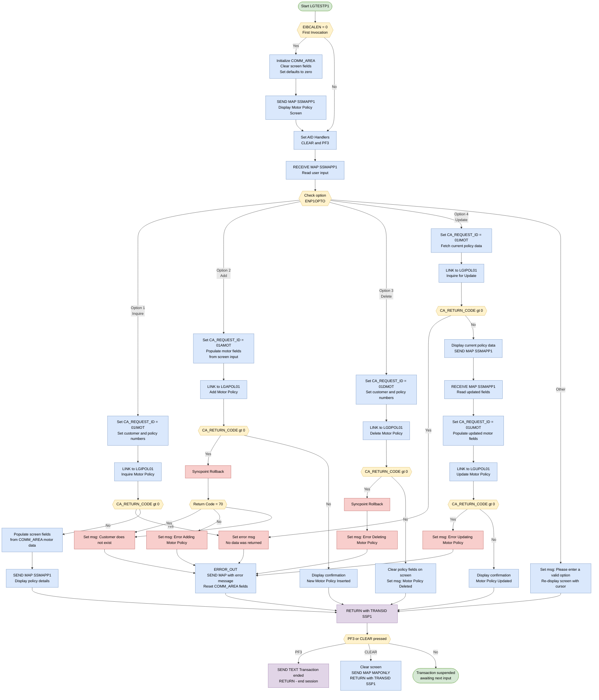

## Table of Contents

- [1. Purpose](#1-purpose)
- [2. Inputs](#2-inputs)
- [3. Outputs](#3-outputs)
  - [3.1 CICS Screen Output (SSMAPP1 Map — Motor Policy Screen)](#31-cics-screen-output-ssmapp1-map--motor-policy-screen)
  - [3.2 CICS Text Output (Terminal)](#32-cics-text-output-terminal)
  - [3.3 CICS Transaction Return / Pseudo-Conversational State](#33-cics-transaction-return--pseudo-conversational-state)
  - [3.4 Linked Program Invocations (EXEC CICS LINK)](#34-linked-program-invocations-exec-cics-link)
- [4. Processing Logic](#4-processing-logic)
  - [4.1 Mermaid Flow Diagram](#41-mermaid-flow-diagram)
  - [4.2 Processing Logic Description](#42-processing-logic-description)
  - [4.3 Database Tables](#43-database-tables)
- [5. Paragraphs](#5-paragraphs)
- [6. Dependencies](#6-dependencies)
  - [6.1 Called Programs](#61-called-programs)
  - [6.2 CICS BMS Maps and Interfaces](#62-cics-bms-maps-and-interfaces)
  - [6.3 Copybooks and Data Structures](#63-copybooks-and-data-structures)
  - [6.4 Transaction State and Control Flow](#64-transaction-state-and-control-flow)
- [7. Constraints](#7-constraints)
  - [7.1 Input Validation Constraints](#71-input-validation-constraints)
  - [7.2 Backend Response and Error-Handling Constraints](#72-backend-response-and-error-handling-constraints)
  - [7.3 Sequencing and Flow Constraints](#73-sequencing-and-flow-constraints)
  - [7.4 Resource and Communication Area Size Constraints](#74-resource-and-communication-area-size-constraints)
  - [7.5 Motor Policy Field Mapping Constraints (Add and Update)](#75-motor-policy-field-mapping-constraints-add-and-update)
- [8. Error Handling](#8-error-handling)
  - [8.1 CICS Condition Handling](#81-cics-condition-handling)
  - [8.2 Backend Return Code Checks (CA_RETURN_CODE)](#82-backend-return-code-checks-ca_return_code)
  - [8.3 Transaction Rollback](#83-transaction-rollback)
  - [8.4 Error Label Routing and Sub-Classification](#84-error-label-routing-and-sub-classification)
  - [8.5 Centralized Error Output and State Reset](#85-centralized-error-output-and-state-reset)
  - [8.6 Invalid Option Handling](#86-invalid-option-handling)
  - [8.7 Session Initialization and State Guard](#87-session-initialization-and-state-guard)
  - [8.8 Normal Termination Paths](#88-normal-termination-paths)
- [9. Examples](#9-examples)
  - [9.1 Example 1 — Inquire a Motor Policy (Option `1`)](#91-example-1--inquire-a-motor-policy-option-1)
  - [9.2 Example 2 — Add a New Motor Policy (Option `2`)](#92-example-2--add-a-new-motor-policy-option-2)
  - [9.3 Example 3 — Delete a Motor Policy (Option `3`)](#93-example-3--delete-a-motor-policy-option-3)

## 1. Purpose

`LGTESTP1` is a CICS-hosted PL/I program that serves as the interactive motor policy transaction menu for a general insurance application, allowing users to perform the full lifecycle of motor policy management — inquire, add, delete, and update — against a customer record. Running under CICS transaction `SSP1`, the program presents and receives the `SSMAPP1` BMS map screen, interprets the user-selected option, packages the relevant policy details (vehicle value, registration number, colour, engine capacity, manufacture date, premium, and accident history) into a shared Communication Area, and delegates each operation to a dedicated backend service program (`LGIPOL01` for inquiry, `LGAPOL01` for add, `LGDPOL01` for delete, and `LGUPOL01` for update) via `EXEC CICS LINK`; it then reflects the results back to the screen, performing a syncpoint rollback and displaying an appropriate error message whenever a backend call signals a failure through a non-zero return code.

## 2. Inputs

**Screen Input Fields (CICS Map — SSMAPP1)**

- **ENP1OPTO** (`SSMAPP1O.ENP1OPTO`, 1 char)
  - Transaction option entered by the user on the motor policy screen; drives the main SELECT, selecting one of: `1` = Inquire, `2` = Add, `3` = Delete, `4` = Update

- **ENP1CNOI / ENP1CNOO** (`SSMAPP1I/O.ENP1CNOI` / `ENP1CNOO`, 10 chars)
  - Customer number typed into or already displayed on the motor policy screen; loaded into `CA_CUSTOMER_NUM` before every backend LINK call

- **ENP1PNOO** (`SSMAPP1O.ENP1PNOO`, 10 chars)
  - Policy number displayed on the screen; loaded into `CA_POLICY_NUM` for Inquire, Delete, and the first half of Update

- **ENP1IDAI** (`SSMAPP1I.ENP1IDAI`, 10 chars)
  - Issue date entered by the user; mapped to `CA_ISSUE_DATE` on Add and Update operations

- **ENP1EDAI** (`SSMAPP1I.ENP1EDAI`, 10 chars)
  - Expiry date entered by the user; mapped to `CA_EXPIRY_DATE` on Add and Update operations

- **ENP1VALI** (`SSMAPP1I.ENP1VALI`, 6 chars)
  - Declared vehicle value entered by the user; mapped to `CA_M_VALUE` on Add and Update

- **ENP1REGI** (`SSMAPP1I.ENP1REGI`, 7 chars)
  - Vehicle registration number entered by the user; mapped to `CA_M_REGNUMBER` on Add and Update

- **ENP1COLI** (`SSMAPP1I.ENP1COLI`, 8 chars)
  - Vehicle colour entered by the user; mapped to `CA_M_COLOUR` on Add and Update

- **ENP1CCI** (`SSMAPP1I.ENP1CCI`, 8 chars)
  - Engine cubic capacity entered by the user; mapped to `CA_M_CC` on Add and Update

- **ENP1MANI** (`SSMAPP1I.ENP1MANI`, 10 chars)
  - Vehicle manufacture date entered by the user; mapped to `CA_M_MANUFACTURED` on Add and Update

- **ENP1PREI** (`SSMAPP1I.ENP1PREI`, 6 chars)
  - Insurance premium entered by the user; mapped to `CA_M_PREMIUM` on Add and Update

- **ENP1ACCI** (`SSMAPP1I.ENP1ACCI`, 6 chars)
  - Accident count/value entered by the user; mapped to `CA_M_ACCIDENTS` on Add and Update

**Communication Area (COMMAREA — passed by CICS on re-entry)**

- **CA_REQUEST_ID** (`COMM_AREA.CA_REQUEST_ID`, 6 chars)
  - Identifies the backend transaction type (`01IMOT`, `01AMOT`, `01DMOT`, `01UMOT`); received in the COMMAREA on every re-entry and set before each LINK call

- **CA_RETURN_CODE** (`COMM_AREA.CA_RETURN_CODE`, PIC `99`)
  - Return status received back from linked backend programs (LGIPOL01, LGAPOL01, LGDPOL01, LGUPOL01); a non-zero value triggers error-handling branches

- **CA_CUSTOMER_NUM** (`COMM_AREA.CA_CUSTOMER_NUM`, PIC `9999999999`)
  - Customer identifier carried in the COMMAREA across CICS pseudo-conversational return cycles and populated from screen fields before each LINK

- **CA_POLICY_NUM** (`COMM_AREA.CA_POLICY_REQUEST.CA_POLICY_NUM`, PIC `9999999999`)
  - Policy identifier carried in the COMMAREA; set from the screen before Inquire/Delete/Update and returned by the backend after a successful Add

- **CA_REQUEST_INITIALISER** (`COMM_AREA.CA_REQUEST_SPECIFIC.CA_REQUEST_INITIALISER`, 32482 chars)
  - Used to wipe the request-specific portion of the COMMAREA; its blank/spaces value arriving in the COMMAREA on re-entry is relied upon to ensure a clean state before building a new request

- **CA_ISSUE_DATE** (`COMM_AREA.CA_POLICY_COMMON.CA_ISSUE_DATE`, 10 chars)
  - Policy issue date returned by `LGIPOL01` on Inquire; subsequently redisplayed on screen and then re-read from the screen into the COMMAREA for Update

- **CA_EXPIRY_DATE** (`COMM_AREA.CA_POLICY_COMMON.CA_EXPIRY_DATE`, 10 chars)
  - Policy expiry date returned by `LGIPOL01` on Inquire; redisplayed and then re-submitted for Update

- **CA_M_MAKE** (`COMM_AREA.CA_MOTOR.CA_M_MAKE`, 15 chars)
  - Vehicle make returned by `LGIPOL01`; displayed on the screen during Inquire and pre-fill for Update

- **CA_M_MODEL** (`COMM_AREA.CA_MOTOR.CA_M_MODEL`, 15 chars)
  - Vehicle model returned by `LGIPOL01`; displayed on the screen during Inquire and pre-fill for Update

- **CA_M_VALUE** (`COMM_AREA.CA_MOTOR.CA_M_VALUE`, PIC `999999`)
  - Vehicle value returned from the backend on Inquire; re-sent to the screen and then re-read back from the screen into the COMMAREA for Update

- **CA_M_REGNUMBER** (`COMM_AREA.CA_MOTOR.CA_M_REGNUMBER`, 7 chars)
  - Registration number returned from the backend on Inquire; redisplayed and re-read for Update

- **CA_M_COLOUR** (`COMM_AREA.CA_MOTOR.CA_M_COLOUR`, 8 chars)
  - Vehicle colour returned from the backend on Inquire; redisplayed and re-read for Update

- **CA_M_CC** (`COMM_AREA.CA_MOTOR.CA_M_CC`, PIC `9999`)
  - Cubic capacity returned from the backend on Inquire; redisplayed and re-read for Update

- **CA_M_MANUFACTURED** (`COMM_AREA.CA_MOTOR.CA_M_MANUFACTURED`, 10 chars)
  - Manufacture date returned from the backend on Inquire; redisplayed and re-read for Update

- **CA_M_PREMIUM** (`COMM_AREA.CA_MOTOR.CA_M_PREMIUM`, PIC `999999`)
  - Premium amount returned from the backend on Inquire; redisplayed and re-read for Update

- **CA_M_ACCIDENTS** (`COMM_AREA.CA_MOTOR.CA_M_ACCIDENTS`, PIC `999999`)
  - Accident record returned from the backend on Inquire; redisplayed and re-read for Update

**CICS Runtime / Program Entry Parameters**

- **DFHEIPTR** (procedure parameter, pointer)
  - Standard CICS EIB pointer passed automatically by CICS at program invocation; provides access to the Execute Interface Block

- **COMM_AREA_PTR** (procedure parameter, pointer)
  - Pointer to the COMMAREA passed by CICS on every pseudo-conversational re-entry; the entire `COMM_AREA` structure is based on this pointer, making it the primary vehicle for all state carried between screen interactions

- **EIBCALEN** (CICS EIB field)
  - Length of the COMMAREA at entry; checked at program start (`IF EIBCALEN = 0`) to distinguish a fresh transaction invocation from a pseudo-conversational re-entry, controlling initialisation logic

## 3. Outputs

### 3.1 CICS Screen Output (SSMAPP1 Map — Motor Policy Screen)

- **ENP1CNOO** — Customer number displayed on the motor policy screen; populated from `CA_CUSTOMER_NUM` after a successful add or update operation
- **ENP1PNOO** — Policy number displayed on screen; returned by the backend after a successful add or update and written back to the screen
- **ENP1IDAO / ENP1IDAI** — Issue date field sent to the screen during inquiry or after update; sourced from `CA_ISSUE_DATE`
- **ENP1EDAO / ENP1EDAI** — Expiry date field sent to the screen during inquiry or after update; sourced from `CA_EXPIRY_DATE`
- **ENP1CMKO / ENP1CMKI** — Vehicle make displayed on screen during inquiry and update; sourced from `CA_M_MAKE`
- **ENP1CMOO / ENP1CMOI** — Vehicle model displayed on screen during inquiry and update; sourced from `CA_M_MODEL`
- **ENP1VALO / ENP1VALI** — Vehicle value displayed on screen; sourced from `CA_M_VALUE`
- **ENP1REGO / ENP1REGI** — Vehicle registration number displayed on screen; sourced from `CA_M_REGNUMBER`
- **ENP1COLO / ENP1COLI** — Vehicle colour displayed on screen; sourced from `CA_M_COLOUR`
- **ENP1CCO / ENP1CCI** — Engine cubic capacity displayed on screen; sourced from `CA_M_CC`
- **ENP1MANO / ENP1MANI** — Vehicle manufacture date displayed on screen; sourced from `CA_M_MANUFACTURED`
- **ENP1PREO / ENP1PREI** — Premium amount displayed on screen; sourced from `CA_M_PREMIUM`
- **ENP1ACCO / ENP1ACCI** — Number of accidents displayed on screen; sourced from `CA_M_ACCIDENTS`
- **ERP1FLDO** — Error/status message field displayed on the motor policy screen; set to one of the following depending on the outcome:
  - `'New Motor Policy Inserted'` — after a successful add (option 2)
  - `'Motor Policy Deleted'` — after a successful delete (option 3)
  - `'Motor Policy Updated'` — after a successful update (option 4)
  - `'Please enter a valid option'` — when an unrecognised option is entered
  - `'Customer does not exist'` — when add fails with return code 70
  - `'Error Adding Motor Policy'` — when add fails with any other error
  - `'Error Updating Motor Policy'` — when update fails
  - `'Error Deleting Motor Policy'` — when delete fails
  - `'No data was returned.'` — when inquiry returns no data

### 3.2 CICS Text Output (Terminal)

- **MSGEND** — Static text `'Transaction ended      '` sent as a full-screen CICS `SEND TEXT` with ERASE when the user presses PF3 or CLEAR triggers the `ENDIT` label; signals normal session termination to the terminal

### 3.3 CICS Transaction Return / Pseudo-Conversational State

- **COMM_AREA** (passed via `EXEC CICS RETURN TRANSID('SSP1') COMMAREA(COMM_AREA)`) — The full communication area is returned to CICS to be passed back on the next transaction invocation, carrying the preserved state of the motor policy session across pseudo-conversational interactions
  - **CA_REQUEST_ID** — Preserved in the COMMAREA across return; identifies the last transaction type performed
  - **CA_RETURN_CODE** — Preserved in the COMMAREA; reset to 0 after error handling to ensure a clean state on the next entry
  - **CA_CUSTOMER_NUM** — Preserved in the COMMAREA; reset to 0 after error handling
  - **CA_REQUEST_INITIALISER** — Preserved in the COMMAREA; reset to spaces after error handling to clear policy-specific data

### 3.4 Linked Program Invocations (EXEC CICS LINK)

- **LGIPOL01** — Called with `CA_REQUEST_ID='01IMOT'` to inquire a motor policy; the COMMAREA is updated in place with policy details returned by the backend
- **LGAPOL01** — Called with `CA_REQUEST_ID='01AMOT'` to add a new motor policy; on success, `CA_POLICY_NUM` in the COMMAREA is populated with the newly assigned policy number; on failure, a `SYNCPOINT ROLLBACK` is issued
- **LGDPOL01** — Called with `CA_REQUEST_ID='01DMOT'` to delete a motor policy; on failure, a `SYNCPOINT ROLLBACK` is issued
- **LGUPOL01** — Called with `CA_REQUEST_ID='01UMOT'` to update a motor policy; updates the policy record in the backend system

## 4. Processing Logic

### 4.1 Mermaid Flow Diagram



---

### 4.2 Processing Logic Description

#### 4.2.1 High-level Summary

`LGTESTP1` is a CICS pseudo-conversational PL/I program that provides a terminal-based **Motor Policy Menu**. It presents a single map (`SSMAPP1`) to an insurance clerk and supports four operations on motor insurance policies: **Inquire**, **Add**, **Delete**, and **Update**. The program acts as the presentation and orchestration layer, delegating all data access to dedicated backend CICS programs via `EXEC CICS LINK`.

---

#### 4.2.2 Execution Flow

**1. First-Time Invocation Check (`EIBCALEN = 0`)**

When the program is entered for the first time (no COMMAREA exists, `EIBCALEN = 0`), it:
- Allocates a local `BASE_COMM_AREA` and points `COMM_AREA_PTR` at it.
- Clears all output map fields (`SSMAPP1O`) and resets `CA_REQUEST_ID`, `CA_RETURN_CODE`, and `CA_CUSTOMER_NUM` to their initial values.
- Sets numeric display fields (customer number, policy number, value, CC, accidents, premium) to zero-formatted strings.
- Sends map `SSMAPP1` with `ERASE` to display a clean Motor Policy screen.

On subsequent invocations (pseudo-conversational re-entry), initialization is skipped and execution falls through directly to the `A_GAIN` label.

---

**2. AID Key and Condition Handling (`A_GAIN` label)**

Before reading user input, CICS attention-identifier handlers are set:
- **CLEAR key** → branches to `CLEARIT`: clears the screen and returns with `TRANSID('SSP1')` to keep the transaction alive.
- **PF3 key** → branches to `ENDIT`: sends the "Transaction ended" message and issues a plain `EXEC CICS RETURN`, terminating the session.
- **MAPFAIL condition** → also routes to `ENDIT`, handling the case where the user submits an empty map.

The program then reads the user's input via `EXEC CICS RECEIVE MAP('SSMAPP1')`.

---

**3. Option Dispatch — `SELECT (ENP1OPTO)`**

The 1-character option field `ENP1OPTO` drives the main SELECT:

---

**Option '1' — Inquire Motor Policy**
- Sets `CA_REQUEST_ID = '01IMOT'`, loads customer number from screen output field (`ENP1CNOO`) and policy number (`ENP1PNOO`) into the COMMAREA.
- Links to **`LGIPOL01`** (Inquire Policy).
- If `CA_RETURN_CODE > 0`: jumps to `NO_DATA` error handler.
- On success: maps all returned motor fields (`CA_M_MAKE`, `CA_M_MODEL`, `CA_M_VALUE`, `CA_M_REGNUMBER`, `CA_M_COLOUR`, `CA_M_CC`, `CA_M_MANUFACTURED`, `CA_M_PREMIUM`, `CA_M_ACCIDENTS`, plus dates) into screen input fields and sends the map back for display.
- Returns with `TRANSID('SSP1')` to re-enter pseudo-conversationally.

---

**Option '2' — Add Motor Policy**
- Sets `CA_REQUEST_ID = '01AMOT'`.
- Reads all motor details from screen input fields (`ENP1CNOI`, `ENP1IDAI`, `ENP1VALI`, etc.) into the COMMAREA. Payment, broker ID, and broker reference are explicitly zeroed/cleared.
- *(Note: Make and model fields are commented out — not currently passed.)*
- Links to **`LGAPOL01`** (Add Policy).
- If `CA_RETURN_CODE > 0`: issues `EXEC CICS Syncpoint Rollback` to undo any partial database changes, then branches to `NO_ADD`.
  - Return code `70` specifically signals "Customer does not exist."
  - All other non-zero codes display a generic "Error Adding Motor Policy" message.
- On success: populates the screen with the newly assigned customer and policy numbers returned from the backend, displays "New Motor Policy Inserted," and returns.

---

**Option '3' — Delete Motor Policy**
- Sets `CA_REQUEST_ID = '01DMOT'`, reads customer and policy numbers from screen output fields.
- Links to **`LGDPOL01`** (Delete Policy).
- If `CA_RETURN_CODE > 0`: issues `EXEC CICS Syncpoint Rollback` and jumps to `NO_DELETE`.
- On success: blanks all policy detail screen fields and displays "Motor Policy Deleted."

---

**Option '4' — Update Motor Policy (Two-Phase)**

Update is a **two-round-trip** operation:

*Phase 1 — Fetch current data:*
- Sets `CA_REQUEST_ID = '01IMOT'`, links to **`LGIPOL01`** to retrieve the existing record.
- If error: routes to `NO_DATA`.
- Populates the screen with the current policy data and sends the map back so the clerk can review and edit.

*Phase 2 — Apply the update:*
- Immediately issues `EXEC CICS RECEIVE MAP('SSMAPP1')` within the same task to read the modified fields back.
- Sets `CA_REQUEST_ID = '01UMOT'`, maps all modified screen fields into the COMMAREA.
- Links to **`LGUPOL01`** (Update Policy).
- If `CA_RETURN_CODE > 0`: routes to `NO_UPD`.
- On success: displays "Motor Policy Updated."

---

**Otherwise — Invalid Option**
- Sets the error field `ERP1FLDO` to "Please enter a valid option."
- Sets `ENP1OPTL = -1` (flags the option field for highlighting/cursor placement).
- Re-sends the map with the `CURSOR` option and loops back via `ENDIT_STARTIT`.

---

**4. Error Handling Labels**

| Label | Trigger | Message |
|---|---|---|
| `NO_DATA` | Inquire returns non-zero code | "No data was returned." |
| `NO_ADD` | Add returns code 70 | "Customer does not exist" |
| `NO_ADD` | Add returns other error | "Error Adding Motor Policy" |
| `NO_UPD` | Update returns non-zero code | "Error Updating Motor Policy" |
| `NO_DELETE` | Delete returns non-zero code | "Error Deleting Motor Policy" |

All error paths converge at `ERROR_OUT`, which:
1. Sends the map with the error message.
2. Resets `SSMAPP1O`, `CA_REQUEST_ID`, `CA_RETURN_CODE`, `CA_CUSTOMER_NUM`, and `CA_REQUEST_INITIALISER` to clean state.
3. Branches to `ENDIT_STARTIT` to return pseudo-conversationally.

---

**5. Termination**

- **`ENDIT_STARTIT`**: Returns control to CICS with `TRANSID('SSP1')` and the COMMAREA, keeping the transaction alive for the next user interaction.
- **`ENDIT`**: Sends the text "Transaction ended" and issues a bare `EXEC CICS RETURN`, ending the transaction entirely. Triggered by PF3, CLEAR-to-end, or MAPFAIL.
- **`CLEARIT`**: Blanks the map and re-sends it with `MAPONLY`, then returns with `TRANSID('SSP1')` to refresh the screen without losing the session.

---

#### 4.2.3 External Interactions

| Backend Program | Request ID | Purpose |
|---|---|---|
| `LGIPOL01` | `01IMOT` | Inquire a motor policy by customer and policy number |
| `LGAPOL01` | `01AMOT` | Add a new motor policy for a customer |
| `LGDPOL01` | `01DMOT` | Delete an existing motor policy |
| `LGUPOL01` | `01UMOT` | Update an existing motor policy |

All interactions use `EXEC CICS LINK` with the 32,500-byte COMMAREA (`COMM_AREA`). The COMMAREA's `CA_REQUEST_ID` identifies the operation type; `CA_RETURN_CODE` carries the result status back. For destructive operations (Add, Delete), a CICS Syncpoint Rollback is issued if the backend reports an error, ensuring data integrity.

---

#### 4.2.4 Plain Language Summary

`LGTESTP1` is the interactive front-end for managing motor insurance policies on a mainframe terminal. When a clerk opens the Motor Policy screen, they can type in a customer number, a policy number, and choose one of four actions:

- **1 – Look up** a motor policy and see all its details (vehicle make, model, value, registration, colour, engine size, manufacture date, premium, and accident history).
- **2 – Add** a new motor policy by filling in the vehicle details; the system assigns a new policy number.
- **3 – Delete** a motor policy; the screen clears to confirm deletion.
- **4 – Update** a policy: the system first displays the current data, the clerk makes changes, and then saves them.

If anything goes wrong (customer not found, database error), a message is shown and the screen resets cleanly. The clerk can press PF3 at any time to end the session, or CLEAR to refresh the screen.

---

### 4.3 Database Tables

The program itself does not directly execute SQL — all data access is delegated to backend linked programs (`LGIPOL01`, `LGAPOL01`, `LGDPOL01`, `LGUPOL01`). The COMMAREA fields correspond to the motor policy data model used by those programs.

```erDiagram
    MOTOR_POLICY {
        decimal POLICY_NUM "10-digit policy identifier"
        decimal CUSTOMER_NUM "10-digit customer identifier"
        string ISSUE_DATE "Policy issue date 10 chars"
        string EXPIRY_DATE "Policy expiry date 10 chars"
        string LASTCHANGED "Last changed timestamp 26 chars"
        decimal BROKERID "Broker identifier"
        string BROKERSREF "Broker reference 10 chars"
        decimal PAYMENT "Payment amount"
        string CA_M_MAKE "Vehicle make 15 chars"
        string CA_M_MODEL "Vehicle model 15 chars"
        decimal CA_M_VALUE "Declared vehicle value"
        string CA_M_REGNUMBER "Registration number 7 chars"
        string CA_M_COLOUR "Vehicle colour 8 chars"
        decimal CA_M_CC "Engine cubic capacity"
        string CA_M_MANUFACTURED "Manufacture date 10 chars"
        decimal CA_M_PREMIUM "Insurance premium"
        decimal CA_M_ACCIDENTS "Accident count or value"
    }
```

## 5. Paragraphs

- **Initialization Block (EIBCALEN = 0 check)**
  - Serves as the program entry and first-time initialization guard. When the CICS communication length (`EIBCALEN`) is zero, this block executes to set up a clean initial state for a new terminal session.
  - Sets `COMM_AREA_PTR` to the address of the local base communication area, blanks the output map (`SSMAPP1O`), zeroes `CA_REQUEST_ID`, `CA_RETURN_CODE`, `CA_CUSTOMER_NUM`, and `CA_REQUEST_INITIALISER`, and pre-fills screen numeric output fields (`ENP1CNOO`, `ENP1PNOO`, `ENP1VALO`, `ENP1CCO`, `ENP1ACCO`, `ENP1PREO`) with zeros.
  - Issues an `EXEC CICS SEND MAP` for map `SSMAPP1` in mapset `SSMAP` with `ERASE` to paint the initial motor policy screen on the terminal.
  - Control then falls through to `A_GAIN`.

- **A_GAIN**
  - The main processing loop label. It re-enters here on every pseudo-conversational return to receive and act on the next user input.
  - Registers AID key handlers: `CLEAR` key routes to `CLEARIT`, `PF3` routes to `ENDIT`. Registers a `MAPFAIL` condition handler pointing to `ENDIT` to gracefully terminate if no map data is received.
  - Issues `EXEC CICS RECEIVE MAP` for `SSMAPP1` into `SSMAPP1I` to accept the user's input from the terminal.
  - Evaluates `ENP1OPTO` (the user-selected option field) in a `SELECT` statement to branch into one of four functional operations — or an error path for an unrecognized option:
    - **WHEN '1' — Inquire Motor Policy:** Sets `CA_REQUEST_ID` to `'01IMOT'`, populates `CA_CUSTOMER_NUM` and `CA_POLICY_NUM` from screen output fields, then links to `LGIPOL01`. On a non-zero `CA_RETURN_CODE`, branches to `NO_DATA`. On success, maps all returned policy fields (issue date, expiry date, make, model, value, registration, colour, CC, manufactured date, premium, accidents) into their corresponding input fields on the map and sends the refreshed screen back. Transfers control to `ENDIT_STARTIT`.
    - **WHEN '2' — Add Motor Policy:** Sets `CA_REQUEST_ID` to `'01AMOT'`, reads screen input fields (`ENP1CNOI`, dates, motor attributes) into the communication area, links to `LGAPOL01`. On failure, issues an `EXEC CICS Syncpoint Rollback` and branches to `NO_ADD`. On success, updates the screen with the newly assigned customer and policy numbers, sets a confirmation message `'New Motor Policy Inserted'`, sends the map, and routes to `ENDIT_STARTIT`.
    - **WHEN '3' — Delete Motor Policy:** Sets `CA_REQUEST_ID` to `'01DMOT'`, passes customer and policy numbers to `LGDPOL01` via `EXEC CICS LINK`. On failure, issues an `EXEC CICS Syncpoint Rollback` and branches to `NO_DELETE`. On success, clears all policy-related input fields from the screen, sets the message `'Motor Policy Deleted'`, sends the map, and routes to `ENDIT_STARTIT`.
    - **WHEN '4' — Update Motor Policy:** Performs a two-phase interaction. First, sets `CA_REQUEST_ID` to `'01IMOT'` and links to `LGIPOL01` to retrieve current policy data and populate the screen for user review. On retrieval error, branches to `NO_DATA`. Then issues a second `EXEC CICS RECEIVE MAP` to capture the user's edits. Sets `CA_REQUEST_ID` to `'01UMOT'`, maps updated screen fields back into the communication area (value, registration, colour, CC, manufactured date, premium, accidents), and links to `LGUPOL01`. On failure, branches to `NO_UPD`. On success, sets the message `'Motor Policy Updated'`, sends the map, and routes to `ENDIT_STARTIT`.
    - **OTHERWISE — Invalid Option:** Sets error message `'Please enter a valid option'`, marks the option field length indicator (`ENP1OPTL`) as `-1` to position the cursor, sends the map with `CURSOR`, and routes to `ENDIT_STARTIT`.

- **ENDIT_STARTIT**
  - The pseudo-conversational return label. Issues `EXEC CICS RETURN` with `TRANSID('SSP1')` and passes the current `COMM_AREA` as the commarea, suspending the program while preserving state so that the next user interaction reactivates it at `A_GAIN`.

- **ENDIT**
  - The normal session termination label. Triggered by PF3 key or a MAPFAIL condition.
  - Sends the literal `MSGEND` (`'Transaction ended      '`) as free text to the terminal using `EXEC CICS SEND TEXT` with `ERASE` and `FREEKB`, then issues a plain `EXEC CICS RETURN` with no transaction ID, ending the CICS task entirely.

- **CLEARIT**
  - Handles the CLEAR key press. Blanks the output map structure (`SSMAPP1O`), sends the map using `MAPONLY` (which refreshes the base map without any modified data), then issues `EXEC CICS RETURN` with `TRANSID('SSP1')` and the commarea to continue the pseudo-conversational session in a clean state.

- **NO_ADD**
  - Error handler for a failed add operation. Inspects `CA_RETURN_CODE`; if it equals `70`, sets the message `'Customer does not exist'`; for all other non-zero codes, sets `'Error Adding Motor Policy'`. Branches to `ERROR_OUT` in both cases.

- **NO_UPD**
  - Error handler for a failed update operation. Sets the error message `'Error Updating Motor Policy'` into the screen error field and branches to `ERROR_OUT`.

- **NO_DELETE**
  - Error handler for a failed delete operation. Sets the error message `'Error Deleting Motor Policy'` into the screen error field and branches to `ERROR_OUT`.

- **NO_DATA**
  - Error handler for a failed inquiry (no data returned). Sets the error message `'No data was returned.'` into the screen error field and branches to `ERROR_OUT`.

- **ERROR_OUT**
  - Central error display and state-reset routine. Sends the current map (`SSMAPP1`) with the error message already placed in `ERP1FLDO` to the terminal. Then resets the communication area fields (`SSMAPP1O`, `CA_REQUEST_ID`, `CA_RETURN_CODE`, `CA_CUSTOMER_NUM`, `CA_REQUEST_INITIALISER`) to a clean state before routing to `ENDIT_STARTIT` so the user can retry the operation in the next transaction cycle.

## 6. Dependencies

### 6.1 Called Programs
- `LGIPOL01`: Motor policy inquiry program invoked via `EXEC CICS LINK` with `COMM_AREA` to retrieve existing motor policy details.
- `LGAPOL01`: Motor policy creation program invoked via `EXEC CICS LINK` with `COMM_AREA` to insert a new motor policy.
- `LGDPOL01`: Motor policy deletion program invoked via `EXEC CICS LINK` with `COMM_AREA` to remove an existing motor policy.
- `LGUPOL01`: Motor policy update program invoked via `EXEC CICS LINK` with `COMM_AREA` to update existing motor policy records.

### 6.2 CICS BMS Maps and Interfaces
- `SSMAPP1` (Mapset: `SSMAP`): The primary 3270 screen map used to display the motor policy menu, capture user input options and motor vehicle details, and present operational feedback or error messages.
- `EIBCALEN`: CICS Execute Interface Block communication area length field, evaluated at program start to determine whether the transaction was initiated with or without an existing communication area.
- `DFHEIPTR`: CICS Execute Interface Pointer parameter required by the CICS PL/I execution environment.
- Transaction `SSP1`: The pseudo-conversational CICS transaction identifier passed in `EXEC CICS RETURN TRANSID('SSP1')` to maintain session context across user terminal interactions.

### 6.3 Copybooks and Data Structures
- `SSMAP.inc` (`SSMAP`): Defines the symbolic map input and output structures (`SSMAPC1I`/`SSMAPC1O` through `SSMAPP5I`/`SSMAPP5O`), providing field layouts for the terminal screens including `SSMAPP1I`/`SSMAPP1O`.
- `LGCMAREA.inc` (`LGCMAREA`): Defines the shared communication area structure (`COMM_AREA`), including generic header fields (`CA_REQUEST_ID`, `CA_RETURN_CODE`, `CA_CUSTOMER_NUM`, `CA_REQUEST_INITIALISER`), common policy fields (`CA_ISSUE_DATE`, `CA_EXPIRY_DATE`), and motor policy fields (`CA_MOTOR`).

### 6.4 Transaction State and Control Flow
- Clear Key and PF3 Key: Attention identifier (AID) keys handled via `EXEC CICS HANDLE AID` to clear the map (`CLEARIT`) or terminate the transaction session (`ENDIT`).
- CICS Syncpoint: `EXEC CICS SYNCPOINT ROLLBACK` invoked during failed add or delete operations to revert transactional modifications.

## 7. Constraints

### 7.1 Input Validation Constraints

- **Transaction option must be one of `'1'`, `'2'`, `'3'`, or `'4'`**
  - The `SELECT (ENP1OPTO)` statement at line 725 routes processing based on the single-character option field
  - Any value outside these four cases falls into the `OTHERWISE` branch (line 879), which sets the error message `'Please enter a valid option'`, highlights the option field by setting `ENP1OPTL = -1`, redisplays the map with cursor, and does not invoke any backend program
  - This makes option selection effectively a required, enumerated field

- **`CA_CUSTOMER_NUM` must reference an existing customer for Add (option `'2'`)**
  - When `LGAPOL01` returns `CA_RETURN_CODE = 70` (line 923), the specific error message `'Customer does not exist'` is displayed
  - This implies the customer number supplied via `ENP1CNOI` must correspond to a pre-existing customer record; otherwise the add is rejected

- **`CA_CUSTOMER_NUM` and `CA_POLICY_NUM` must reference an existing policy for Inquire (option `'1'`), Delete (option `'3'`), and Update (option `'4'`)**
  - For options `'1'` and `'4'`, `ENP1CNOO` and `ENP1PNOO` are transferred to `CA_CUSTOMER_NUM` and `CA_POLICY_NUM` (lines 729–730, 820–821) before calling `LGIPOL01`
  - For option `'3'`, `ENP1CNOO` and `ENP1PNOO` are similarly used before calling `LGDPOL01` (lines 792–793)
  - A non-zero `CA_RETURN_CODE` causes a redirect to `NO_DATA` or `NO_DELETE`, indicating the policy must exist and be retrievable

- **Field sizes impose implicit format constraints**
  - `CA_CUSTOMER_NUM` is declared `PIC '9999999999'` (10 digits, numeric only)
  - `CA_POLICY_NUM` is declared `PIC '9999999999'` (10 digits, numeric only)
  - `CA_RETURN_CODE` is declared `PIC '99'` (2 digits, numeric)
  - Motor policy fields are bounded by their declared sizes:
    - `CA_M_VALUE`: `PIC '999999'` — 6 numeric digits maximum
    - `CA_M_CC`: `PIC '9999'` — 4 numeric digits maximum
    - `CA_M_PREMIUM`: `PIC '999999'` — 6 numeric digits maximum
    - `CA_M_ACCIDENTS`: `PIC '999999'` — 6 numeric digits maximum
    - `CA_M_REGNUMBER`: `CHAR(7)` — 7 characters maximum
    - `CA_M_COLOUR`: `CHAR(8)` — 8 characters maximum
    - `CA_M_MANUFACTURED`: `CHAR(10)` — 10 characters maximum

### 7.2 Backend Response and Error-Handling Constraints

- **`CA_RETURN_CODE` greater than zero halts normal processing**
  - For option `'1'` (Inquire): non-zero return code redirects to `NO_DATA` label (line 734–735); the inquiry result is never populated on the screen
  - For option `'2'` (Add): non-zero return code causes an immediate `EXEC CICS Syncpoint Rollback` followed by redirect to `NO_ADD` (lines 775–778); the new policy number is never written back to the screen
  - For option `'3'` (Delete): non-zero return code causes an immediate `EXEC CICS Syncpoint Rollback` followed by redirect to `NO_DELETE` (lines 797–799)
  - For option `'4'` (Update): non-zero return code redirects to `NO_UPD` (lines 865–866); no successful confirmation message is displayed

- **A specific return code of `70` from `LGAPOL01` is treated as a distinct validation error**
  - In `NO_ADD`, `CA_RETURN_CODE = 70` produces the targeted message `'Customer does not exist'` (lines 922–926), distinguishing a customer-not-found condition from a generic add failure

- **Error recovery resets the communication area state**
  - After any error branch reaches `ERROR_OUT` (line 945), `CA_REQUEST_ID`, `CA_RETURN_CODE`, `CA_CUSTOMER_NUM`, and `CA_REQUEST_INITIALISER` are all reset to zero or blank (lines 951–954) before re-entering the transaction loop, ensuring no stale error state persists across interaction cycles

### 7.3 Sequencing and Flow Constraints

- **Initial entry (EIBCALEN = 0) must perform screen initialisation before any operation**
  - When `EIBCALEN` equals zero (line 691), all output fields and communication area fields are blanked/zeroed and the map is sent with `ERASE` before control reaches the `A_GAIN` receive loop
  - This means backend calls cannot occur on the very first transaction invocation; the user must first interact with the displayed screen

- **Update (option `'4'`) requires a two-step screen exchange before committing**
  - An initial `EXEC CICS LINK` to `LGIPOL01` (line 822) is mandatory to retrieve and display existing policy data before the user can modify it
  - Only after the populated screen is re-sent (line 839) and a second `EXEC CICS RECEIVE MAP` (line 842) is performed are the user-modified values collected and passed to `LGUPOL01`
  - This means an update cannot proceed without a prior successful inquiry of the target policy

- **CA_REQUEST_ID must be set to the correct request code before each backend call**
  - `'01IMOT'` is required for inquire (lines 728, 819)
  - `'01AMOT'` is required for add (line 755)
  - `'01DMOT'` is required for delete (line 791)
  - `'01UMOT'` is required for update (line 846)
  - The program enforces this sequencing by setting the field immediately before each `EXEC CICS LINK`

- **CLEAR key (PF-key) aborts processing and resets the screen without invoking any backend**
  - The `EXEC CICS HANDLE AID CLEAR(CLEARIT)` (line 715) intercepts the CLEAR key before map input is processed; it blanks the output map, resends it empty, and returns to transaction `SSP1` with the communication area, bypassing all business logic

- **PF3 key terminates the session unconditionally**
  - `EXEC CICS HANDLE AID PF3(ENDIT)` (line 716) causes an immediate jump to `ENDIT`, where a "Transaction ended" message is sent to the terminal and `EXEC CICS RETURN` is issued with no `TRANSID`, ending the pseudo-conversational loop

- **MAPFAIL condition terminates the session**
  - `EXEC CICS HANDLE CONDITION MAPFAIL(ENDIT)` (line 717–718) ensures that if the map receive fails (e.g., user presses Enter without data), processing ends rather than attempting to execute with unpopulated inputs

### 7.4 Resource and Communication Area Size Constraints

- **The COMMAREA passed to all linked programs is fixed at 32,500 bytes**
  - Every `EXEC CICS LINK` call specifies `LENGTH(32500)` (lines 733, 774, 796, 864), matching the `COMM_AREA_RAW CHAR(32500)` declaration (line 586)
  - This is both a maximum and a required exact size; linked programs are expected to interpret the area at this fixed length

- **`CA_REQUEST_INITIALISER` (32,482 bytes) is used to clear the request-specific portion of the COMMAREA**
  - Set to spaces on initial entry (line 698) and after errors (line 954), this field overwrites the entire `CA_REQUEST_SPECIFIC UNION` to prevent stale data from prior transactions being submitted to backend programs

- **The transaction re-entry identifier is fixed as `SSP1`**
  - `EXEC CICS RETURN TRANSID('SSP1')` (lines 899, 918) restricts the pseudo-conversational loop to a single hard-coded transaction ID; no dynamic transaction routing is permitted

### 7.5 Motor Policy Field Mapping Constraints (Add and Update)

- **`CA_M_MAKE` and `CA_M_MODEL` are intentionally excluded from Add and Update submissions**
  - Lines 762–763 (Add) and 853–854 (Update) contain commented-out assignments for `CA_M_MAKE` and `CA_M_MODEL`, meaning the vehicle make and model fields visible on the screen (`ENP1CMKI`, `ENP1CMOI`) are never transmitted to the backend during write operations
  - These fields are read-only from the backend's perspective for add and update transactions

- **`CA_PAYMENT`, `CA_BROKERID`, and `CA_BROKERSREF` are always zeroed/blanked before Add and Update calls**
  - Lines 757–759 (Add) and 848–850 (Update) hard-code these common policy fields to zero or empty string
  - The user cannot supply payment, broker ID, or broker reference values through this screen; those fields are not exposed for motor policy transactions

## 8. Error Handling

### 8.1 CICS Condition Handling

- **HANDLE AID — PF3 and CLEAR key interception**: At the `A_GAIN` label, `EXEC CICS HANDLE AID` is registered to intercept specific attention identifier keys. Pressing PF3 routes control to the `ENDIT` label, and pressing CLEAR routes to the `CLEARIT` label, ensuring that user-initiated termination and screen-clear actions are handled gracefully rather than falling through to normal processing logic.

- **HANDLE CONDITION — MAPFAIL**: Also at `A_GAIN`, `EXEC CICS HANDLE CONDITION MAPFAIL(ENDIT)` is established to trap the CICS MAPFAIL condition. If a map receive operation finds no data (e.g., the user pressed Enter on an empty screen), control is transferred to the `ENDIT` label, preventing the program from attempting to process an empty or absent map input.

### 8.2 Backend Return Code Checks (CA_RETURN_CODE)

- **Inquiry failure check (option '1' and option '4' — initial inquiry phase)**: After linking to `LGIPOL01` for a motor policy inquiry, `CA_RETURN_CODE` is tested. A value greater than zero causes an unconditional branch to the `NO_DATA` label, which sets an error message and routes to `ERROR_OUT`.

- **Add failure check (option '2')**: After linking to `LGAPOL01` to add a motor policy, `CA_RETURN_CODE` is tested. A value greater than zero triggers a CICS Syncpoint Rollback before branching to the `NO_ADD` label, where further sub-classification of the error occurs.

- **Delete failure check (option '3')**: After linking to `LGDPOL01` to delete a motor policy, `CA_RETURN_CODE` is tested. A value greater than zero triggers a CICS Syncpoint Rollback before branching to the `NO_DELETE` label.

- **Update failure check (option '4' — update phase)**: After linking to `LGUPOL01` for a motor policy update, `CA_RETURN_CODE` is tested. A value greater than zero causes a branch to the `NO_UPD` label.

### 8.3 Transaction Rollback

- **CICS Syncpoint Rollback on add failure**: When the add operation (option '2') returns a non-zero `CA_RETURN_CODE`, an `EXEC CICS Syncpoint Rollback` is issued before jumping to `NO_ADD`. This ensures any partial database changes made during the add are undone.

- **CICS Syncpoint Rollback on delete failure**: When the delete operation (option '3') returns a non-zero `CA_RETURN_CODE`, an `EXEC CICS Syncpoint Rollback` is similarly issued before jumping to `NO_DELETE`, protecting data integrity.

### 8.4 Error Label Routing and Sub-Classification

- **NO_ADD label**: Receives control when the add operation fails. It inspects `CA_RETURN_CODE` using a SELECT statement:
  - A return code of 70 sets the error message to indicate the customer does not exist.
  - Any other return code produces a generic "Error Adding Motor Policy" message.
  - In both cases, control flows to `ERROR_OUT`.

- **NO_UPD label**: Receives control when the update operation fails, sets the message "Error Updating Motor Policy", and routes to `ERROR_OUT`.

- **NO_DELETE label**: Receives control when the delete operation fails, sets the message "Error Deleting Motor Policy", and routes to `ERROR_OUT`.

- **NO_DATA label**: Receives control when an inquiry returns no data, sets the message "No data was returned.", and routes to `ERROR_OUT`.

### 8.5 Centralized Error Output and State Reset

- **ERROR_OUT label**: Acts as the single convergence point for all error paths. It sends the SSMAPP1 map back to the terminal with the error message already populated in `ERP1FLDO`, then resets the communication area fields — `CA_REQUEST_ID`, `CA_RETURN_CODE`, `CA_CUSTOMER_NUM`, and `CA_REQUEST_INITIALISER` — to their initial/empty values, ensuring a clean state before returning to the transaction loop via `ENDIT_STARTIT`.

### 8.6 Invalid Option Handling

- **OTHERWISE branch in SELECT (ENP1OPTO)**: When the user enters an option value other than '1', '2', '3', or '4', the OTHERWISE clause is triggered. It sets the error message "Please enter a valid option" in `ERP1FLDO` and also sets `ENP1OPTL` to -1 (indicating the cursor should be positioned on the option field), then sends the map back to the terminal with the CURSOR option. This provides immediate inline feedback without aborting the transaction.

### 8.7 Session Initialization and State Guard

- **EIBCALEN = 0 check**: At entry to the program, the CICS communication length field `EIBCALEN` is checked. If it equals zero, the program recognizes this as a fresh (non-pseudoconversational) invocation and initialises the communication area and all screen output fields to zeros or spaces. This prevents stale or uninitialised data from being processed in a brand-new session.

### 8.8 Normal Termination Paths

- **ENDIT label**: Used as the target for PF3, CLEAR key (via MAPFAIL), and normal exit flows. It sends the "Transaction ended" text message to the terminal, frees the keyboard, then issues an unconditional `EXEC CICS RETURN` to end the transaction cleanly.

- **CLEARIT label**: Handles the CLEAR key by blanking the map output structure, re-sending the empty map, and returning with the transaction ID `SSP1` and the current communication area, allowing the user to start fresh without terminating the session.

## 9. Examples

### 9.1 Example 1 — Inquire a Motor Policy (Option `1`)

**Screen Input**

| Field | Value |
|---|---|
| `ENP1OPTO` (option) | `1` |
| `ENP1CNOO` (customer number) | `0000000042` |
| `ENP1PNOO` (policy number) | `0000000007` |

**Processing**

`CA_REQUEST_ID` is set to `'01IMOT'`, `CA_CUSTOMER_NUM` to `0000000042`, and `CA_POLICY_NUM` to `0000000007`. The program links to backend program **LGIPOL01** with the populated COMMAREA. On return, if `CA_RETURN_CODE = 0`, the motor policy fields retrieved from the backend are written to the output map fields and the screen is refreshed.

**Expected Output (screen)**

| Field | Populated with |
|---|---|
| `ENP1IDAO` | e.g., `2019-03-15` (issue date) |
| `ENP1EDAO` | e.g., `2024-03-15` (expiry date) |
| `ENP1VALO` | e.g., `015000` (vehicle value) |
| `ENP1REGO` | e.g., `AB12CDE` (registration) |
| `ENP1COLO` | e.g., `RED     ` (colour) |
| `ENP1CCO` | e.g., `1600` (engine CC) |
| `ENP1MANO` | e.g., `2018-06-01` (manufactured date) |
| `ENP1PREO` | e.g., `000450` (premium) |
| `ENP1ACCO` | e.g., `000001` (accidents) |

If `CA_RETURN_CODE > 0`, the screen instead shows the error message `'No data was returned.'` in `ERP1FLDO`.

---

### 9.2 Example 2 — Add a New Motor Policy (Option `2`)

**Screen Input**

| Field | Value |
|---|---|
| `ENP1OPTO` (option) | `2` |
| `ENP1CNOI` (customer number) | `0000000042` |
| `ENP1IDAI` (issue date) | `2024-01-10` |
| `ENP1EDAI` (expiry date) | `2025-01-10` |
| `ENP1VALI` (vehicle value) | `012000` |
| `ENP1REGI` (registration) | `XY98ZZZ` |
| `ENP1COLI` (colour) | `BLUE    ` |
| `ENP1CCI` (CC) | `2000` |
| `ENP1MANI` (manufactured) | `2020-05-01` |
| `ENP1PREI` (premium) | `000600` |
| `ENP1ACCI` (accidents) | `000000` |

**Processing**

`CA_REQUEST_ID` is set to `'01AMOT'` and all motor-specific COMMAREA fields are populated from the screen input fields. `CA_PAYMENT`, `CA_BROKERID`, and `CA_BROKERSREF` are zeroed/cleared. The program links to **LGAPOL01**. On a successful return (`CA_RETURN_CODE = 0`), the newly assigned policy number is written back to `ENP1PNOI` and the confirmation message `'New Motor Policy Inserted'` appears in `ERP1FLDO`.

**Expected Output (screen)**

| Field | Value |
|---|---|
| `ENP1CNOO` | `0000000042` |
| `ENP1PNOO` | e.g., `0000000099` (new policy number assigned by backend) |
| `ERP1FLDO` | `New Motor Policy Inserted` |

If the backend returns `CA_RETURN_CODE = 70`, the error message `'Customer does not exist'` is displayed; for any other non-zero code, `'Error Adding Motor Policy'` is shown, and a CICS Syncpoint Rollback is issued before displaying the error.

---

### 9.3 Example 3 — Delete a Motor Policy (Option `3`)

**Screen Input**

| Field | Value |
|---|---|
| `ENP1OPTO` (option) | `3` |
| `ENP1CNOO` (customer number) | `0000000042` |
| `ENP1PNOO` (policy number) | `0000000099` |

**Processing**

`CA_REQUEST_ID` is set to `'01DMOT'`, customer and policy numbers are passed to **LGDPOL01**. On success, all motor policy screen fields are blanked and the message `'Motor Policy Deleted'` is displayed. On failure, a Syncpoint Rollback is issued and `'Error Deleting Motor Policy'` appears in `ERP1FLDO`.

**Expected Output (screen)**

| Field | Value |
|---|---|
| `ENP1IDAO` | *(blank)* |
| `ENP1REGO` | *(blank)* |
| `ERP1FLDO` | `Motor Policy Deleted` |

---

Generated by IBM Bob Premium Package for Z
