## Table of Contents

- [1. Purpose](#1-purpose)
- [2. Inputs](#2-inputs)
- [3. Outputs](#3-outputs)
- [4. Processing Logic](#4-processing-logic)
  - [4.1 Mermaid Flow Diagram](#41-mermaid-flow-diagram)
  - [4.2 Processing Logic Description](#42-processing-logic-description)
  - [4.3 Database Tables](#43-database-tables)
- [5. Paragraphs](#5-paragraphs)
- [6. Dependencies](#6-dependencies)
  - [6.1 DB2 Database Tables](#61-db2-database-tables)
  - [6.2 DB2 Infrastructure](#62-db2-infrastructure)
  - [6.3 Copybook / Include Members](#63-copybook--include-members)
  - [6.4 CICS Services & EIB Fields](#64-cics-services--eib-fields)
  - [6.5 External Programs Invoked via EXEC CICS LINK](#65-external-programs-invoked-via-exec-cics-link)
  - [6.6 Input Parameters](#66-input-parameters)
- [7. Constraints](#7-constraints)
  - [7.1 Input / Communication Area (COMMAREA) Constraints](#71-input--communication-area-commarea-constraints)
  - [7.2 Timestamp / Optimistic-Locking Constraint](#72-timestamp--optimistic-locking-constraint)
  - [7.3 DB2 Cursor and Locking Constraints](#73-db2-cursor-and-locking-constraints)
  - [7.4 Policy-Type-Specific Field Constraints](#74-policy-type-specific-field-constraints)
  - [7.5 POLICY Table Update Field Constraints](#75-policy-table-update-field-constraints)
  - [7.6 Post-Update Processing Constraint](#76-post-update-processing-constraint)
  - [7.7 Error Logging Constraints](#77-error-logging-constraints)
- [8. Error Handling](#8-error-handling)
  - [8.1 CICS Communication Area (COMMAREA) Validation](#81-cics-communication-area-commarea-validation)
  - [8.2 DB2 SQL Error Handling](#82-db2-sql-error-handling)
  - [8.3 Optimistic Locking / Timestamp Mismatch Detection](#83-optimistic-locking--timestamp-mismatch-detection)
  - [8.4 Cascading Failure Guard on Sub-Table Updates](#84-cascading-failure-guard-on-sub-table-updates)
  - [8.5 Transaction Rollback on Policy Table Failure](#85-transaction-rollback-on-policy-table-failure)
  - [8.6 Error Notification via Logging](#86-error-notification-via-logging)
  - [8.7 Return Code Propagation to Caller](#87-return-code-propagation-to-caller)
- [9. Examples](#9-examples)
  - [9.1 Example 1: Successful Motor Policy Update](#91-example-1-successful-motor-policy-update)
  - [9.2 Example 2: Optimistic Locking Conflict (Concurrent Update Detected)](#92-example-2-optimistic-locking-conflict-concurrent-update-detected)

## 1. Purpose

`LGUPDB01` is the Db2 data-access module responsible for updating existing insurance policy records within the General Insurance Application. It validates optimistic concurrency control by comparing the last-changed timestamp supplied in the communication area against the database record, preventing concurrent overwrite conflicts. Upon verifying data consistency, it updates the specific policy subtype details—such as Endowment, House, or Motor policies—in their corresponding Db2 tables, updates the common policy table with new metadata and a refreshed timestamp, propagates the changes to VSAM storage by linking to `LGUPVS01`, and logs diagnostic information to a transient data queue if an error occurs.

## 2. Inputs

**CICS COMMAREA (Primary Program Input)**

The program is invoked as a CICS transaction and receives all external input through a single COMMAREA, passed via the pointer parameter `COMM_AREA_PTR`. The COMMAREA is mapped to the `COMM_AREA` structure and contains the following fields used as inputs:

- **`CA_REQUEST_ID`** — A 6-character code identifying the type of policy update to perform (`01UEND` for Endowment, `01UHOU` for House, `01UMOT` for Motor); drives the branching logic
- **`CA_CUSTOMER_NUM`** — 10-digit customer number; used as a DB2 query key to locate the correct policy record
- **`CA_POLICY_NUM`** — 10-digit policy number; used together with the customer number as a DB2 query key
- **`CA_LASTCHANGED`** — 26-character timestamp; compared against the DB2 record's `LASTCHANGED` to detect concurrent modification before proceeding with the update
- **Common policy fields (within `CA_POLICY_COMMON`)**
  - **`CA_ISSUE_DATE`** — Policy issue date to be written to the POLICY table
  - **`CA_EXPIRY_DATE`** — Policy expiry date to be written to the POLICY table
  - **`CA_BROKERID`** — Broker identifier to be written to the POLICY table
  - **`CA_BROKERSREF`** — Broker's reference string to be written to the POLICY table
  - **`CA_PAYMENT`** — Payment amount associated with the policy
- **Endowment-specific fields (used when `CA_REQUEST_ID` = `01UEND`)**
  - **`CA_E_WITH_PROFITS`** — With-profits indicator flag
  - **`CA_E_EQUITIES`** — Equities indicator flag
  - **`CA_E_MANAGED_FUND`** — Managed fund indicator flag
  - **`CA_E_FUND_NAME`** — Name of the investment fund
  - **`CA_E_TERM`** — Term length of the endowment policy
  - **`CA_E_SUM_ASSURED`** — Sum assured amount
  - **`CA_E_LIFE_ASSURED`** — Name of the life assured
  - **`CA_E_PADDING_DATA`** — Variable-length data for the Varchar field in the ENDOWMENT table; its effective length is derived from `EIBCALEN`
- **House-specific fields (used when `CA_REQUEST_ID` = `01UHOU`)**
  - **`CA_H_PROPERTY_TYPE`** — Type of property
  - **`CA_H_BEDROOMS`** — Number of bedrooms
  - **`CA_H_VALUE`** — Assessed value of the property
  - **`CA_H_HOUSE_NAME`** — House name
  - **`CA_H_HOUSE_NUMBER`** — House number
  - **`CA_H_POSTCODE`** — Postcode of the property
- **Motor-specific fields (used when `CA_REQUEST_ID` = `01UMOT`)**
  - **`CA_M_MAKE`** — Vehicle make
  - **`CA_M_MODEL`** — Vehicle model
  - **`CA_M_VALUE`** — Market value of the vehicle
  - **`CA_M_REGNUMBER`** — Vehicle registration number
  - **`CA_M_COLOUR`** — Vehicle colour
  - **`CA_M_CC`** — Engine cubic capacity
  - **`CA_M_MANUFACTURED`** — Year of manufacture
  - **`CA_M_PREMIUM`** — Motor insurance premium
  - **`CA_M_ACCIDENTS`** — Number of accidents recorded

---

**CICS Execution Block Fields**

These are read from the CICS EIB (Execute Interface Block) at runtime and influence program behaviour:

- **`EIBCALEN`** — Length of the received COMMAREA; used to verify a COMMAREA was passed and to calculate the length of the Varchar field for endowment updates
- **`EIBTRNID`** — CICS transaction ID of the current invocation; captured for diagnostic/logging purposes
- **`EIBTRMID`** — CICS terminal ID; captured for diagnostic/logging purposes
- **`EIBTASKN`** — CICS task number; captured for diagnostic/logging purposes

---

**DB2 Database (Read Input)**

The program opens a `SELECT FOR UPDATE` cursor against the `POLICY` table to read the current state of the record before applying the update. The data fetched serves as an input to the timestamp comparison check:

- **`POLICY` table** — Queried by `CUSTOMERNUMBER` and `POLICYNUMBER`; the fetched `LASTCHANGED` timestamp is compared against `CA_LASTCHANGED` to validate that no concurrent modification has occurred

## 3. Outputs

-
- Database Updates (DB2)
  - POLICY table: Updates common policy details (ISSUEDATE, EXPIRYDATE, LASTCHANGED, BROKERID, BROKERSREFERENCE) using WHERE CURRENT OF POLICY_CURSOR
  - ENDOWMENT table: Updates endowment-specific fields (WITHPROFITS, EQUITIES, MANAGEDFUND, FUNDNAME, TERM, SUMASSURED, LIFEASSURED) with optional VARCHAR padding data
  - HOUSE table: Updates house-specific fields (PROPERTYTYPE, BEDROOMS, VALUE, HOUSENAME, HOUSENUMBER, POSTCODE)
  - MOTOR table: Updates motor-specific fields (MAKE, MODEL, VALUE, REGNUMBER, COLOUR, CC, YEAROFMANUFACTURE, PREMIUM, ACCIDENTS)

- Commarea Output Fields (Returned to Caller)
  - CA_RETURN_CODE: Two-digit status code indicating result
    - '00' = Successful update
    - '01' = Policy not found (SQLCODE=100)
    - '02' = Timestamp mismatch (optimistic locking failure - commarea timestamp differs from DB2)
    - '90' = Database error (SQL errors, lock contention -913, cursor issues)
  - CA_LASTCHANGED: Updated with new CURRENT TIMESTAMP from DB2 after successful policy table update (returned to caller for subsequent optimistic locking)

- Error Logging to Transient Data Queue (TDQ/CSMT) via LGSTSQ
  - Structured error message (ERROR_MSG) containing: date, time, program name ('LGIPOL01'), customer number, policy number, SQL request type (e.g., ' FETCH  ROW   ', ' OPEN   PCURSOR ', ' UPDATE POLICY  ', ' UPDATE ENDOW ', ' UPDATE HOUSE ', ' UPDATE MOTOR ', ' CLOSE  PCURSOR'), and SQLCODE
  - Commarea snapshot (CA_ERROR_MSG): First 90 bytes of raw commarea data (or full commarea if < 91 bytes) prefixed with 'COMMAREA='

- CICS ABEND
  - ABEND with code 'LGCA' and NODUMP when no commarea is received (EIBCALEN = 0)

- CICS LINK to LGUPVS01
  - Passes commarea (225 bytes) to validation program LGUPVS01 after database updates complete

- SQLCA Communication Area
  - SQLCODE and other DB2 status fields populated after each EXEC SQL statement (used internally for branching but observable via error messages)

## 4. Processing Logic

### 4.1 Mermaid Flow Diagram

```mermaid
graph TD
    classDef startEnd fill:#b5ead7,stroke:#5a9e7c,color:#000
    classDef process fill:#c7ceea,stroke:#6c77b0,color:#000
    classDef decision fill:#ffdac1,stroke:#c48a50,color:#000
    classDef error fill:#ffb7b2,stroke:#b05050,color:#000
    classDef db fill:#e2f0cb,stroke:#6a9944,color:#000

    A([Start LGUPDB01]):::startEnd
    B[Initialize WS variables<br>Set TRANSID TERMID TASKNUM<br>Reset DB2 host variables]:::process
    C{{EIBCALEN = 0?}}:::decision
    D[Set error msg NO COMMAREA<br>Call WRITE_ERROR_MESSAGE]:::error
    E[ABEND LGCA NODUMP]:::error
    F[Set CA_RETURN_CODE = 00<br>Convert customer and policy nums<br>to DB2 integer format]:::process
    G[Call UPDATE_POLICY_DB2_INFO]:::process
    H[EXEC CICS LINK LGUPVS01<br>Length 225]:::process
    I([EXEC CICS RETURN]):::startEnd

    A --> B --> C
    C -- Yes --> D --> E
    C -- No --> F --> G --> H --> I

    subgraph UPDATE_POLICY_DB2_INFO
        UP1[OPEN POLICY_CURSOR<br>SELECT FOR UPDATE]:::db
        UP2{{OPEN SQLCODE?}}:::decision
        UP3[Set CA_RETURN_CODE = 90<br>Write error<br>CICS RETURN]:::error
        UP4[Call FETCH_DB2_POLICY_ROW]:::db
        UP5{{FETCH SQLCODE = 0?}}:::decision
        UP6{{SQLCODE = 100?}}:::decision
        UP7[Set CA_RETURN_CODE = 01<br>Row not found]:::process
        UP8[Set CA_RETURN_CODE = 90<br>Write error message]:::error
        UP9{{CA_LASTCHANGED = DB2_LASTCHANGED?}}:::decision
        UP10[Set CA_RETURN_CODE = 02<br>Timestamp mismatch]:::process
        UP11{{CA_REQUEST_ID?}}:::decision
        UP12[Call UPDATE_ENDOW_DB2_INFO]:::db
        UP13[Call UPDATE_HOUSE_DB2_INFO]:::db
        UP14[Call UPDATE_MOTOR_DB2_INFO]:::db
        UP15{{CA_RETURN_CODE = 00?}}:::decision
        UP16[Close cursor<br>CICS RETURN on failure]:::process
        UP17[Convert CA_BROKERID and CA_PAYMENT<br>to integer format]:::process
        UP18[UPDATE POLICY table<br>SET ISSUEDATE EXPIRYDATE<br>LASTCHANGED BROKERID BROKERSREF]:::db
        UP19[SELECT LASTCHANGED back<br>into CA_LASTCHANGED]:::db
        UP20{{SELECT SQLCODE = 0?}}:::decision
        UP21[SYNCPOINT ROLLBACK<br>Set CA_RETURN_CODE = 90<br>Write error]:::error
        UP22[Call CLOSE_PCURSOR]:::process

        UP1 --> UP2
        UP2 -- SQLCODE -913 or other --> UP3
        UP2 -- SQLCODE 0 --> UP4
        UP4 --> UP5
        UP5 -- No --> UP6
        UP6 -- Yes --> UP7
        UP6 -- No --> UP8
        UP5 -- Yes --> UP9
        UP9 -- No --> UP10
        UP9 -- Yes --> UP11
        UP11 -- 01UEND --> UP12
        UP11 -- 01UHOU --> UP13
        UP11 -- 01UMOT --> UP14
        UP12 --> UP15
        UP13 --> UP15
        UP14 --> UP15
        UP15 -- No --> UP16
        UP15 -- Yes --> UP17
        UP17 --> UP18 --> UP19 --> UP20
        UP20 -- No --> UP21
        UP20 -- Yes --> UP22
        UP10 --> UP22
        UP7 --> UP22
        UP8 --> UP22
    end

    subgraph UPDATE_ENDOW_DB2_INFO
        E1[Convert TERM and SUMASSURED<br>to integer format]:::process
        E2{{WS_VARY_LEN greater than 0?}}:::decision
        E3[UPDATE ENDOWMENT<br>including VARCHAR padding data]:::db
        E4[UPDATE ENDOWMENT<br>without VARCHAR field]:::db
        E5{{SQLCODE = 0?}}:::decision
        E6[Set CA_RETURN_CODE 01 or 90<br>Write error if needed]:::error

        E1 --> E2
        E2 -- Yes --> E3 --> E5
        E2 -- No --> E4 --> E5
        E5 -- No --> E6
    end

    subgraph UPDATE_HOUSE_DB2_INFO
        H1[Convert BEDROOMS and VALUE<br>to integer format]:::process
        H2[UPDATE HOUSE table<br>PROPERTYTYPE BEDROOMS VALUE<br>HOUSENAME HOUSENUMBER POSTCODE]:::db
        H3{{SQLCODE = 0?}}:::decision
        H4[Set CA_RETURN_CODE = 01<br>Write error]:::error

        H1 --> H2 --> H3
        H3 -- No --> H4
    end

    subgraph UPDATE_MOTOR_DB2_INFO
        M1[Convert CC VALUE PREMIUM ACCIDENTS<br>to integer format]:::process
        M2[UPDATE MOTOR table<br>MAKE MODEL VALUE REGNUMBER<br>COLOUR CC YEAROFMANUFACTURE<br>PREMIUM ACCIDENTS]:::db
        M3{{SQLCODE = 0?}}:::decision
        M4[Set CA_RETURN_CODE 01 or 90<br>Write error if needed]:::error

        M1 --> M2 --> M3
        M3 -- No --> M4
    end

    subgraph WRITE_ERROR_MESSAGE
        W1[EXEC CICS ASKTIME and FORMATTIME<br>Get current date and time]:::process
        W2[EXEC CICS LINK LGSTSQ<br>Write ERROR_MSG to TDQ]:::process
        W3{{EIBCALEN greater than 0?}}:::decision
        W4[Copy up to 90 bytes of COMMAREA<br>EXEC CICS LINK LGSTSQ]:::process

        W1 --> W2 --> W3
        W3 -- Yes --> W4
    end
```



---

### 4.2 Processing Logic Description

#### 4.2.1 High-level Summary

`LGUPDB01` is a CICS/DB2 PL/I program that updates insurance policy details in a DB2 database. It acts as the **DB2 data-access layer** for policy update operations within the GenApp General Insurance Application. It receives a COMMAREA containing the customer number, policy number, request type, and updated field values, then performs a safe optimistic-locking update across the `POLICY` table and one of three policy-specific tables — `ENDOWMENT`, `HOUSE`, or `MOTOR`. After updating DB2, it delegates to the VSAM-side program `LGUPVS01` for any VSAM persistence.

---

#### 4.2.2 Execution Flow

**Step 1 — Initialization**
- Retrieves EIB fields: `EIBTRNID`, `EIBTRMID`, `EIBTASKN` for the working-storage header.
- Resets the `DB2_POLICY` structure and all DB2 integer host variables to zero.

**Step 2 — COMMAREA Validation**
- Checks `EIBCALEN = 0`. If no COMMAREA is present, sets an error message and issues `EXEC CICS ABEND ABCODE('LGCA') NODUMP`, halting immediately.

**Step 3 — Setup**
- Sets `CA_RETURN_CODE = '00'` (success assumed).
- Converts the COMMAREA's `CA_CUSTOMER_NUM` and `CA_POLICY_NUM` (picture format) to binary integer host variables (`DB2_CUSTOMERNUM_INT`, `DB2_POLICYNUM_INT`) for use in SQL.
- Saves customer/policy numbers into error-message fields for diagnostics.

**Step 4 — Call `UPDATE_POLICY_DB2_INFO`**

This is the main update procedure:

- **Open Cursor**: `POLICY_CURSOR` is a `SELECT FOR UPDATE` cursor on the `POLICY` table, filtered by customer number and policy number. Opening it acquires a row-level lock.
  - `SQLCODE -913` (deadlock/timeout) → `CA_RETURN_CODE = '90'`, write error, `CICS RETURN`.
  - Any other non-zero SQLCODE → same error path.
  
- **Fetch Row**: `FETCH_DB2_POLICY_ROW` fetches `ISSUEDATE`, `EXPIRYDATE`, `LASTCHANGED`, `BROKERID`, `BROKERSREFERENCE`, `PAYMENT` from the cursor with indicator variables for nullable columns.
  - `SQLCODE = 100` (no row found) → `CA_RETURN_CODE = '01'`.
  - Other non-zero SQLCODE → `CA_RETURN_CODE = '90'` + error log.

- **Timestamp Comparison (Optimistic Locking)**:
  - Compares `CA_LASTCHANGED` (timestamp from the calling application) with `DB2_LASTCHANGED` (timestamp from the freshly fetched DB2 row).
  - **Mismatch** → `CA_RETURN_CODE = '02'` (conflict — data changed by another user since it was last read).
  - **Match** → proceeds to update.

- **Policy-Type Dispatch** (based on `CA_REQUEST_ID`):
  - `'01UEND'` → `UPDATE_ENDOW_DB2_INFO`
  - `'01UHOU'` → `UPDATE_HOUSE_DB2_INFO`
  - `'01UMOT'` → `UPDATE_MOTOR_DB2_INFO`
  - If the specific-table update fails (`CA_RETURN_CODE ≠ '00'`), the cursor is closed and the program returns immediately — the `POLICY` table is **not** updated.

- **Update POLICY Table**: If the specific table update succeeded, updates the `POLICY` table `WHERE CURRENT OF POLICY_CURSOR` (using the held cursor lock), setting `ISSUEDATE`, `EXPIRYDATE`, `LASTCHANGED = CURRENT TIMESTAMP`, `BROKERID`, `BROKERSREFERENCE`.
  - Immediately re-selects `LASTCHANGED` from `POLICY` to capture the DB2-generated timestamp and return it in `CA_LASTCHANGED` for the caller.
  - If this SELECT fails → `EXEC CICS SYNCPOINT ROLLBACK`, `CA_RETURN_CODE = '90'`, error logged.

- **Close Cursor**: `CLOSE_PCURSOR` closes `POLICY_CURSOR`.
  - `SQLCODE -501` (cursor already closed) is treated as benign.

**Step 5 — Link to LGUPVS01**
- `EXEC CICS LINK Program('LGUPVS01')` is called unconditionally (even on error paths that didn't RETURN early) with the COMMAREA (length 225) to handle VSAM-side updates.

**Step 6 — Return**
- `EXEC CICS RETURN` returns control to CICS.

---

#### 4.2.3 Internal Sub-procedures

**`UPDATE_ENDOW_DB2_INFO`**
- Converts `CA_E_TERM` and `CA_E_SUM_ASSURED` to integer host variables.
- Calculates `WS_VARY_LEN = EIBCALEN - WS_REQUIRED_CA_LEN`:
  - If positive, the COMMAREA includes data for the VARCHAR `LIFEASSURED` field → executes an `UPDATE ENDOWMENT` that includes `LIFEASSURED`.
  - Otherwise, executes an `UPDATE ENDOWMENT` without VARCHAR data.
- Updates: `WITHPROFITS`, `EQUITIES`, `MANAGEDFUND`, `FUNDNAME`, `TERM`, `SUMASSURED`, `LIFEASSURED`.
- `SQLCODE = 100` → `CA_RETURN_CODE = '01'`; other errors → `'90'` + error log.

**`UPDATE_HOUSE_DB2_INFO`**
- Converts `CA_H_BEDROOMS` and `CA_H_VALUE` to integer format.
- Executes `UPDATE HOUSE SET PROPERTYTYPE, BEDROOMS, VALUE, HOUSENAME, HOUSENUMBER, POSTCODE WHERE POLICYNUMBER = :DB2_POLICYNUM_INT`.
- Errors set `CA_RETURN_CODE = '01'` in all cases (both SQLCODE 100 and other).

**`UPDATE_MOTOR_DB2_INFO`**
- Converts `CA_M_CC`, `CA_M_VALUE`, `CA_M_PREMIUM`, `CA_M_ACCIDENTS` to integer format.
- Executes `UPDATE MOTOR SET MAKE, MODEL, VALUE, REGNUMBER, COLOUR, CC, YEAROFMANUFACTURE, PREMIUM, ACCIDENTS WHERE POLICYNUMBER = :DB2_POLICYNUM_INT`.
- `SQLCODE = 100` → `'01'`; other errors → `'90'` + error log.

**`WRITE_ERROR_MESSAGE`**
- Uses `EXEC CICS ASKTIME` / `EXEC CICS FORMATTIME` to get current timestamp.
- Calls `EXEC CICS LINK PROGRAM('LGSTSQ')` twice:
  1. To write the structured error message (program name, customer, policy, SQL request, SQLCODE).
  2. To write up to 90 bytes of the raw COMMAREA content for diagnosis.

---

#### 4.2.4 External Interactions

| Interaction | Purpose |
|---|---|
| DB2 `POLICY` table | SELECT FOR UPDATE (lock row), UPDATE policy header fields, re-SELECT new timestamp |
| DB2 `ENDOWMENT` table | UPDATE endowment-specific fields for policy type `01UEND` |
| DB2 `HOUSE` table | UPDATE house-specific fields for policy type `01UHOU` |
| DB2 `MOTOR` table | UPDATE motor-specific fields for policy type `01UMOT` |
| `EXEC CICS LINK LGUPVS01` | Delegates VSAM-side update after DB2 update completes |
| `EXEC CICS LINK LGSTSQ` | Error logging — writes diagnostic messages to a CICS TD Queue |
| `EXEC CICS SYNCPOINT ROLLBACK` | Rolls back DB2 changes on POLICY update failure |
| `EXEC CICS ABEND LGCA` | Hard abend if no COMMAREA supplied |

---

#### 4.2.5 Plain Language Summary

When a user wants to update an insurance policy, this program is called with the updated policy details. It first checks that data was passed in correctly, then opens a locked view of the matching policy record in the database to prevent anyone else from changing it at the same time. It compares a "last changed" timestamp to make sure the data hasn't been modified by someone else since the user last looked at it — if it has, the update is rejected with a conflict code. If the timestamps match, it updates the specific policy detail table (Endowment, House, or Motor) and then updates the main Policy record with a fresh timestamp. If anything goes wrong at any step, it rolls back the DB2 changes and logs a diagnostic message. Finally, it hands off to a companion program to handle any VSAM file updates before returning to the caller.

---

### 4.3 Database Tables

```erDiagram
    POLICY {
        int CUSTOMERNUMBER "Customer identifier"
        int POLICYNUMBER "Policy identifier PK"
        string ISSUEDATE "Policy issue date"
        string EXPIRYDATE "Policy expiry date"
        string LASTCHANGED "Optimistic lock timestamp"
        int BROKERID "Broker identifier nullable"
        string BROKERSREFERENCE "Broker reference nullable"
        int PAYMENT "Payment amount nullable"
    }

    ENDOWMENT {
        int POLICYNUMBER "FK to POLICY"
        string WITHPROFITS "With profits flag"
        string EQUITIES "Equities flag"
        string MANAGEDFUND "Managed fund flag"
        string FUNDNAME "Fund name"
        int TERM "Policy term in years"
        int SUMASSURED "Sum assured amount"
        string LIFEASSURED "Life assured name VARCHAR"
    }

    HOUSE {
        int POLICYNUMBER "FK to POLICY"
        string PROPERTYTYPE "Type of property"
        int BEDROOMS "Number of bedrooms"
        int VALUE "Property value"
        string HOUSENAME "House name"
        string HOUSENUMBER "House number"
        string POSTCODE "Postcode"
    }

    MOTOR {
        int POLICYNUMBER "FK to POLICY"
        string MAKE "Vehicle make"
        string MODEL "Vehicle model"
        int VALUE "Vehicle value"
        string REGNUMBER "Registration number"
        string COLOUR "Vehicle colour"
        int CC "Engine cubic capacity"
        string YEAROFMANUFACTURE "Year of manufacture"
        int PREMIUM "Motor premium"
        int ACCIDENTS "Number of accidents"
    }

    POLICY ||--o| ENDOWMENT : "has"
    POLICY ||--o| HOUSE : "has"
    POLICY ||--o| MOTOR : "has"
```

## 5. Paragraphs

- **LGUPDB01 (Main Procedure)**
  - Purpose: Serves as the primary entry point for updating policy details in the Db2 database and propagating changes to the VSAM layer.
  - Operations:
    - Captures CICS runtime execution parameters (`EIBTRNID`, `EIBTRMID`, `EIBTASKN`).
    - Validates the existence of the incoming communication area (`EIBCALEN`).
    - Initializes the return code and converts customer/policy numbers into internal Db2 host integer formats.
    - Invokes `UPDATE_POLICY_DB2_INFO` to process the updates against Db2 tables.
    - Synchronizes the update to the VSAM file by linking to `LGUPVS01` with the communication area.
    - Returns control to the calling CICS environment.
  - Control Flow:
    - Evaluates `EIBCALEN = 0`; if true, logs an error message and terminates via `EXEC CICS ABEND ABCODE('LGCA') NODUMP`.
    - Proceeds sequentially to invoke `UPDATE_POLICY_DB2_INFO`, link to `LGUPVS01`, and execute `EXEC CICS RETURN`.
  - External Interactions:
    - CICS commands: `EXEC CICS ABEND`, `EXEC CICS LINK PROGRAM('LGUPVS01')`, and `EXEC CICS RETURN`.

- **FETCH_DB2_POLICY_ROW**
  - Purpose: Fetches a single policy record from the Db2 `POLICY` table using the declared cursor.
  - Operations:
    - Sets error tracking request context (`EM_SQLREQ = ' FETCH  ROW   '`).
    - Executes an SQL `FETCH` on `POLICY_CURSOR` into host variables (`DB2_ISSUEDATE`, `DB2_EXPIRYDATE`, `DB2_LASTCHANGED`, `DB2_BROKERID_INT`, `DB2_BROKERSREF`, `DB2_PAYMENT_INT`) along with corresponding indicator variables.
  - Control Flow:
    - Sequential execution of the `FETCH` statement.
  - External Interactions:
    - Db2 SQL: `FETCH POLICY_CURSOR INTO ...`.

- **UPDATE_POLICY_DB2_INFO**
  - Purpose: Coordinates optimistic locking and transactional updates across the common `POLICY` table and policy-type-specific Db2 tables.
  - Operations:
    - Opens `POLICY_CURSOR` and invokes `FETCH_DB2_POLICY_ROW`.
    - Implements concurrency control by checking if the communication area timestamp (`CA_LASTCHANGED`) matches the database timestamp (`DB2_LASTCHANGED`).
    - Dispatches the policy-type update to the appropriate sub-procedure based on `CA_REQUEST_ID`.
    - Updates common fields (`ISSUEDATE`, `EXPIRYDATE`, `LASTCHANGED = CURRENT TIMESTAMP`, `BROKERID`, `BROKERSREFERENCE`) in the `POLICY` table using positioned update (`WHERE CURRENT OF POLICY_CURSOR`).
    - Re-selects the newly generated `LASTCHANGED` timestamp from `POLICY` to return it in the COMMAREA.
    - Handles SQL errors, rollback triggers, and closes the cursor.
  - Control Flow:
    - `SELECT ( SQLCODE )` on cursor open: handles success (`0`), lock timeouts/deadlocks (`-913`), and other errors.
    - `IF ( SQLCODE = 0 )`: checks optimistic concurrency match (`CA_LASTCHANGED = DB2_LASTCHANGED`).
      - On match: executes `SELECT ( CA_REQUEST_ID )` for `'01UEND'`, `'01UHOU'`, or `'01UMOT'`.
      - Checks if specific update failed (`CA_RETURN_CODE <> '00'`); if so, closes cursor and returns.
      - On update/fetch errors, sets error code `CA_RETURN_CODE = '90'` or `CA_RETURN_CODE = '01'` (row not found), and logs to TDQ.
      - If timestamp mismatch occurs, branches to `CA_RETURN_CODE = '02'`.
      - Performs `EXEC CICS SYNCPOINT ROLLBACK` if update of `POLICY` fails.
  - External Interactions:
    - Db2 SQL: `OPEN POLICY_CURSOR`, `UPDATE POLICY ... WHERE CURRENT OF POLICY_CURSOR`, `SELECT LASTCHANGED INTO ... FROM POLICY`.
    - CICS commands: `EXEC CICS RETURN`, `EXEC CICS SYNCPOINT ROLLBACK`.

- **CLOSE_PCURSOR**
  - Purpose: Closes the open `POLICY_CURSOR` and handles resulting status codes.
  - Operations:
    - Sets error request indicator `EM_SQLREQ = ' CLOSE  PCURSOR'`.
    - Issues `CLOSE POLICY_CURSOR`.
    - Analyzes the returned `SQLCODE`.
  - Control Flow:
    - Evaluates `SQLCODE`:
      - `0`: Success, sets `CA_RETURN_CODE = '00'`.
      - `-501` (cursor not open): Sets `CA_RETURN_CODE = '00'`, sets error text indicator, and returns to CICS.
      - Otherwise: Sets `CA_RETURN_CODE = '90'`, calls `WRITE_ERROR_MESSAGE`, and returns to CICS.
  - External Interactions:
    - Db2 SQL: `CLOSE POLICY_CURSOR`.
    - CICS commands: `EXEC CICS RETURN`.

- **UPDATE_ENDOW_DB2_INFO**
  - Purpose: Updates policy-specific details in the `ENDOWMENT` table.
  - Operations:
    - Formats numeric fields (`CA_E_TERM`, `CA_E_SUM_ASSURED`) into host integers.
    - Determines if dynamic character data exists for the `VARCHAR` field based on `EIBCALEN`.
    - Updates columns (`WITHPROFITS`, `EQUITIES`, `MANAGEDFUND`, `FUNDNAME`, `TERM`, `SUMASSURED`, `LIFEASSURED`) in `ENDOWMENT` for the matching `POLICYNUMBER`.
  - Control Flow:
    - `IF ( WS_VARY_LEN > 0 )`: Executes update including dynamic/varying string data.
    - `ELSE`: Executes update without dynamic string data and checks `SQLCODE` (`100` sets return code `'01'`; other errors set `'90'` and invoke `WRITE_ERROR_MESSAGE`).
  - External Interactions:
    - Db2 SQL: `UPDATE ENDOWMENT SET ... WHERE POLICYNUMBER = :DB2_POLICYNUM_INT`.

- **UPDATE_HOUSE_DB2_INFO**
  - Purpose: Updates policy-specific details in the `HOUSE` table.
  - Operations:
    - Formats numeric fields (`CA_H_BEDROOMS`, `CA_H_VALUE`) into host variables.
    - Sets `EM_SQLREQ = ' UPDATE HOUSE '`.
    - Updates columns (`PROPERTYTYPE`, `BEDROOMS`, `VALUE`, `HOUSENAME`, `HOUSENUMBER`, `POSTCODE`) in `HOUSE` for the given `POLICYNUMBER`.
  - Control Flow:
    - `IF ( SQLCODE <> 0 )`: Evaluates `SQLCODE = 100` (sets `CA_RETURN_CODE = '01'`), otherwise sets return code `'01'` and invokes `WRITE_ERROR_MESSAGE`.
  - External Interactions:
    - Db2 SQL: `UPDATE HOUSE SET ... WHERE POLICYNUMBER = :DB2_POLICYNUM_INT`.

- **UPDATE_MOTOR_DB2_INFO**
  - Purpose: Updates policy-specific details in the `MOTOR` table.
  - Operations:
    - Maps numeric values (`CA_M_CC`, `CA_M_VALUE`, `CA_M_PREMIUM`, `CA_M_ACCIDENTS`) into host variables.
    - Sets `EM_SQLREQ = ' UPDATE MOTOR '`.
    - Updates columns (`MAKE`, `MODEL`, `VALUE`, `REGNUMBER`, `COLOUR`, `CC`, `YEAROFMANUFACTURE`, `PREMIUM`, `ACCIDENTS`) in `MOTOR` matching `POLICYNUMBER`.
  - Control Flow:
    - `IF ( SQLCODE <> 0 )`: Checks if `SQLCODE = 100` (sets `CA_RETURN_CODE = '01'`); else sets `CA_RETURN_CODE = '90'` and invokes `WRITE_ERROR_MESSAGE`.
  - External Interactions:
    - Db2 SQL: `UPDATE MOTOR SET ... WHERE POLICYNUMBER = :DB2_POLICYNUM_INT`.

- **WRITE_ERROR_MESSAGE**
  - Purpose: Formats and logs diagnostic error information and commarea data to transient data queues.
  - Operations:
    - Requests current date and time via CICS time services and populates error header fields.
    - Links to error handling program `LGSTSQ` to write `ERROR_MSG`.
    - Extracts up to 90 bytes of `COMM_AREA_RAW` and links to `LGSTSQ` to write `CA_ERROR_MSG`.
  - Control Flow:
    - Evaluates `EIBCALEN > 0`; branches depending on whether `EIBCALEN < 91` or larger to extract the appropriate length of raw commarea before invoking `LGSTSQ`.
  - External Interactions:
    - CICS commands: `EXEC CICS ASKTIME`, `EXEC CICS FORMATTIME`, and `EXEC CICS LINK PROGRAM('LGSTSQ')`.

## 6. Dependencies

### 6.1 DB2 Database Tables

- **POLICY table**
  - Accessed via a declared cursor (`POLICY_CURSOR`) with `SELECT FOR UPDATE` to lock the row
  - Fields read: `ISSUEDATE`, `EXPIRYDATE`, `LASTCHANGED`, `BROKERID`, `BROKERSREFERENCE`
  - Fields updated: `ISSUEDATE`, `EXPIRYDATE`, `LASTCHANGED`, `BROKERID`, `BROKERSREFERENCE`
  - Post-update `SELECT` retrieves the newly assigned `LASTCHANGED` timestamp for return in the COMMAREA

- **ENDOWMENT table**
  - Updated when request ID is `01UEND`
  - Fields updated: `WITHPROFITS`, `EQUITIES`, `MANAGEDFUND`, `FUNDNAME`, `TERM`, `SUMASSURED`, `LIFEASSURED`
  - Filtered by `POLICYNUMBER`

- **HOUSE table**
  - Updated when request ID is `01UHOU`
  - Fields updated: `PROPERTYTYPE`, `BEDROOMS`, `VALUE`, `HOUSENAME`, `HOUSENUMBER`, `POSTCODE`
  - Filtered by `POLICYNUMBER`

- **MOTOR table**
  - Updated when request ID is `01UMOT`
  - Fields updated: `MAKE`, `MODEL`, `VALUE`, `REGNUMBER`, `COLOUR`, `CC`, `YEAROFMANUFACTURE`, `PREMIUM`, `ACCIDENTS`
  - Filtered by `POLICYNUMBER`

### 6.2 DB2 Infrastructure

- **SQLCA (`%INCLUDE SQLCA`)**
  - DB2 SQL Communications Area — provides `SQLCODE` and related status fields used throughout all SQL error-handling logic

### 6.3 Copybook / Include Members

- **`LGPOLICY` (expanded inline from `Includes/LGPOLICY.inc`)**
  - Defines all DB2 host-variable structures: `DB2_CUSTOMER`, `DB2_POLICY`, `DB2_ENDOWMENT`, `DB2_HOUSE`, `DB2_MOTOR`, `DB2_COMMERCIAL`, `DB2_CLAIM`, and the `WS_POLICY_LENGTHS` length constants
  - Central schema mapping between DB2 column types and PL/I variables

- **`LGCMAREA` (expanded inline from `Includes/LGCMAREA.inc`)**
  - Defines the `COMM_AREA` union structure based on `COMM_AREA_PTR`
  - Contains all request/response fields: customer number, return code, and policy-type-specific sub-structures (`CA_ENDOWMENT`, `CA_HOUSE`, `CA_MOTOR`, `CA_COMMERCIAL`, `CA_CLAIM`)

### 6.4 CICS Services & EIB Fields

- **EIB (Execute Interface Block) fields**
  - `EIBTRNID` — transaction ID, stored in `WS_TRANSID` at program entry
  - `EIBTRMID` — terminal ID, stored in `WS_TERMID` at program entry
  - `EIBTASKN` — task number, stored in `WS_TASKNUM` at program entry
  - `EIBCALEN` — COMMAREA length; used to detect a missing COMMAREA and to calculate the VARCHAR payload length

- **`EXEC CICS ABEND ABCODE('LGCA') NODUMP`**
  - Issued when no COMMAREA is received (`EIBCALEN = 0`); terminates the task with abend code `LGCA`

- **`EXEC CICS ASKTIME` / `EXEC CICS FORMATTIME`**
  - Obtains and formats the current date and time for inclusion in error messages

- **`EXEC CICS SYNCPOINT ROLLBACK`**
  - Issued on a non-zero SQLCODE after the `UPDATE POLICY` statement to undo DB2 changes

- **`EXEC CICS RETURN`**
  - Returns control to CICS at normal completion and at several error exit points

### 6.5 External Programs Invoked via EXEC CICS LINK

- **`LGUPVS01`**
  - Linked unconditionally after the DB2 update logic completes
  - Receives the full `COMM_AREA` with `LENGTH(225)`; performs the corresponding VSAM update for the same policy

- **`LGSTSQ`**
  - Error-logging utility; called (potentially twice per error event) from the `WRITE_ERROR_MESSAGE` internal procedure
  - First call passes `ERROR_MSG` (structured error text including date, time, program name, customer number, policy number, and SQLCODE)
  - Second call passes `CA_ERROR_MSG` (a dump of the first 90 bytes of the COMMAREA) to the transient data queue (`CSMT`)

### 6.6 Input Parameters

- **`COMM_AREA_PTR` (procedure parameter)**
  - Pointer passed as the main procedure argument; addresses the `COMM_AREA` union at runtime
  - Key input fields consumed:
    - `CA_REQUEST_ID` — identifies the policy type (`01UEND`, `01UHOU`, `01UMOT`)
    - `CA_CUSTOMER_NUM` — customer number used as a DB2 host variable
    - `CA_POLICY_NUM` — policy number used as a DB2 host variable
    - `CA_LASTCHANGED` — timestamp used for optimistic-lock comparison against the DB2 value
    - Policy-type-specific fields (`CA_ENDOWMENT`, `CA_HOUSE`, or `CA_MOTOR` sub-structures)

## 7. Constraints

### 7.1 Input / Communication Area (COMMAREA) Constraints

- **COMMAREA must be present at invocation** — `EIBCALEN` is checked at program entry; if it equals `0`, the program issues `EXEC CICS ABEND ABCODE('LGCA') NODUMP` and terminates immediately. No processing is attempted without a valid COMMAREA.
- **COMMAREA maximum raw size is 32,500 bytes** — `COMM_AREA_RAW` is declared as `CHAR(32500)`, placing an absolute upper limit on inbound data the program can process.
- **COMMAREA header length is fixed at 28 bytes** — `WS_CA_HEADER_LEN` is initialised to `+28`; the minimum COMMAREA must accommodate at least this header before any policy-specific fields.
- **Customer number (`CA_CUSTOMER_NUM`) must be a 10-digit numeric value** — declared as `PIC '9999999999'`; non-numeric or shorter values are structurally incompatible with the field.
- **Policy number (`CA_POLICY_NUM`) must be a 10-digit numeric value** — declared as `PIC '9999999999'`; same structural constraint.
- **Request ID (`CA_REQUEST_ID`) must be one of three recognised values** — the `SELECT (CA_REQUEST_ID)` construct in `UPDATE_POLICY_DB2_INFO` branches only for `'01UEND'` (Endowment), `'01UHOU'` (House), or `'01UMOT'` (Motor). Any other value causes no type-specific update sub-procedure to be called, effectively silently bypassing DB2 updates for that policy type.

---

### 7.2 Timestamp / Optimistic-Locking Constraint

- **The `LASTCHANGED` timestamp in the COMMAREA must exactly match the value stored in the DB2 POLICY table** — after fetching the current row via `POLICY_CURSOR`, the program compares `CA_LASTCHANGED` with `DB2_LASTCHANGED`. A mismatch sets `CA_RETURN_CODE = '02'` and abandons all updates without rolling back (no data was changed), preventing stale-data overwrites.
- **The policy-specific table update must succeed before the POLICY table is updated** — the call to `UPDATE_ENDOW_DB2_INFO`, `UPDATE_HOUSE_DB2_INFO`, or `UPDATE_MOTOR_DB2_INFO` is made first; if it returns `CA_RETURN_CODE <> '00'`, the cursor is closed and the program returns without executing the `UPDATE POLICY` statement.
- **The POLICY table update uses `WHERE CURRENT OF POLICY_CURSOR`** — it can only execute while `POLICY_CURSOR` is open and positioned on the fetched row; this enforces that the row lock from the `SELECT FOR UPDATE` cursor is still held at the time of the update.

---

### 7.3 DB2 Cursor and Locking Constraints

- **`POLICY_CURSOR` must open successfully before any data retrieval or update** — SQLCODE from `OPEN POLICY_CURSOR` is tested; SQLCODE `-913` (resource unavailable / deadlock / timeout) and any other non-zero code both set `CA_RETURN_CODE = '90'` and cause immediate return, preventing updates when the row cannot be locked.
- **Exactly one matching row is expected from the cursor** — the comment "we only expect one matching row" and the single `FETCH` call reflect that the `WHERE` clause on both `CUSTOMERNUMBER` and `POLICYNUMBER` is assumed to identify a unique row. SQLCODE `100` (no row found) sets `CA_RETURN_CODE = '01'`, signalling "not found" rather than an error.
- **`POLICY_CURSOR` is declared `WITH HOLD`** — the cursor survives a CICS syncpoint boundary, ensuring the lock is maintained across the update sequence until an explicit `CLOSE POLICY_CURSOR` is issued.
- **Cursor must be closed after every processing path** — `CLOSE_PCURSOR` is called at the end of `UPDATE_POLICY_DB2_INFO` unconditionally, and also after a failed policy-specific update. SQLCODE `-501` (cursor not open) is handled gracefully and treated as non-fatal.
- **On any non-zero SQLCODE from the `UPDATE POLICY` statement**, a `SYNCPOINT ROLLBACK` is issued — this rolls back all DB2 changes made in the current unit of work, setting `CA_RETURN_CODE = '90'`.

---

### 7.4 Policy-Type-Specific Field Constraints

**Endowment policies (`01UEND`)**
- **`CA_E_TERM` must fit in a SMALLINT (`FIXED BIN(15)`)** — converted to `DB2_E_TERM_SINT`; values outside ±32,767 would overflow.
- **`CA_E_SUM_ASSURED` must fit in an INTEGER (`FIXED BIN(31)`)** — converted to `DB2_E_SUMASSURED_INT`.
- **Endowment VARCHAR (padding) data is included only when `WS_VARY_LEN > 0`** — computed as `EIBCALEN - WS_REQUIRED_CA_LEN`; if the COMMAREA is not large enough to contain VARCHAR data, only the fixed fields are updated. The VARCHAR update path uses `SUBSTR(WS_VARY_CHAR,1,WS_VARY_LEN)` and `WS_VARY_CHAR` is capped at 3,900 bytes.

**House policies (`01UHOU`)**
- **`CA_H_BEDROOMS` must fit in a SMALLINT (`FIXED BIN(15)`)** — converted to `DB2_H_BEDROOMS_SINT`.
- **`CA_H_VALUE` must fit in an INTEGER (`FIXED BIN(31)`)** — converted to `DB2_H_VALUE_INT`.
- **House policy update treats both SQLCODE `100` and any other non-zero code identically** — both branches set `CA_RETURN_CODE = '01'` (unlike Endowment and Motor, which distinguish `100` from other errors).

**Motor policies (`01UMOT`)**
- **`CA_M_CC` must fit in a SMALLINT (`FIXED BIN(15)`)** — converted to `DB2_M_CC_SINT`.
- **`CA_M_VALUE`, `CA_M_PREMIUM`, and `CA_M_ACCIDENTS` must each fit in an INTEGER (`FIXED BIN(31)`)** — converted to their respective integer host variables before the SQL `UPDATE`.

---

### 7.5 POLICY Table Update Field Constraints

- **`CA_BROKERID` must fit in an INTEGER (`FIXED BIN(31)`)** — converted to `DB2_BROKERID_INT` before the `UPDATE POLICY` statement.
- **`CA_PAYMENT` must fit in an INTEGER (`FIXED BIN(31)`)** — converted to `DB2_PAYMENT_INT`; however, `PAYMENT` is **not** included in the `UPDATE POLICY SET` clause, meaning payment cannot be modified by this program even if supplied.
- **`LASTCHANGED` is always overwritten with `CURRENT TIMESTAMP`** — the caller cannot supply or dictate the new timestamp; after update, the new server-assigned timestamp is re-fetched via a `SELECT LASTCHANGED … WHERE POLICYNUMBER = :DB2_POLICYNUM_INT` and returned in `CA_LASTCHANGED`.

---

### 7.6 Post-Update Processing Constraint

- **`EXEC CICS LINK Program('LGUPVS01') … LENGTH(225)` is called unconditionally after the DB2 update phase** — regardless of whether `CA_RETURN_CODE` indicates success or failure, control is always passed to `LGUPVS01` with a fixed COMMAREA length of 225 bytes before returning to the caller.

---

### 7.7 Error Logging Constraints

- **COMMAREA dump in error messages is limited to a maximum of 90 bytes** — `WRITE_ERROR_MESSAGE` writes at most `MIN(EIBCALEN, 90)` bytes of the raw COMMAREA to the transient data queue via `LGSTSQ`, preventing oversized log entries.
- **Error logging only occurs when `EIBCALEN > 0`** — if no COMMAREA is present the logging of the COMMAREA dump is skipped (though the program would have already abended at the earlier COMMAREA presence check).

## 8. Error Handling

### 8.1 CICS Communication Area (COMMAREA) Validation

- **Missing COMMAREA detection:** At program entry, `EIBCALEN` is checked against zero. If no COMMAREA was received, an error message is immediately set and logged, and the program issues an `EXEC CICS ABEND` with abend code `LGCA` and `NODUMP`, terminating execution unconditionally.

---

### 8.2 DB2 SQL Error Handling

**Cursor Open Errors (`OPEN POLICY_CURSOR`)**
- After opening the DB2 cursor, `SQLCODE` is evaluated using a `SELECT` (CASE) construct:
  - `SQLCODE = 0`: Processing continues normally; `CA_RETURN_CODE` is set to `'00'`.
  - `SQLCODE = -913` (deadlock or timeout): `CA_RETURN_CODE` is set to `'90'`, an error message is written via `WRITE_ERROR_MESSAGE`, and the program returns immediately via `EXEC CICS RETURN`.
  - Any other non-zero `SQLCODE`: Same handling as `-913` — return code `'90'`, error message logged, and immediate CICS return.

**Cursor Fetch Errors (`FETCH POLICY_CURSOR`)**
- After the fetch, `SQLCODE` is checked:
  - `SQLCODE = 0`: Fetch succeeded; processing proceeds to timestamp comparison and update logic.
  - `SQLCODE = 100` (no row found): `CA_RETURN_CODE` is set to `'01'`, indicating the policy record was not found. No error message is written.
  - Any other non-zero `SQLCODE`: `CA_RETURN_CODE` is set to `'90'`, and `WRITE_ERROR_MESSAGE` is called.

**Policy Table UPDATE Errors**
- After the `UPDATE POLICY` SQL statement and the subsequent `SELECT LASTCHANGED`, `SQLCODE` is tested:
  - Any non-zero value causes a `EXEC CICS SYNCPOINT ROLLBACK` to roll back the transaction, sets `CA_RETURN_CODE` to `'90'`, and calls `WRITE_ERROR_MESSAGE`.

**Endowment Table UPDATE Errors**
- After the `UPDATE ENDOWMENT` SQL statement (the non-VARCHAR variant path):
  - `SQLCODE = 100`: `CA_RETURN_CODE` is set to `'01'` (record not found).
  - Any other non-zero `SQLCODE`: `CA_RETURN_CODE` is set to `'90'` and `WRITE_ERROR_MESSAGE` is called.

**House Table UPDATE Errors**
- After `UPDATE HOUSE`:
  - Both `SQLCODE = 100` and any other non-zero `SQLCODE` result in `CA_RETURN_CODE = '01'`. For the non-100 case, `WRITE_ERROR_MESSAGE` is also called.

**Motor Table UPDATE Errors**
- After `UPDATE MOTOR`:
  - `SQLCODE = 100`: `CA_RETURN_CODE` is set to `'01'`.
  - Any other non-zero `SQLCODE`: `CA_RETURN_CODE` is set to `'90'` and `WRITE_ERROR_MESSAGE` is called.

**Cursor Close Errors (`CLOSE POLICY_CURSOR`)**
- After closing the cursor, `SQLCODE` is evaluated:
  - `SQLCODE = 0`: Normal closure; `CA_RETURN_CODE` set to `'00'`.
  - `SQLCODE = -501` (cursor not open): Treated as a non-fatal condition; `CA_RETURN_CODE` is set to `'00'` but an indicator message (`-501 detected c`) is placed in `EM_SQLREQ`, and the program returns via `EXEC CICS RETURN`.
  - Any other non-zero `SQLCODE`: `CA_RETURN_CODE` is set to `'90'`, `WRITE_ERROR_MESSAGE` is called, and the program returns.

---

### 8.3 Optimistic Locking / Timestamp Mismatch Detection

- After a successful fetch, the `LASTCHANGED` timestamp retrieved from the DB2 POLICY table is compared to the value passed in the COMMAREA (`CA_LASTCHANGED`). If the timestamps do not match, it means the record was modified by another transaction since the caller last read it. In this case, `CA_RETURN_CODE` is set to `'02'` and all update processing is bypassed — no error message is written, and no rollback is issued. This acts as an optimistic concurrency control mechanism.

---

### 8.4 Cascading Failure Guard on Sub-Table Updates

- After calling the policy-type-specific update routine (Endowment, House, or Motor), `CA_RETURN_CODE` is checked before proceeding to update the main POLICY table. If the sub-table update returned a non-`'00'` code, the cursor is closed immediately and the program returns via `EXEC CICS RETURN`, preventing a partial update where only the sub-table (or only the master policy row) would be modified.

---

### 8.5 Transaction Rollback on Policy Table Failure

- If the `UPDATE POLICY` or the follow-up `SELECT LASTCHANGED` fails (non-zero `SQLCODE`), an `EXEC CICS SYNCPOINT ROLLBACK` is executed. This ensures that any previously committed sub-table updates (Endowment, House, or Motor) within the same Unit of Work are rolled back, preserving data integrity.

---

### 8.6 Error Notification via Logging

- A dedicated `WRITE_ERROR_MESSAGE` procedure provides centralised error logging. When invoked, it:
  - Retrieves the current date and time using `EXEC CICS ASKTIME` and `EXEC CICS FORMATTIME`.
  - Populates the `ERROR_MSG` structure with date, time, program name, customer number, policy number, the SQL request identifier (`EM_SQLREQ`), and the SQLCODE.
  - Writes the error message by calling the `LGSTSQ` logging program via `EXEC CICS LINK`.
  - Additionally dumps up to 90 bytes of the raw COMMAREA content to the same logging queue, capping the length at `EIBCALEN` if it is less than 90. This provides diagnostic context about the data state at the time of the error.

---

### 8.7 Return Code Propagation to Caller

- All error paths set `CA_RETURN_CODE` in the COMMAREA before returning control to the caller:
  - `'00'`: Successful completion.
  - `'01'`: Record not found (SQLCODE 100 on fetch or specific update).
  - `'02'`: Timestamp mismatch — concurrent update conflict detected.
  - `'90'`: General DB2 or system error requiring investigation.
- This allows the calling CICS transaction to inspect the return code and take appropriate action without needing to understand the internal error details.

## 9. Examples

### 9.1 Example 1: Successful Motor Policy Update

This example demonstrates updating common policy attributes and specific motor policy details when the concurrency check succeeds.

#### 9.1.1 Sample Input Data
* **`COMM_AREA` Header & Identification:**
  * `CA_REQUEST_ID`: `'01UMOT'`
  * `CA_RETURN_CODE`: `'00'`
  * `CA_CUSTOMER_NUM`: `0000000001`
  * `CA_POLICY_NUM`: `0000000100`
* **Common Policy Details (`CA_POLICY_COMMON`):**
  * `CA_ISSUE_DATE`: `'2023-01-15'`
  * `CA_EXPIRY_DATE`: `'2024-01-15'`
  * `CA_LASTCHANGED`: `'2023-01-15-10.30.00.000000'` *(matches current DB2 `LASTCHANGED` timestamp)*
  * `CA_BROKERID`: `0000000501`
  * `CA_BROKERSREF`: `'BRKREF1234'`
  * `CA_PAYMENT`: `000450`
* **Motor Specific Details (`CA_MOTOR`):**
  * `CA_M_MAKE`: `'HONDA'`
  * `CA_M_MODEL`: `'CIVIC'`
  * `CA_M_VALUE`: `015000`
  * `CA_M_REGNUMBER`: `'AB12CDE'`
  * `CA_M_COLOUR`: `'BLUE'`
  * `CA_M_CC`: `1600`
  * `CA_M_MANUFACTURED`: `'2020-05-10'`
  * `CA_M_PREMIUM`: `000450`
  * `CA_M_ACCIDENTS`: `000000`

#### 9.1.2 Expected Output
* **`CA_RETURN_CODE`**: `'00'`
* **`CA_LASTCHANGED`**: Updated timestamp retrieved from the `POLICY` table after update (e.g., `'2023-11-20-14.45.12.123456'`)
* **Database State**: `MOTOR` and `POLICY` tables updated with the supplied details; VSAM sync program `LGUPVS01` invoked via `EXEC CICS LINK`.

#### 9.1.3 Logic Explanation
1. The program validates that `EIBCALEN > 0` and opens `POLICY_CURSOR` for `CUSTOMERNUMBER = 1` and `POLICYNUMBER = 100`.
2. It fetches the row and compares `CA_LASTCHANGED` with `DB2_LASTCHANGED`. Because they match, optimistic locking succeeds.
3. Matching request code `'01UMOT'`, it executes `UPDATE_MOTOR_DB2_INFO` to update table `MOTOR`.
4. It updates `POLICY` with new issue/expiry dates, broker information, and `CURRENT TIMESTAMP` using `WHERE CURRENT OF POLICY_CURSOR`.
5. It selects the new `LASTCHANGED` value back into `CA_LASTCHANGED`, commits cursor operations, and links to `LGUPVS01` to synchronize changes.

---

### 9.2 Example 2: Optimistic Locking Conflict (Concurrent Update Detected)

This example illustrates the program's concurrency protection when another transaction has modified the policy record since it was last read.

#### 9.2.1 Sample Input Data
* **`COMM_AREA` Header & Identification:**
  * `CA_REQUEST_ID`: `'01UHOU'`
  * `CA_RETURN_CODE`: `'00'`
  * `CA_CUSTOMER_NUM`: `0000000002`
  * `CA_POLICY_NUM`: `0000000200`
* **Common Policy Details (`CA_POLICY_COMMON`):**
  * `CA_LASTCHANGED`: `'2022-06-01-08.00.00.000000'` *(stale timestamp; database currently holds `'2023-01-10-09.15.00.000000'`)*
* **House Specific Details (`CA_HOUSE`):**
  * `CA_H_PROPERTY_TYPE`: `'DETACHED'`
  * `CA_H_BEDROOMS`: `004`
  * `CA_H_VALUE`: `00350000`

#### 9.2.2 Expected Output
* **`CA_RETURN_CODE`**: `'02'`
* **Database State**: Unchanged (no updates performed on `HOUSE` or `POLICY` tables).

#### 9.2.3 Logic Explanation
1. `LGUPDB01` opens `POLICY_CURSOR` and fetches the current `POLICY` record for policy `0000000200`.
2. It compares `CA_LASTCHANGED` (`'2022-06-01-08.00.00.000000'`) against `DB2_LASTCHANGED` in the database (`'2023-01-10-09.15.00.000000'`).
3. Because the timestamps do not match, the program sets `CA_RETURN_CODE = '02'`, bypasses the `UPDATE` statements, closes `POLICY_CURSOR`, and returns control to the caller.

---

Generated by IBM Bob Premium Package for Z
