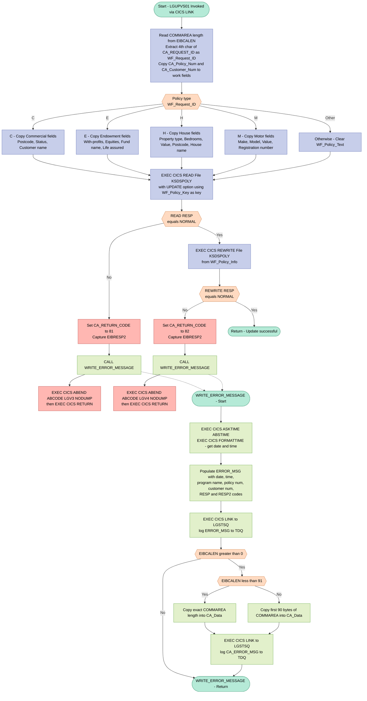
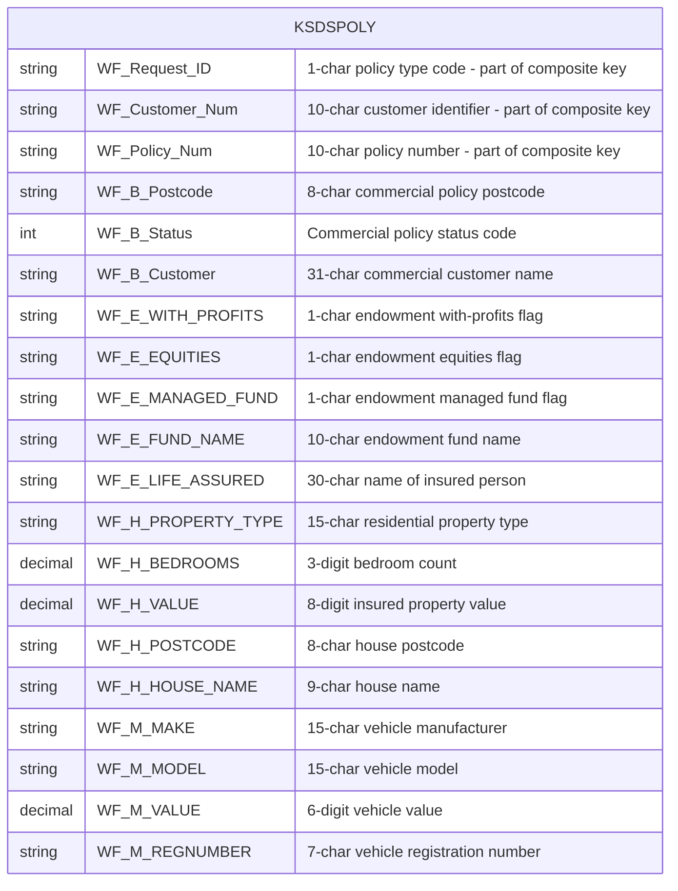

## Table of Contents

- [1. Purpose](#1-purpose)
- [2. Inputs](#2-inputs)
  - [2.1 CICS Communication Area (`COMM_AREA` via `COMM_AREA_PTR`)](#21-cics-communication-area-comm_area-via-comm_area_ptr)
  - [2.2 Policy-Type-Specific Fields (from `CA_POLICY_REQUEST` within the Communication Area)](#22-policy-type-specific-fields-from-ca_policy_request-within-the-communication-area)
  - [2.3 CICS Runtime System Fields](#23-cics-runtime-system-fields)
  - [2.4 VSAM File (`KSDSPOLY`)](#24-vsam-file-ksdspoly)
- [3. Outputs](#3-outputs)
- [4. Processing Logic](#4-processing-logic)
  - [4.1 Mermaid Flow Diagram](#41-mermaid-flow-diagram)
  - [4.2 Processing Logic Description](#42-processing-logic-description)
  - [4.3 Database Tables](#43-database-tables)
- [5. Paragraphs](#5-paragraphs)
- [6. Dependencies](#6-dependencies)
- [7. Constraints](#7-constraints)
  - [7.1 Data Validation and Input Constraints](#71-data-validation-and-input-constraints)
  - [7.2 VSAM File Access Constraints](#72-vsam-file-access-constraints)
  - [7.3 Sequencing and Control-Flow Constraints](#73-sequencing-and-control-flow-constraints)
  - [7.4 Error Handling Constraints](#74-error-handling-constraints)
  - [7.5 Resource and Size Constraints](#75-resource-and-size-constraints)
- [8. Error Handling](#8-error-handling)
- [9. Examples](#9-examples)
  - [9.1 Example 1 — Update a Motor Policy](#91-example-1--update-a-motor-policy)
  - [9.2 Example 2 — Update a House Policy](#92-example-2--update-a-house-policy)
  - [9.3 Example 3 — Read Failure (Error Path)](#93-example-3--read-failure-error-path)

## 1. Purpose

`LGUPVS01` is a PL/I CICS program that updates existing insurance policy records stored in a VSAM Key-Sequenced Data Set (KSDS) named `KSDSPOLY`. Invoked via a CICS COMMAREA, it accepts a policy update request identifying the customer, policy number, and policy type (Commercial, Endowment, House, or Motor), maps the relevant policy-specific fields from the communication area into an internal work record, locates the matching VSAM record using a 21-byte composite key, and rewrites the updated record back to the dataset. If either the initial read-for-update or the rewrite operation fails, the program sets a specific return code in the COMMAREA, logs a timestamped error message by linking to the `LGSTSQ` utility program, and terminates with a CICS ABEND, ensuring that failed update attempts are fully recorded and the transaction is cleanly ended.

## 2. Inputs

### 2.1 CICS Communication Area (`COMM_AREA` via `COMM_AREA_PTR`)

The program's sole entry point parameter is `COMM_AREA_PTR`, a pointer to the CICS-passed communication area. All external inputs are overlaid fields within this structure.

- **`CA_REQUEST_ID`** *(CHAR(6))* — Identifies the type of policy transaction and policy sub-type to process. The 4th character (extracted into `WF_Request_ID`) selects the policy branch: `C` = Commercial, `E` = Endowment, `H` = House, `M` = Motor.
- **`CA_CUSTOMER_NUM`** *(PIC '9999999999')* — The 10-digit customer number identifying the owner of the policy being updated. Used to construct the VSAM KSDS lookup key.
- **`CA_POLICY_NUM`** *(PIC '9999999999')* — The 10-digit policy number identifying the specific policy record to be located and rewritten in the VSAM file.

### 2.2 Policy-Type-Specific Fields (from `CA_POLICY_REQUEST` within the Communication Area)

Depending on the value of `CA_REQUEST_ID`, exactly one of the following groups is read:

- **Commercial policy fields** (when request type = `C`):
  - **`CA_B_Postcode`** *(CHAR(8))* — Postcode of the commercial property.
  - **`CA_B_Status`** *(PIC '9999')* — Processing status of the commercial policy.
  - **`CA_B_Customer`** *(CHAR(255))* — Business customer name associated with the commercial policy.

- **Endowment policy fields** (when request type = `E`):
  - **`CA_E_WITH_PROFITS`** *(CHAR(1))* — Flag indicating whether the policy includes a with-profits option.
  - **`CA_E_EQUITIES`** *(CHAR(1))* — Flag indicating equity investment participation.
  - **`CA_E_MANAGED_FUND`** *(CHAR(1))* — Flag indicating managed fund participation.
  - **`CA_E_FUND_NAME`** *(CHAR(10))* — Name of the investment fund linked to the endowment policy.
  - **`CA_E_LIFE_ASSURED`** *(CHAR(31))* — Full name of the insured person on the endowment policy.

- **House policy fields** (when request type = `H`):
  - **`CA_H_PROPERTY_TYPE`** *(CHAR(15))* — Type/classification of the insured residential property.
  - **`CA_H_BEDROOMS`** *(PIC '999')* — Number of bedrooms in the insured property.
  - **`CA_H_VALUE`** *(PIC '99999999')* — Declared insured value of the residential property.
  - **`CA_H_POSTCODE`** *(CHAR(8))* — Postcode of the insured property.
  - **`CA_H_HOUSE_NAME`** *(CHAR(20))* — Name or identifier of the insured house.

- **Motor policy fields** (when request type = `M`):
  - **`CA_M_MAKE`** *(CHAR(15))* — Manufacturer brand of the insured vehicle.
  - **`CA_M_MODEL`** *(CHAR(15))* — Model name of the insured vehicle.
  - **`CA_M_VALUE`** *(PIC '999999')* — Declared value of the insured vehicle.
  - **`CA_M_REGNUMBER`** *(CHAR(7))* — Vehicle registration/license plate number.

### 2.3 CICS Runtime System Fields

- **`EIBCALEN`** — CICS-provided length of the passed communication area. Used to size the VSAM read operation and to guard error-logging logic.
- **`EIBRESP2`** — CICS-provided secondary response code, captured on VSAM read/rewrite failures and written to the error log.

### 2.4 VSAM File (`KSDSPOLY`)

- **`KSDSPOLY`** — The VSAM KSDS dataset holding existing policy records. The program reads (with update intent) the record matching the 21-byte composite key (`WF_Policy_Key` = request type + customer number + policy number) before rewriting the updated record. The content of the record read from this file drives whether the rewrite succeeds.

## 3. Outputs

**CICS VSAM File Update (`KSDSPOLY`)**
- `WF_Policy_Info` — the complete policy record written back to the VSAM KSDS file `KSDSPOLY` via `EXEC CICS REWRITE`. Contains the composed policy key and the policy-type-specific payload assembled from COMMAREA fields, representing the persisted result of the update operation.
  - `WF_Policy_Key` — the 21-byte key (request-type character + customer number + policy number) used to locate the record for exclusive update read (`EXEC CICS READ … UPDATE`) before the rewrite.
  - **Commercial (`C`) payload fields written into the record:**
    - `WF_B_Postcode` — commercial property postcode
    - `WF_B_Status` — commercial policy status code
    - `WF_B_Customer` — business customer name
  - **Endowment (`E`) payload fields written into the record:**
    - `WF_E_WITH_PROFITS`, `WF_E_EQUITIES`, `WF_E_MANAGED_FUND` — investment option flags
    - `WF_E_FUND_NAME` — name of the endowment investment fund
    - `WF_E_LIFE_ASSURED` — name of the insured person
  - **House (`H`) payload fields written into the record:**
    - `WF_H_PROPERTY_TYPE` — property category
    - `WF_H_BEDROOMS` — bedroom count
    - `WF_H_VALUE` — declared property value
    - `WF_H_POSTCODE`, `WF_H_HOUSE_NAME` — address details
  - **Motor (`M`) payload fields written into the record:**
    - `WF_M_MAKE` — vehicle manufacturer
    - `WF_M_MODEL` — vehicle model
    - `WF_M_VALUE` — vehicle value
    - `WF_M_REGNUMBER` — vehicle registration number

**COMMAREA Return Code (`CA_RETURN_CODE`)**
- Set to `'81'` when the exclusive-read of the policy record from `KSDSPOLY` fails, or `'82'` when the subsequent rewrite fails. Communicates the error outcome back to the calling CICS transaction via the shared communication area.

**CICS Abend (`EXEC CICS ABEND`)**
- On read failure: issues abend code `LGV3` (no dump) to abnormally terminate the transaction.
- On rewrite failure: issues abend code `LGV4` (no dump) to abnormally terminate the transaction.

**Error Logging via `LGSTSQ` (Transient Data / Temporary Storage Queue)**
- `ERROR_MSG` — formatted diagnostic message passed to the `LGSTSQ` program via `EXEC CICS LINK`. Contains the timestamp (`EM_DATE`, `EM_TIME`), the customer number (`EM_CUSNUM`), the CICS response codes (`EM_RESPRC`, `EM_RESP2RC`), and a fixed label identifying the failed KSDSPOLY rewrite. Written on any error path.
- `CA_ERROR_MSG` — a secondary message containing up to 90 bytes of the raw COMMAREA content (`CA_Data`), also passed to `LGSTSQ` to provide context for debugging. Written only when `EIBCALEN > 0`.

## 4. Processing Logic

### 4.1 Mermaid Flow Diagram

---

### 4.2 Processing Logic Description

#### 4.2.1 High-level Summary

`LGUPVS01` is the **VSAM data-access layer** for updating an insurance policy record in the GenApp application. It is invoked via `EXEC CICS LINK` from a business-logic program. It receives a fully populated COMMAREA that identifies the policy type and the new field values, assembles a VSAM record key and payload, performs a **read-for-update** on the KSDS file `KSDSPOLY`, and then **rewrites** the record with the updated data. Any failure during the read or the rewrite triggers structured error logging and an abnormal task termination.

---

#### 4.2.2 Execution Flow

**Step 1 — Entry and COMMAREA Extraction**
On entry the program reads `EIBCALEN` into `WS_Commarea_Len` to confirm the length of the passed communication area. It then extracts three key identifiers:
- `WF_Request_ID` — the 4th character of `CA_REQUEST_ID`, which encodes the policy type (`C`, `E`, `H`, or `M`).
- `WF_Policy_Num` — copied from `CA_POLICY_NUM`.
- `WF_Customer_Num` — copied from `CA_CUSTOMER_NUM`.

Together these three fields form the 21-byte `WF_Policy_Key` used as the VSAM KSDS key.

**Step 2 — Policy-Type Branching (SELECT on WF_Request_ID)**
A `SELECT` statement dispatches to one of four branches based on the policy type code:

| Code | Policy Type | Fields Mapped |
|------|-------------|---------------|
| `C`  | Commercial  | Postcode, Status, Customer name |
| `E`  | Endowment   | With-profits flag, Equities flag, Managed-fund flag, Fund name, Life assured name |
| `H`  | House       | Property type, Bedrooms, Value, Postcode, House name |
| `M`  | Motor       | Make, Model, Value, Registration number |
| Other | Unknown   | `WF_Policy_Text` is blanked |

Each branch populates the relevant sub-structure inside the `WF_Policy_Data UNION`, which overlays the same 43-byte `WF_Policy_Text` area. This union design means only one policy type's data is physically present in the work record at any time.

**Step 3 — VSAM Read for Update**
`EXEC CICS READ FILE('KSDSPOLY') ... UPDATE` locks the target record exclusively in the VSAM KSDS using the 21-byte `WF_Policy_Key` (key length 21). The `INTO(WS_FileIn)` area receives the current record contents, which are needed to hold the VSAM lock. The `RESP` code is checked immediately.

- **If RESP ≠ NORMAL**: `CA_RETURN_CODE` is set to `'81'`, `EIBRESP2` is saved in `WS_RESP2`, `WRITE_ERROR_MESSAGE` is called, then `EXEC CICS ABEND ABCODE('LGV3') NODUMP` terminates the task without producing a storage dump, followed by `EXEC CICS RETURN`.

**Step 4 — VSAM Rewrite**
`EXEC CICS REWRITE FILE('KSDSPOLY') FROM(WF_Policy_Info)` replaces the locked record with the updated `WF_Policy_Info` structure (key + new policy data). This command is only valid because it immediately follows a successful `READ UPDATE` on the same file. The VSAM key field inside the record must not change across the rewrite.

- **If RESP ≠ NORMAL**: `CA_RETURN_CODE` is set to `'82'`, `EIBRESP2` is saved, `WRITE_ERROR_MESSAGE` is called, and `EXEC CICS ABEND ABCODE('LGV4') NODUMP` terminates the task.

**Step 5 — Normal Return**
If the rewrite succeeds, the program issues a plain `RETURN`, handing control back to the calling business-logic program. No explicit return-code is set on the success path; the caller infers success from the absence of an error code in `CA_RETURN_CODE`.

---

#### 4.2.3 WRITE_ERROR_MESSAGE Subroutine

This internal procedure is called on either error path and performs the following steps:

1. **Timestamp capture** — `EXEC CICS ASKTIME ABSTIME(WS_ABSTIME)` retrieves the current time as milliseconds since 1 Jan 1900 (packed decimal). `EXEC CICS FORMATTIME` converts it to a human-readable date (`MMDDYYYY`) and time string.
2. **Error record population** — `EM_DATE`, `EM_TIME`, `EM_CUSNUM`, `EM_RESPRC`, and `EM_RESP2RC` are filled in the `ERROR_MSG` structure, which also contains the literal program name `LGUPVS01` and the label `Re-write KSDSPOLY`.
3. **Log error message** — `EXEC CICS LINK PROGRAM('LGSTSQ')` sends `ERROR_MSG` to the `LGSTSQ` transient-data queue writer.
4. **Log COMMAREA snapshot** — If `EIBCALEN > 0`, up to 90 bytes of the raw COMMAREA are copied into `CA_Data` and a second `EXEC CICS LINK PROGRAM('LGSTSQ')` call logs it, providing a diagnostic snapshot of the input at the time of failure.

---

#### 4.2.4 External Interactions

| Interaction | Resource | Purpose |
|---|---|---|
| `EXEC CICS READ UPDATE` | VSAM KSDS `KSDSPOLY` | Locks and retrieves the existing policy record for update |
| `EXEC CICS REWRITE` | VSAM KSDS `KSDSPOLY` | Writes the updated policy data back, replacing the locked record |
| `EXEC CICS LINK` | Program `LGSTSQ` | Writes error diagnostic messages to a transient-data queue on failure |

---

#### 4.2.5 Plain Language Summary

When an operator or user requests an insurance policy update, this program is called as the storage layer responsible for saving the change to the VSAM file. It first figures out what kind of policy is being updated (house, motor, endowment, or commercial) and picks out the relevant new values from the input area. It then opens and locks the existing policy record on the file, replaces it with the updated record, and closes out. If anything goes wrong during either the lock step or the save step, the program records a detailed error message — including time, customer number, and CICS error codes — to a diagnostic log, then forcibly stops the transaction with a specific error code (`LGV3` for lock failure, `LGV4` for save failure) so the problem can be diagnosed without flooding the system with dump data.

---

### 4.3 Database Tables

## 5. Paragraphs

**LGUPVS01 (Main Procedure)**

- This is the main entry point of the program, declared as `LGUPVS01: Proc(COMM_AREA_PTR) Options(Main)`.
- On entry, it captures the incoming communication area length from `EIBCALEN` into `WS_Commarea_Len` and extracts the key identifying fields:
  - `WF_Request_ID` is populated from the 4th character of `CA_Request_ID` (the policy type indicator).
  - `WF_Policy_Num` is populated from `CA_Policy_Num`.
  - `WF_Customer_Num` is populated from `CA_Customer_Num`.
- A `SELECT` statement branches on `WF_Request_ID` to map the policy-type-specific fields from the communication area into the internal work record `WF_Policy_Info`:
  - `'C'` (Commercial): Maps postcode (`WF_B_Postcode`), status (`WF_B_Status`), and business customer name (`WF_B_Customer`) from the `CA_COMMERCIAL` structure.
  - `'E'` (Endowment): Maps with-profits flag, equities flag, managed fund flag, fund name (`WF_E_FUND_NAME`), and life assured name (`WF_E_LIFE_ASSURED`) from the `CA_ENDOWMENT` structure.
  - `'H'` (House): Maps property type (`WF_H_PROPERTY_TYPE`), number of bedrooms (`WF_H_BEDROOMS`), property value (`WF_H_VALUE`), postcode, and house name from the `CA_HOUSE` structure.
  - `'M'` (Motor): Maps vehicle make (`WF_M_MAKE`), model (`WF_M_MODEL`), value, and registration number (`WF_M_REGNUMBER`) from the `CA_MOTOR` structure.
  - `OTHERWISE`: Clears `WF_Policy_Text` to spaces as a fallback for unrecognised policy types.
- After the policy type mapping, `WF_Policy_Num` is reassigned from `CA_Policy_Num` to ensure consistency.
- An `EXEC CICS READ FILE('KSDSPOLY')` is issued with the `UPDATE` option, using `WF_Policy_Key` (a 21-byte composite of request ID, customer number, and policy number) as the record identifier. The record is read into `WS_FileIn` to lock it for subsequent rewrite.
  - If the read fails (`WS_RESP <> DFHRESP(NORMAL)`), `WS_RESP2` is captured from `EIBRESP2`, return code `'81'` is set in `CA_RETURN_CODE`, `WRITE_ERROR_MESSAGE` is called, and the program abends with code `'LGV3'` before issuing `EXEC CICS RETURN`.
- An `EXEC CICS REWRITE FILE('KSDSPOLY')` is then issued, writing the updated policy record from `WF_Policy_Info` back to the VSAM KSDS dataset.
  - If the rewrite fails, `WS_RESP2` is captured, return code `'82'` is set, `WRITE_ERROR_MESSAGE` is called, and the program abends with code `'LGV4'` before returning.
- On successful completion, the procedure issues a `RETURN` to pass control back to the CICS caller.

---

**WRITE_ERROR_MESSAGE**

- An internal subroutine (`PROCEDURE`) invoked via `CALL WRITE_ERROR_MESSAGE` whenever a CICS file operation fails.
- Retrieves the current time and date using `EXEC CICS ASKTIME ABSTIME(WS_ABSTIME)` followed by `EXEC CICS FORMATTIME`, formatting the result into `WS_DATE` (MM/DD/YYYY) and `WS_TIME`.
- Populates the `ERROR_MSG` structure with the current date, time, customer number (`EM_Cusnum`), primary response code (`EM_RespRC` from `WS_RESP`), and secondary response code (`EM_Resp2RC` from `WS_RESP2`). The structure also carries a static literal identifying the failing operation as `Re-write KSDSPOLY`.
- Issues `EXEC CICS LINK PROGRAM('LGSTSQ')` passing `ERROR_MSG` as the commarea to log the error to the transient data queue.
- Conditionally logs a portion of the raw communication area for diagnostic purposes:
  - If `EIBCALEN > 0` and less than 91 bytes, the entire raw commarea content is placed into `CA_Data` and a second `EXEC CICS LINK` to `'LGSTSQ'` is made passing `CA_ERROR_MSG`.
  - If `EIBCALEN >= 91`, the first 90 bytes of the raw commarea are placed into `CA_Data` and the same link to `'LGSTSQ'` is made.
- Returns to the caller after logging, allowing the main procedure to continue with its abend and return sequence.

## 6. Dependencies

**CICS Resources**
- `KSDSPOLY` — VSAM KSDS file accessed via `EXEC CICS READ … UPDATE` to lock the existing policy record for update, and via `EXEC CICS REWRITE` to persist the modified record; the 21-byte key (`WF_Policy_Key`) is composed of request-type code, customer number, and policy number
- CICS EIB fields used at runtime:
  - `EIBCALEN` — length of the passed communication area; checked on entry and in error-logging logic
  - `EIBRESP2` — secondary CICS response code captured on file I/O failures
  - `DFHRESP(NORMAL)` — CICS symbolic response constant used to evaluate READ and REWRITE outcomes

**External Programs (CICS LINK)**
- `LGSTSQ` — error-logging utility; invoked twice per error event via `EXEC CICS LINK PROGRAM('LGSTSQ')`, once with `ERROR_MSG` (timestamped error details) and once with `CA_ERROR_MSG` (raw COMMAREA dump)

**Communication Area (COMMAREA)**
- `LGCMAREA` include (`Includes/LGCMAREA.inc`) — defines the `COMM_AREA` union structure mapped via `COMM_AREA_PTR`; provides all inbound policy fields consumed by this program:
  - `CA_REQUEST_ID` — 6-character request code; character 4 (`WF_Request_ID`) selects the policy type branch (`C`/`E`/`H`/`M`)
  - `CA_CUSTOMER_NUM` — 10-digit customer identifier copied into the VSAM record key
  - `CA_POLICY_NUM` — 10-digit policy identifier copied into the VSAM record key
  - `CA_RETURN_CODE` — output field set to `81` (READ failure) or `82` (REWRITE failure) before abend
  - `CA_B_*` fields — commercial policy payload fields (`CA_B_Postcode`, `CA_B_Status`, `CA_B_Customer`)
  - `CA_E_*` fields — endowment policy payload fields (`CA_E_WITH_PROFITS`, `CA_E_EQUITIES`, `CA_E_MANAGED_FUND`, `CA_E_FUND_NAME`, `CA_E_LIFE_ASSURED`)
  - `CA_H_*` fields — house policy payload fields (`CA_H_PROPERTY_TYPE`, `CA_H_BEDROOMS`, `CA_H_VALUE`, `CA_H_POSTCODE`, `CA_H_HOUSE_NAME`)
  - `CA_M_*` fields — motor policy payload fields (`CA_M_MAKE`, `CA_M_MODEL`, `CA_M_VALUE`, `CA_M_REGNUMBER`)

**CICS Abend Codes**
- `LGV3` — issued via `EXEC CICS ABEND ABCODE('LGV3') NODUMP` when the initial READ with UPDATE on `KSDSPOLY` fails
- `LGV4` — issued via `EXEC CICS ABEND ABCODE('LGV4') NODUMP` when the REWRITE to `KSDSPOLY` fails

**CICS Time Services**
- `EXEC CICS ASKTIME` / `EXEC CICS FORMATTIME` — used inside `WRITE_ERROR_MESSAGE` to obtain and format the current timestamp (`WS_ABSTIME`, `WS_DATE`, `WS_TIME`) for inclusion in error log entries

## 7. Constraints

### 7.1 Data Validation and Input Constraints

- **`CA_REQUEST_ID` policy-type discriminator (character 4 only)**
  - Only the 4th character of the 6-character `CA_REQUEST_ID` field is extracted via `SUBSTR(CA_REQUEST_ID,4,1)` and stored in `WF_Request_ID`
  - Only four specific values are recognized: `'C'` (Commercial), `'E'` (Endowment), `'H'` (House), `'M'` (Motor); any other value triggers the `OTHERWISE` branch, which clears `WF_Policy_Text` to spaces but still proceeds to the VSAM read/rewrite — effectively allowing an unrecognized policy type to reach the file update stage with a blank payload

- **`CA_CUSTOMER_NUM` — 10-digit numeric field**
  - Declared as `PIC '9999999999'`; only numeric digit characters are valid; non-numeric content causes a PL/I data conversion exception at runtime

- **`CA_POLICY_NUM` — 10-digit numeric field**
  - Declared as `PIC '9999999999'`; same numeric-only constraint as `CA_CUSTOMER_NUM`

- **`CA_RETURN_CODE` — 2-digit numeric field**
  - Declared as `PIC '99'`; constrained to values `00`–`99`; error paths set it explicitly to `'81'` (read failure) or `'82'` (rewrite failure)

- **Policy-type-specific field size constraints (enforced by structure declarations)**
  - Commercial (`'C'`): postcode max 8 chars (`WF_B_Postcode`), status is `FIXED BIN(15)` (signed 16-bit integer), customer name max 31 chars (`WF_B_Customer`)
  - Endowment (`'E'`): fund name max 10 chars (`WF_E_FUND_NAME`), life assured name max 30 chars (`WF_E_LIFE_ASSURED`); indicator flags (`WF_E_WITH_PROFITS`, `WF_E_EQUITIES`, `WF_E_MANAGED_FUND`) are single characters
  - House (`'H'`): property type max 15 chars (`WF_H_PROPERTY_TYPE`), bedrooms is a 3-digit picture (`PIC '(3)9'` — values 000–999), property value is an 8-digit picture (`PIC '(8)9'` — values 00000000–99999999), postcode max 8 chars, house name max 9 chars
  - Motor (`'M'`): make and model each max 15 chars, registration number max 7 chars (`WF_M_REGNUMBER`), vehicle value is a 6-digit picture (`PIC '(6)9'` — values 000000–999999)

- **COMMAREA raw size cap of 32 500 bytes**
  - `COMM_AREA_RAW` is declared `CHAR(32500)`; any incoming commarea larger than this cannot be mapped through the union overlay

### 7.2 VSAM File Access Constraints

- **Mandatory prior existence of the record before update**
  - A CICS `READ … UPDATE` against file `KSDSPOLY` must succeed before a `REWRITE` is attempted; the program enforces strict sequencing: read must precede rewrite — there is no path that issues a `REWRITE` without a successful prior `READ UPDATE`

- **VSAM key must be exactly 21 bytes**
  - `RIDFLD(WF_Policy_Key)` with `KEYLENGTH(21)` is hardcoded; the key is composed of `WF_Request_ID` (1 byte) + `WF_Customer_Num` (10 bytes) + `WF_Policy_Num` (10 bytes) = 21 bytes; any mismatch abends or returns a file error

- **Record read length driven by `EIBCALEN`**
  - The `READ` command uses `Length(WS_Commarea_Len)` which is set from `EIBCALEN`; the actual commarea length governs how many bytes are read into `WS_FileIn` (1 024-byte buffer); if `EIBCALEN` exceeds 1 024, a data overflow could occur silently

- **Record rewrite length driven by `WS_Commarea_LenF`**
  - `WS_Commarea_LenF` is declared `FIXED BIN(15) INIT(0)` and is never explicitly assigned in the mainline code, so it remains `0` at the `REWRITE`; this means the rewrite is always issued with a length of zero, which CICS may reject or treat as a minimum-length write — this is an implicit constraint on the rewrite payload size

### 7.3 Sequencing and Control-Flow Constraints

- **`READ UPDATE` must precede `REWRITE`**
  - The program unconditionally issues `READ … UPDATE` first; only if `WS_RESP = DFHRESP(NORMAL)` does control fall through to the `REWRITE`; the read failure path (`CA_RETURN_CODE = '81'`) abends with `LGV3` and returns immediately, preventing any rewrite

- **`REWRITE` failure is terminal**
  - If the rewrite fails (`WS_RESP ≠ DFHRESP(NORMAL)`), `CA_RETURN_CODE` is set to `'82'`, `WRITE_ERROR_MESSAGE` is called, and the task abends with code `LGV4` followed by `EXEC CICS RETURN` — no partial retry or rollback logic exists

- **Policy data population must occur before VSAM operations**
  - The `SELECT (WF_Request_ID)` block that copies commarea fields into `WF_Policy_Info` sub-structures executes entirely before the `READ UPDATE` and `REWRITE` calls; field values cannot be changed mid-flight during file I/O

### 7.4 Error Handling Constraints

- **Abend codes are hardcoded and nodump**
  - Read failures produce abend `LGV3`; rewrite failures produce `LGV4`; both use `NODUMP`, meaning no system dump is generated — diagnostic information is limited to what `WRITE_ERROR_MESSAGE` logs via `LGSTSQ`

- **Error logging is gated on commarea length**
  - Within `WRITE_ERROR_MESSAGE`, the secondary commarea dump to `LGSTSQ` only occurs when `EIBCALEN > 0`
  - If `EIBCALEN < 91`, the full raw commarea up to `EIBCALEN` bytes is logged; otherwise, only the first 90 bytes are logged — commarea content beyond 90 bytes is silently truncated in the error log

- **`EIBCALEN` must be greater than zero for full error diagnostics**
  - If the program is invoked with an empty commarea (`EIBCALEN = 0`), the secondary error message (showing commarea contents) is suppressed entirely

### 7.5 Resource and Size Constraints

- **`WS_FileIn` buffer is fixed at 1 024 bytes**
  - The intermediate read buffer `WS_FileIn CHAR(1024)` constrains the maximum usable size of the VSAM record read into it; records larger than 1 024 bytes will be truncated

- **`CA_Data` error log field capped at 90 bytes**
  - Regardless of the actual commarea length, no more than 90 bytes of commarea data are ever written to the error log structure `CA_ERROR_MSG`

- **`WF_Policy_Info` UNION overlay is 64 bytes maximum**
  - The union of all policy data variants (`WF_Policy_Text CHAR(43)` plus the key of 21 bytes) constrains the physical record written back to VSAM to at most 64 bytes (key + longest data variant); data from the commarea that exceeds these fixed field widths is silently truncated by PL/I character assignment

## 8. Error Handling

**CICS File I/O Response Code Checking**

- After issuing `EXEC CICS READ FILE('KSDSPOLY')` with the `UPDATE` option, the program captures the response in `WS_RESP` using the `RESP` clause
  - If `WS_RESP` is not equal to `DFHRESP(NORMAL)`, the read-for-update operation is considered failed
  - The secondary response code `EIBRESP2` is also captured into `WS_RESP2` to provide more granular diagnostic detail
  - A return code of `'81'` is placed into `CA_RETURN_CODE` in the communication area, signalling a read failure to the caller
  - The internal `WRITE_ERROR_MESSAGE` procedure is called to log the error
  - The program then issues `EXEC CICS ABEND ABCODE('LGV3') NODUMP` to terminate the transaction abnormally without producing a dump, followed by `EXEC CICS RETURN` to yield control back to CICS

- After issuing `EXEC CICS REWRITE FILE('KSDSPOLY')`, the response is again captured in `WS_RESP`
  - If `WS_RESP` is not equal to `DFHRESP(NORMAL)`, the rewrite operation is considered failed
  - `EIBRESP2` is captured into `WS_RESP2` for additional diagnostic context
  - A return code of `'82'` is placed into `CA_RETURN_CODE`, distinguishing this failure from the read error
  - The `WRITE_ERROR_MESSAGE` procedure is called to log the error
  - The program issues `EXEC CICS ABEND ABCODE('LGV4') NODUMP` and `EXEC CICS RETURN` to terminate the task and return control to CICS

**Fallback / Default Logic for Unknown Policy Type**

- In the `SELECT (WF_Request_ID)` block, the program routes policy data mapping based on the request type character (`'C'`, `'E'`, `'H'`, or `'M'`)
  - The `OTHERWISE` branch handles any unrecognised policy type by setting `WF_Policy_Text` to a blank space, effectively providing a safe default state that prevents uninitialized data from being written to the VSAM file

**Error Logging and Notification via WRITE_ERROR_MESSAGE**

- The `WRITE_ERROR_MESSAGE` internal procedure provides a centralised error-logging mechanism triggered on any file I/O failure
  - It retrieves the current date and time using `EXEC CICS ASKTIME` and `EXEC CICS FORMATTIME`, stamping the error record with temporal context
  - It populates an `ERROR_MSG` structure that includes the program name (`LGUPVS01`), policy number, customer number, CICS `RESP` code (`WS_RESP`), and secondary response code (`WS_RESP2`)
  - The formatted error message is passed to an external logging program `LGSTSQ` via `EXEC CICS LINK`, writing the diagnostic record to a transient storage queue or similar mechanism
  - If the communication area is present (i.e., `EIBCALEN > 0`), the raw COMMAREA content is also logged:
    - If `EIBCALEN` is less than 91, the exact length of the COMMAREA is extracted and sent to `LGSTSQ` as a secondary error message
    - If `EIBCALEN` is 91 or greater, only the first 90 bytes of the COMMAREA are extracted and sent, preventing buffer overrun while still capturing diagnostic context

**Abnormal Transaction Termination**

- On both file I/O error paths, the program issues `EXEC CICS ABEND` with a unique abend code (`LGV3` for read failure, `LGV4` for rewrite failure) and the `NODUMP` option
  - The `NODUMP` option suppresses the generation of a system dump, reducing overhead while still recording the abend for operational monitoring
  - `EXEC CICS RETURN` is issued immediately after the abend command to explicitly return control to CICS, ensuring orderly task termination

## 9. Examples

### 9.1 Example 1 — Update a Motor Policy

**Input (COMMAREA fields):**

| Field | Value |
|---|---|
| `CA_REQUEST_ID` | `'UPD01M'` (4th character = `'M'`) |
| `CA_CUSTOMER_NUM` | `'0000001234'` |
| `CA_POLICY_NUM` | `'0000005678'` |
| `CA_M_MAKE` | `'FORD           '` |
| `CA_M_MODEL` | `'FOCUS          '` |
| `CA_M_VALUE` | `'012500'` |
| `CA_M_REGNUMBER` | `'AB12CDE'` |

**Processing:**
1. The 4th character of `CA_REQUEST_ID` (`'M'`) is extracted into `WF_Request_ID`.
2. The `SELECT` block matches `WHEN ('M')`, so motor-specific fields (`WF_M_MAKE`, `WF_M_MODEL`, `WF_M_VALUE`, `WF_M_REGNUMBER`) are populated from the COMMAREA.
3. The 21-byte `WF_Policy_Key` is assembled: `'M'` + `'0000001234'` + `'0000005678'`.
4. An `EXEC CICS READ … UPDATE` is issued against VSAM file `KSDSPOLY` using that key.
5. If the read succeeds, `EXEC CICS REWRITE` overwrites the record with the updated `WF_Policy_Info` structure.

**Expected Output:**
- The VSAM `KSDSPOLY` record for policy `0000005678` / customer `0000001234` is updated with the new motor details (make, model, value, registration).
- `CA_RETURN_CODE` remains `'00'` (no error set), and the transaction returns normally.

---

### 9.2 Example 2 — Update a House Policy

**Input (COMMAREA fields):**

| Field | Value |
|---|---|
| `CA_REQUEST_ID` | `'UPD01H'` (4th character = `'H'`) |
| `CA_CUSTOMER_NUM` | `'0000009999'` |
| `CA_POLICY_NUM` | `'0000001111'` |
| `CA_H_PROPERTY_TYPE` | `'DETACHED       '` |
| `CA_H_BEDROOMS` | `'004'` |
| `CA_H_VALUE` | `'00250000'` |
| `CA_H_POSTCODE` | `'SW1A 1AA'` |
| `CA_H_HOUSE_NAME` | `'ROSE COTTAGE '` |

**Processing:**
1. `WF_Request_ID` is set to `'H'` (4th byte of `CA_REQUEST_ID`).
2. The `SELECT` block matches `WHEN ('H')`, so house-specific fields are copied into `WF_H_Policy_Data`.
3. `WF_Policy_Key` is built as `'H'` + `'0000009999'` + `'0000001111'`.
4. `EXEC CICS READ … UPDATE` locks the record in `KSDSPOLY`.
5. `EXEC CICS REWRITE` writes the updated house record back.

**Expected Output:**
- The house policy record `0000001111` for customer `0000009999` is updated in `KSDSPOLY` with the new property type, bedroom count, insured value, postcode, and house name.
- `CA_RETURN_CODE` stays `'00'`; transaction completes normally.

---

### 9.3 Example 3 — Read Failure (Error Path)

**Input:**

| Field | Value |
|---|---|
| `CA_REQUEST_ID` | `'UPD01M'` |
| `CA_CUSTOMER_NUM` | `'0000099999'` |
| `CA_POLICY_NUM` | `'0000088888'` (record does **not** exist in KSDSPOLY) |

**Processing:**
1. Motor fields are populated and the 21-byte key is assembled.
2. `EXEC CICS READ … UPDATE` against `KSDSPOLY` returns a non-NORMAL response (e.g., `NOTFND`).
3. The error branch fires: `CA_RETURN_CODE` is set to `'81'`, `WRITE_ERROR_MESSAGE` is called (which timestamps the error and links to `LGSTSQ` to log it), and the transaction abends with code `LGV3` (no dump).

**Expected Output:**
- `CA_RETURN_CODE = '81'` is set in the COMMAREA.
- An error message containing the policy number, customer number, RESP, and RESP2 values is written to the TS queue via `LGSTSQ`.
- The CICS task abends with abend code `LGV3`; no VSAM record is modified.

---

Generated by IBM Bob Premium Package for Z
